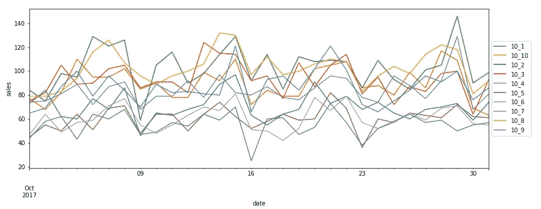
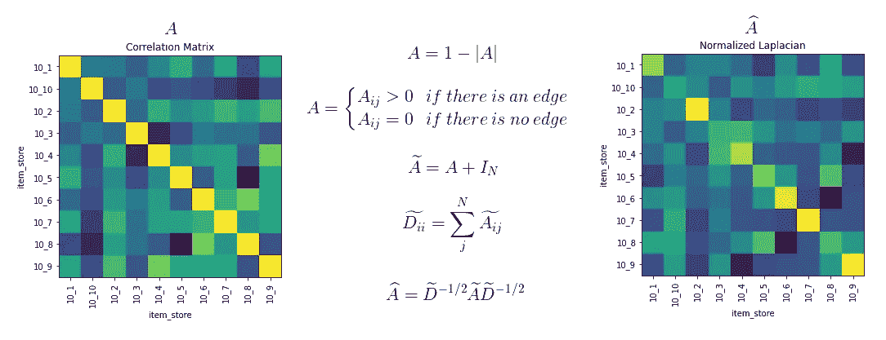
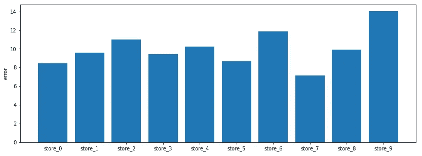
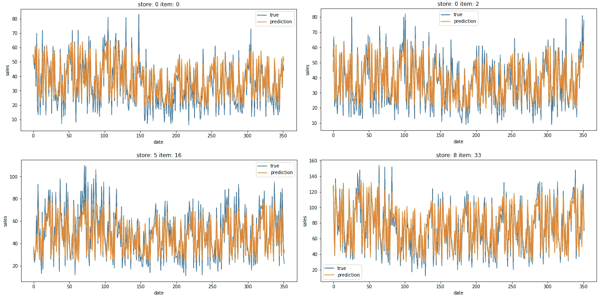

# 基于图卷积神经网络的时间序列预测

> 原文：<https://towardsdatascience.com/time-series-forecasting-with-graph-convolutional-neural-network-7ffb3b70afcf?source=collection_archive---------5----------------------->

## 结合图和递归结构的商店物品需求预测


米歇尔·比特托在 [Unsplash](https://unsplash.com?utm_source=medium&utm_medium=referral) 上的照片

时间序列预测任务可以通过以下不同的方法来完成。最经典的是基于统计和自回归方法。更棘手的是基于 boosting 和 ensemble 的算法，在这些算法中，我们必须产生大量有用的手工制作的滚动周期特征。另一方面，我们可以找到神经网络模型，使其开发更加自由，提供可定制的顺序建模和更多。

递归和卷积结构在时间序列预测中取得了巨大成功。该领域中有趣的方法是通过采用最初在 NLP 中固有的转换器和注意力架构来给出的。图形结构的使用似乎不常见，其中我们有一个由不同节点组成的网络，这些节点通过某种链接相互关联。我们试图用时间序列的图形表示来预测未来。

在本文中，我们执行了一项销售预测任务，其中我们利用图形卷积神经网络，利用我们的数据的嵌套结构，这些数据由不同商店中各种商品的不同销售系列组成。

# 数据

该数据集是从 Kaggle 上过去的比赛中收集的。[商店商品需求预测挑战赛](https://www.kaggle.com/c/demand-forecasting-kernels-only/data)以每日格式提供了各商店销售的不同商品的 4 整年的销售数据。我们有 10 家商店和 50 种产品，总共 500 个系列。每个产品在每个商店都有销售。我们的范围是每天为所有项目提供准确的未来预测。



每个商店中商品 10 的销售额

我们掌握的数据很少:只有销售额以及商品和商店的数字编码。这仍然足以让我们强调一个基本的层次结构。我们需要做的就是在项目级别对系列进行分组，这样我们最终得到 50 个组(项目)，每个组由 10 个系列组成(每个商店销售的项目)；上图描述了一个组的示例。

在经典图网络中，所有相关信息都存储在一个名为**邻接矩阵**的对象中。这是数据中所有关联的数字表示。我们上下文中的相邻矩阵可以通过根据所有商店中给定商品的销售序列计算的**相关矩阵**来检索。

序列重新划分在我们的方法中是基本的，因为我们决定像递归架构一样处理数据，这也将是我们模型的一部分。

# 模型

我们的模型接收来自所有商店的**销售序列和从相同序列获得的相邻矩阵**作为输入。序列通过 LSTM 层，而相关矩阵由图卷积层处理。它们在 [Spektral](https://github.com/danielegrattarola/spektral) 中实现，这是一个基于 Tensorflow 构建的很酷的图形深度学习库。它提供了各种类型的图层。我们使用最基本的一种，图卷积。它在可学习的权重、外部节点特征(与相邻矩阵一起提供)和我们的相关矩阵之间进行一系列卷积运算。不太可能，目前 Spektral 不支持 Window，所以我必须手动提取我感兴趣的类并创建我的 Python 可执行文件。

我们的网络看起来如下:

```
def get_model(): opt = Adam(lr=0.001) inp_seq = Input((sequence_length, 10))
    inp_lap = Input((10, 10))
    inp_feat = Input((10, X_train_feat.shape[-1])) x = GraphConv(32, activation='relu')([inp_feat, inp_lap])
    x = GraphConv(16, activation='relu')([x, inp_lap])
    x = Flatten()(x) xx = LSTM(128, activation='relu',return_sequences=True)(inp_seq)
    xx = LSTM(32, activation='relu')(xx) x = Concatenate()([x,xx])
    x = BatchNormalization()(x)
    x = Dropout(0.5)(x)
    x = Dense(128, activation='relu')(x)
    x = Dense(32, activation='relu')(x)
    x = Dropout(0.3)(x)
    out = Dense(1)(x) model = Model([inp_seq, inp_lap, inp_feat], out)
    model.compile(optimizer=opt, loss='mse', 
                  metrics=[tf.keras.metrics.RootMeanSquaredError()]) return model
```

如前所述，在开发递归网络时，数据的处理一如既往。这些序列是固定时间段内所有商店中所考虑商品的销售情况的集合。

在我们的例子中，下一步是在相同的序列上计算商店间销售额的相关矩阵，它代表我们的相邻矩阵。与它们一起提供了一些手工制作的特征(如平均值、标准偏差、偏斜度、峰度、回归系数)，这些特征由我们根据每个序列的存储进行计算，代表我们在网络中的节点特征。

给定样本协方差或相关矩阵，我们可以基于频谱卷积的一阶近似，应用拉普拉斯归一化来估计邻接矩阵，这使得能够使用高效的逐层传播规则(如这里的[所述](https://arxiv.org/pdf/1609.02907.pdf)和在[频谱](https://github.com/danielegrattarola/spektral)中实现的)。



给定相关矩阵的拉普拉斯归一化过程

训练是用前两年的数据计算的，而剩下的两年分别用于验证和测试。我为每个商店训练了一个模型，所以我们最终得到了总共 10 个不同的神经网络。

在训练程序结束时，悬挂物的预测由相关模型检索。误差计算为测试数据的 RMSE，报告如下。



RMSE 为每个商店计算了测试集上的所有项目

同样，很容易提取 desired stores 中商品的预测，直接操作我们的嵌套数据结构。



测试数据预测

# 摘要

在这篇文章中，我在一个不常见的场景中采用了图形神经网络，比如时间序列预测。在我们的深度学习模型中，图依赖将自身与循环部分相结合，试图提供更准确的预测。这种方法似乎很适合我们的问题，因为我们可以强调我们的数据中的基本层次结构，我们用相关矩阵进行数字编码。

[**查看我的 GITHUB 回购**](https://github.com/cerlymarco/MEDIUM_NoteBook)

保持联系: [Linkedin](https://www.linkedin.com/in/marco-cerliani-b0bba714b/)

**参考文献**

*   [Spektral:带有 Keras 和 Tensorflow 的图形神经网络](https://github.com/danielegrattarola/spektral)
*   图卷积网络的半监督分类