# 用 Python 中的 SARIMA 进行时间序列预测

> 原文：<https://towardsdatascience.com/time-series-forecasting-with-sarima-in-python-cda5b793977b?source=collection_archive---------2----------------------->

## 关于使用 Python 使用 SARIMA 进行时间序列建模的实践教程


摩根·豪斯尔在 [Unsplash](https://unsplash.com?utm_source=medium&utm_medium=referral) 上的照片

在之前的文章中，我们介绍了[移动平均过程 MA(q)](/how-to-model-time-series-in-python-9983ebbf82cf) ，和[自回归过程 AR(p)](/time-series-forecasting-with-autoregressive-processes-ba629717401) 。我们将它们结合起来，形成了 ARMA(p，q)和 ARIMA(p，d，q)模型来模拟更复杂的时间序列。

现在，给模型添加最后一个组件:季节性。

本文将涵盖:

*   季节性 ARIMA 模型
*   使用真实数据的完整建模和预测项目

Github 上有[笔记本](https://github.com/marcopeix/time-series-analysis/tree/master/Advanced%20modelling)和[数据集](https://github.com/marcopeix/time-series-analysis/tree/master/data)。

我们开始吧！

> *关于 Python 中时间序列分析的完整课程，涵盖统计和深度学习模型，请查看我新发布的* [*课程*](https://www.datasciencewithmarco.com/offers/tdU2mtVK) *！*

# 萨里玛模型

到目前为止，我们还没有考虑时间序列中季节性的影响。然而，这种行为肯定存在于许多情况下，如礼品店销售或飞机乘客总数。

季节性 ARIMA 模型或萨里玛的写法如下:

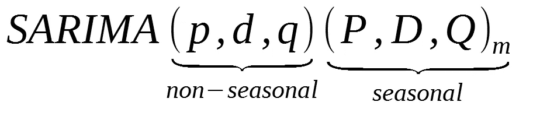

萨里玛符号

你可以看到我们为时间序列的季节性部分添加了 P、D 和 Q。它们与非季节性成分的术语相同，因为它们涉及季节性周期的后移。

在上面的公式中， *m* 是每年或一段时间内的观察次数。如果我们分析季度数据， *m* 等于 4。

## ACF 和 PACF 图

AR 和 MA 模型的季节性部分可以从 PACF 和 ACF 图中推断出来。

在 SARIMA 模型中，只有一个阶为 1、周期为 12 的季节性移动平均过程，表示为:

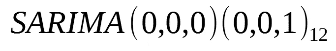

*   在滞后 12 时观察到峰值
*   PACF 季节滞后的指数衰减(滞后 12，24，36，…)

类似地，对于仅具有阶为 1、周期为 12 的季节性自回归过程的模型:

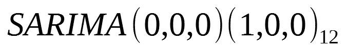

*   ACF 季节性滞后的指数衰减(滞后 12，24，36，…)
*   在 PACF 中，在滞后 12 时观察到峰值

## 系统模型化

建模过程与非季节性 ARIMA 模型相同。在这种情况下，我们只需要考虑额外的参数。

使时间序列平稳和根据最低 AIC 选择模型所需的步骤仍留在建模过程中。

让我们用真实世界的数据集来涵盖一个完整的示例。

# 项目—为强生公司的季度每股收益建模

我们将重温强生公司的季度每股收益(EPS)数据集。这是一个非常有趣的数据集，因为有一个移动平均过程在起作用，而且我们有季节性，这是用 SARIMA 进行一些练习的完美时机。

和往常一样，我们首先导入所有必要的库来进行分析

```
from statsmodels.graphics.tsaplots import plot_pacf
from statsmodels.graphics.tsaplots import plot_acf
from statsmodels.tsa.statespace.sarimax import SARIMAX
from statsmodels.tsa.holtwinters import ExponentialSmoothing
from statsmodels.tsa.stattools import adfuller
import matplotlib.pyplot as plt
from tqdm import tqdm_notebook
import numpy as np
import pandas as pdfrom itertools import productimport warnings
warnings.filterwarnings('ignore')%matplotlib inline
```

现在，让我们读入数据帧中的数据:

```
data = pd.read_csv('jj.csv')
```

然后，我们可以显示一个时间序列图:

```
plt.figure(figsize=[15, 7.5]); # Set dimensions for figure
plt.plot(data['date'], data['data'])
plt.title('Quarterly EPS for Johnson & Johnson')
plt.ylabel('EPS per share ($)')
plt.xlabel('Date')
plt.xticks(rotation=90)
plt.grid(True)
plt.show()
```

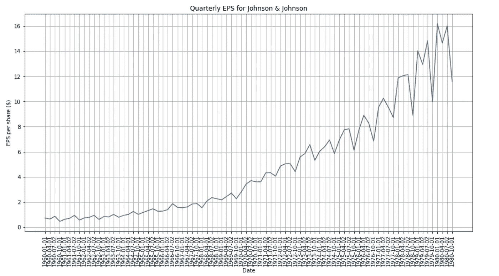

强生公司季度每股收益

很明显，时间序列不是静态的，因为它的平均值在整个时间内不是恒定的，我们看到数据中的方差在增加，这是**异方差**的标志。

为了确保这一点，让我们绘制 PACF 和 ACF:

```
plot_pacf(data['data']);
plot_acf(data['data']);
```


PACF 和 ACF

同样，不能从这些图中推断出任何信息。您可以使用扩展的 Dickey-Fuller 测试进一步测试平稳性:

```
ad_fuller_result = adfuller(data['data'])
print(f'ADF Statistic: {ad_fuller_result[0]}')
print(f'p-value: {ad_fuller_result[1]}')
```

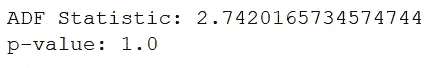

ADF 测试结果

由于 p 值很大，我们不能拒绝零假设，必须假设时间序列是非平稳的。

现在，让我们取对数差，努力使它保持稳定:

```
data['data'] = np.log(data['data'])
data['data'] = data['data'].diff()
data = data.drop(data.index[0])
```

绘制新数据应给出:

```
plt.figure(figsize=[15, 7.5]); # Set dimensions for figure
plt.plot(data['data'])
plt.title("Log Difference of Quarterly EPS for Johnson & Johnson")
plt.show()
```

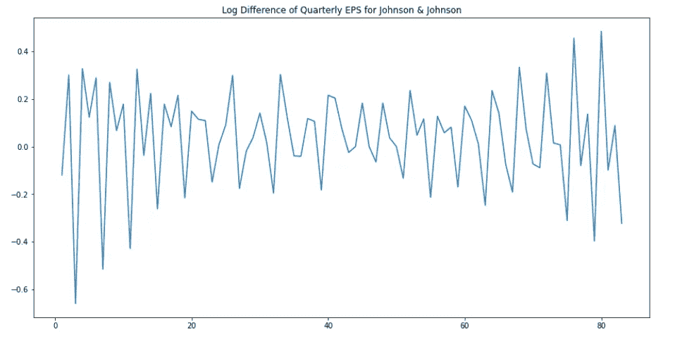

强生公司季度每股收益记录表

厉害！现在，我们仍然在上面的图中看到季节性。因为我们处理的是季度数据，所以我们的周期是 4。因此，我们将在 4:

```
# Seasonal differencingdata['data'] = data['data'].diff(4)
data = data.drop([1, 2, 3, 4], axis=0).reset_index(drop=True)
```

绘制新数据:

```
plt.figure(figsize=[15, 7.5]); # Set dimensions for figure
plt.plot(data['data'])
plt.title("Log Difference of Quarterly EPS for Johnson & Johnson")
plt.show()
```

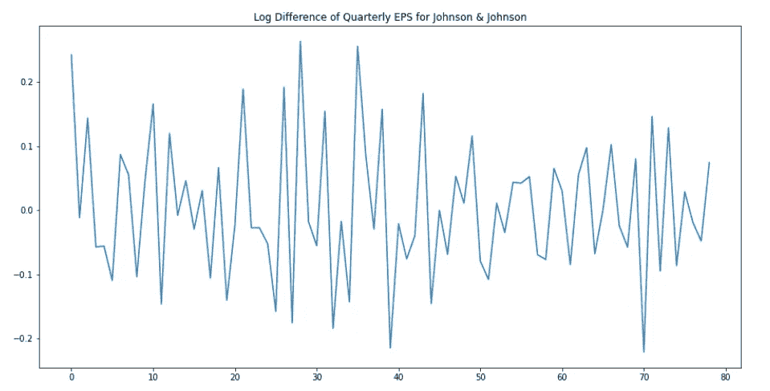

完美！请记住，虽然我们在 4 个月的时间内取了差值，但季节差值(D)的顺序是 1，因为我们只取了一次差值。

现在，让我们再次运行扩展的 Dickey-Fuller 测试，看看我们是否有一个平稳的时间序列:

```
ad_fuller_result = adfuller(data['data'])
print(f'ADF Statistic: {ad_fuller_result[0]}')
print(f'p-value: {ad_fuller_result[1]}')
```

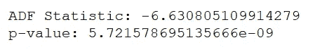

事实上，p 值足够小，我们可以拒绝零假设，我们可以认为时间序列是平稳的。

看看 ACF 和 PACF:

```
plot_pacf(data['data']);
plot_acf(data['data']);
```

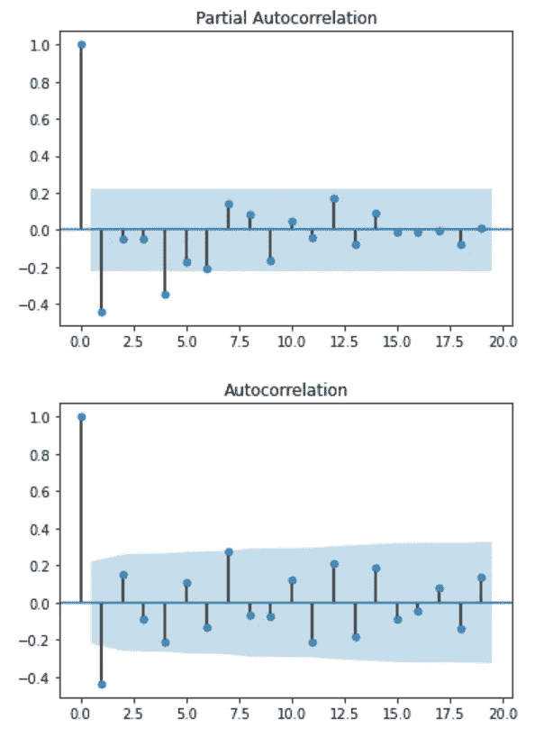

我们可以从 PACF 中看到，我们在滞后 1 处有一个显著的峰值，这表明 AR(1)过程。此外，我们在滞后 4 处有另一个峰值，表明 1 阶的季节性自回归过程(P = 1)。

查看 ACF 图，我们仅在滞后 1 处看到一个显著的峰值，表明存在非季节性 MA(1)过程。

尽管这些图可以让我们大致了解正在进行的过程，但最好测试多个场景，并选择产生最低 AIC 的模型。

因此，让我们编写一个函数来测试 SARIMA 模型的一系列参数，并输出一个性能最佳的模型位于顶部的表:

```
def optimize_SARIMA(parameters_list, d, D, s, exog):
    """
        Return dataframe with parameters, corresponding AIC and SSE

        parameters_list - list with (p, q, P, Q) tuples
        d - integration order
        D - seasonal integration order
        s - length of season
        exog - the exogenous variable
    """

    results = []

    for param in tqdm_notebook(parameters_list):
        try: 
            model = SARIMAX(exog, order=(param[0], d, param[1]), seasonal_order=(param[2], D, param[3], s)).fit(disp=-1)
        except:
            continue

        aic = model.aic
        results.append([param, aic])

    result_df = pd.DataFrame(results)
    result_df.columns = ['(p,q)x(P,Q)', 'AIC']
    #Sort in ascending order, lower AIC is better
    result_df = result_df.sort_values(by='AIC', ascending=True).reset_index(drop=True)

    return result_df
```

请注意，我们将只测试参数 P、P、q 和 q 的不同值。我们知道季节和非季节积分参数都应该是 1，季节长度是 4。

因此，我们生成所有可能的参数组合:

```
p = range(0, 4, 1)
d = 1
q = range(0, 4, 1)
P = range(0, 4, 1)
D = 1
Q = range(0, 4, 1)
s = 4parameters = product(p, q, P, Q)
parameters_list = list(parameters)
print(len(parameters_list))
```

你应该看到我们有 256 种不同的组合！现在，我们的函数将根据我们的数据拟合 256 种不同的 SARIMA 模型，以找到 AIC 最低的模型:

```
result_df = optimize_SARIMA(parameters_list, 1, 1, 4, data['data'])
result_df
```

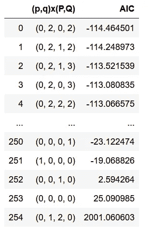

结果表

从表中可以看出，最佳模型是:SARIMA(0，1，2)(0，1，2，4)。

我们现在可以拟合模型并输出其摘要:

```
best_model = SARIMAX(data['data'], order=(0, 1, 2), seasonal_order=(0, 1, 2, 4)).fit(dis=-1)
print(best_model.summary())
```

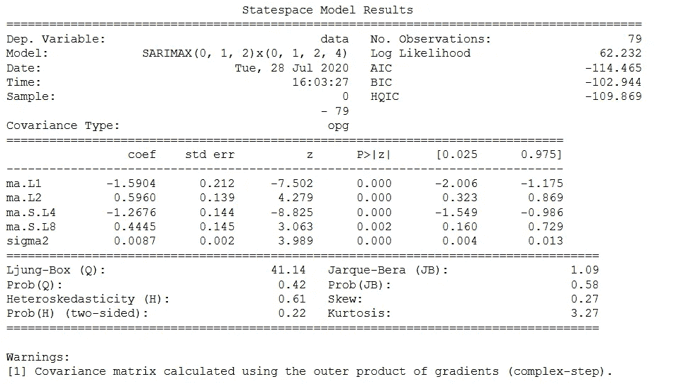

最佳模式总结

在这里，你可以看到表现最好的模型同时具有季节性和非季节性移动平均过程。

根据上面的总结，您可以找到系数的值及其 p 值。请注意，从 p 值来看，所有系数都是显著的。

现在，我们可以研究残差:

```
best_model.plot_diagnostics(figsize=(15,12));
```

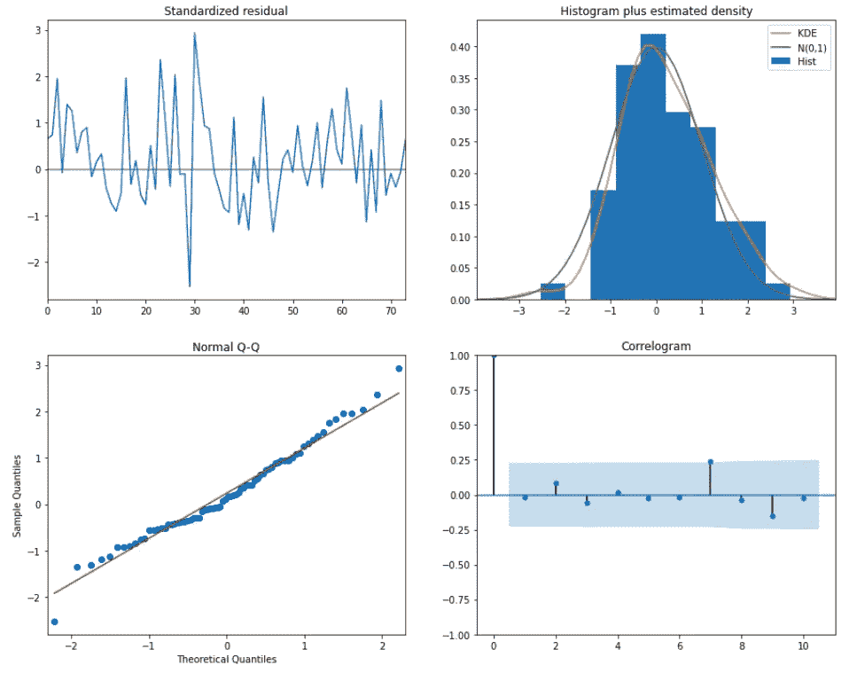

模型诊断

从正常的 Q-Q 图，我们可以看到，我们几乎有一条直线，这表明没有系统偏离正常。此外，右下角的相关图表明残差中没有自相关，因此它们实际上是白噪声。

我们已经准备好绘制模型的预测图，并预测未来:

```
data['arima_model'] = best_model.fittedvalues
data['arima_model'][:4+1] = np.NaNforecast = best_model.predict(start=data.shape[0], end=data.shape[0] + 8)
forecast = data['arima_model'].append(forecast)plt.figure(figsize=(15, 7.5))
plt.plot(forecast, color='r', label='model')
plt.axvspan(data.index[-1], forecast.index[-1], alpha=0.5, color='lightgrey')
plt.plot(data['data'], label='actual')
plt.legend()plt.show()
```

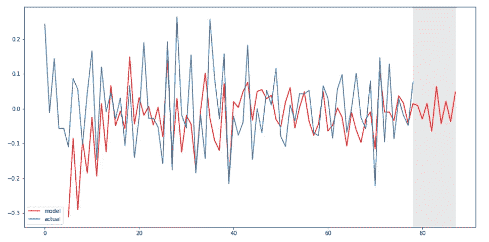

模型预测

瞧啊。

# 结论

恭喜你！您现在了解了什么是季节性 ARIMA(或 SARIMA)模型，以及如何使用它进行建模和预测。

通过以下课程了解有关时间序列的更多信息:

*   [在 Python 中应用时间序列分析](https://www.datasciencewithmarco.com/offers/tdU2mtVK)

干杯🍺