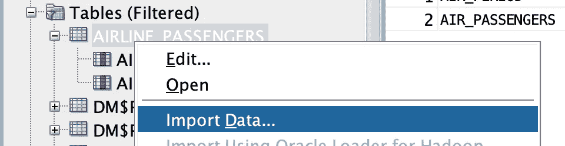
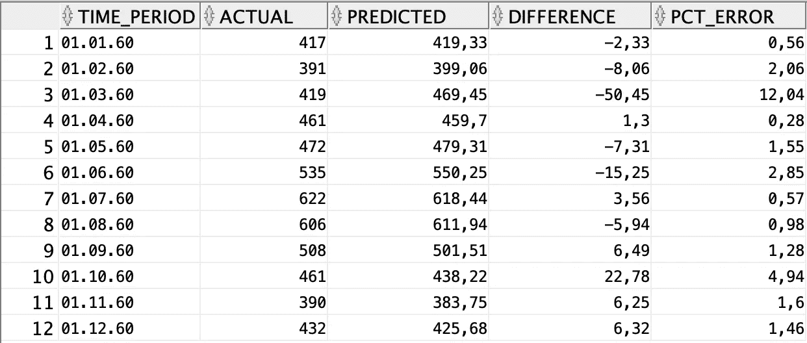

# 使用 SQL 进行时间序列预测——比您想象的要简单

> 原文：<https://towardsdatascience.com/time-series-forecasting-with-sql-its-easier-than-you-think-1f5b362d0c81?source=collection_archive---------9----------------------->

## 是的，SQL 现在可以做到这一点。

时间序列预测是我通常用 *Python* 做的一项任务。你可能已经习惯了其他语言，比如 *R* 或者 *Julia* ，但是我敢打赌你从来没有想到过这种类型的任务。如果是这样的话——继续读下去——你会惊讶地发现只用 *SQL* 就能完成这么多事情。


[晨酿](https://unsplash.com/@morningbrew?utm_source=medium&utm_medium=referral)在 [Unsplash](https://unsplash.com?utm_source=medium&utm_medium=referral) 上拍摄的照片

我以前写过关于使用 *SQL* 执行分类任务的文章，所以如果你对此感兴趣的话，一定要看看:

[](/machine-learning-with-sql-its-easier-than-you-think-c6aae9064d5a) [## 使用 SQL 进行机器学习——比你想象的要简单

### 当 Python 不是一个选项时该做什么。包括代码。

towardsdatascience.com](/machine-learning-with-sql-its-easier-than-you-think-c6aae9064d5a) 

时间序列不同于一般的机器学习任务。你不可能训练一次模型，在生产中用几个月。时间序列模型必须使用完整的历史数据进行训练，并且新的数据点可能每小时、每天、每周或每月都会出现—因项目而异。

这就是为什么在硬件资源有限的情况下，在数据库中进行训练是有益的。 *Python* 几乎总是会比数据库消耗更多的资源。

我们将再次使用[甲骨文云](https://www.oracle.com/index.html)。这是免费的，所以请注册并创建一个 OLTP 数据库实例(版本 19c，有 0.2TB 的存储)。完成后，下载*云钱包*并通过*SQL Developer*——或任何其他工具建立连接。

这将花费你至少 10 分钟，但这是一件相当简单的事情，所以我不会在这上面浪费时间。

厉害！让我们继续数据加载。

# 数据加载

在进行任何类型的预测之前，我们需要一些数据。任何时间序列教程的事实上的标准数据集是[航空乘客](https://raw.githubusercontent.com/jbrownlee/Datasets/master/airline-passengers.csv)数据集。下载它，并在安全的地方保存一分钟。

我们需要创建一个保存数据集的表，接下来我们就这么做。下面是 SQL 语句:

```
CREATE TABLE airline_passengers(
    air_period DATE,
    air_passengers INTEGER
);
```

我们现在可以通过*导入数据*功能加载数据集:



当弹出一个模态窗口时，只需提供下载的 CSV 文件的路径，然后点击几次 *Next* 。使用您的最佳判断选择列，并选择日期格式为`YYYY-MM`。

完成后，我们的数据集就可以使用了:


厉害！我们现在可以继续进行模型训练和预测。

# 模特培训

我们的数据集有 144 行。我们不会对其整体进行模型训练。我们将保留最后 12 行用于评估。

从训练开始，我们需要创建一个指向训练数据的`VIEW`。方法如下:

```
CREATE OR REPLACE VIEW src_passengers AS
    SELECT * FROM airline_passengers 
    WHERE air_period < TO_DATE('1960-01-01', 'YYYY-MM-DD');
```

`src_passengers`视图现在保存了前 132 行——这正是我们想要的。

接下来，我们将声明一个处理模型训练的简短的`PL/SQL`片段:

```
DECLARE
    v_setlst DBMS_DATA_MINING.SETTING_LIST;
BEGIN
    v_setlst(DBMS_DATA_MINING.ALGO_NAME) := DBMS_DATA_MINING.ALGO_EXPONENTIAL_SMOOTHING;
    v_setlst(DBMS_DATA_MINING.EXSM_INTERVAL) := DBMS_DATA_MINING.EXSM_INTERVAL_MONTH;
    v_setlst(DBMS_DATA_MINING.EXSM_PREDICTION_STEP) := '12';
    v_setlst(DBMS_DATA_MINING.EXSM_MODEL) := DBMS_DATA_MINING.EXSM_HW;
    v_setlst(DBMS_DATA_MINING.EXSM_SEASONALITY) := '12';

    DBMS_DATA_MINING.CREATE_MODEL2(
        model_name => 'AIRLINE_PSG_FORECAST',
        mining_function => 'TIME_SERIES',
        data_query => 'SELECT * FROM src_passengers',
        set_list => v_setlst,
        case_id_column_name => 'air_period',
        target_column_name => 'air_passengers'
    );
END;
/
```

让我们把这个片段分解一下，让它更容易理解:

*   `DBMS_DATA_MINING.ALGO_NAME` -时间序列预测算法类型，指数平滑是目前唯一可用的算法
*   `DBMS_DATA_MINING.EXSM_INTERVAL` -表示数据集的间隔。我们的数据按月间隔存储，因此有了`EXSM_INTERVAL_MONTH`值
*   `DBMS_DATA_MINING.PREDICTION_STEP` -做出多少预测。12(一年)不错
*   `DBMS_DATA_MINING.EXSM_MODEL` -本质上是指数平滑模型的超参数组合。我选择使用三重指数平滑法或霍尔特-温特斯法。这里是可用算法的完整列表。
*   `DBMS_DATA_MINING.EXSM_SEASONALITY` -表示一个季节持续多长时间

声明之后，我们可以在`DBMS_DATA_MINING.CREATE_MODEL2`过程的帮助下创建一个时间序列模型(顺便说一下，这是一个很好的命名约定)。以下是解释:

*   `model_name` -任意，随心所欲命名型号
*   `mining_function` -设置为`TIME_SERIES`，原因很清楚
*   `data_query` -模型如何获得训练数据
*   `set_list` -之前声明的设置列表，告诉 Oracle 如何实际训练模型
*   `case_id_column_name` -包含日期值的列的名称
*   `target_column_name` -包含数值的列的名称(我们试图预测的内容)

就是这样！如果你能理解这一点，你就知道如何用 SQL 训练时间序列模型。

您现在可以运行`PL/SQL`代码片段了。需要几秒钟才能完成。完成后，您可以继续下一部分。

# 模型评估

让我们看看我们的模型表现有多好。为此，我准备了以下声明:

```
SELECT
    a.case_id AS time_period,
    b.air_passengers AS actual,
    ROUND(a.prediction, 2) AS predicted,
    ROUND((b.air_passengers - a.prediction), 2) AS difference,
    ROUND((ABS(b.air_passengers - a.prediction) / b.air_passengers) * 100, 2) AS pct_error
FROM 
    dm$p0airline_psg_forecast a, 
    airline_passengers b
WHERE 
    a.case_id = b.air_period
AND a.case_id >= TO_DATE('1960-01-01', 'YYYY-MM-DD');
```

它将实际数据与 Holt-Winters 算法所做的预测进行比较，并比较绝对误差和百分比误差。以下是上述 SQL 语句的输出:



厉害！就我们投入的工作而言，我们的模型并没有那么糟糕。让我们在下一部分总结一下。

# 在你走之前

这工作量很大——不要争论了。尽管如此，我们仍有改进的方法。一个想法立即浮现在脑海中——创建一个将返回最佳算法的函数。

您可以将所有可能的算法存储在一个数组中，然后在遍历数组的同时训练一个模型，跟踪每个模型的性能。但这是另一个话题了。

感谢阅读。

[**加入我的私人邮件列表，获取更多有用的见解。**](https://mailchi.mp/46a3d2989d9b/bdssubscribe)

*喜欢这篇文章吗？成为* [*中等会员*](https://medium.com/@radecicdario/membership) *继续无限制学习。如果你使用下面的链接，我会收到你的一部分会员费，不需要你额外付费。*

[](https://medium.com/@radecicdario/membership) [## 通过我的推荐链接加入 Medium-Dario rade ci

### 作为一个媒体会员，你的会员费的一部分会给你阅读的作家，你可以完全接触到每一个故事…

medium.com](https://medium.com/@radecicdario/membership) 

*原载于 2020 年 9 月 22 日 https://betterdatascience.com*[](https://betterdatascience.com/time-series-forecasting-with-sql/)**。**