# Python 代码中基于统计模型的时间序列预测

> 原文：<https://towardsdatascience.com/time-series-forecasting-with-statistical-models-in-python-code-da457a46d68a?source=collection_archive---------9----------------------->

在我之前的文章中，我展示了使用脸书先知 Python API(可用的统计模型之一)预测数字广告支出是多么容易。在第二部分中，我们将更多地讨论如何应用统计方法进行时间序列分析。

**问题**:根据 2 年多的历史每日广告支出，预测未来 2 个月的数字广告支出。

下面快速浏览一下数据文件(从 2017 年 1 月 1 日到 2019 年 9 月 23 日的每日广告支出)

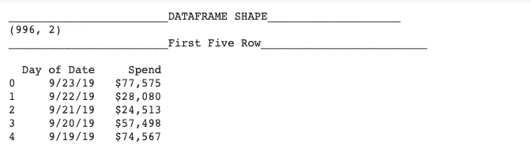

创建培训和测试数据集:

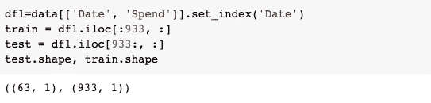

# 目录

1.  介绍

*   时间序列分析
*   什么是流行的统计模型
*   单变量统计时间序列建模的关键要素

2.ARIMA

*   ACF 和 PACF 图
*   萨里玛
*   案例研究:用 SARIMA 预测广告支出

3.美国教育考试服务中心

*   美国教育考试服务中心
*   霍尔特-温特季节方法
*   案例研究:用霍尔特-温特季节平滑法预测广告支出

4.对比模型

5.结案摘要

# 1.1 时间序列分析

细节在我之前的帖子[中解释过，这里](/a-quick-start-of-time-series-forecasting-with-a-practical-example-using-fb-prophet-31c4447a2274)。

# 1.2 我们可以使用什么时间序列统计模型？

a.单变量统计时间序列建模(例如，平均和平滑模型、有/无季节项的 ARIMA 模型)

b.多变量统计时间序列建模(如外部回归变量、风险值)

c.附加或组件模型(如[第一部分](/a-quick-start-of-time-series-forecasting-with-a-practical-example-using-fb-prophet-31c4447a2274)中涉及的脸书预言家)

d.结构时序建模(例如，贝叶斯结构时序建模、分层时序建模)。

在本文中，我将重点解释萨里玛和霍尔特-温特斯。

# 1.3 关键组件

我们需要我们的数据平稳性，这意味着(1)常数均值(2)常数方差(3)自协方差不依赖于时间，如果我们想使用时间序列数据的统计建模。

那如果我的数据不符合这个统计假设呢？换句话说，非平稳数据是什么样的？

非平稳数据背后的两个共同特征是:( 1)趋势~均值不随时间变化;( 2)季节性~方差不随时间变化;( 3)自协方差依赖于时间。

去趋势化和消除季节性的方法有哪些？

*   转换(例如，日志、sqrt 等)
*   平滑(例如，滚动平均等)
*   差异
*   分解
*   多项式拟合(例如，拟合回归模型)

# 2.1 ARIMA 模型中的关键术语

格式:ARIMA(p，d，q) — (1) p: AR 项(2) d: (3) q: MA 项

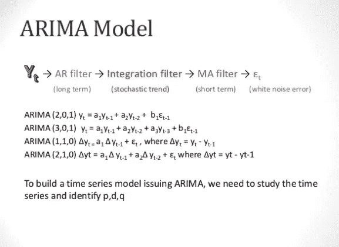

图片来自[https://www.slideshare.net/21_venkat?](https://www.slideshare.net/21_venkat?)

*   AR(自回归)项将序列中的下一步描述为前一时间步观察值的线性函数。
*   I(积分)项，序列的差分预处理步骤，使序列稳定。
*   MA(移动平均)项将序列中的下一步描述为前一时间步平均过程的残差的线性函数。

模型的符号包括将 AR (p)、I (d)和 MA (q)模型的阶指定为 ARIMA 函数的参数，例如 ARIMA(p，d，q)。ARIMA 模型也可以用来开发 AR、MA 和 ARMA 模型。

那我们怎么确定 p，d，q 呢？

# 2.2 ACF 和 PACF 图

ACF(自相关函数)描述了时间序列与其自身滞后版本之间的相关性(例如，Y(t)与 Y(t-1)的相关性)

PACF(部分自相关函数)提供了由每个连续滞后项解释的附加相关性。

1.  用 PACF 图确定 p
2.  使用 ACF 图确定 q

 [## 识别 ARIMA 模型中 AR 和 MA 项的顺序

### 非季节性 ARIMA 模型说明(pdf 文件)季节性和非季节性 ARIMA 模型幻灯片(pdf 文件)介绍…

people.duke.edu](https://people.duke.edu/~rnau/411arim3.htm) 

# 2.3 萨里玛

SARIMA(季节性自回归综合移动平均)在季节性水平上结合了 ARIMA 模型。

格式:SARIMA(p，D，q) (P，D，Q)s 其中 s 代表季节周期。

# 2.3 案例研究:用 SARIMA 预测广告支出

我创建了 test _ stationarity 来检查平稳性。

该函数绘制了滚动平均值和标准差，并通过进行[增强迪基-富勒测试](https://en.wikipedia.org/wiki/Augmented_Dickey%E2%80%93Fuller_test)输出 p 值。

检查原始数据:test _ stationary(df1[' Spend ']。dropna())

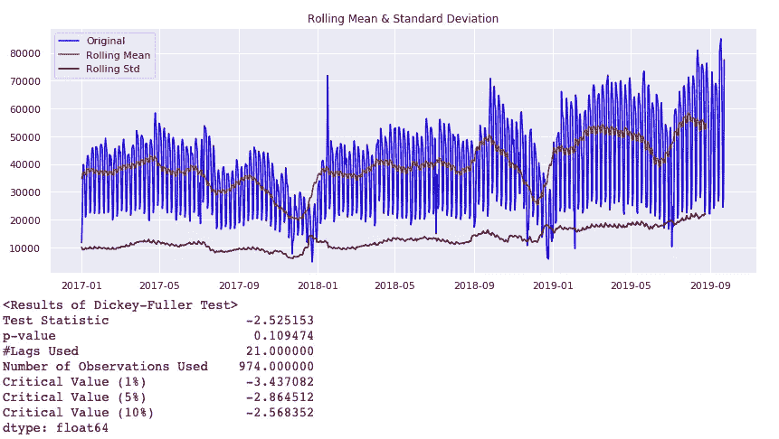

与临界值相比，时间序列是非平稳的。

让我们做一个对数转换:df1[' log _ Spend ']= NP . log(df1[' Spend '])

test _ stationary(df1[' log _ Spend ']。diff(1)。dropna())

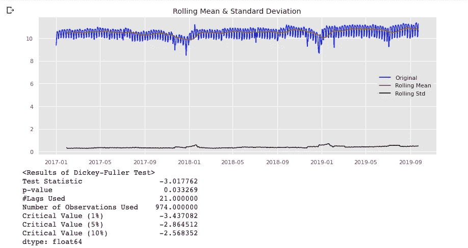

太好了。利用对数变换，时间序列在 5%的阈值处是平稳的。

让我们尝试第一个差异:test _ stationary(df1[' Spend ']。diff(1)。dropna())

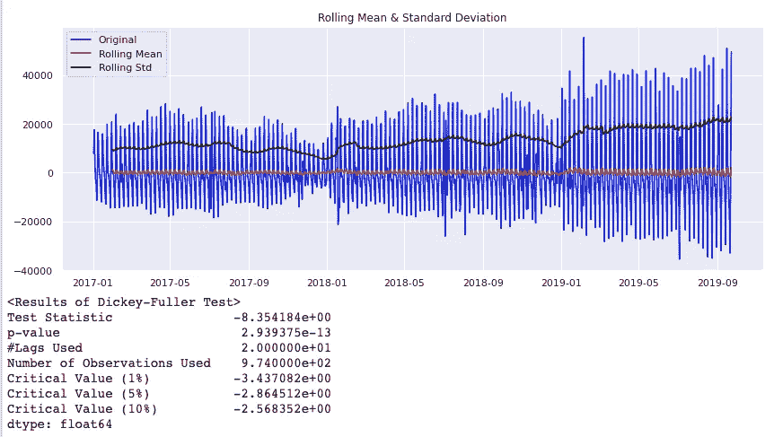

令人印象深刻。结果是事件更好:时间序列在 1%的阈值处是稳定的，具有一阶差分。

建立 SARIMA 模型，预测 2019 年 7 月 23 日至 2019 年 9 月 23 日两个月的广告支出

现在，让我们通过从*sk learn . metrics import mean _ squared _ error，mean_absolute_error* 计算 mse 和 mae 来检查该模型的性能

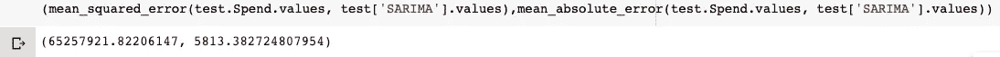

让我们想象一下预测:

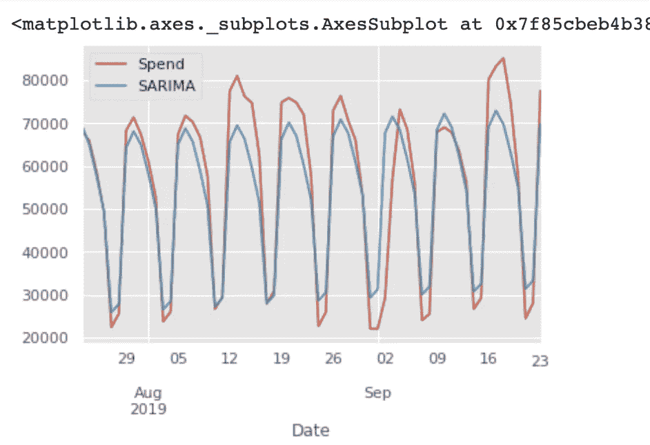

SARIMA 模型能够捕捉趋势和每周季节性，但在 MAE 为 5813 的波峰和波谷上有点偏离。

# 3.指数平滑(ETS)

因为时间序列数据在一段时间内自然是随机的，我们通常希望平滑数据，为此我们将使用 ETS，使用指数方法为过去的观察值分配较少的权重。在 [wiki](https://en.wikipedia.org/wiki/Exponential_smoothing) 上有一个像样的解释。

类似地，我们也希望通过应用 ETS 将时间序列分解成趋势(T)、季节(S)和不规则或误差(E)分量。

三种常见的 ETS 类型:

*   **线性:**双指数平滑:
*   **加法:**三重指数平滑
*   **乘法:**也称三重指数平滑

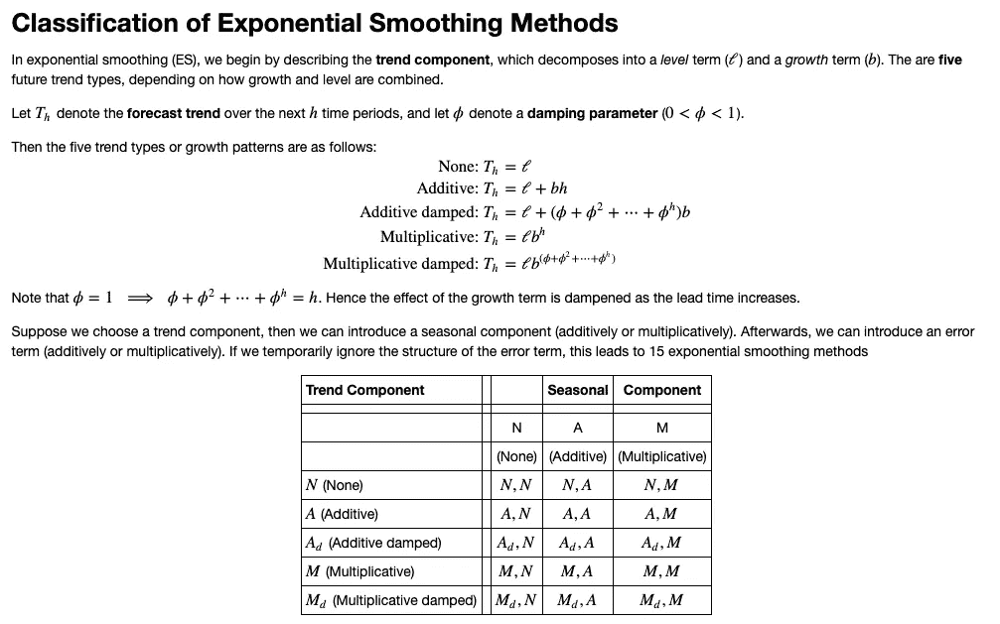

来自:https://www . stat . Berkeley . edu/~ arturof/Teaching/stat 248/lab 10 _ part 1 . html

# 3.2 霍尔特-温特斯季节性方法

热冬季节法是三重指数平滑法的一种。它有三个关键部分:(1)一个水平(2)一个趋势(3)季节成分霍尔特-温特斯加法和霍尔特-温特斯乘法。

# 3.3 案例研究:用霍尔特-温特季节平滑法预测广告支出

建立热冬附加模型，预测 2019 年 7 月 23 日至 2019 年 9 月 23 日两个月的广告支出

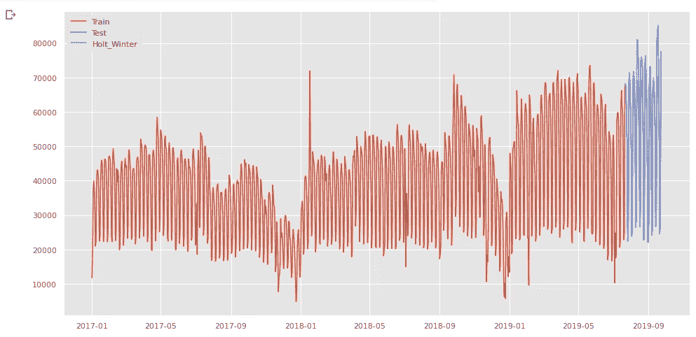

通过*从 sklearn.metrics 导入 mean_squared_error，mean_absolute_error* 计算 mse 和 mae

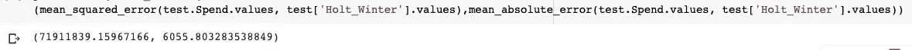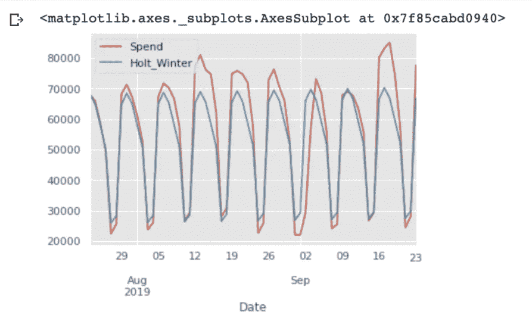

H-W 模型能够捕捉趋势和每周季节性，但在 MAE 为 6055 的波峰和波谷上有点偏离。

# 4.比较这两个模型

让我们在同一个图中可视化两个模型的预测。

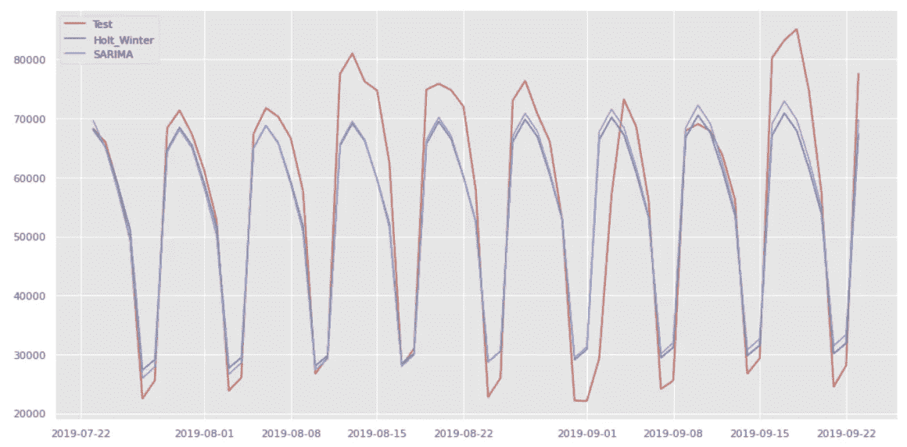

从图中，我们可以看出 SARIMA 模型比 Holt_Winter 模型表现稍好，MSE 和 MAE 都较低。尽管这两个模型都不能完美地捕捉到波峰和波谷，但在这种情况下，它们仍然对业务有用。根据数据，平均每月广告支出为 200 万美元以上。然而，基于这两种模型的平均寿命约为 6000。换句话说，对于一个平均每月广告支出为 200 万美元的企业来说，两个月的广告支出预测将下降约 6000 美元。这是一个相当不错的预测！

# 5.结案摘要

在本文中，单变量预测方法在广告支出数据上表现良好。但是用这些方法组合/合并新的信号，例如事件、天气，并不容易。这些统计方法对缺失数据也非常敏感，通常不能很好地预测长期数据。

在下一篇文章中，我将展示如何使用深度学习来预测同一数据集上的时间序列！

有用的参考资料:

 [## 实验 10，第 1 部分-指数平滑

### 首先，我们区分方法和模型。预测方法是一种算法，它提供一个点…

www.stat.berkeley.edu](https://www.stat.berkeley.edu/~arturof/Teaching/STAT248/lab10_part1.html)  [## 指数平滑法

### 指数平滑是一种使用指数窗口平滑时间序列数据的经验法则…

en.wikipedia.org](https://en.wikipedia.org/wiki/Exponential_smoothing)  [## ARIMA 模型介绍

### 非季节性 ARIMA 模型说明(pdf 文件)季节性和非季节性 ARIMA 模型幻灯片(pdf 文件)介绍…

people.duke.edu](https://people.duke.edu/~rnau/411arim.htm)