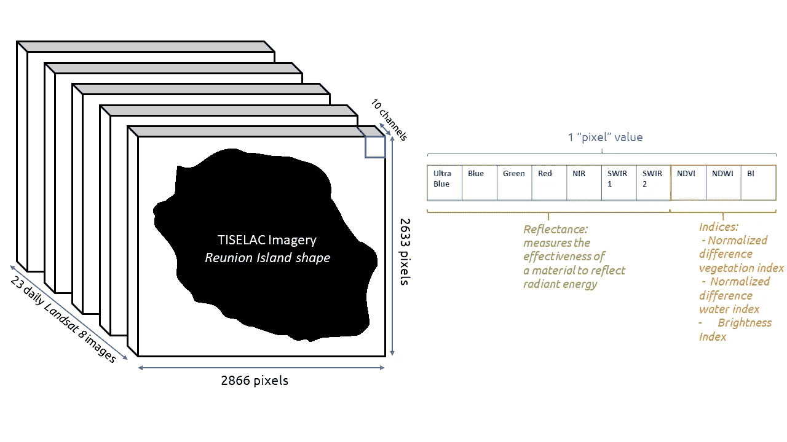
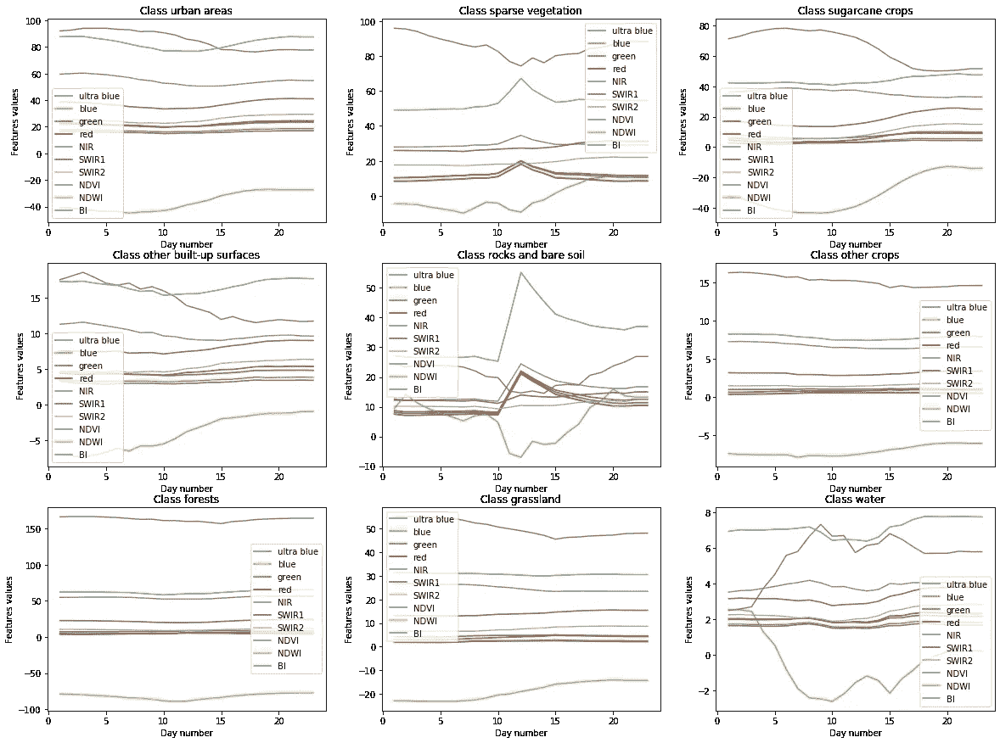
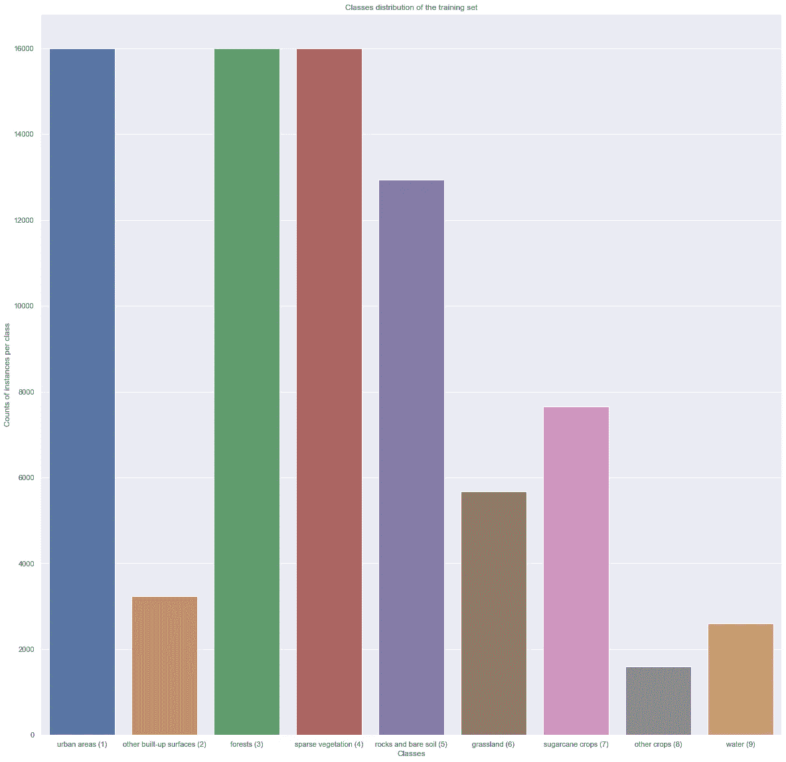
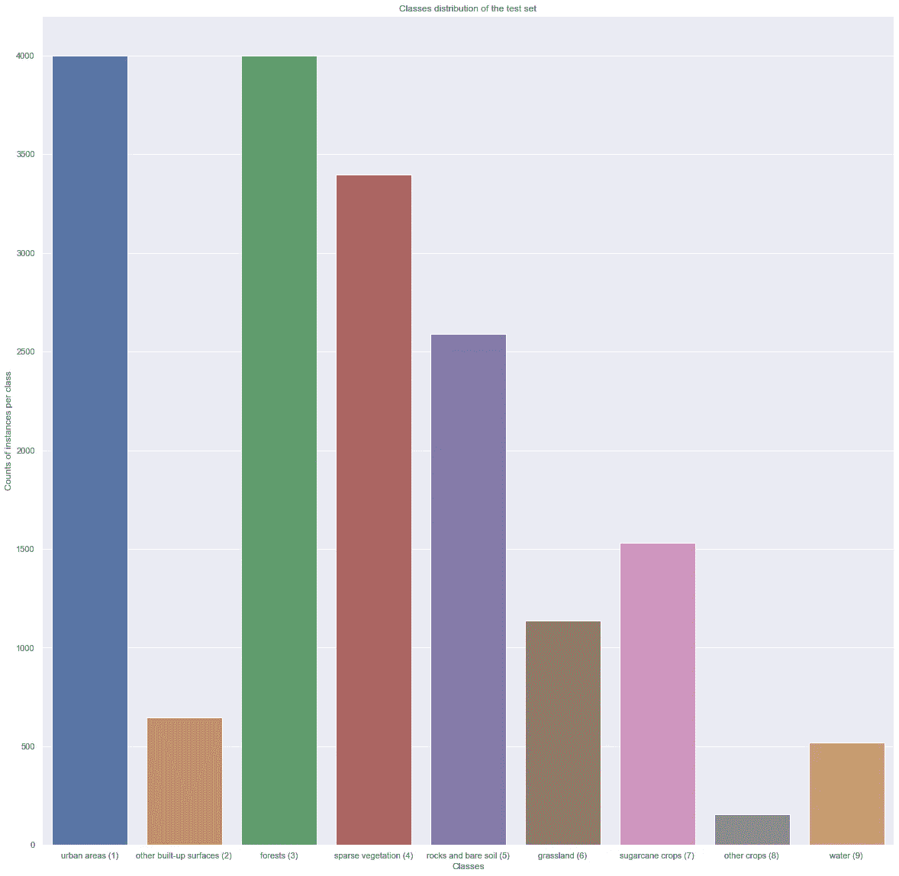
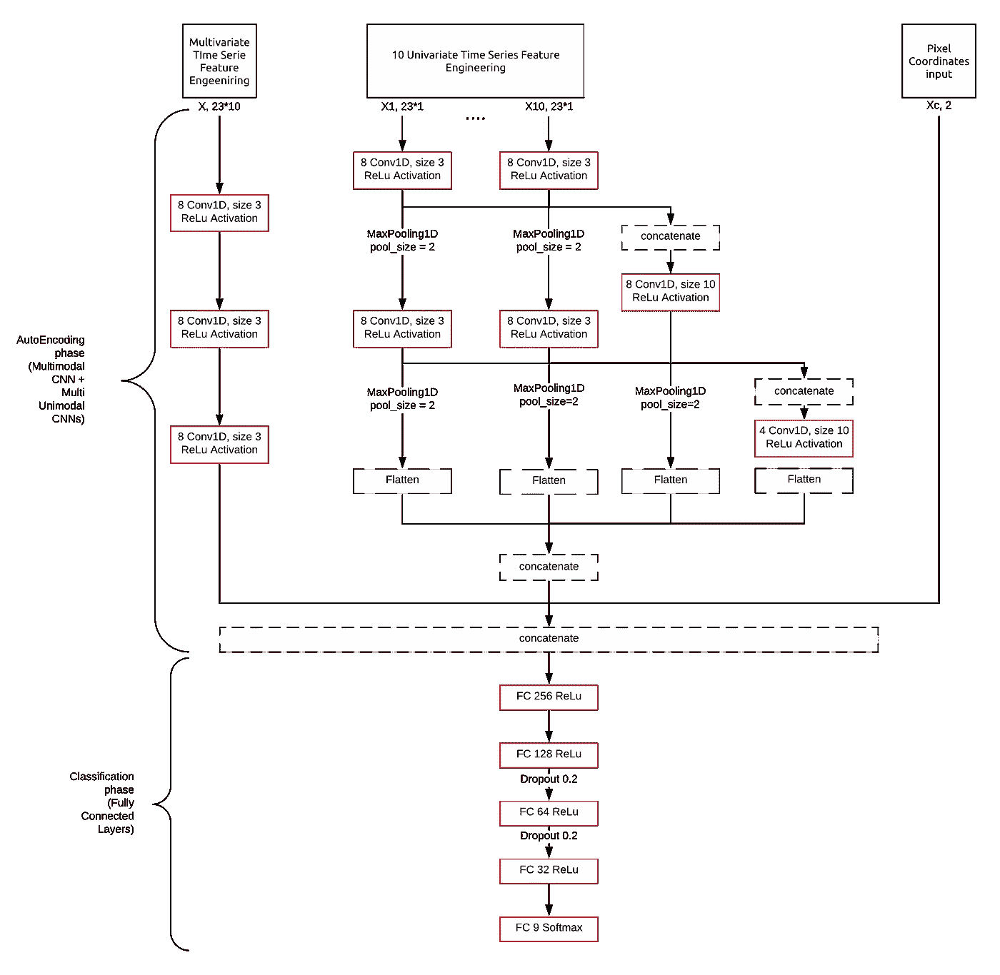
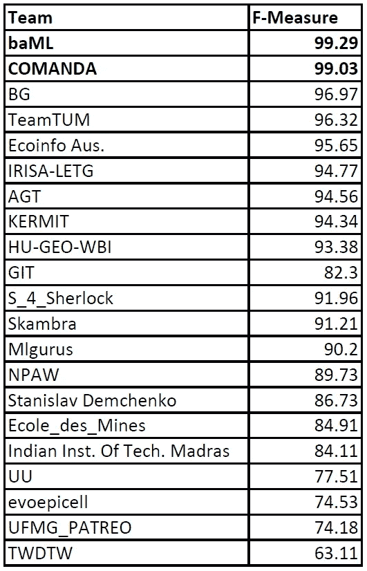

# 时间序列土地覆盖挑战:深度学习视角

> 原文：<https://towardsdatascience.com/time-series-land-cover-challenge-a-deep-learning-perspective-6a953368a2bd?source=collection_archive---------15----------------------->

## 针对 TiSeLaC 挑战的不同 DL 架构快速回顾

蒙彼利埃大学在 2017 年提出的 [TiSeLaC 挑战](https://sites.google.com/site/dinoienco/tiselc)[1】(TiSeLaC 针对*时间序列土地覆盖*)在于**预测卫星图像**时间序列**中的土地覆盖**类像素。

照片由 [**Kelly Lacy**](https://www.pexels.com/@kelly-lacy-1179532?utm_content=attributionCopyText&utm_medium=referral&utm_source=pexels) 从 [**Pexels**](https://www.pexels.com/photo/aerial-photo-of-empty-meandering-road-in-between-forest-2876511/?utm_content=attributionCopyText&utm_medium=referral&utm_source=pexels)

# 目录

1.  什么是时间序列卫星图像
2.  TiSeLaC 数据集呢？
3.  TiSeLaC 分类任务
4.  结论

# 1.什么是时间序列卫星图像？

时间序列卫星图像是对卫星图像时间维度的补充。换句话说，它是一系列定期拍摄的卫星图片，以便不仅使用图片中嵌入的空间信息，而且使用时间维度来进行预测，无论这些预测是分类、检测还是分割。

X. Yang 和 C. P. Lo [2]在 2002 年对卫星图像时间序列进行了历史上最引人注目的使用，他们揭示并量化了在亚特兰大加速城市发展的背景下森林的损失和城市扩张。

# 2.TiSeLaC 数据集呢？

这些卫星图片是 2014 年以 30 米分辨率拍摄的 23 张 2866 * 2633 像素的留尼汪岛图片。这些像素中的每一个都由 10 个特征组成:7 个表面反射率，代表每个独立多光谱带(OLI)的测量值:超蓝、蓝、绿、红、NIR、SWIR1 和 SWIR2。我们还发现了 3 个互补的辐射指数，分别是*归一化差异植被指数*、*归一化差异水指数*以及最后的*亮度指数*。

带有 10 维细节数据的图形*像素*(来源: [**托马斯·迪·马蒂诺**](https://medium.com/@dimartinot) )

有这么多波段，我们只能想象波段之间的潜在相关性。我们现在将深入探索性数据分析。

## 2.1 探索性数据分析

这里要注意的第一件重要的事情是，在每幅图像包含的 2866*2633 个像素中，**只有 81714 个像素被保留在训练集中**，测试集中有 **17973 个像素**。这意味着我们**不处理整个图像**，因为只有像素的子集被处理和分析。

以下动画显示了每个像素的蓝色、绿色和红色分量随时间的变化:

使用 RGB 波段的卫星数据的 23 天 gif 动画(来源: [**托马斯·迪·马蒂诺**](https://medium.com/@dimartinot) )

此外，为了对每个类栅格有一个总体了解，我通过计算 23 天中每一天的 10 个波段各自的平均值和标准差，为每个类创建了一个图。

“每一类”的时间序列意味着(来源: [**托马斯·迪·马蒂诺**](https://medium.com/@dimartinot) )

正如我们在那里看到的，一些不同的类别看到它们的特征随着时间的推移被高度扰乱(例如*水*类别或*岩石和裸露土壤*是最明显的)。相反，森林类和农作物类的结果相当稳定。

每个类别的特征变化中的这种明显多样性是一个“*好迹象”*，对于自动分类器来说，能够将它们彼此区分开应该不会太难。然而，这些结果充其量是一般化的，可能会产生误导，它们只是提供了关于数据多样性的见解，但并不能证明分类任务(或至少是高度精确的分类)会很容易。

我们现在将探索类的分布。TiSeLaC 组织者对像素进行的二次采样的第一个目的是平衡等级分布。然后，我们希望看到一个稍微平衡的数据集:

训练集的类的柱状图(来源: [**托马斯·迪·马蒂诺**](https://medium.com/@dimartinot) )

我们看到，数据集实际上是倾斜的，因为“*其他作物*”类的训练样本少于 2000 个，而城市地区、森林和稀疏植被都是向上采样的。

对于测试集，我们有:

训练集的类的条形图(来源: [**托马斯·迪·马蒂诺**](https://medium.com/@dimartinot) )

我们在这里有一个有点类似的图，每个类都比训练集中的少 4 到 6 倍，除了“*其他作物”*在测试集中更少。

## 2.2 分类问题的初步提示

由于这个数据集是由二次抽样数据组成的，在某种程度上，只有一些像素被保留，我们**不能像图像处理**一样处理这个问题，因为我们只能访问图像的一部分。

然而，我们可以从**信号处理**的角度来看问题，更具体地说，可以从**时间序列分类**的角度来看问题，由于像素坐标数据，时间序列分类具有关于所述时间序列在空间中的定位的额外信息。

# 3.TiSeLaC 分类任务

一旦我们采取了时间序列分类的方向，我们就可以比较最近流行的针对时间序列文学的*深度学习的不同模型。*

## 3.1 多重单峰网络:**多通道深度卷积神经网络**

最受欢迎的模型之一是在[3]中开发和研究的**多通道深度卷积神经网络**(即 MCDCNN)。这种架构希望通过在输入的每个维度上独立(即并行)应用卷积来利用多模态时间序列数据的不同特征之间的假定独立性。

我自己用 Python 和 Keras 实现了一个。

首先，我描述了 10 个通道各自的架构:

然后我用一个*连接*层将它们混合成一个模型。

对于训练过程，我使用了一个 **SGD** ，其**学习率为 0.01** ，一个**衰减为 0.0005，**一个**批量为 64 个**实例，以及 **120 个时期**。

考虑到 TiSeLaC 组织者使用的 F1 评分标准,我得到了 0.867 的**分**

然而，对这个数据集的评估是，我们正在处理多模态时间序列。

## 3.2 多模式网络:时代-CNN

事实上，人们可能会认为指数的**值与反射率测量值**相关。这一点在“*岩石和裸土”*类地块中尤为明显，在第 11 天左右，多条带中的峰值非常明显。

这个想法在[4]中被赵 B、陆 H、陈 S、刘 J 和吴 D 讨论过，他们引入了时间的概念。该模型在多个方面不同于 MCDCNN:

*   它使用 sigmoid 输出层的 MSE 损失，而不是通常的*分类交叉熵*和 *softmax 输出层*；
*   它使用*平均池*代替通常的最大池；
*   在最后一个卷积层之后不存在池层

我在 Keras 和 Python 中实现的 **Time-CNN** 如下:

这一次，我使用了 1e-3 的**学习率，没有衰减的 **Adam 优化器**，128** 的**批量和 100 个时期的**(使用**提前停止**，通常在 **50 个时期**左右停止训练过程)。****

**通过这种技术，我取得了 0.878 的 **F1 分数，这是正确的，但仍然不令人满意。****

**正如我们所看到的，两个模型在考虑如何完成这项任务时采取了完全不同的角度:一个模型假设时间序列是不相关的，而另一个模型认为 10 个时间序列是一个独特的实体。这就是我认为使用这两种想法并将它们合并到一个模型中会有所帮助的地方。**

## **3.3 多模式和多单模式架构的组合**

**这个想法在[5]中被 TiSeLaC 竞赛的一组研究人员深入探讨，他们的解决方案获得了冠军。我的实现深受他们工作的启发，虽然我没有达到与他们相同的性能(原因是他们使用像素的预处理空间特征表示以及通常的时间序列，并使用不同初始化的多个模型的打包技术完成)，但我仍然设法获得了令人满意的分数。**

**我的架构如下:**

****

**我提议的最终网络架构，由 3 种不同模型组合而成(来源: [**托马斯·迪·马蒂诺**](https://medium.com/@dimartinot) )**

**所提出的架构使用 3 种不同的模型，从左边的**多变量模型**、中间的 **10 个单变量模型**和右边的用于位置信息的**聚集模型**开始。**

**第一个模型是单变量模型，仅包含 3 个卷积层，中间没有池层。**

**第二个模型使用 10 个单变量模型，具有不同的连接级别，以处理在网络的不同级别设计的功能，有点类似于 UNet 或 ResNet 会做的事情。**

**然后，第三个模型仅通过预处理和缩放的像素坐标到达最终的完全连接的层。**

**然后，将这些特征提取模型输出中的每一个连接起来，用通常的全连接层进行分类:**

**有了这个架构，我获得了 0.930 的 **F1 分数，0.001** 的**学习率，256** 的**批量， **50 个历元**和一个默认参数为**的 **Adam 优化器。****

****

**TiSeLaC 排行榜(来源: [**TiSeLaC 网站**](https://sites.google.com/site/dinoienco/tiselc) )**

**有了这个分数，我的解决方案将位于 GIT 团队之上。然而，它仍然需要通过在高性能计算机上运行可能的 GridSearch 算法以及为像素位置找到一个好的预处理思想来彻底调整超参数，而不是简单的缩放过程。**

# **4.结论**

**通过这个项目，我们看到了如今的 DL 架构在对时间序列数据进行分类时是多么有效，以及如何将单峰和多峰分析结合起来以获得更好的性能。**

**作为一个更普遍的结论，我们已经看到深度学习在处理序列方面有多好。**

**最后一点，我想感谢 TiSeLaC 竞赛的组织者公开了这个数据集。通过这种方式，我已经能够处理它，并了解更多关于构建不需要数百万个参数的高效模型的信息。**

**整个代码和执行程序都保存在我的个人 GitHub 上的一个 Jupyter 笔记本里，在 [**这个链接**](https://github.com/dimartinot/tiselac-challenge) 。去看看！**

# **文献学**

**[1] R. Gaetano，D. Ienco。 *TiSeLaC:时间序列土地覆盖分类挑战数据集。*法国蒙彼利埃的 UMR·泰蒂斯。2017**

**[2] X .杨，C. P. Lo。*使用时间序列的卫星图像检测佐治亚州亚特兰大大都市地区的土地利用和土地覆盖变化*。国际遥感杂志。第 1775-1798 页。2002.**

**[3]郑，刘，陈，葛，赵。*利用多通道深度卷积神经网络进行多元时间序列分类。*计算机科学前沿。2014.**

**[4]赵 B，陆 H，陈 S，刘 J，吴 D. *卷积神经网络用于时间序列分类。系统工程与电子学杂志。第 162-169 页。2017 年 2 月。***

**[5]迪毛罗、韦尔加里、巴西尔、文托拉、埃斯波里图。*用于卫星图像时序分类的深度时空表示的端到端学习*。2017。**