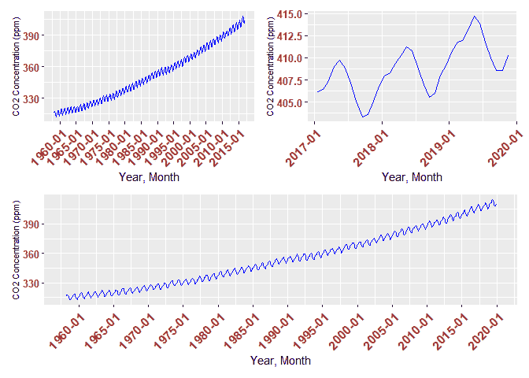
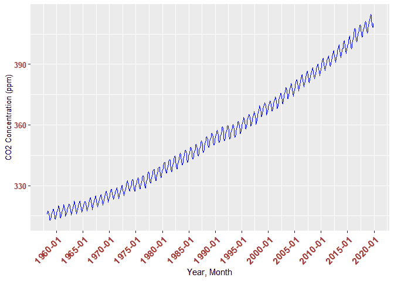
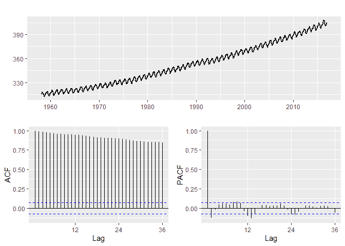
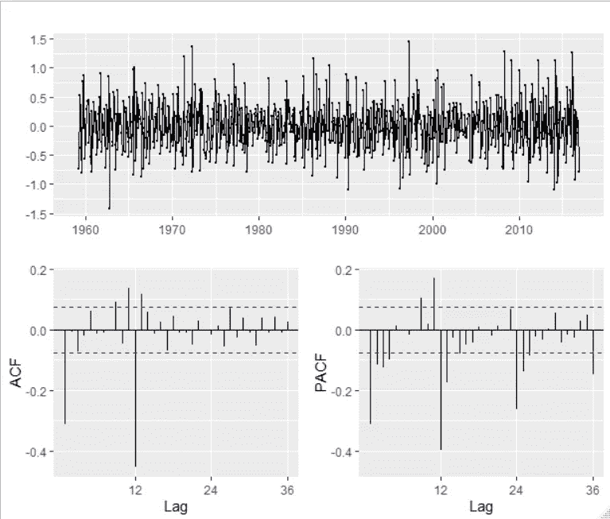
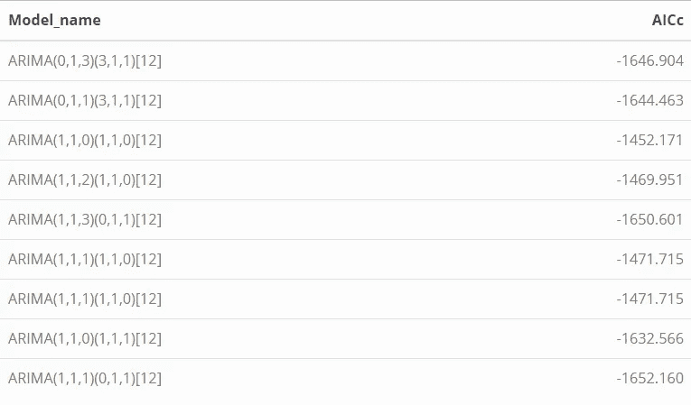
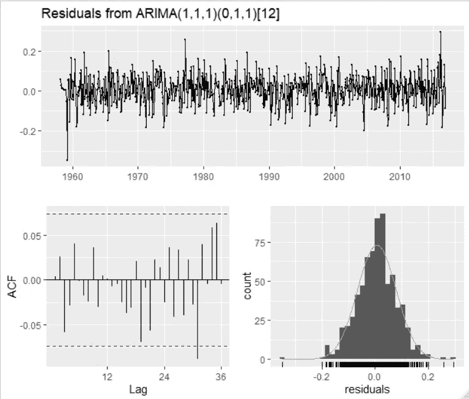
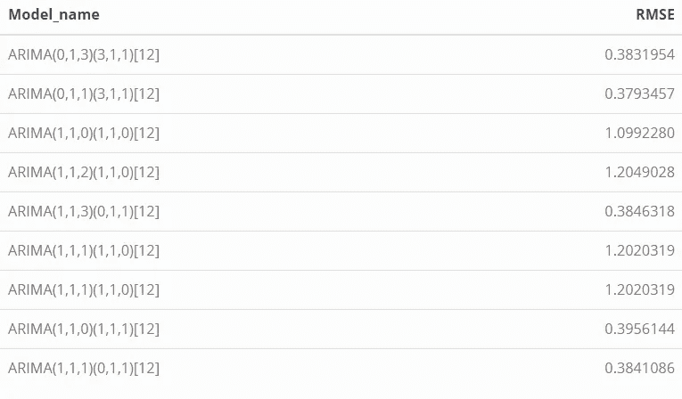
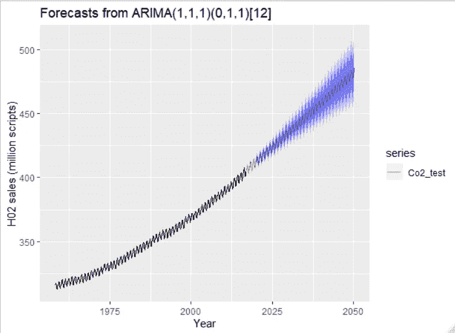
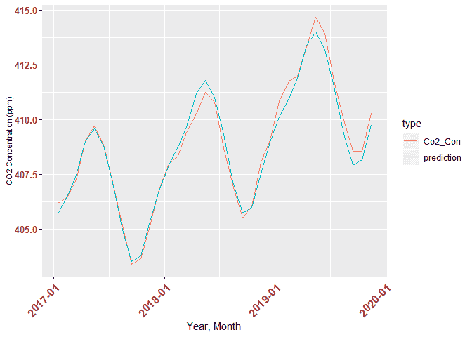
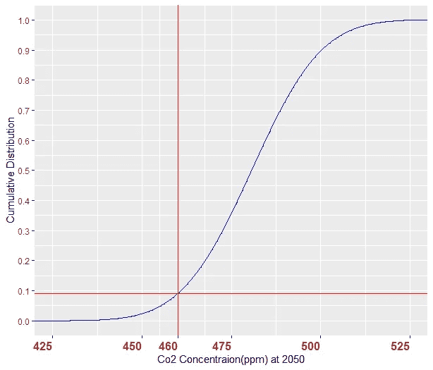

# 大气 CO2 浓度(ppm)的时间序列建模，1958–2019

> 原文：<https://towardsdatascience.com/time-series-modeling-for-atmospheric-co2-concentration-ppm-1958-2019-8425fadcb927?source=collection_archive---------14----------------------->

## R +中季节性 ARIMA 建模的分步方法(源代码)



在本帖中，我将介绍历史二氧化碳浓度(1958 年至 2019 年)的时间序列建模。季节性 ARIMA 建模将用于建立模型。Rmarkdown 格式的源代码可以在作者的 GitHub 链接[这里](https://github.com/Peymankor/Data-Science_Portfolio/tree/master/Time%20Series%20Analysis-Historical%20Co2)找到。知道[人们常说](https://doi.org/10.1093/reep/rer022)二氧化碳浓度应该在本世纪下半叶开始之前达到 460 ppm 以下，具体来说，这篇文章试图回答这个问题:

*   如果二氧化碳浓度的当前趋势继续下去(一切照旧)，那么在本世纪下半叶达到 460 ppm 的可能性有多大？

好，我们开始吧！

# 初始化

首先要做的是导入这个分析中需要的包(如果您还没有安装它们，请预先在 R 中安装这些包):

```
library(tidyverse)
library(forecast)
library(lubridate)
library(car)
library(scales)
library(patchwork)
library(kableExtra)
```

# 数据导入:

本分析将使用在夏威夷莫纳罗亚天文台测量的“1960/3–2019/12”期间的月 CO2 浓度(ppm)数据。此数据的链接可从以下网址获得:

【https://www.esrl.noaa.gov/gmd/ccgg/trends/data.html 

现在，要读取 R 中的数据，必须考虑几点:

*   数据有注释，这不是我们分析的兴趣。因此，我们用*comment.char = '#' *，
*   数据有 7 列，但其中一些列(如年和月标签)尚未写入数据，因此在导入时，我们分配以下列名(年、月、时间、Co2_con、插值、趋势、天)。
*   使用空格分隔列，因此 sep =“”将被添加到代码中。
*   因为我们包含了列名，所以可以包含 header = F。

```
data <- read.delim('ftp://aftp.cmdl.noaa.gov/products/trends/co2/co2_mm_mlo.txt', comment.char = '#', header = F, sep = '', col.names = c('Year','Month','Time','Co2_Concentration','Interpolated','Trend','Days'))
```

# 使数据整洁:

查看任何 NA 值:

```
which(is.na(data))## integer(0)
```

好，我们有完整的测量数据！但是，在读取数据时我们看到一些-99.99 的值！—注意，如注释中所述，这些值是在测量不可用时的值，因此对于这些点(741 次测量中的 7 次)，我们使用*插值*列:

```
data_cc <- data %>% 
    mutate(
        Co2_Con = case_when(
            Co2_Concentration == -99.99 ~ Interpolated,
            TRUE ~ Co2_Concentration
        )
    )
```

让我们看看列类型:

```
sapply(data_cc, class)##              Year             Month              Time Co2_Concentration 
##         "integer"         "integer"         "numeric"         "numeric" 
##      Interpolated             Trend              Days           Co2_Con 
##         "numeric"         "numeric"         "integer"         "numeric"
```

我们可以看到列类型采用了适当的格式，但是我们可以添加名为 *Date* 的新列，它以标准的时间序列格式给出测量日期。

# 数据转换

这里 *Lubridate* 包提供了一个简单的方法来转换我们的*年*和*月*列到日期:

```
data_cc$Date <- ymd(paste0(data$Year, " ", data$Month, " ", "15"))
```

此外，我们可以在我们想要做的分析中看到，我们不需要所有的列，因此我们可以选择我们分析中需要的列:

```
data_cc_sel <- data_cc %>% 
    select(Year, Month, Date, Co2_Con )
```

此外，我们需要有一部分数据，以测试我们基于训练数据开发的模型-因此，在这里，我们认为 2017 年、 *2018 年*和 *2019 年*的数据是测试数据，其余的是训练数据。

```
data_cc_sel_test <- data_cc_sel %>% 
    filter(Year > 2016)
data_cc_sel_train <- data_cc_sel %>% 
    filter(Year <= 2016)
```

# 数据可视化

现在，让我们先把数据可视化，

```
ggplot(data_cc_sel,aes(Date, Co2_Con)) +
    geom_line(color='blue') +
    xlab("Year, Month") +
    scale_x_date(date_labels = "%Y-%m", date_breaks = "5 year") +
    theme(axis.text.x = element_text(face = "bold", color = "#993333", 
                           size = 12, angle = 45, hjust = 1)) +
    ylab("CO2 Concentration (ppm)") +
    #scale_x_continuous(breaks = trans_breaks(identity, identity, n = 10))
    scale_y_continuous() +
    theme(axis.text.y = element_text(face = "bold", color = "#993333", 
                           size = 10, hjust = 1),axis.title.y = element_text(size = 10))
```



现在，有时使用“拼凑”包将所有总数据集、训练和测试一个接一个地绘制出来也很好:

```
p1 <- ggplot(data_cc_sel,aes(Date, Co2_Con)) +
    geom_line(color='blue') +
    xlab("Year, Month") +
    scale_x_date(date_labels = "%Y-%m", date_breaks = "5 year") +
    theme(axis.text.x = element_text(face = "bold", color = "#993333", 
                           size = 12, angle = 45, hjust = 1)) +
    ylab("CO2 Concentration (ppm)") +
    #scale_x_continuous(breaks = trans_breaks(identity, identity, n = 10))
    scale_y_continuous() +
    theme(axis.text.y = element_text(face = "bold", color = "#993333", 
                           size = 10, hjust = 1),axis.title.y = element_text(size = 8)) p2 <- ggplot(data_cc_sel_train,aes(Date, Co2_Con)) +
    geom_line(color='blue') +
    xlab("Year, Month") +
    scale_x_date(date_labels = "%Y-%m", date_breaks = "5 year") +
    theme(axis.text.x = element_text(face = "bold", color = "#993333", 
                           size = 12, angle = 45, hjust = 1)) +
    ylab("CO2 Concentration (ppm)") +
    #scale_x_continuous(breaks = trans_breaks(identity, identity, n = 10))
    scale_y_continuous() +
    theme(axis.text.y = element_text(face = "bold", color = "#993333", 
                           size = 10, hjust = 1), axis.title.y = element_text(size = 8)) p3 <- ggplot(data_cc_sel_test,aes(Date, Co2_Con)) +
    geom_line(color='blue') +
    xlab("Year, Month") +
    scale_x_date(date_labels = "%Y-%m", date_breaks = "1 year") +
    theme(axis.text.x = element_text(face = "bold", color = "#993333", 
                           size = 12, angle = 45, hjust = 1)) +
    ylab("CO2 Concentration (ppm)") +
    #scale_x_continuous(breaks = trans_breaks(identity, identity, n = 10))
    scale_y_continuous() +
    theme(axis.text.y = element_text(face = "bold", color = "#993333", 
                           size = 10, hjust = 1), axis.title.y = element_text(size = 8)) (p2 | p3 ) /
      p1
```


# 建模:

在时间序列分析中，关于趋势，我们需要知道的前三件事是:

*   数据是静态的吗？
*   回答:不是，我们在图中看到了清晰的趋势，因此 CO2 浓度的特性取决于时间(例如，数据的平均值取决于时间，是非平稳的)。
*   数据有季节性吗？
*   回答:是的，我们在数据中肯定能看到季节性。现在，知道了数据的非平稳性和季节性，它建议使用季节性差异来建模数据。要回答，
*   自相关函数和偏相关是怎样的？

这是来自*预测*包的 ACF 和 PACF 的图:

```
Co2_train <- ts(data_cc_sel_train$Co2_Con, start = c(1958,3), frequency = 12)
Co2_train %>% ggtsdisplay()
```



很明显，数据显示需要差分(因为 ACF 不会下降到零)，现在我们对进行普通差分，滞后时间为 12:

```
Co2_train %>% diff(lag=12) %>% diff() %>% ggtsdisplay()
```



现在，情况有所好转，我们基本上消除了这种趋势。我们以 ARIMA(p，D，q)(P，D，Q)[12]中的 d=D = 1 开始模型(原因是我们在上面的图中区分了季节性和非季节性部分。)

现在，我们必须有一些 P，Q，P，Q 的起始参数。所以，让我们看看上面的 ACF 和 PACF:

*   在季节性滞后中，ACF 中有一个显著的尖峰，表明可能存在 MA(1)项。所以，起点是 Q = 1
*   在非季节性差异数据的图中，ACF 图有三个尖峰，这可能暗示季节性 MA(3)项，q=3。

因此，我们开始使用 ARIMA(0，1，3)(3，1，1)[12]并在 AR 和 MA 项中进行变化。这里，在保持阶常数(D，D)的同时，我们使用 AICs 值来判断模型的质量。(尽量减少 AIC)

```
aicsvalue <- function(p,q,P,Q) {
  fit <- Arima(Co2_train, order=c(p,1,q),seasonal=list(order=c(P,1,Q),period=12),
                  lambda = "auto"
              )
  return(fit$aicc)
}model_eva <- data.frame(Model_name=c("ARIMA(0,1,3)(3,1,1)[12]","ARIMA(0,1,1)(3,1,1)[12]","ARIMA(1,1,0)(1,1,0)[12]",
                                     "ARIMA(1,1,2)(1,1,0)[12]","ARIMA(1,1,3)(0,1,1)[12]","ARIMA(1,1,1)(1,1,0)[12]",
                                     "ARIMA(1,1,1)(1,1,0)[12]","ARIMA(1,1,0)(1,1,1)[12]","ARIMA(1,1,1)(0,1,1)[12]" ), AICc=c(aicsvalue(0,3,3,1),aicsvalue(0,1,3,1),aicsvalue(1,0,1,0),                                                            aicsvalue(1,2,1,0),aicsvalue(1,3,0,1),aicsvalue(1,1,1,0),                                                           aicsvalue(1,1,1,0),aicsvalue(1,0,1,1), aicsvalue(1,1,0,1)))
```



基于以上分析，将选择*A****R****I****M****A*(1，1，1)(0，1，1)[12]，但是我们需要检查残差以避免任何过拟合和欠拟合，以查看 Ljung-Box 测试残差是否类似白噪声。

```
(fit_minaicc <- Arima(Co2_train, order=c(1,1,1),seasonal=list(order=c(0,1,1),period=12),
                  lambda = "auto"
              ))
checkresiduals(fit_minaicc, lag=36)
fit_minaicc$aicc
```



```
## 
##  Ljung-Box test
## 
## data:  Residuals from ARIMA(2,0,1)(1,1,1)[12] with drift
## Q* = 32.406, df = 30, p-value = 0.3489
## 
## Model df: 6\.   Total lags used: 36
```

现在，我们可以看到残差非常类似于白噪声，p 值也很高，模型通过了 Ljong-Box 测试。(然而，必须提到的是，一些 ACF 刚刚达到蓝线的边界，然而，我不认为它会对预测产生实质性影响——有时很难让模型通过所有测试。)

然而，这并不是模型选择的终点。这里比较一下模型在*测试*数据上的表现。我们寻求最小化 RMSE 的模型。

```
Co2_test <- ts(data_cc_sel_test$Co2_Con, start = c(2017,1), frequency = 12)
mm <- accuracy(forecast(fit_minaicc,h=35)$mean, Co2_test )
```

本节比较了上一节中提供的 9 种车型的 *RMSE* 值。

```
rmse_eva <- function(p,d,q,P,D,Q) {
  fit <- Arima(Co2_train, order=c(p,d,q),seasonal=list(order=c(P,D,Q),period=12),
                  lambda = "auto", include.drift = T
              )
  mm <- accuracy(forecast(fit,h=35)$mean, Co2_test)
  return(mm[2])}rmse_eva <- data.frame(Model_name=c(
"ARIMA(0,1,3)(3,1,1)[12]","ARIMA(0,1,1)(3,1,1)[12]","ARIMA(1,1,0)(1,1,0)[12]",
"ARIMA(1,1,2)(1,1,0)[12]","ARIMA(1,1,3)(0,1,1)[12]","ARIMA(1,1,1)(1,1,0)[12]",
"ARIMA(1,1,1)(1,1,0)[12]","ARIMA(1,1,0)(1,1,1)[12]","ARIMA(1,1,1)(0,1,1)[12]"
 ), RMSE=c(                        
rmse_eva(0,1,3,3,1,1),rmse_eva(0,1,1,3,1,1),rmse_eva(1,1,0,1,1,0),                                                  rmse_eva(1,1,2,1,1,0),rmse_eva(1,1,3,0,1,1),rmse_eva(1,1,1,1,1,0),                                                  rmse_eva(1,1,1,1,1,0),rmse_eva(1,1,0,1,1,1),rmse_eva(1,1,1,0,1,1)))
```



结果表明，模型 ARIMA(1，1，1)(0，1，1)[12]没有最小 RMSE 值，但它非常接近最小值，但它在 AICc 值中是最小的。最后，已知模型残差遵循白噪声，选择模型 ARIMA(1，1，1)(0，1，1)[12]来预测包装，因为它的参数较少且简单，同时保持最小的 AIC。(注意:如果标准被设置为 RMSE，这可能会导致我们的模型非常复杂，有许多参数)

```
Co2_train %>%
  Arima(order=c(1,1,1),seasonal=list(order=c(0,1,1),period=12),
                lambda = "auto"
              ) %>%
  forecast(h=400) %>%
  autoplot() +
    ylab("H02 sales (million scripts)") + xlab("Year") +
  autolayer(Co2_test)
```



让我们放大模型预测和测试数据，以直观地查看模型性能:

```
prediction <- forecast(fit_minaicc,h=35) 
data_cc_sel_test$prediction <- prediction$mean
data_test_pre_tidy <- gather(data_cc_sel_test, "type", "Co2", -Year,-Month,-Date)## Warning: attributes are not identical across measure variables;
## they will be droppedggplot(data_test_pre_tidy,aes(Date, Co2,color=type)) +
    geom_line() +
    xlab("Year, Month") +
    scale_x_date(date_labels = "%Y-%m", date_breaks = "1 year") +
    theme(axis.text.x = element_text(face = "bold", color = "#993333", 
                           size = 12, angle = 45, hjust = 1)) +
    ylab("CO2 Concentration (ppm)") +
    #scale_x_continuous(breaks = trans_breaks(identity, identity, n = 10))
    scale_y_continuous() +
    theme(axis.text.y = element_text(face = "bold", color = "#993333", 
                           size = 10, hjust = 1), axis.title.y = element_text(size = 8))
```



# 洞察力:

现在，给定开发的模型，我们想要回答的问题是:

给定开发的模型，2050 年达到 460 ppm 的几率有多大？要回答这个问题，我们首先需要建立 2050 年二氧化碳浓度的累积分布:

```
prediction1 <- forecast(fit_minaicc,h=396, level = c(80,90)) 
p10 <- prediction1$upper[396,2]
p50 <- prediction1$mean[396]
sd_calc <- (p10-p50)/1.28Co2_con_2050 <- rnorm(10^6,p50,sd_calc)
cdf_co2_con_2050 <- ecdf(Co2_con_2050)
cdf_co2_con_2050_data <- data.frame(Co2_con_2050)
ggplot(cdf_co2_con_2050_data, aes(Co2_con_2050)) + stat_ecdf(geom = "step", color='blue') +
  geom_vline(xintercept = 460, color='red') +
  geom_hline(yintercept = cdf_co2_con_2050(460), color='red') +
  theme(axis.text.x = element_text(face = "bold", color = "#993333", 
                           size = 12, angle = 0, hjust = 1)) +
  scale_x_continuous(breaks=c(400,425,450, 460,475,500,525, 550), limits = c(425,525)) +
  scale_y_continuous(breaks=c(seq(0,1,0.1)), limits = c(0,1)) +
  ylab('Cumulative Distribution') +
  xlab("Co2 Concentraion(ppm) at 2050")## Warning: Removed 238 rows containing non-finite values (stat_ecdf).
```



现在，有了累积分布，我们可以问这个问题:

*   到 2050 年，二氧化碳浓度(ppm)保持在 460 以下的概率有多大？

```
cdf_co2_con_2050(460)
## [1] 0.089823
```

可以看到，答案是 9%左右。