# 使用 Scikit、Pandas 和 Numpy 进行时间序列建模

> 原文：<https://towardsdatascience.com/time-series-modeling-using-scikit-pandas-and-numpy-682e3b8db8d1?source=collection_archive---------0----------------------->

## 直观地利用季节性来提高模型准确性


图片由[作者](https://medium.com/@vishi2020https://medium.com/@vishi2020)

欢迎学习时间序列分析的第 2 部分！在本帖中，我们将通过建模时间序列数据来学习我们的方法。这是我上一篇关于时间序列数据的文章的延续。

在我们[之前的博客文章](/time-series-analysis-using-pandas-in-python-f726d87a97d8)中，我们讨论了什么是时间序列数据，如何格式化这样的数据以最大化其效用，以及如何处理缺失数据。我们还学习了如何按月、周、年等对时间序列数据进行重采样，并计算滚动平均值。我们深入研究了趋势、季节性、一阶差分和自相关等概念。如果你熟悉大部分的东西，你就可以开始了。如果你需要复习，你可以在谷歌上快速搜索这些话题，或者在这里阅读我之前的文章。

## 在我们开始之前说几句话:

毫无疑问，还有其他更好的用于时间序列预测的软件包，比如 ARIMA 的[或者脸书的专有软件](https://www.statsmodels.org/devel/generated/statsmodels.tsa.arima_model.ARIMA.html) [Prophet](https://facebook.github.io/prophet/#:~:text=Prophet%20is%20a%20procedure%20for,several%20seasons%20of%20historical%20data.) 。然而，这篇文章的灵感来自一个朋友的带回家的作业，该作业要求她只能使用 Scikit、Numpy 和 Pandas(否则将面临立即取消资格！).

# 让我们深入我们的数据集

我们将使用公开的数据集开放电力系统数据。你可以在这里下载数据[。它包含 2006-2017 年的电力消耗、风力发电和太阳能发电。](https://raw.githubusercontent.com/jenfly/opsd/master/opsd_germany_daily.csv)

```
url='[https://raw.githubusercontent.com/jenfly/opsd/master/opsd_germany_daily.csv'](https://raw.githubusercontent.com/jenfly/opsd/master/opsd_germany_daily.csv')
data = pd.read_csv(url,sep=",")
```

将`Date`列设置为索引后，我们的数据集看起来是这样的:

```
*# to explicitly convert the date column to type DATETIME*
data['Date'] = pd.to_datetime(data['Date'])
data = data.set_index('Date')
```

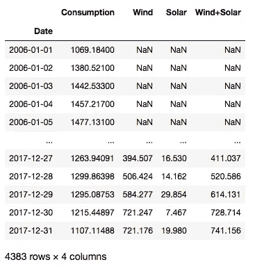

# 定义建模任务

## 预测的目标

我们的目标是从这个时间序列数据集中预测`Consumption`(理想情况下是未来未知的日期)。

## 训练和测试设备

我们将使用 10 年的数据进行培训，即 2006-2016 年，使用去年的数据进行测试，即 2017 年。

## 工作指标

为了评估我们的模型有多好，我们将使用 R-squared 和均方根误差(但将打印所有相关指标，以便您进行最终通话)。

# 助手功能

为了打印与回归任务相关的所有性能指标(比如 MAE 和 R-square)，我们将定义`regression_results`函数。

```
import sklearn.metrics as metrics
def regression_results(y_true, y_pred): *# Regression metrics*
    explained_variance=metrics.explained_variance_score(y_true, y_pred)
    mean_absolute_error=metrics.mean_absolute_error(y_true, y_pred) 
    mse=metrics.mean_squared_error(y_true, y_pred) 
    mean_squared_log_error=metrics.mean_squared_log_error(y_true, y_pred)
    median_absolute_error=metrics.median_absolute_error(y_true, y_pred)
    r2=metrics.r2_score(y_true, y_pred) print('explained_variance: ', round(explained_variance,4))    
    print('mean_squared_log_error: ', round(mean_squared_log_error,4))
    print('r2: ', round(r2,4))
    print('MAE: ', round(mean_absolute_error,4))
    print('MSE: ', round(mse,4))
    print('RMSE: ', round(np.sqrt(mse),4))
```

# 特征工程

作为基线，我们选择了一个简单的模型，该模型基于以下因素预测今天的消费价值

*   昨天的消费值**和；**
*   昨天和前天的消费值之差。

```
*# creating new dataframe from consumption column*
data_consumption = data[['Consumption']]*# inserting new column with yesterday's consumption values*
data_consumption.loc[:,'Yesterday'] = 
data_consumption.loc[:,'Consumption'].shift()*# inserting another column with difference between yesterday and day before yesterday's consumption values.* data_consumption.loc[:,'Yesterday_Diff'] = data_consumption.loc[:,'Yesterday'].diff()*# dropping NAs*
data_consumption = data_consumption.dropna()
```

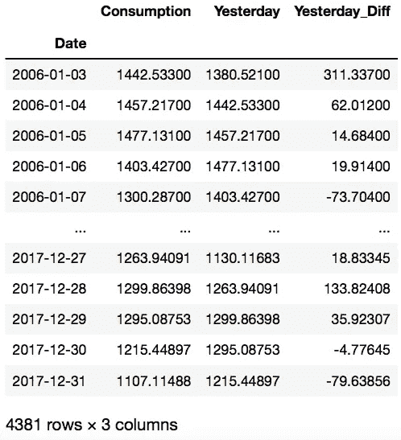

# 定义训练集和测试集

```
X_train = data_consumption[:'2016'].drop(['Consumption'], axis = 1)
y_train = data_consumption.loc[:'2016', 'Consumption']X_test = data_consumption['2017'].drop(['Consumption'], axis = 1)
y_test = data_consumption.loc['2017', 'Consumption']
```

# 时间序列数据的交叉验证

在数据科学面试中经常出现的一个问题是:*你会对时间序列数据使用哪种交叉验证技术？*

你可能会被有史以来最受欢迎的 K 倍交叉验证所吸引(相信我，直到最近——不要问最近！—我不知道除了 K-fold 之外还有 CV 技术。不幸的是，这不是正确的答案。原因是，它没有考虑到时间序列数据有一些自然的顺序，标准 k 倍交叉验证中的随机化没有保持这种顺序。

> 对时间序列数据进行交叉验证的一个更好的替代方法(比 K-fold CV)是正向链接策略。

在正向链接中，假设有 3 个折叠，训练集和验证集看起来像:

*   折叠 1:培训[1]，验证[2]
*   折叠 2:培训[1 2]，验证[3]
*   折叠 3:培训[1 2 3]，验证[4]

其中 1，2，3，4 代表年份。这样，连续的训练集是它们之前的训练集的超集。

幸运的是，sklearn 有一个使用`TimeSeriesSplit`实现这种列车测试分割的规定。

```
from sklearn.model_selection import TimeSeriesSplit
```

`TimeSerieSplit`函数将分割数作为输入。由于我们的培训数据有 11 个独特的年份(2006 -2016)，我们将设置`n_splits = 10`。这样我们就有了整洁的训练和验证集:

*   折叠 1:培训[2006]，验证[2007]
*   折叠 2:培训[2006 年 2007 年]，验证[2008 年]
*   折叠 3:培训[2006 年 2007 年 2008 年]，验证[2009 年]
*   折叠 4:培训[2006 年 2007 年 2008 年 2009 年]，验证[2010 年]
*   折叠 5:培训[2006 年 2007 年 2008 年 2009 年 2010 年]，验证[2011 年]
*   折叠 6:培训[2006 年 2007 年 2008 年 2009 年 2010 年 2011 年]，验证[2012 年]
*   折叠 7:培训[2006 年 2007 年 2008 年 2009 年 2010 年 2011 年 2012 年]，验证[2013 年]
*   折叠 8:培训[2006 年 2007 年 2008 年 2009 年 2010 年 2011 年 2012 年 2013 年]，验证[2014 年]
*   折叠 9:培训[2006 年 2007 年 2008 年 2009 年 2010 年 2011 年 2012 年 2013 年 2014 年]，验证[2015 年]
*   折叠 10:培训[2006 年 2007 年 2008 年 2009 年 2010 年 2011 年 2012 年 2013 年 2014 年 2015 年]，验证[2016 年]

# 抽查算法

```
*# Spot Check Algorithms*models = []
models.append(('LR', LinearRegression()))
models.append(('NN', MLPRegressor(solver = 'lbfgs')))  #neural network
models.append(('KNN', KNeighborsRegressor())) 
models.append(('RF', RandomForestRegressor(n_estimators = 10))) # Ensemble method - collection of many decision trees
models.append(('SVR', SVR(gamma='auto'))) # kernel = linear*# Evaluate each model in turn*
results = []
names = []
for name, model in models:
    *# TimeSeries Cross validation*
 tscv = TimeSeriesSplit(n_splits=10)

 cv_results = cross_val_score(model, X_train, y_train, cv=tscv, scoring='r2')
 results.append(cv_results)
 names.append(name)
 print('%s: %f (%f)' % (name, cv_results.mean(), cv_results.std()))

*# Compare Algorithms*
plt.boxplot(results, labels=names)
plt.title('Algorithm Comparison')
plt.show()
```

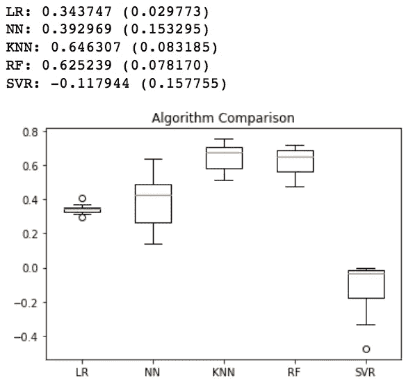

KNN 和 RF 表现同样出色。但我个人更喜欢 RF，因为这种集合模型(将多个‘个体’(不同的)模型结合在一起，并提供卓越的预测能力。)几乎可以开箱即用，这也是它们非常受欢迎的原因之一。

# 网格搜索超参数

我在之前的文章中讨论了网格搜索超参数的必要性。

> 超参数的最佳组合使模型的性能最大化，而不会导致高方差问题(过度拟合)。

执行网格搜索的 Python 代码如下:

```
from sklearn.model_selection import GridSearchCVmodel = RandomForestRegressor()
param_search = { 
    'n_estimators': [20, 50, 100],
    'max_features': ['auto', 'sqrt', 'log2'],
    'max_depth' : [i for i in range(5,15)]
}tscv = TimeSeriesSplit(n_splits=10)
gsearch = GridSearchCV(estimator=model, cv=tscv, param_grid=param_search, scoring = rmse_score)gsearch.fit(X_train, y_train)
best_score = gsearch.best_score_
best_model = gsearch.best_estimator_
```

如果你注意到上面的代码，我们已经通过设置`scoring = rmse_score`定义了一个*自定义* *计分器*，而不是使用 sklearn 中定义的[通用计分指标](https://scikit-learn.org/stable/modules/model_evaluation.html#the-scoring-parameter-defining-model-evaluation-rules)之一。我们将自定义计分器定义如下:

```
from sklearn.metrics import make_scorerdef rmse(actual, predict):predict = np.array(predict)
    actual = np.array(actual)distance = predict - actualsquare_distance = distance ** 2mean_square_distance = square_distance.mean()score = np.sqrt(mean_square_distance)return scorermse_score = make_scorer(rmse, greater_is_better = False)
```

# 根据测试数据检查最佳模型性能

```
y_true = y_test.values
y_pred = best_model.predict(X_test)regression_results(y_true, y_pred)
```

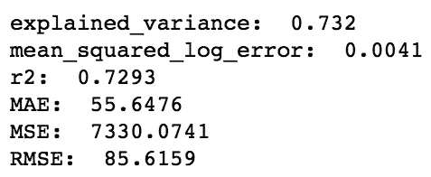

这对初学者来说并不坏。让我们看看是否可以进一步改进我们的模型。

# 特征工程回报

到目前为止，我们一直使用`(t-1)th`日的值来预测`t`日的值。现在，让我们也使用`(t-2)`天的值来预测消耗量:

```
*# creating copy of original dataframe*
data_consumption_2o = data_consumption.copy()*# inserting column with yesterday-1 values*
data_consumption_2o['Yesterday-1'] = data_consumption_2o['Yesterday'].shift()*# inserting column with difference in yesterday-1 and yesterday-2 values.*
data_consumption_2o['Yesterday-1_Diff'] = data_consumption_2o['Yesterday-1'].diff()*# dropping NAs*
data_consumption_2o = data_consumption_2o.dropna()
```

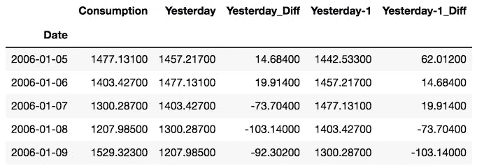

## 重置列车和测试装置

```
X_train_2o = data_consumption_2o[:'2016'].drop(['Consumption'], axis = 1)
y_train_2o = data_consumption_2o.loc[:'2016', 'Consumption']X_test = data_consumption_2o['2017'].drop(['Consumption'], axis = 1)
y_test = data_consumption_2o.loc['2017', 'Consumption']
```

## 检查使用“新”预测器的“最佳”随机森林是否表现更好

```
model = RandomForestRegressor()
param_search = { 
    'n_estimators': [20, 50, 100],
    'max_features': ['auto', 'sqrt', 'log2'],
    'max_depth' : [i for i in range(5,15)]
}tscv = TimeSeriesSplit(n_splits=10)
gsearch = GridSearchCV(estimator=model, cv=tscv, param_grid=param_search, scoring = rmse_score)gsearch.fit(X_train_2o, y_train_2o)
best_score = gsearch.best_score_
best_model = gsearch.best_estimator_y_true = y_test.values
y_pred = best_model.predict(X_test)regression_results(y_true, y_pred)
```

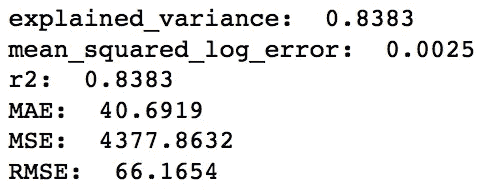

好消息！！我们已经显著降低了 RMSE 和 MAE 值，而 R 平方值也上升了。

# 特征工程反击

让我们看看增加太阳能生产的价值是否在某种程度上有利于预测电力消耗。

```
data_consumption_2o_solar = data_consumption_2o.join(data[['Solar']])data_consumption_2o_solar = data_consumption_2o_solar.dropna()
```

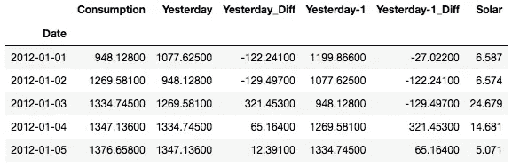

## 重置训练/测试+网格搜索+检查性能

```
X_train_2o_solar = data_consumption_2o_solar[:'2016'].drop(['Consumption'], axis = 1)
y_train_2o_solar = data_consumption_2o_solar.loc[:'2016', 'Consumption']X_test = data_consumption_2o_solar['2017'].drop(['Consumption'], axis = 1)
y_test = data_consumption_2o_solar.loc['2017', 'Consumption']model = RandomForestRegressor()
param_search = { 
    'n_estimators': [20, 50, 100],
    'max_features': ['auto', 'sqrt', 'log2'],
    'max_depth' : [i for i in range(5,15)]
}tscv = TimeSeriesSplit(n_splits=5)
gsearch = GridSearchCV(estimator=model, cv=tscv, param_grid=param_search, scoring = rmse_score)gsearch.fit(X_train_2o_solar, y_train_2o_solar)
best_score = gsearch.best_score_
best_model = gsearch.best_estimator_y_true = y_test.values
y_pred = best_model.predict(X_test)regression_results(y_true, y_pred)
```

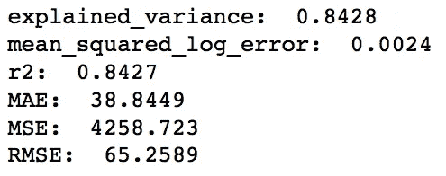

瞧，现在模型的性能更好了。

# 可变重要性图

```
imp = best_model.feature_importances_
features = X_train_2o_solar.columns
indices = np.argsort(imp)plt.title('Feature Importances')
plt.barh(range(len(indices)), imp[indices], color='b', align='center')
plt.yticks(range(len(indices)), [features[i] for i in indices])
plt.xlabel('Relative Importance')
plt.show()
```

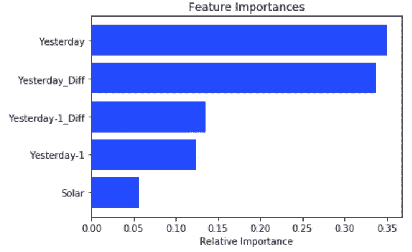

正如我们所见，太阳能发电量并不像其他基于时间的预测指标那样是一个强大的电力消耗预测指标。

# 特征工程的最后阶段

如果你阅读了我前一篇博文第一部分的叙述，你会记得我们的数据集有一些季节性因素，更准确地说是每周季节性。因此，将给定日期前一周的消费值作为模型的输入更有意义。这意味着，如果模型试图预测 1 月 8 日的消费值，它必须获得 1 月 1 日的消费信息。

```
data_consumption_2o_solar_weeklyShift = data_consumption_2o_solar.copy()data_consumption_2o_solar_weeklyShift['Last_Week'] = data_consumption_2o_solar['Consumption'].shift(7)data_consumption_2o_solar_weeklyShift = data_consumption_2o_solar_weeklyShift.dropna()
```

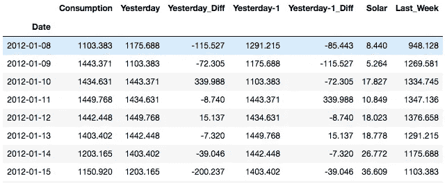

## 重置训练/测试+网格搜索+检查性能

```
X_train_2o_solar_weeklyShift = data_consumption_2o_solar_weeklyShift[:'2016'].drop(['Consumption'], axis = 1)
y_train_2o_solar_weeklyShift = data_consumption_2o_solar_weeklyShift.loc[:'2016', 'Consumption']X_test = data_consumption_2o_solar_weeklyShift['2017'].drop(['Consumption'], axis = 1)
y_test = data_consumption_2o_solar_weeklyShift.loc['2017', 'Consumption']model = RandomForestRegressor()
param_search = { 
    'n_estimators': [20, 50, 100],
    'max_features': ['auto', 'sqrt', 'log2'],
    'max_depth' : [i for i in range(5,15)]
}tscv = TimeSeriesSplit(n_splits=10)
gsearch = GridSearchCV(estimator=model, cv=tscv, param_grid=param_search, scoring = rmse_score)gsearch.fit(X_train_2o_solar_weeklyShift, y_train_2o_solar_weeklyShift)
best_score = gsearch.best_score_
best_model = gsearch.best_estimator_y_true = y_test.values
y_pred = best_model.predict(X_test)regression_results(y_true, y_pred)
```

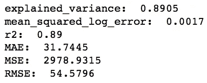

我们又做了一次..误差进一步减小，r 平方增加。我们可以继续添加更多相关的功能，但我想你现在已经明白了！

# 特征重要性图

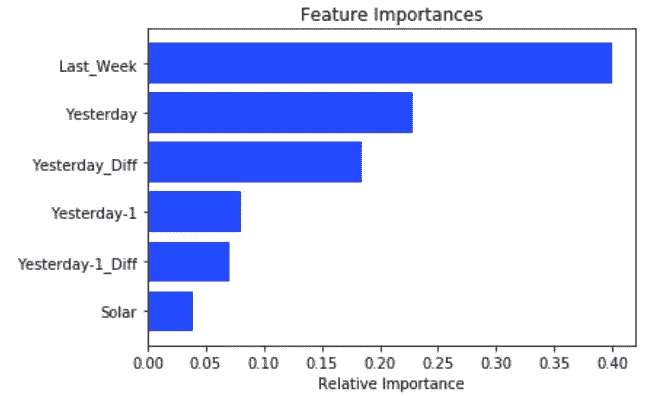

正如我们正确假设的那样，第`(t-7)`天的价值比第`(t-1)`天的价值具有更强的预测力。

# 结论

在本文中，我们学习了如何对时间序列数据建模，对时间序列数据进行交叉验证，以及微调我们的模型超参数。我们还成功地将预测功耗的 RMSE 从 85.61 降低到 54.57。

在本系列的第 3 部分中，我们将进行一个案例研究，分析呼叫中心生成的时间序列数据，主要是分析[放弃率](https://www.investopedia.com/terms/a/abandon-rate.asp#:~:text=For%20an%20inbound%20call%20center,direct%20relation%20to%20waiting%20times.)的(可怕)增量。敬请关注…

直到下次:)

*我喜欢写循序渐进的初学者指南、操作指南、面试问题、解码 ML/AI 中使用的术语等。如果你想完全访问我的所有文章(以及其他媒体上的文章)，那么你可以使用* [***我的链接***](https://varshitasher.medium.com/membership)**这里* ***注册。****

*[](/fine-tuning-hubert-for-emotion-recognition-in-custom-audio-data-using-huggingface-c2d516b41cd8) [## 检测语音数据中的情感:使用 Huggingface 微调 HuBERT

### 构建自定义数据加载器、实验日志、改进指标的技巧和 GitHub repo，如果您想了解…

towardsdatascience.com](/fine-tuning-hubert-for-emotion-recognition-in-custom-audio-data-using-huggingface-c2d516b41cd8) [](/understanding-python-imports-init-py-and-pythonpath-once-and-for-all-4c5249ab6355) [## 了解 Python 导入，__init__。py 和 pythonpath —一劳永逸

### 了解如何导入包和模块(以及两者之间的区别)

towardsdatascience.com](/understanding-python-imports-init-py-and-pythonpath-once-and-for-all-4c5249ab6355) [](https://medium.com/@vishi2020/tackling-the-time-series-take-home-assignment-a-case-study-in-python-b2a3bd78d956) [## 处理时序带回家的作业:Python 中的一个案例研究

### 利用呼叫中心分析改善客户支持

medium.com](https://medium.com/@vishi2020/tackling-the-time-series-take-home-assignment-a-case-study-in-python-b2a3bd78d956) [](/data-scientists-guide-to-efficient-coding-in-python-670c78a7bf79) [## 数据科学家的 Python 高效编码指南

### 我每天用来编写干净代码的技巧和窍门

towardsdatascience.com](/data-scientists-guide-to-efficient-coding-in-python-670c78a7bf79)*