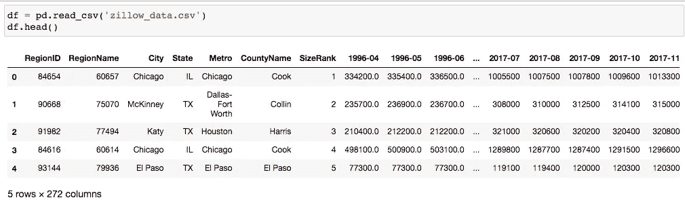
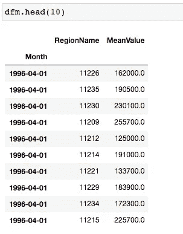
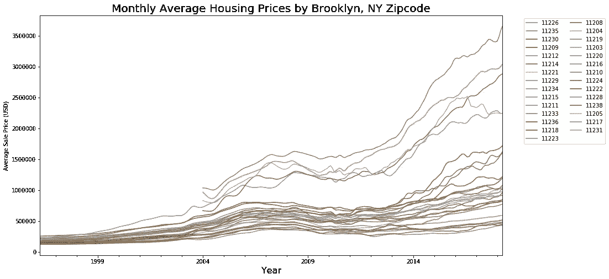
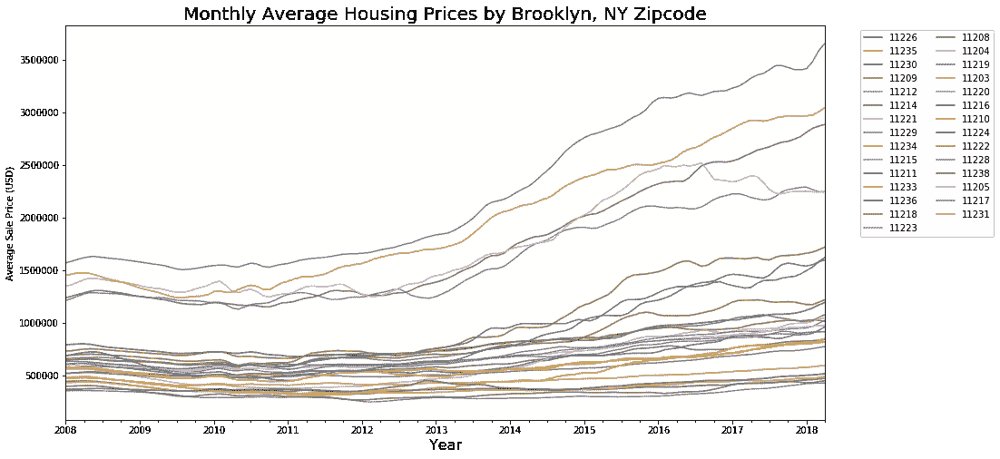
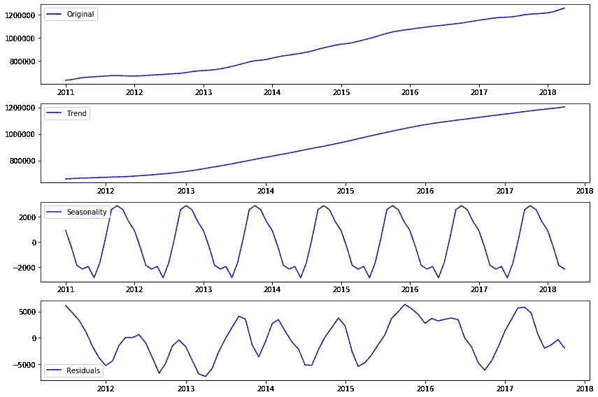
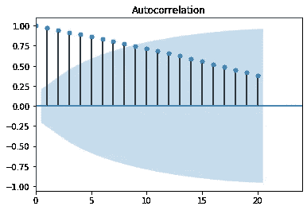
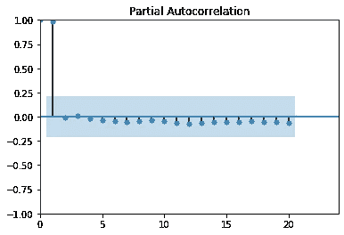
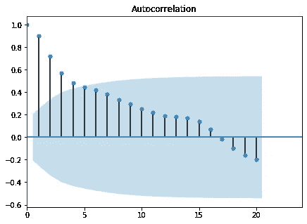
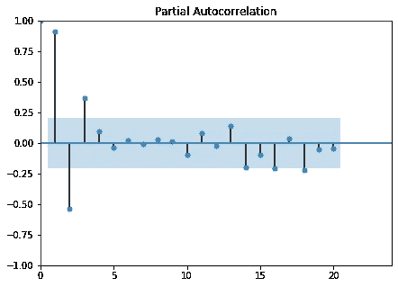
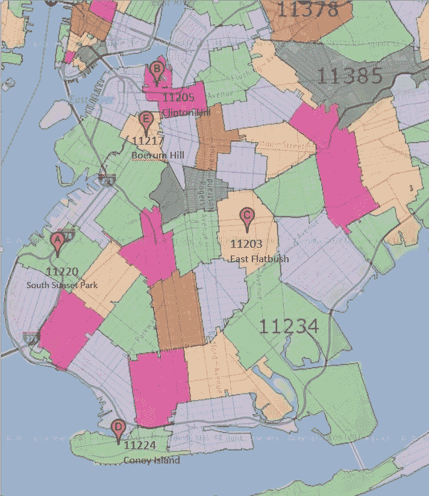

# 用 ARIMA 时间序列建模预测未来房价

> 原文：<https://towardsdatascience.com/time-series-modeling-with-arima-to-predict-future-house-price-9b180c3bbd2f?source=collection_archive---------12----------------------->

## 从 0 到 1 的时间序列分析和建模


艾萨克·史密斯在 [Unsplash](https://unsplash.com/s/photos/chart?utm_source=unsplash&utm_medium=referral&utm_content=creditCopyText) 上拍摄的照片

时间序列曾经是我在研究生院时试图避免的话题，因为我的同龄人分享的课程非常理论化，课堂上讨论的所有案例都与金融有关，不幸的是，我当时对金融不感兴趣。多亏了我的数据科学训练营，我又有了一次接触时间序列的机会，我发现它在许多情况下都非常实用和有用。这一次，我使用时间序列分析和模型来预测投资布鲁克林的 5 个最佳邮政编码，我和我丈夫打算在那里购买一套公寓。在这篇博文中，我将分享你需要知道的关于时间序列的基础知识，以及我是如何一步步用 ARIMA 模型预测房价的。

首先我要打下一个时间序列建模项目的架构。我将在后面的章节中详细解释。

**第一步:数据处理**

**第二步:数据探索和可视化**

**第三步:确定模型方法和 KPI**

**步骤 4:在训练集上开发模型，并使用测试集进行验证**

**第五步:微调模型并进行预测**

请记住，时间序列只是在一段时间内以一致的时间间隔测量的一系列定义明确的数据点。时间序列分析帮助我们理解隐藏的模式，有意义的特征和数据的统计。

## 第一步:**数据处理——将原始数据转换成以时间为索引的时间序列**

在处理来自 Zillow.com 的数据集时，我必须首先选择该城市，并使用 *pd.melt* 将数据框从宽格式重塑为长格式，然后转换为时间序列数据。



```
import pandas as pd
import numpy as np
import matplotlib.pyplot as plt
%matplotlib inlinedfm.set_index('Month', inplace = True)
```



## 第二步:数据探索和可视化——季节分解、与 ACF 和 PCAF 的自相关等。

通过可视化，我们可以识别数据中潜在的趋势和故事。我们来看看布鲁克林的房价随着时间的变化。



从 1996 年到 2007 年可以看到总体上升趋势，随后从 2008 年到 2010 年年中出现波动。2011 年开始，房价更加稳定，再次持续上涨。我们可以非常自信地说，2008 年的房地产市场崩溃是这次波动的原因，我们确实希望跳过这段时间，以便对未来有一个更准确的预测。



2011 年后趋势更加稳定

我们关心的有三个重要特征:**平稳性、季节性和自相关性**。

## **平稳性**

大多数时间序列模型都假设时间序列是平稳的，这意味着时间序列的统计特性如均值、方差等是平稳的。保持不变。理想情况下，我们希望有一个平稳的时间序列来建模。 *Dickey-Fuller 检验*可以用来检验一个时间序列是否平稳。注意零假设是:时间序列不是平稳的。

```
from statsmodels.tsa.stattools import adfullerdftest = adfuller(ts)
```

## 季节性

季节性是指在一段固定时间内重复的周期性变化和模式。有时，季节性可以与上升或下降趋势相结合。季节性分解总是有助于检测数据集中的季节性、趋势和任何噪声。以布鲁克林住房数据为例:

```
from statsmodels.tsa.seasonal import seasonal_decomposedecomposition = sm.tsa.seasonal_decompose(month_avg, model='additive')trend = decomposition.trend
seasonal = decomposition.seasonal
residual = decomposition.resid*# Plot gathered statistics*
plt.figure(figsize=(12,8))
plt.subplot(411)
plt.plot(month_avg, label='Original', color='blue')
plt.legend(loc='best')
plt.subplot(412)
plt.plot(trend, label='Trend', color='blue')
plt.legend(loc='best')
plt.subplot(413)
plt.plot(seasonal,label='Seasonality', color='blue')
plt.legend(loc='best')
plt.subplot(414)
plt.plot(residual, label='Residuals', color='blue')
plt.legend(loc='best')
plt.tight_layout()
```



布鲁克林月平均房价的季节分解

从上面的图表中我们可以清楚地看到，随着每年的季节性，有一个上升的趋势。下一步是用 *Dickey-Fuller* 测试来测试我们的残差。

## 自相关

自相关有助于我们研究每个时间序列观测值如何与其最近(或不太最近)的过去相关联。很容易得出，明天的房价极有可能和今天的房价有关。 **ACF(自相关函数)**和 **PACF(偏自相关函数)**是两个强有力的工具。ACF 将时间序列的自相关表示为时滞的函数。PACF 试图移除观测值和先前时间步长的观测值的自相关中存在的间接相关性

检查所有邮政编码的月平均价格的 ACF 和 PACF。

```
from statsmodels.graphics.tsaplots import plot_acf, plot_pacf
from matplotlib.pylab import rcParamsrcParams['figure.figsize']=7,5
plot_acf(month_avg); plt.xlim(0,24); plt.show()
plot_pacf(month_avg); plt.xlim(0,24); plt.ylim(-1,1);plt.show()
```



ACF 显示该时间序列与之前的时间周期具有自相关性，然而，PACF 没有显示出显著的偏相关。

如果我们从当前月份的值中减去 3 个月前的值，换句话说，这是一个滞后 3 的差值。我们可以在 PACF 图中看到，当滞后=2 时，存在负的偏自相关，这意味着滞后-1 差异在时间序列数据中是显著的。

```
plot_acf(month_avg.diff(periods=3).bfill()); plt.xlim(0,24); plt.show()
plot_pacf(month_avg.diff(periods=3).bfill()); plt.xlim(0,24); plt.ylim(-1,1);plt.show()
```



## 步骤 3:决定模型方法和 KPI

由于我们的数据集不是静态的，并且存在季节性成分，因此使用 SARIMA 模型——季节性 ARIMA(带有外生回归量的季节性自回归综合移动平均)是合理的。在不深入研究方法论的情况下，我现在将重点关注重要的参数。

根据公式 SARIMA( *p* ， *d* ， *q* )x( *P* ， *D* ， *Q，s* )，这些型号的参数如下:

*   ***p*** 和季节性 ***P*** :表示自回归项(平稳序列的滞后)的个数
*   ***d*** 和季节性 ***D*** :表示为了平稳化系列必须进行的差分
*   ***q*** 和季节性 ***Q*** :表示移动平均项的个数(预测误差的滞后)
*   ***s*** :表示时间序列的周期性(4 表示季度，12 表示年度)

**KPI:使用 AIC 选择最佳参数集**

## **第四步:开发模型并用测试集**验证模型

由于布鲁克林的 Zillow 数据集中有 29 个邮政编码，我决定首先在 3 个样本邮政编码上构建 SARIMA 模型，然后遍历所有其他邮政编码。

我首先创建一个数据帧列表，每个数据帧都有一个邮政编码的信息。

```
zip_dfs = []
zip_list = dfm.RegionName.unique()
for x in zip_list:
    zip_dfs.append(pd.DataFrame(dfm[dfm['RegionName']==x][['MeanValue']].copy()))
```

然后定义 P，D，Q 和 P，D，Q，s 取 0 到 2 之间的任意值

```
p = d = q = range(0,2)
# Generate all different combinations of p, d and q triplets
pdq = list(itertools.product(p,d,q))
# Generate all different combinations of seasonal p, d and q triplets
pdqs = [(x[0], x[1], x[2], 12) for x in list(itertools.product(p, d, q))]
```

萨里玛模型

```
ans = []for df, name in zip(zip_dfs, zip_list):
    for para1 in pdq:
        for para2 in pdqs:
            try:
                mod = sm.tsa.statespace.SARIMAX(df,
                                                order = para1,
                                                seasonal_order = para2,
                                                enforce_stationarity = False,
                                                enforce_invertibility = False)
                output = mod.fit()
                ans.append([name, para1, para2, output.aic])
                print('Result for {}'.format(name) + ' ARIMA {} x {}12 : AIC Calculated = {}'.format(para1, para2, output.aic))
            except:
                continue
```

然后将所有结果存储到数据框中

```
result = pd.DataFrame(ans, columns = ['name','pdq','pdqs','AIC'])
```

按最低 AIC 排序，以找到每个邮政编码的最佳参数

```
best_para = result.loc[result.groupby("name")["AIC"].idxmin()]
```

## 对部分数据进行动态预测，并与真实值进行比较

```
#Make Prediction and compare with real values
summary_table = pd.DataFrame()
Zipcode = []
MSE_Value = []
models = []
for name, pdq, pdqs, df in zip(best_para['name'], best_para['pdq'], best_para['pdqs'], zip_dfs):ARIMA_MODEL = sm.tsa.SARIMAX(df,
                                 order = pdq,
                                 seasonal_order = pdqs,
                                 enforce_stationarity = False,
                                 enforce_invertibility = False,
                                 )

    output = ARIMA_MODEL.fit()
    models.append(output)

    #get dynamic predictions starting 2017-06-01
    pred_dynamic = output.get_prediction(start=pd.to_datetime('2017-06-01'), dynamic = True, full_results = True)
    pred_dynamic_conf = pred_dynamic.conf_int()
    zip_forecasted = pred_dynamic.predicted_mean
    zip_truth = df['2017-06-01':]['MeanValue']

    sqrt_mse = np.sqrt(((zip_forecasted - zip_truth)**2).mean())

    Zipcode.append(name)
    MSE_Value.append(sqrt_mse)

summary_table['Zipcode'] = Zipcode
summary_table['Sqrt_MSE'] = MSE_Value
```

## 第五步:预测未来

下一步将是使用完整的数据集来预测未来的值。我用 3 年作为例子。

```
#Final Model 
forecast_table = pd.DataFrame()
current = []
forecast_3Yr = []

for zipcode, output, df in zip(Zipcode, models, zip_dfs):
    pred_3 = output.get_forecast(steps = 36)
    pred_conf_3 = pred_3.conf_int()
    forecast_3 = pred_3.predicted_mean.to_numpy()[-1]
    current.append(df['2018-04']['MeanValue'][0])
    forecast_3Yr.append(forecast_3) forecast_table['Zipcode'] = Zipcode
forecast_table['Current Value'] = current
forecast_table['3 Years Value'] = forecast_3Yr forecast_table['3Yr-ROI']=(forecast_table['3 Years Value'] - forecast_table['Current Value'])/forecast_table['Current Value']
```

这是我的最终结果:

*   11220 年:南日落公园(3 年投资回报率:17%-87%)
*   第 11205 名:克林顿·希尔(3 年投资回报率:16%-78%)
*   11203 年:东弗拉特布什(3 年投资回报率:8%-78%)
*   11224 年:科尼岛(3 年投资回报率:-0.5%-76%)
*   11217 年:博勒姆山(3 年投资回报率:6%-61%)



## 下一步

该模型纯粹基于时间序列，因此预测可能不太准确，因为显然还有许多其他因素影响房价，如经济、利率、房屋市场安全得分等。

如果要考虑其他因素，线性模型会更理想。

感谢阅读！让我知道你的想法。

有用的资源:

[利用 Python 和自动 ARIMA 预测季节性时间序列](https://medium.com/@josemarcialportilla/using-python-and-auto-arima-to-forecast-seasonal-time-series-90877adff03c)

[关于时间序列你需要知道的一切](/almost-everything-you-need-to-know-about-time-series-860241bdc578)