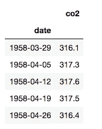
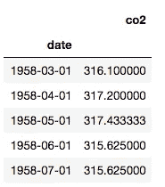
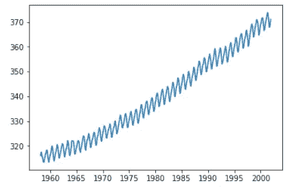
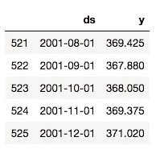
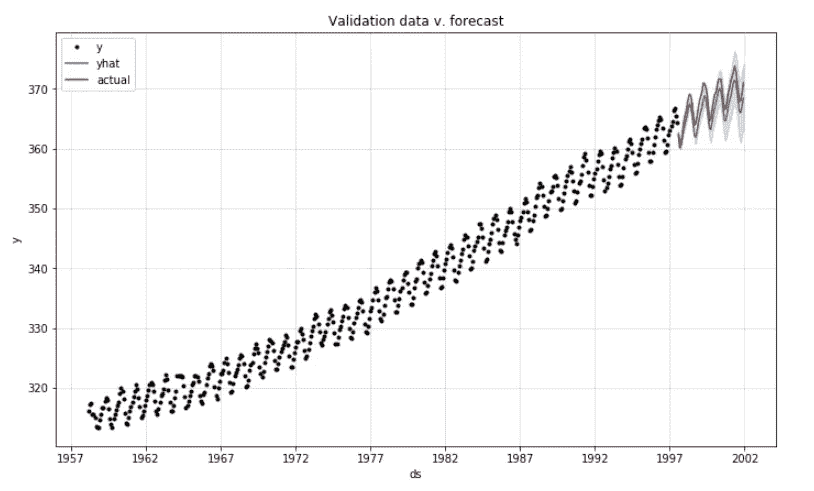
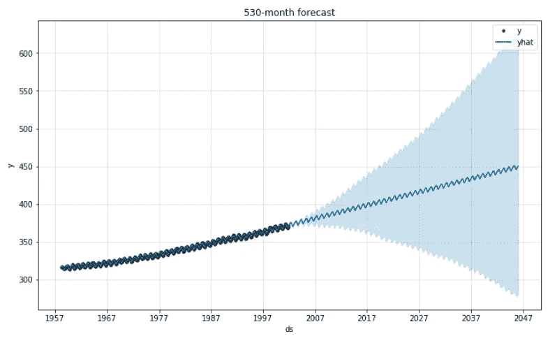
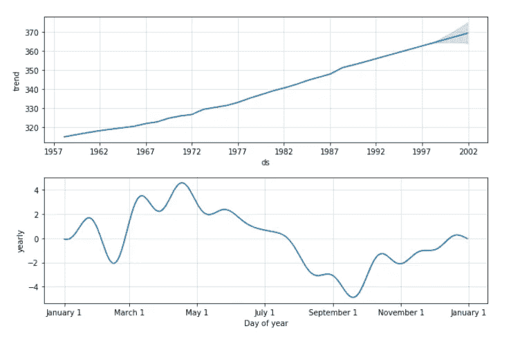

# 用脸书预言家进行时间序列建模

> 原文：<https://towardsdatascience.com/time-series-modeling-with-facebook-prophet-57f146a11d0d?source=collection_archive---------10----------------------->

## 分析和可视化时间序列数据的快速入门方法

当试图理解时间序列时，有太多的东西需要考虑。数据的总体趋势是什么？受季节性影响吗？我应该使用什么样的模型，它的性能如何？

所有这些问题都会让时间序列建模变得有点吓人，但也没那么糟糕。最近在为我的数据科学训练营做一个项目时，我尝试了[脸书预言家](https://facebook.github.io/prophet/)，一个由……你知道，脸书开发的用于时间序列建模的开源包。我发现使用我的数据运行它非常快速和容易，所以在这篇文章中，我将向您展示如何做到这一点，并分享一个我编写的使用 Prophet all-in-one 进行建模和验证的函数。请继续阅读！

# 时间序列建模:基础

简而言之，时间序列建模就是寻找因变量和时间之间的关系。许多现实世界的数据可以以时间序列的形式出现:股票价格、温度、二氧化碳水平、我在万圣节每小时吃的零食数量等等。如果您想要预测时间序列中接下来会发生什么，那么您需要识别并消除时间对数据的影响，以便您可以将预测精力集中在任何潜在的、非基于时间的模式上。

实际上，这意味着您应该:

*   识别数据随时间变化的总体趋势。价值观总体上是上升还是下降？还是他们徘徊在一个中间点？
*   识别数据中任何重复的、季节性的模式。价值观是否每年夏天都会飙升，每年冬天都会跌至低谷？值在工作日还是周末更高？“季节性”趋势可能发生在任何时间尺度上(年、月、日、小时等)。)，只要它在你的总时间段内重复。
*   测试去除趋势和季节性后剩余的数据是否是平稳的。如果你的时间序列是平稳的，它的均值、方差和协方差从一项到下一项将是常数，而不是随时间变化。大多数时间序列模型都假设您提供给它们的数据是稳定的，因此如果您希望模型按预期工作，这是一个重要的步骤。

接下来往往是某种形式的 [ARIMA](https://en.wikipedia.org/wiki/Autoregressive_integrated_moving_average) (自回归综合移动平均线)建模。ARIMA 类似于线性回归，但是我们的解释性特征是我们比较每个数据点的过去时间点。

要在 Statsmodels 中运行一个 [ARIMA 模型，你需要计算出有多少以及哪些过去的时间点用于比较，这可能会变得棘手且耗时。要找到最佳组合，您可能需要多次运行您的模型，每次都使用不同的术语组合(使用网格搜索或随机搜索)，然后选择产生最佳结果的一个。当您考虑更多选项时，这样做所需的时间会成倍增加！](https://www.statsmodels.org/dev/generated/statsmodels.tsa.statespace.sarimax.SARIMAX.html)

# 脸书先知

[脸书预言家](https://facebook.github.io/prophet/)在幕后自动化了其中的一些过程，所以你需要做的预处理和参数选择更少(你出错的机会也更少)。你可以想象，脸书对他们用户活动中基于时间的模式非常感兴趣，所以他们建立了 Prophet，使其在处理多种规模的季节性方面特别强大。Prophet 还被设计为可供开发人员和非开发人员使用，这意味着它易于编写，并且可以为您提供有吸引力的图表和方便的预测数据表，而您只需付出很少的努力。Prophet 真正希望从您那里得到的是特定格式的数据，我将在下一节介绍这一点。

# 为先知做准备

请记住，我在 Python 中使用 Prophet，所以如果您在 r 中使用它，情况可能会有所不同。当 Prophet 读取您的数据帧时，它会查找两个特定的列。一个必须称为“ds”并包含您的 datetime 对象，另一个必须称为“y”并包含您的因变量。确保您的数据是“长”格式，即每行代表一个时间点。

为了更容易理解，我将使用 Statsmodels 的[数据集，记录 1958 年至 2001 年莫纳罗亚天文台](https://www.statsmodels.org/devel/datasets/generated/co2.html)的二氧化碳水平。正如你将看到的，这个数据既有上升趋势，又有很强的季节性模式。

```
# Load needed packages
import pandas as pd
import numpy as np
import matplotlib.pyplot as plt
import statsmodels.api as sm
from fbprophet import Prophet as proph

# Load the "co2" dataset from sm.datasets
data_set = sm.datasets.co2.load()

# load in the data_set into pandas data_frame
CO2 = pd.DataFrame(data=data_set["data"])
CO2.rename(columns={"index": "date"}, inplace=True)

# set index to date column
CO2.set_index('date', inplace=True)

CO2.head()
```



现在，日期是这个数据框架的索引。

请注意，我并没有马上将我的数据帧放入 Prophet 的正确格式中；我想先用它做些事情。

二氧化碳水平每周记录一次，但假设我对月间隔更感兴趣。我将重新取样为每月一次:

```
# Resample from weekly to monthly
co2_month = CO2.resample('MS').mean()

# Backfill any missing values
co2_month.fillna(method='bfill', inplace=True)

co2_month.head()
```



现在数据代表月平均二氧化碳水平。

看看趋势和季节性:

```
# Plot co2_month
plt.plot(co2_month.index, co2_month.co2)
```



一路曲折到达顶端！

好吧，这是一个可怕的二氧化碳水平上升，但让我们继续。在使用 Prophet 之前，我们需要创建“ds”和“y”列。

```
# Reset the index to make the dates an ordinary column
co2_month.reset_index(inplace=True)

# Rename the columns
co2_month.columns = ['ds', 'y']
co2_month.tail()
```



我们有 526 行月度二氧化碳数据，为 Prophet 做了适当的标记。

现在我们准备好迎接一些预言了！

# 包装该函数

我想预测二氧化碳将如何随时间增长，但我也想知道我的模型表现如何。我可以用我所拥有的数据来做这件事，方法是分离出数据的一部分，预测这部分的值，然后将预测值与实际值进行比较。在这种情况下，我将去掉最后 10%的数据(53 个月)用于验证:

```
# Split the data 90:10
co2_train = co2_month[:473]
co2_test = co2_month[473:]
```

我为自己编写了一个函数，它可以接受我的训练数据、验证数据和整个数据集，并返回以下内容:

*   我的训练数据和预测的图表；
*   将我的预测与来自验证数据集的实际值进行比较的图；
*   显示基于整个数据集的长期预测的图；
*   显示整个数据集中总体趋势和季节性的图。

我的函数打印这些图，并返回包含要与验证数据和长期预测进行比较的预测的数据帧。如果您想要分析模型预测的精确值，这些会很有用。

这是我的函数:

```
# Define a function to do all the great stuff described above
def proph_it(train, test, whole, interval=0.95, forecast_periods1, 
             forecast_periods2):
    '''Uses Facebook Prophet to fit model to train set, evaluate  
    performance with test set, and forecast with whole dataset. The 
    model has a 95% confidence interval by default.

       Remember: datasets need to have two columns, `ds` and `y`.
       Dependencies: fbprophet, matplotlib.pyplot as plt
       Parameters:
          train: training data
          test: testing/validation data
          whole: all available data for forecasting
          interval: confidence interval (percent)
          forecast_periods1: number of months for forecast on 
              training data
          forecast_periods2: number of months for forecast on whole 
              dataset'''

    # Fit model to training data and forecast
    model = proph(interval_width=interval)
    model.fit(train)
    future = model.make_future_dataframe(periods=forecast_periods1, freq='MS')
    forecast = model.predict(future)

    # Plot the model and forecast
    model.plot(forecast, uncertainty=True)
    plt.title('Training data with forecast')
    plt.legend();

    # Make predictions and compare to test data
    y_pred = model.predict(test)

    # Plot the model, forecast, and actual (test) data
    model.plot(y_pred, uncertainty=True)
    plt.plot(test['ds'], test['y'], color='r', label='actual')
    plt.title('Validation data v. forecast')
    plt.legend();

    # Fit a new model to the whole dataset and forecast
    model2 = proph(interval_width=0.95)
    model2.fit(whole)
    future2 = model2.make_future_dataframe(periods=forecast_periods2, 
                                          freq='MS')
    forecast2 = model2.predict(future2)

    # Plot the model and forecast
    model2.plot(forecast2, uncertainty=True)
    plt.title('{}-month forecast'.format(forecast_periods2))
    plt.legend();

    # Plot the model components
    model2.plot_components(forecast);

    return y_pred, forecast2
```

请注意，我的函数被设置为按月处理数据，图中将有反映这一点的标题。您可以重构函数来处理不同规模的数据，但这符合我的目的。

# 快跑，先知，快跑！

让我们在三个数据集(训练、验证和整体)上运行这个函数。因为我任意保留了最后 10% (53 个月)的数据进行验证，所以我也任意预测超过 10 倍的数据，即 530 个月，也就是 44 年多一点。

```
# Run the wrapper function, supplying numbers of months for forecasts
short_term_pred, long_term_pred = proph_it(co2_train, co2_test, co2_month, 53, 530)
```

该功能现在将开始打印出图。这是前 90%的数据集以及对后 10%的预测:


现在我们可以将预测值与过去 53 个月的实际值进行比较:



现在利用所有可用数据进行长期预测。自然，95%的置信区间会随着时间的推移而急剧扩大。二氧化碳水平可能会降低……但也可能会升高。



这些是 Prophet 的“组件图”，它分解了数据中的趋势和季节性。看起来二氧化碳水平往往在春季达到年度最高，在秋季达到最低。



我现在可以直观地分析这些漂亮的图，如果我想看预测值本身，我手头也有。

这就是全部了！我在一个关于预测未来几年俄勒冈州房价上涨的项目中使用了这个函数。你可以[在 GitHub](https://github.com/jrkreiger/or-real-estate) 上查看代码。

感谢阅读！

*跨贴自*[*【jrkreiger.net】*](http://jrkreiger.net)*。*