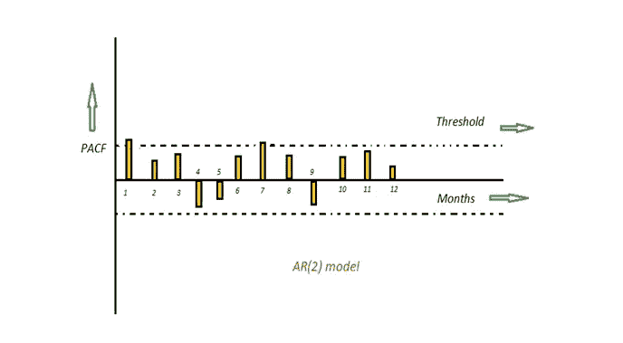
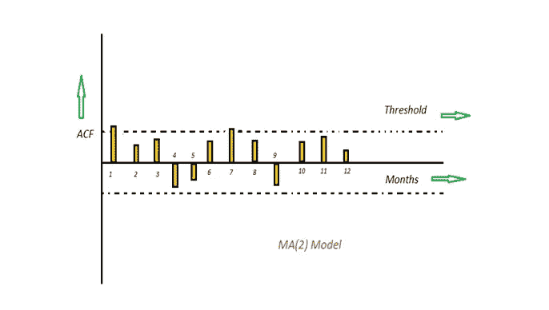
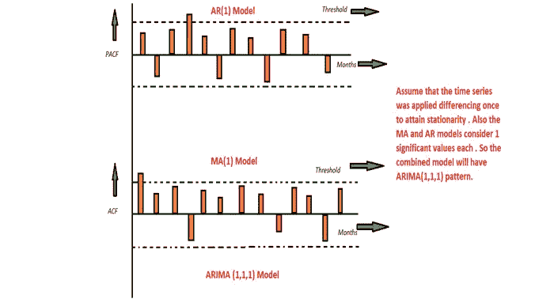

# 时间序列模型

> 原文：<https://towardsdatascience.com/time-series-models-d9266f8ac7b0?source=collection_archive---------1----------------------->

## AR，MA，ARMA，ARIMA

图片由[皮克斯拜](https://pixabay.com/?utm_source=link-attribution&utm_medium=referral&utm_campaign=image&utm_content=4852537)的 Gerd Altmann 提供

AR、MA、ARMA 和 ARIMA 模型用于根据为同一观测记录的先前时间点的历史数据来预测(t+1)的观测。但是，有必要确保时间序列在观测超时期间的历史数据上是平稳的。如果时间序列不是平稳的，那么我们可以在记录上应用差异因子，看看时间序列的图形是否是平稳的超时周期。

## **ACF(自相关函数)**

自相关函数考虑了所有过去的观察值，而不考虑其对未来或当前时间段的影响。它计算 t 和(t-k)时间段之间的相关性。它包括 t 和(t-k)时间段之间的所有滞后或间隔。相关性总是使用皮尔逊相关公式来计算。

## **PACF(部分相关函数)**

PACF 确定时间段 t 和 t-k 之间的部分相关性。它没有考虑 t 和 t-k 之间的所有时滞。例如，让我们假设今天的股价可能取决于前 3 天的股价，但它可能没有考虑昨天的股价收盘。因此，我们通过忽略两个时隙 t 和 t-k 之间的不重要的时滞，只考虑对未来时间周期有直接影响的时滞

## **如何区分何时使用 ACF 和 PACF？**

让我们以一个村庄一年的糖果销售和收入为例。假设村里每 2 个月有一个节日，我们取出 12 个月的糖果销售和收入的历史数据。如果我们把时间画成月份，那么我们可以观察到，在计算糖果销售额时，我们只对隔月感兴趣，因为糖果销售额每两个月增加一次。但如果我们要考虑下个月的收入，那么我们就必须考虑去年全年的收入。

因此，在上述情况下，我们将使用 ACF 来找出未来产生的收入，但我们将使用 PACF 来找出下个月销售的糖果。

## **AR(自回归)模型**

作者图片

在 t 的时间周期受到在不同时隙 t-1，t-2，t-3，…..先前时间点的影响由该特定时间段的系数因子决定。任何特定公司 X 的股票价格可能取决于时间序列中所有以前的股票价格。这种模型计算过去时间序列的回归，并计算序列中的当前或未来值，称为自回归(AR)模型。

**yt = β₁*y-₁+β₂*yₜ-₂+β₃*yₜ-₃+…………+βₖ*yₜ-ₖ**

考虑一个牛奶分销公司的例子，该公司每月在该国生产牛奶。考虑到去年生产的牛奶，我们想计算本月生产的牛奶量。我们首先计算当月所有 12 个滞后期的 PACF 值。如果任何特定月份的 PACF 值大于某个有效值，则只有这些值会被考虑用于模型分析。

例如，在上图中，值 1，2，3 到 12 显示了在给定滞后 t 的情况下，当月牛奶产量的直接影响(PACF)。如果我们考虑两个高于阈值的显著值，则该模型将被称为 AR(2)。

## **移动平均线模型**

作者图片

t 处的时间周期受到在各个时隙 t-1、t-2、t-3、…的意外外部因素的影响..这些意想不到的影响被称为误差或残差。先前时间点的影响由该特定时间段的系数因子α决定。任何特定 X 公司的股票价格可能取决于一夜之间发生的公司合并，或者该公司因破产而关闭。这种模型计算过去时间序列的残差或误差，并计算序列的当前或未来值，称为移动平均(MA)模型。

**yt = α₁*ɛₜ-₁+α₂*ɛₜ-₂+α₃*ɛₜ-₃+…………+αₖ*ɛₜ-ₖ**

考虑一个在我生日时分发蛋糕的例子。假设你妈妈让你带糕点去派对。每年你都会错过判断参加聚会的邀请数量，并根据要求结束或多或少的蛋糕数量。实际和预期的差异导致了误差。因此，您希望避免今年的错误，因此我们对时间序列应用移动平均模型，并根据过去的总体错误计算今年所需的糕点数量。接下来，计算时间序列中所有滞后的 ACF 值。如果任何特定月份的 ACF 值大于一个重要值，则只有这些值将被考虑用于模型分析。

例如，在上图中，值 1、2、3 到 12 显示了当前月份糕点计数的总误差(ACF ),考虑到时间 t 和当前月份之间的所有滞后，给出了滞后 t。如果我们考虑高于阈值的两个重要值，那么该模型将被称为 MA(2)。

## **ARMA(自回归移动平均)模型**

作者图片

这是一个由 AR 和 MA 模型组合而成的模型。在该模型中，预测时间序列的未来值时考虑了先前滞后和残差的影响。这里，β表示 AR 模型的系数，α表示 MA 模型的系数。

**yt = β₁*yₜ-₁+α₁*ɛₜ-₁+β₂*yₜ-₂+α₂*ɛₜ-₂+β₃*yₜ-₃+α₃*﹍-̿+……+β﹍* y﹍+α﹍*﹍-̿**

考虑上面的图表，其中 MA 和 AR 值标有各自的有效值。让我们假设我们只考虑来自 AR 模型的 1 个重要值和来自 MA 模型的 1 个重要值。因此，ARMA 模型将从其他两个模型的组合值中获得，其数量级为 ARMA(1，1)。

## **ARIMA(自回归综合移动平均)模型**

作者图片

我们知道，为了应用各种模型，我们必须首先将序列转换成平稳时间序列。为了达到同样的目的，我们应用差分或积分方法，从时间序列的 t 值中减去 t-1 值。在应用第一差分之后，如果我们仍然不能获得平稳的时间序列，那么我们再次应用二阶差分。

ARIMA 模型与 ARMA 模型非常相似，除了它包括一个称为积分(I)的因子，即在 ARIMA 模型中代表 I 的差分。因此，简而言之，ARIMA 模型是已经应用于模型的许多差异的组合，以使其稳定，先前的滞后数以及残差，以预测未来值。

考虑上面的图表，其中 MA 和 AR 值标有各自的有效值。让我们假设我们只考虑来自 AR 模型的 1 个重要值和来自 MA 模型的 1 个重要值。此外，该图最初是不稳定的，我们必须执行一次差分操作，以便转换成稳定的集合。因此，将从其他两个模型的组合值以及积分算子获得的 ARIMA 模型可以显示为 ARIMA(1，1，1)。

## 结论:

所有这些模型都给了我们对任何特定时间序列的洞察力或至少足够接近的预测。此外，哪种型号完全满足用户的需求也取决于用户。如果与其他模型相比，任何一个模型的错误率都较小，那么我们最好选择给出最接近估计值的模型。

希望这篇文章能帮助你更好地理解事情！！