# 基于 LSTM 的时间序列价格异常检测

> 原文：<https://towardsdatascience.com/time-series-of-price-anomaly-detection-with-lstm-11a12ba4f6d9?source=collection_archive---------1----------------------->

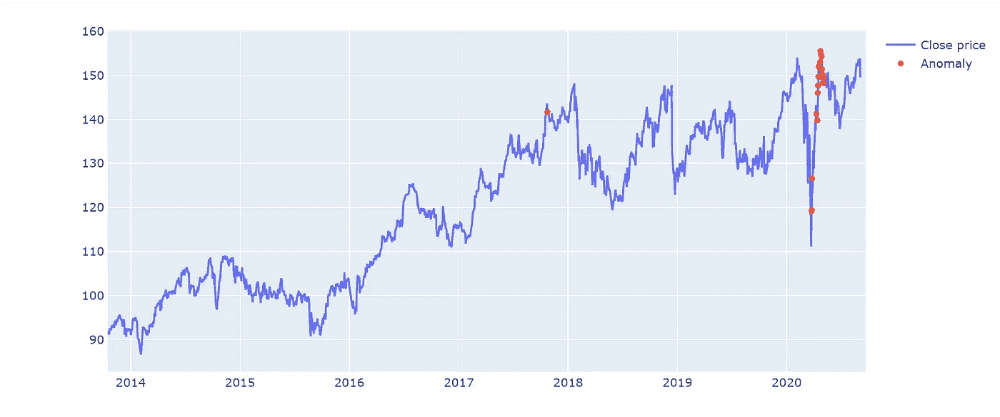

## 强生、JNJ、Keras、Autoencoder、Tensorflow

[自动编码器](https://en.wikipedia.org/wiki/Autoencoder)是一种无监督学习技术，尽管它们是使用监督学习方法训练的。目标是最小化基于损失函数的重建误差，例如均方误差。

在本帖中，我们将尝试使用 [LSTM 自动编码器](https://machinelearningmastery.com/lstm-autoencoders/)来检测[约翰逊&约翰逊的历史股价时间序列数据](https://finance.yahoo.com/quote/JNJ/history?p=JNJ)中的异常。

数据可以从[雅虎财经](https://finance.yahoo.com/quote/JNJ/history/)下载。我选择的时间段是从 1985 年 9 月 4 日到 2020 年 9 月 3 日。

使用 LSTM 自动编码器检测强生股票价格数据异常时，我们将遵循的步骤:

1.  用强生公司从 1985 年 9 月 4 日到 2013 年 9 月 3 日的股票价格数据训练一个 LSTM 自动编码器。我们假设没有异常，它们是正常的。
2.  使用 LSTM 自动编码器重建 2013 年 9 月 4 日至 2020 年 9 月 3 日测试数据的误差。
3.  如果测试数据的重建误差高于阈值，我们将该数据点标记为异常。

我们将分解一个 LSTM 自动编码器网络来逐层理解它们。

# 数据

LSTM _ 自动编码器 _ 异常. py

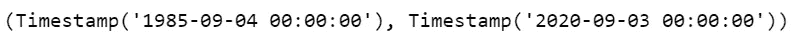

# 可视化时间序列

viz_timeseries.py

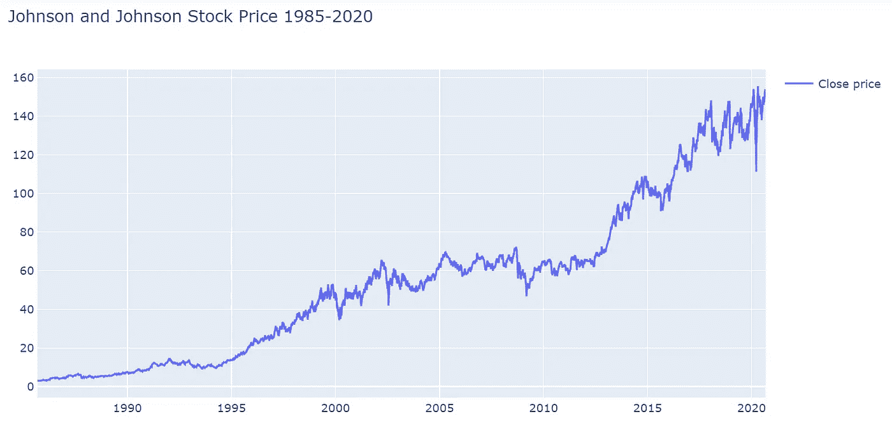

图 1

# 预处理

*   列车测试分离

火车 _ 测试. py

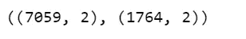

*   使数据标准化

标准化. py

*   创建序列

结合`TIME_STEPS`将输入数据转换成三维数组。根据 LSTM 网络的要求，阵列的形状应为`[samples, TIME_STEPS, features]`。

我们希望我们的网络有 30 天的记忆，所以我们设置了`TIME_STEPS=30`。

create _ sequences.py

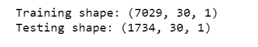

# 建立模型

*   我们定义了重建 LSTM 自动编码器架构，其期望具有 30 个时间步长和一个特征的输入序列，并且输出具有 30 个时间步长和一个特征的序列。
*   `RepeatVector()`重复输入 30 次。
*   设置`return_sequences=True`，那么输出仍然是一个序列。
*   `TimeDistributed(Dense(X_train.shape[2]))`加在最后得到输出，其中`X_train.shape[2]`是输入数据中的特征数。

LSTM _ 自动编码器. py

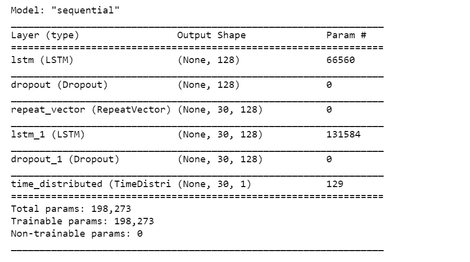

图 2

# 训练模型

LSTM _ 自动编码器 _ 火车 _ 模型. py

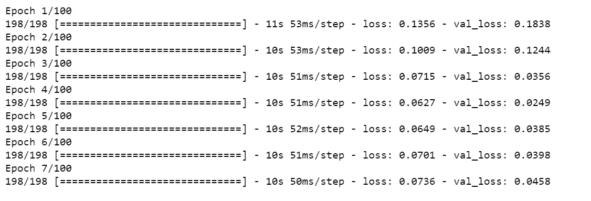

图 3

```
plt.plot(history.history['loss'], label='Training loss')
plt.plot(history.history['val_loss'], label='Validation loss')
plt.legend();
```

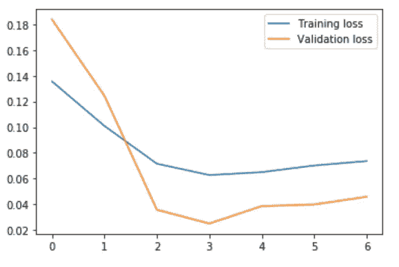

图 4

```
model.evaluate(X_test, y_test)
```

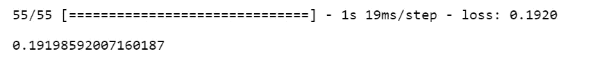

# 确定异常

*   在训练数据上找到 MAE loss。
*   将训练数据中的最大 MAE 损失值作为`reconstruction error threshold`。
*   如果测试集中一个数据点的重建损失大于这个`reconstruction error threshold`值，那么我们将把这个数据点标记为异常。

LSTM _ 火车 _ 损失. py

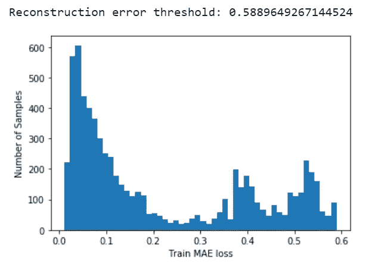

图 5

test _ 测试 _ 损失. py

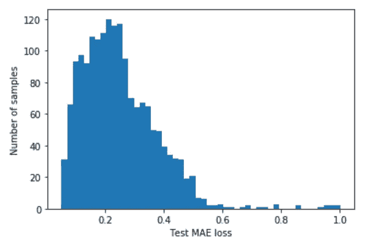

图 6

测试 _ 损耗 _ vs _ 阈值. py

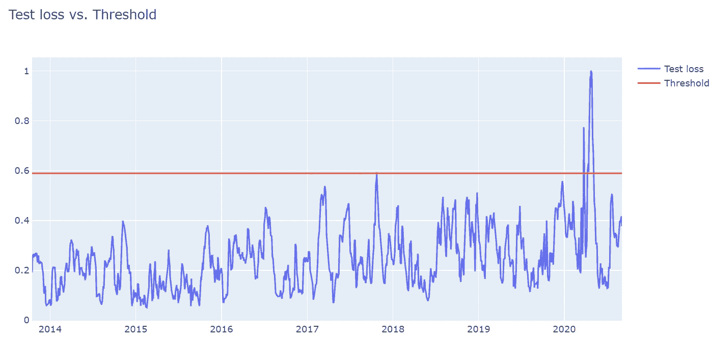

图 7

```
anomalies = test_score_df.loc[test_score_df['anomaly'] == True]
anomalies.shape
```

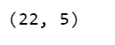

如您所见，测试集中有 22 个数据点超过了`reconstruction error threshold`。

# 可视化异常

plot_anomalies.py

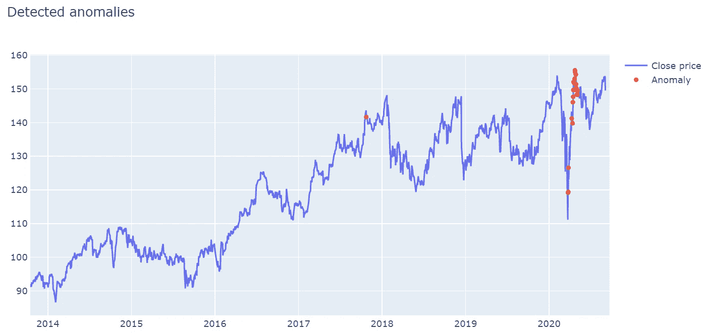

图 8

模型发现 3 月份出现一些低价异常，4 月份出现高价异常。据详细记载， [JNJ 股票在 3 月份触及 2020 年低点，但由于对其冠状病毒疫苗](https://www.investors.com/news/technology/jnj-stock-buy-now/)的乐观预期，不到一个月之后迅速回升至高点。

[Jupyter 笔记本](https://github.com/susanli2016/Machine-Learning-with-Python/blob/master/Timeseries%20anomaly%20detection%20using%20LSTM%20Autoencoder%20JNJ.ipynb)可以在 [Github](https://github.com/susanli2016/Machine-Learning-with-Python/blob/master/Timeseries%20anomaly%20detection%20using%20LSTM%20Autoencoder%20JNJ.ipynb) 上找到。祝你一周愉快！

参考资料:

[](https://machinelearningmastery.com/lstm-autoencoders/) [## LSTM 自动编码器简介-机器学习掌握

### LSTM 自动编码器是一个使用编码器-解码器 LSTM 的序列数据自动编码器的实现

machinelearningmastery.com](https://machinelearningmastery.com/lstm-autoencoders/) [](https://www.coursera.org/projects/anomaly-detection-time-series-keras) [## 基于 Keras 的时间序列数据异常检测

### 由 Coursera 项目网提供。在这个动手介绍异常检测的时间序列数据与 Keras…

www.coursera.org](https://www.coursera.org/projects/anomaly-detection-time-series-keras) [](https://keras.io/examples/timeseries/timeseries_anomaly_detection/) [## Keras 文档:使用自动编码器的时间序列异常检测

### 作者:pavithrasv 创建日期:2020/05/31 最近修改时间:2020/05/31 描述:检测时间序列中的异常…

keras.io](https://keras.io/examples/timeseries/timeseries_anomaly_detection/)