# 基于空气质量传感器数据的时间序列模式识别

> 原文：<https://towardsdatascience.com/time-series-pattern-recognition-with-air-quality-sensor-data-4b94710bb290?source=collection_archive---------5----------------------->

## 一个具有真实传感器数据的面向真实客户的项目

[Marcin Jozwiak](https://unsplash.com/@marcinjozwiak) 在 [Unsplash](https://unsplash.com/) 上拍摄的照片

[1。简介](#ca2e)
[2。探索性数据分析](#4928)
∘ [2.1 模式变化](#fc44)
∘ [2.2 特征之间的相关性](#847d)
[3 .异常检测与模式识别](#10bb)
∘ [3.1 点异常检测(系统故障)](#6619)
∘ [3.2 集体异常检测(外部事件)](#2836)
∘ [3.3 聚类与模式识别(外部事件)](#aff8)
[4 .结论](#cd68)
[参考文献](#bd81)
[附录—所选特征的散布矩阵](#f43d)
[关于我](#d77b)

**注**:详细的项目报告和本帖使用的数据集可以在我的 [GitHub 页面](https://github.com/zhouxu-ds/air-quality-pattern-recognition)找到。

# 1.介绍

这个项目是我为客户做的自由数据科学工作的一部分。不需要保密协议，该项目不包含任何敏感信息。因此，我决定展示该项目的数据分析和建模部分，作为我个人数据科学作品集的一部分。客户信息已被匿名化。

在该项目中，提供了两个数据集，每个数据集由一周的空气质量传感器读数组成。它们用于完成以下四项任务:

1.发现数据集中的异常以自动标记事件

2.将异常归类为“系统故障”或“外部事件”

3.从数据集中的模式中提供任何其他有用的结论

4.可视化数据集中要素的相互依赖关系

在本报告中，我将简要介绍我用于数据分析、特征关联可视化、自动标记“系统故障”和“外部事件”的机器学习技术以及我从数据中得出的发现的步骤。

# 2.探索性数据分析

我在这部分的代码和结果可以在[这里](https://github.com/zhouxu-ds/ds-projects/blob/master/air_quality_pattern_recognition/notebook/EDA.ipynb)找到。

数据集带有两个 CSV 文件，都可以从我的 [GitHub 页面](https://github.com/zhouxu-ds/air-quality-pattern-recognition/tree/main/data)访问。我首先用 Python 将它们导入并连接成一个熊猫数据帧。除了我们感兴趣的 11 个特征之外，进行了一些重新排列以移除列:

*   臭氧
*   硫化氢
*   总挥发性有机化合物
*   二氧化碳
*   PM 1
*   PM 2.5
*   PM 10
*   温度(内部和外部)
*   湿度(内部和外部)。

在美国东部时间(GMT-4)时区，时间戳从 2020 年 5 月 26 日到 6 月 9 日(总共 14 整天)。通过减法，发现每个读数之间有不同的间隔，从 7 秒到 3552 秒不等。下面的表 1 中列出了前 5 个频繁的时间间隔，其中大多数都接近 59 和 60 秒，因此可以得出结论，传感器每分钟都在读取。然而，如果不涉及故意干扰，阅读间隔的不一致性可能值得研究，因为它可能会在未来的时间序列分析中造成麻烦。

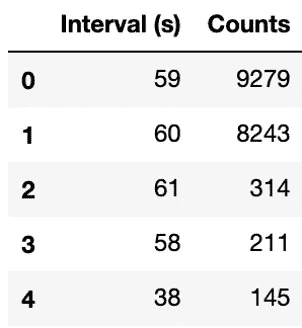

表 1:传感器测量的前 5 个时间间隔

对于每个特征，时间序列数据处于不同的尺度上，因此为了更好的可视化和机器学习效率，它们被归一化。然后对它们进行绘图和视觉检查，以发现任何有趣的模式。

## 2.1 模式变化

一些特征似乎在特定时间点共享相似的模式变化。三个最重要的因素(外部温度、外部湿度和臭氧)如下图 1 所示。可以清楚地看到，用粉红色突出显示的区域倾向于具有平坦的信号，而未突出显示的区域是正弦曲线。

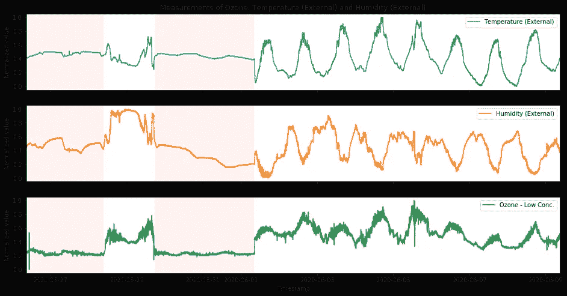

图 1:温度(外部)、湿度(外部)和臭氧的读数。它们在相同的时间点经历相似的模式变化。

根据常识，室外温度在中午达到最高点，并在晚上下降，我开始怀疑在这 14 天期间不同的测试环境的可能性。为了测试这个想法，从加拿大天气统计中查询多伦多天气数据[1]。温度和相对湿度被叠加，并与该数据集中的外部温度和湿度进行比较。该图如图 2 所示。可以看出，实际温度和湿度以正弦方式波动。温度和湿度读数的大部分与天气数据有很好的相关性，而用粉红色突出显示的区域保持相对不变。我没有获得任何关于测量环境的相关信息，但是从图中可以合理地推断出该装置在 14 天期间在室内和室外环境之间进行了重新定位。这也将在第 3.3 节的自动异常检测中进行测试。

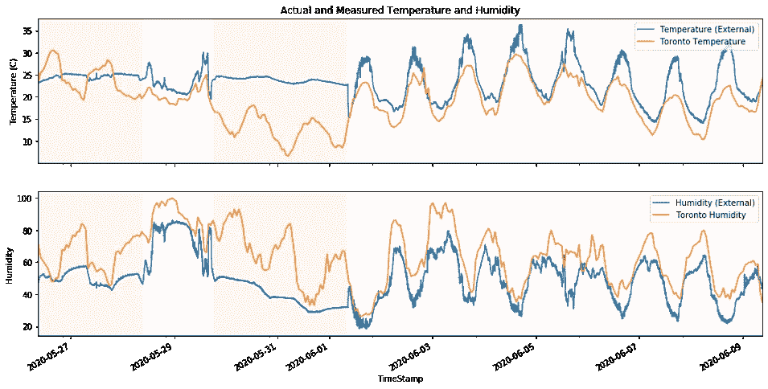

图 2:温度(外部)和湿度(外部)与多伦多天气数据叠加。与其他区域相比，粉红色突出显示的区域保持相对不变。

## 2.2 特征之间的相关性

相关性是一种研究两个定量的连续变量之间关系的技术，以表示它们之间的相互依赖性。在不同的相关技术中，皮尔逊相关是最常用的一种，它测量两个变量之间的关联强度。其相关系数从-1 到 1，其中 1 代表最强的正相关，-1 代表最强的负相关，0 代表无相关。计算每对数据集之间的相关系数，并绘制成热图，如表 2 所示。所选特征的散点图也绘制在图中并附在附录部分。

首先要注意的是，PM 1、PM 2.5 和 PM 10 之间的相关性很高，这意味着它们总是以相同的方式波动。臭氧与二氧化碳负相关，与温度(内部)和温度(外部)正相关。另一方面，令人惊讶的是，在温度(内部)和温度(外部)之间没有发现任何显著的相关性，这可能是由于仪器具有优异的隔热性能。然而，由于没有提供相关知识，因此无法对这一发现的合理性做出结论。除臭氧外，温度(内部)也与二氧化碳、硫化氢和三种颗粒物指标呈负相关。相反，温度(外部)与湿度(内部)和三种颗粒物测量值正相关，而与湿度(外部)负相关，正如图 1 中的时间序列图所示。

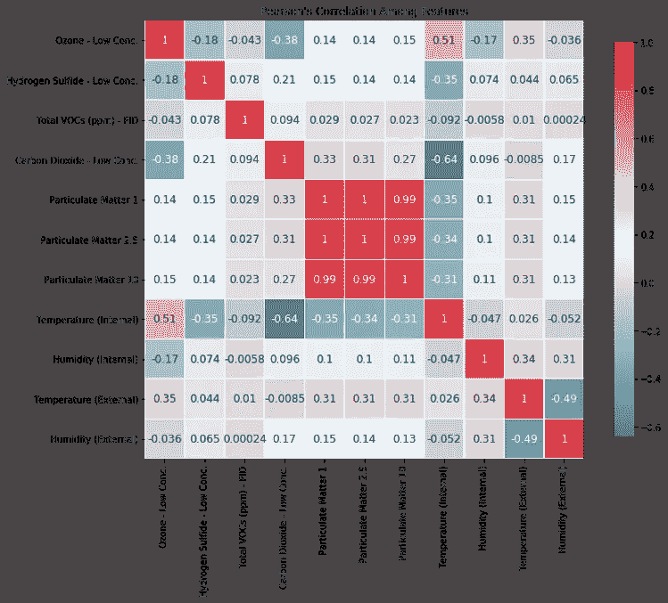

表 2:特征间皮尔逊相关系数的热图。

# 3.异常检测和模式识别

在本节中，将基于数据集检查各种异常检测方法。数据没有标签，因此没有知识或分类规则来区分“系统故障”、“外部事件”和其他。也没有提供仪器和实验的任何细节。因此，我在这一部分的结果可能会偏离预期，但我会尽最大努力做出假设，定义问题，然后根据我的个人经验完成它们。该部分由三部分组成:点异常检测、集体异常检测和聚类。

## 3.1 点异常检测(系统故障)

点异常或全局异常值是那些完全在通常信号范围之外的数据点，没有任何近邻的支持。这通常是由人为或系统错误引起的，需要在数据清理过程中移除，以便在预测建模中获得更好的性能。在这个数据集中，通过假设“系统故障”等同于这种点异常，有几个特征值得研究，例如图 3 所示的例子。

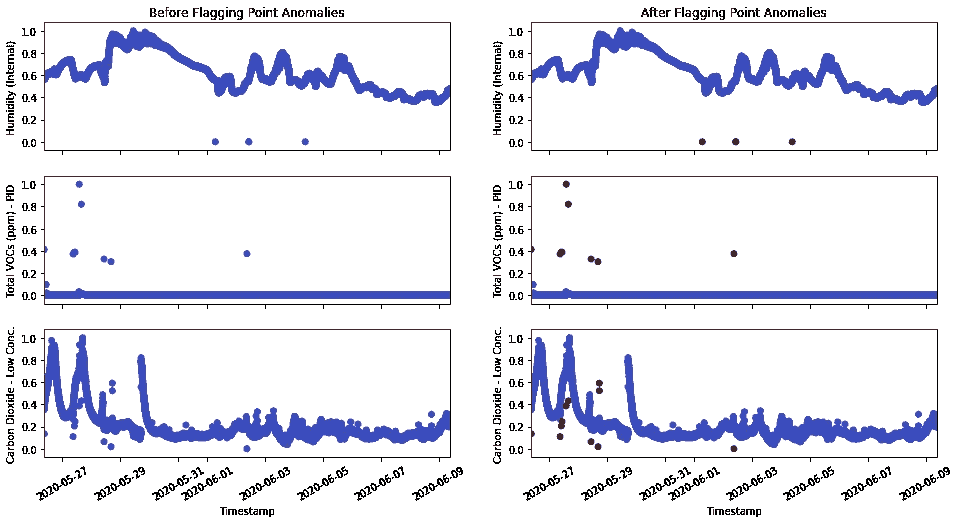

图 3:自动标记之前(左)和之后(右)的时间序列信号。点异常(异常值)标记为红色。从上到下:湿度(内部)、总挥发性有机化合物和二氧化碳。

这里，从湿度(内部)到总挥发性有机化合物到二氧化碳，每一个都代表了点异常检测任务的独特复杂性。在第一个例子中，三个异常值位于 0 级，因此一个简单的布尔过滤器可以标记这些数据点。在第二种情况下，异常值明显偏离我们感兴趣的信号，因此可以使用线性阈值来分离出异常值。这两种情况都很容易实现，因为它们可以通过纯粹基于经验的方法来完成。当涉及到第三种情况时，不可能使用线性阈值来分离出异常值，因为即使它们偏离其邻居，这些值也可能不像在其他时间点的通常信号那样大。

对于这种情况，有很多方法可以处理。一种简单的方法是计算每个时间点的滚动平均值或中值，并测试实际值是否在通过从中心线加减一定波动范围计算的预测区间内。因为我们在处理异常值，所以滚动中位数更稳健，所以在这个数据集中使用。

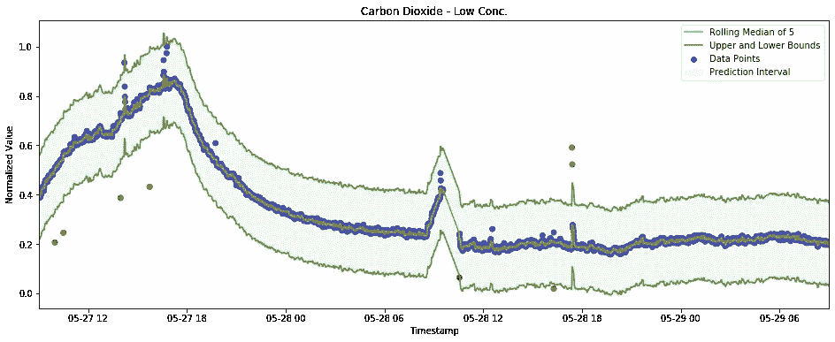

图 4:放大的二氧化碳时间序列图，带有滚动中值和预测区间

从图 4 中可以更清楚地看到这种方法:基于滚动中值设置等距预测区间。这里，滚动窗口设置为 5，这意味着对于每个数据点，我们取其最近的四个邻居，并计算中位数作为预测的中心。则围绕中心填充 0.17 的预测间隔。任何外部点都被视为异常值。

使用这种方法检测点异常是简单而有效的。但是，它也有不足之处，在处理更复杂的数据时可能不够可靠。在该模型中，有两个参数:滚动窗口大小和预测区间大小，这两个参数都是通过给定数据的实验手动定义的。我们基本上解决了从情况 2 到情况 3 时遇到的问题，如图 3 所示，方法是根据时间对信号和异常值之间的分类边界启用自调整能力。然而，带宽是固定的，因此在点异常的定义随时间变化的情况下，它变得不太有用。例如，超级便宜机票的定义在正常工作日和假日季节可能完全不同。

这就是机器学习发挥作用的时候，模型可以从数据中学习，以便在时间发生变化时自行调整参数。它将知道在特定时间点何时数据点可以被分类为点异常或不被分类为点异常。然而，我不能为这个数据集在这个任务上构建这样一个有监督的机器学习模型，因为前提是有标记的数据，而我们的没有。我们仍然建议在未来沿着这条路走下去，因为有了这样的模型，无论系统或数据有多复杂，都会产生最准确的结果。

即使有监督的学习方法在这个任务中不起作用，也有无监督的学习技术是有用的，例如聚类，也在 3.3 小节中讨论。聚类可以通过使用相似性度量(如向量空间中数据点之间的距离)对未标记的数据进行分组。然后通过选择远离聚类中心的异常点来区分异常点。然而，为了在该数据集中使用聚类进行点异常检测，我们必须遵循这样的假设，即外部事件是用多个特征的范围来定义的，而不是分别对待每个单独的时间序列。关于这一点的更多细节将在以下两个小节 3.2 和 3.3 中讨论。

## 3.2 集体异常检测(外部事件)

如果我们将“系统故障”定义为点异常，那么“外部事件”有两个方向。其中之一是将其定义为出现在每个时间序列信号中的集体异常。集体异常的概念与点异常相反。点异常是与通常信号有很大偏差的不连续值，而集体异常通常是连续的，但值超出预期，如在某些时间点显著增加或减少。在这一小节中，所有 11 个特征被分别视为一个时间序列。接下来的任务是找出它们各自发生的突变。

对于这样的问题，一种典型的方法是调整时间序列预测的用法:我们可以将模型拟合到某个时间段之前，然后预测该时间段之后的值。然后将实际值进行比较，看它是否落入预测区间。它与前一小节中使用的滚动中值方法非常相似，但这里只使用了以前的时间点，而不是使用两个方向的邻居。

该模型也有不同的选项。像 SARIMA 这样的传统时间序列预测模型是一个很好的选择，但是该模型可能不够复杂，无法适应我在第 2.1 节和第 3.3 节中提到的“模式”。另一种选择是为时间序列训练一个监督回归模型，这种模型现在被广泛使用。

想法很简单:使用滑动窗口的概念从时间序列中提取特征，如表 3 和图 5 所示。滑动窗口大小(蓝色)设置为与所需的特征号 k 相同。然后，对于时间序列中的每个数据点(橙色)，特征是从滞后 1 到滞后 k 之前的数据点值。因此，具有 N 个样本的时间序列能够被转换成 N-k 个观察值和 k 个特征的表。接下来，通过实现“正向链接”的概念，每个点由使用从指数 0 到 k-1 的观察值训练的回归模型预测。除了主回归模型之外，还训练了两个具有不同显著性水平的分位数回归变量来预测预测区间的上限和下限，这样我们就能够判断实际值是高于还是低于区间范围。

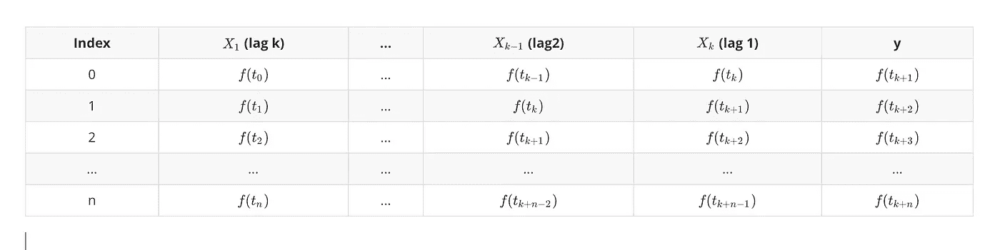

表 3:通过滑动窗口的特征提取算法

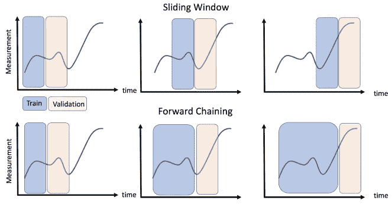

图 5:滑动窗口和正向链接的概念[2]。使用滑动窗口从时间序列中提取特征和目标。训练过程基于“正向链接”。

这个方法应用于给定的数据集，下面的图 6 显示了一个例子。为了加快训练速度，每小时对臭氧时间序列进行采样，提取特征，并使用 Scikit-Learn 将其输入三个梯度增强回归器模型(1 个主回归器和 2 个分位数回归器)。选择显著性水平，使得预测水平代表 90%的置信区间(在图 6 顶部显示为绿色)。然后将实际值与预测区间进行比较，并在图 6 底部用红色(意外增加)和蓝色(意外减少)标记。

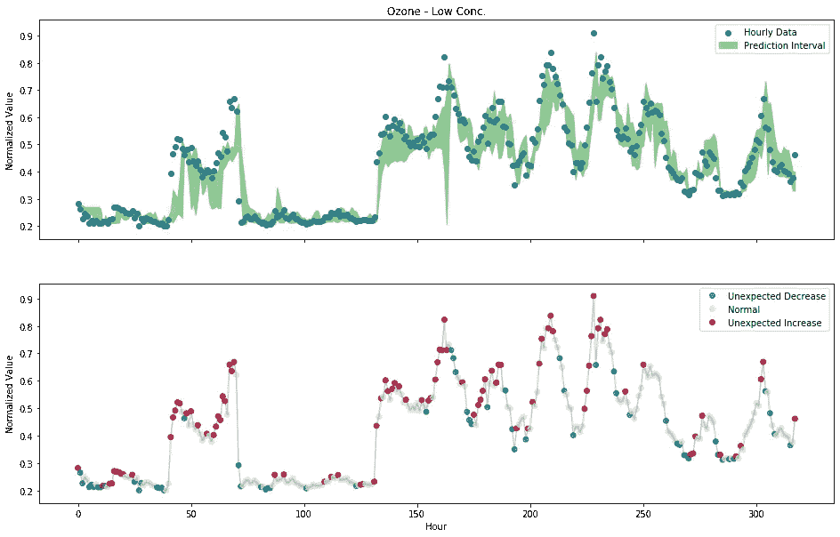

图 6:通过应用分位数回归方法，用臭氧时间序列数据(每小时采样)标记结果。顶部:数据和预测区间；底部:带有显示在预测间隔之上或之下的标志的数据。

结果可能还不是非常令人印象深刻，因为围绕回归模型选择和超参数微调还需要做更多的工作。然而，它已经显示出应对这些突然增加和减少的能力。使用机器学习模型的一个好处是，当输入数据时，模型会自己学习和进化。从图 6 底部可以看出，最后三个山丘(大约 240 小时后)的标记点比之前的少。这不仅是因为幅度较小，而且是因为模型正在从以前的经验中学习，并开始适应“思想”,它现在处于“山区”,应预料到周期性波动。因此，不难得出结论，如果输入更多的数据实例，模型性能会越来越好。

除了这种分位数回归模型，深度学习模型如 LSTM 可能能够实现更好的性能。长短期记忆(LSTM)是一种专门的人工递归神经网络(RNN)，由于其反馈连接的特殊设计，它是序列建模的最新选择之一。但是，设置和微调网络架构需要更长的时间和精力，这超出了本项目的时间限制，因此本报告中未将其作为可展示的内容。

另一方面，正如我在前面的章节中提到的，所提供的数据没有显示哪些数据点被认为是异常的标签。通过限制模型的选择和性能，它确实给本小节中讨论的集体异常检测任务带来了困难。未来如果提供一些标签，就变成了半监督或监督学习问题，这样就变得更容易达到更好的效果。

## 3.3 聚类和模式识别(外部事件)

正如我在上面 3.2 小节中提到的，识别“外部事件”可以从两个方向着手:一个是分别处理每个时间序列并监控传感器信号发生的任何意外变化，另一个是假设事件同时影响多个特征，这样我们希望通过查看不同特征中显示的独特特征来区分事件。在这种情况下，如果我们已经标记了数据，这将是一个常见的分类问题，但即使没有标签，我们仍然能够通过聚类来处理。

聚类是一种无监督的机器学习技术，它根据特征发现数据之间的相似性，并将相似的数据对象分组到聚类中。它可以作为一个独立的工具来深入了解数据分布，也可以作为其他算法的预处理步骤。有许多不同的聚类方法，这里我使用两种最常用的方法:K-Means 和 DBSCAN。

K-means 是用于聚类的划分方法之一。它将对象随机划分为非空子集，并不断添加新对象和调整质心，直到在优化每个对象和质心之间的距离平方和时达到局部最小值。另一方面，基于密度的噪声应用空间聚类(DBSCAN)是一种基于密度的方法，其中聚类被定义为密度连接点的最大集合[3]。

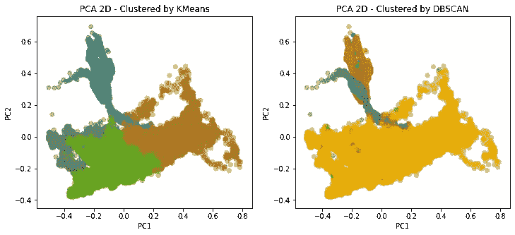

图 7:投影到前两个主成分的聚类结果。左:K-Means；右图:DBSCAN

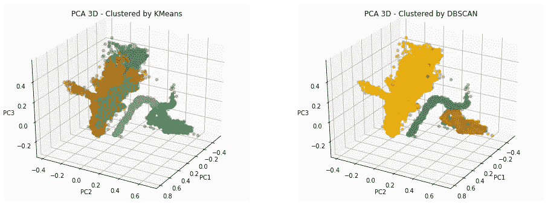

图 8:投影到前 3 个主成分的聚类结果。左:K-Means；右图:DBSCAN

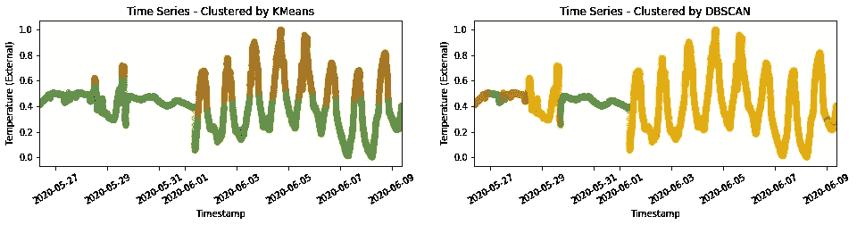

图 9:温度时间序列的聚类结果(外部)。左:K-Means；右图:DBSCAN

主成分分析(PCA)是一种降维技术，它创造了新的不相关变量，以增加可解释性和最小化信息损失。在本项目中，对标准化数据应用 K-means 和 DBSCAN 算法后，执行 PCA，并使用前 2 个和 3 个主成分在 2D(图 7)和 3D(图 8)中绘制聚类结果。此外，为了从另一个角度查看聚类结果，制作了带标签的时间序列图，温度(外部)图如图 9 所示。

从图中可以清楚地看出，这两种方法都能够区分我在第 2.1 节中提到的室内/室外模式变化。主要区别是基于划分的 K-means 方法对昼夜交替引起的星等变化更敏感。数据集中的许多变量都受到同时发生的这种明显的正弦变化的影响，包括温度(外部和内部)、湿度(外部和内部)和臭氧。k 均值倾向于区别对待波峰和波谷。另一方面，基于密度的 DBSCAN 不太关心星等差异，而是更关注密度分布。因此，它将整个正弦部分聚集成一个质量云，如图 7 和图 8 所示。

在现阶段不可能评论哪种聚类方法比另一种更好，因为它们有足够的独特性来满足不同的兴趣。如果我们对区别对待正弦信号的高低部分更感兴趣，我们将使用 K 均值；如果只想区分室内/室外模式，那么 DBSCAN 更好。另外，由于是无监督的学习任务，除了可视化和凭经验判断，没有办法量化模型之间的性能。在未来，如果提供一些标记数据，结果可以变成半监督学习任务，并且可以获得更多关于模型选择的直觉。

# 4.结论

在本文中，我将简要介绍探索性数据分析和相关性分析的方法和结果，以及用于点异常检测、集体异常检测和聚类的三种不同建模管道的构造。

在探索性数据分析部分，发现传感器读数时间间隔变化很大。即使它们中的大多数包含在一分钟左右，不一致性问题仍然值得研究，因为它可能会降低分析任务的效率和性能。我们发现测量环境受时间序列图变化的影响，后来通过与实际的多伦多天气数据以及聚类结果保持一致而得到保证。此外，还对特征之间的相关性进行了研究和举例。出现了一些困惑，如温度(内部)和温度(外部)之间的奇怪关系，这需要通过实验或设备本身来研究。

在异常检测部分，由于“系统故障”和“外部事件”没有明确定义，我将项目分成三个不同的任务。点异常被定义为严重偏离和不连续的数据点。这里使用了滚动中值方法来成功地自动化标记这种点异常的过程。另一方面，集体异常被定义为偏离的数据点集合，通常被视为突然增加或减少。这项任务是通过从时间序列数据中提取特征，然后训练回归模型来完成的。还使用 K-mean 和 DBSCAN 对数据集执行聚类，这两种方法都发挥了它们的优势，并通过利用它们相似和不相似的特征成功地对数据进行聚类。

本项目中介绍的所有异常检测模型都只是原型，没有广泛的模型部分和微调。如果付出更多的努力，并通过获得更多的数据知识，它们中的每一个都有很大的潜力进化成更好的形式。对于点异常，有更多基于机器学习的异常检测技术，如隔离森林和局部异常因子，以适应更复杂的数据形式。对于集体异常，最先进的 LSTM 值得投入精力，特别是在时间序列数据和序列建模方面。对于聚类来说，还有许多其他的方法，比如层次聚类和基于网格的聚类。他们有能力获得类似的出色表现。

当然，这些未来的方向都是在没有标注数据的前提下建议的。如果有经验的工程师或科学家能够就哪些类型的数据被视为“系统故障”或“外部事件”给出他们的见解，那么通过将任务转化为半监督或监督学习问题，肯定会取得更令人兴奋的进展，届时将有更多的工具可供选择。

感谢您的阅读！如果你喜欢这篇文章，请**关注我的频道**和/或 [**成为我今天的推荐会员**](https://zhouxu-ds.medium.com/membership) (非常感谢🙏).我会继续写下去，分享我关于数据科学的想法和项目。如果你有任何问题，请随时联系我。

 [## 通过我的推荐链接加入 Medium 周(乔)徐

### 阅读周(Joe)徐(以及媒体上成千上万的其他作家)的每一个故事。您的会员费直接支持…

zhouxu-ds.medium.com](https://zhouxu-ds.medium.com/membership) 

# 关于我

我是赛诺菲的数据科学家。我拥抱技术，每天都在学习新技能。欢迎您通过[媒体博客](https://zhouxu-ds.medium.com/)、 [LinkedIn](https://www.linkedin.com/in/zhouxu-ds/) 或 [GitHub](https://github.com/zhouxu-ds) 联系我。我的观点是我自己的，而不是我雇主的观点。

请看我的其他文章:

*   [使用 Python 和 Flask-RESTful 为机器学习模型构建 REST API](/build-rest-api-for-machine-learning-models-using-python-and-flask-restful-7b2cd8d87aa0)
*   [使用 Elasticsearch 的实时类型预测搜索(AWS OpenSearch)](/real-time-typeahead-search-with-elasticsearch-aws-opensearch-88410d5b31a1)
*   [理解分类问题中的 Sigmoid、Logistic、Softmax 函数和交叉熵损失(对数损失)](https://medium.com/@zhouxu-ds/understanding-sigmoid-logistic-softmax-functions-and-cross-entropy-loss-log-loss-dbbbe0a17efb)
*   [利润最大化的贷款违约预测](/loan-default-prediction-for-profit-maximization-45fcd461582b)
*   [使用 Berka 数据集进行贷款违约预测](/loan-default-prediction-an-end-to-end-ml-project-with-real-bank-data-part-1-1405f7aecb9e)

# 参考

[1]加拿大天气统计:[https://www.weatherstats.ca/](https://www.weatherstats.ca/)

[2]时间序列机器学习框架:[https://towards data science . com/Time-Series-Machine-Learning-regression-Framework-9ea 33929009 a](/time-series-machine-learning-regression-framework-9ea33929009a)

[3] J. Han，M. Kamber 和 J. Pei，*数据挖掘:概念和技术*，2011 年第 3 版。

# 附录—所选特征的散布矩阵

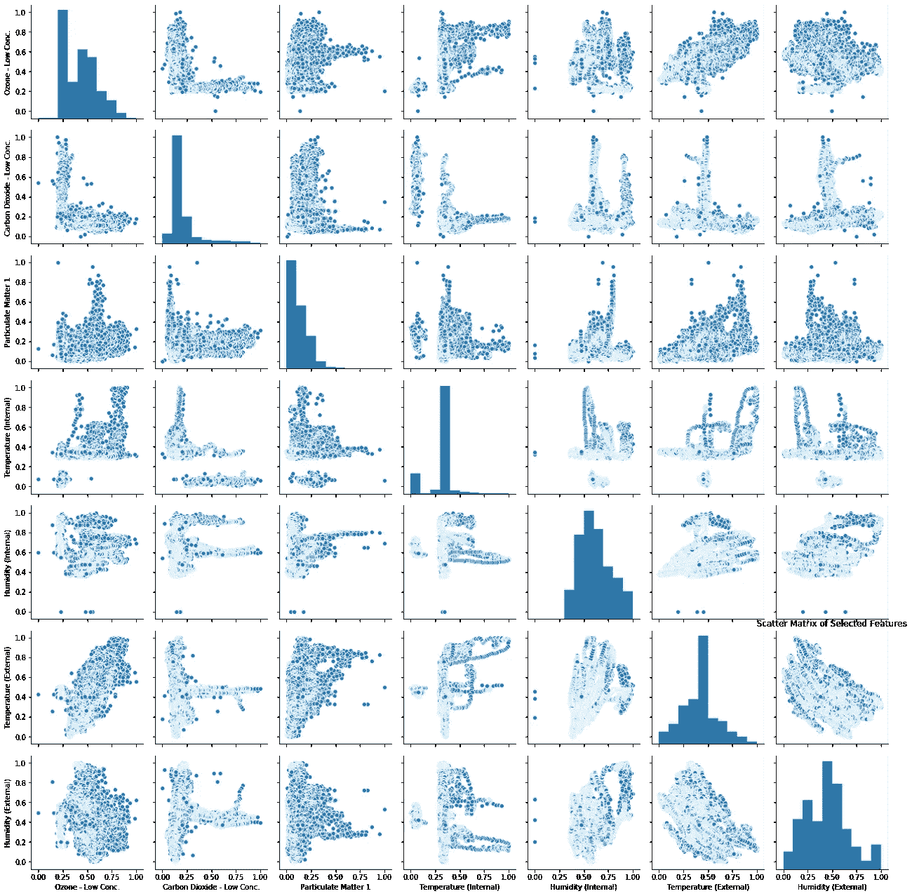