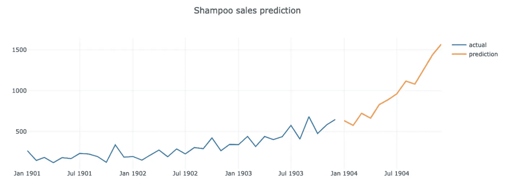

# 超越测试数据的时间序列预测

> 原文：<https://towardsdatascience.com/time-series-prediction-beyond-test-data-3f4625019fd9?source=collection_archive---------3----------------------->

## 许多(如果不是全部的话)与时间序列预测相关的例子仅用于测试数据，缺乏如何预测真实未来日期的例子。这个简单的例子展示了如何在测试数据集之外进行预测。


来源:Pixabay

我当时的任务是构建一个大规模时间序列预测解决方案。我最终在单一解决方案中使用了多种方法的组合——预言家、ARIMA 和 LSTM 神经网络(运行在 Keras/TensorFlow 之上)。使用 Prophet ( [用 Flask 提供 Prophet 模型—预测未来](/serving-prophet-model-with-flask-predicting-future-1896986da05f))和 ARIMA 可以直接计算未来日期的预测，两者都提供了返回给定未来范围的预测的函数。如果你是新手，LSTM 的情况就不一样了——这将需要大量的时间来研究如何预测真实的未来日期(大多数例子只展示了如何根据测试数据集进行预测)。

我发现了一个很好的例子，它帮助我解决了我的任务——[一个使用长短期记忆(LSTM)网络](https://medium.com/swlh/a-quick-example-of-time-series-forecasting-using-long-short-term-memory-lstm-networks-ddc10dc1467d)进行时间序列预测的快速例子。在这篇文章中，我将展示如何预测洗发水销售月度数据，主要基于上面例子中的代码。

可以从 Kaggle 下载一个包含洗发水月销售数据的[数据集](https://www.kaggle.com/guangningyu/sales-of-shampoo)。

LSTM 模型是用 TensorFlow 2.0 和 Keras 建立的。

首先，我们需要获取和解析时间序列数据:

```
def parser(x):
    return pd.datetime.strptime('190'+x, '%Y-%m')df = pd.read_csv('shampoo.csv', parse_dates=[0], index_col=0, date_parser=parser)
df.tail()
```

对于 LSTM 模型训练，必须对数据进行缩放，这是通过来自 *sklearn* 库的 MinMaxScaler 完成的:

```
train = dfscaler = MinMaxScaler()
scaler.fit(train)
train = scaler.transform(train)
```

时间序列预测是一项序列预测任务。日期对于 ML 算法来说并不重要，它试图识别过去和未来数据之间的依赖模式。有许多方法可以将原始序列数据转换成适合 LSTM 神经网络训练的数据。我更喜欢使用 Keras TimeseriesGenerator(在这里阅读更多信息— [如何在 Keras](https://machinelearningmastery.com/how-to-use-the-timeseriesgenerator-for-time-series-forecasting-in-keras/) 中使用 TimeseriesGenerator 进行时间序列预测)。我们将预测 12 个月的洗发水销售额，因为这将使用过去 12 个月的时间窗口来确定预测:

```
n_input = 12
n_features = 1
generator = TimeseriesGenerator(train, train, length=n_input, batch_size=6)
```

LSTM 模特培训。对于输入和目标，我们将使用整个时间序列数据集，模型将在整个数据集上进行训练。这将允许为训练集中可用的最后日期之后的日期生成预测:

```
model = Sequential()
model.add(LSTM(200, activation='relu', input_shape=(n_input, n_features)))
model.add(Dropout(0.15))
model.add(Dense(1))optimizer = keras.optimizers.Adam(learning_rate=0.001)
model.compile(optimizer=optimizer, loss='mse')history = model.fit_generator(generator,epochs=100,verbose=1)
```

一旦模型训练完毕，我们就可以生成未来日期的预测。这里的想法是——使用最近的 12 个步骤，为未来的一个步骤生成一个预测。向数组中添加新的预测，从同一数组中删除第一个条目，并用 12 步的更新数组预测下一步。

```
pred_list = []batch = train[-n_input:].reshape((1, n_input, n_features))for i in range(n_input):   
    pred_list.append(model.predict(batch)[0]) 
    batch = np.append(batch[:,1:,:],[[pred_list[i]]],axis=1)
```

创建包含未来月份的数据框，我们将为这些月份分配计算的预测数据:

```
add_dates = [df.index[-1] + DateOffset(months=x) for x in range(0,13) ]
future_dates = pd.DataFrame(index=add_dates[1:],columns=df.columns)
```

创建包含日期和预测数据的数据框。最后，与训练数据框架合并，以绘制显示训练数据和真实未来预测的图表:

```
df_predict = pd.DataFrame(scaler.inverse_transform(pred_list),
                          index=future_dates[-n_input:].index, columns=['Prediction'])df_proj = pd.concat([df,df_predict], axis=1)
```

结果显示为 Plotly:

```
plot_data = [
    go.Scatter(
        x=df_proj.index,
        y=df_proj['Sales'],
        name='actual'
    ),
    go.Scatter(
        x=df_proj.index,
        y=df_proj['Prediction'],
        name='prediction'
    )
]plot_layout = go.Layout(
        title='Shampoo sales prediction'
    )
fig = go.Figure(data=plot_data, layout=plot_layout)
pyoff.iplot(fig)
```

预测的真实未来销售额，以黄色显示:



源代码可以在 [GitHub](https://github.com/abaranovskis-redsamurai/automation-repo/tree/master/forecast-lstm) 上获得。