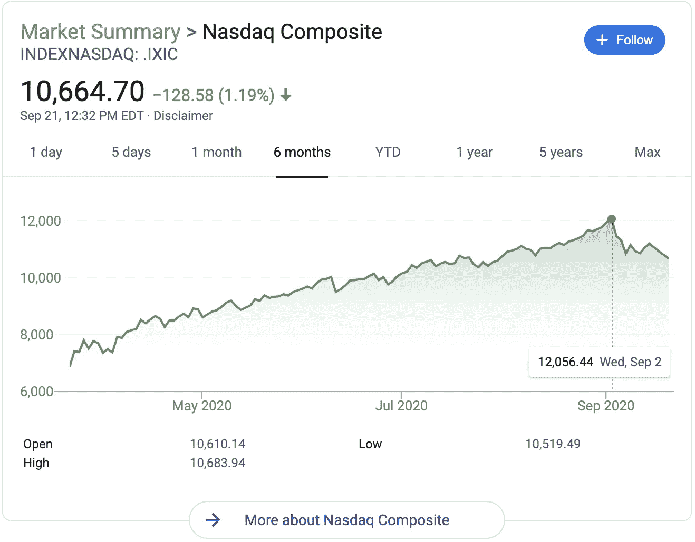
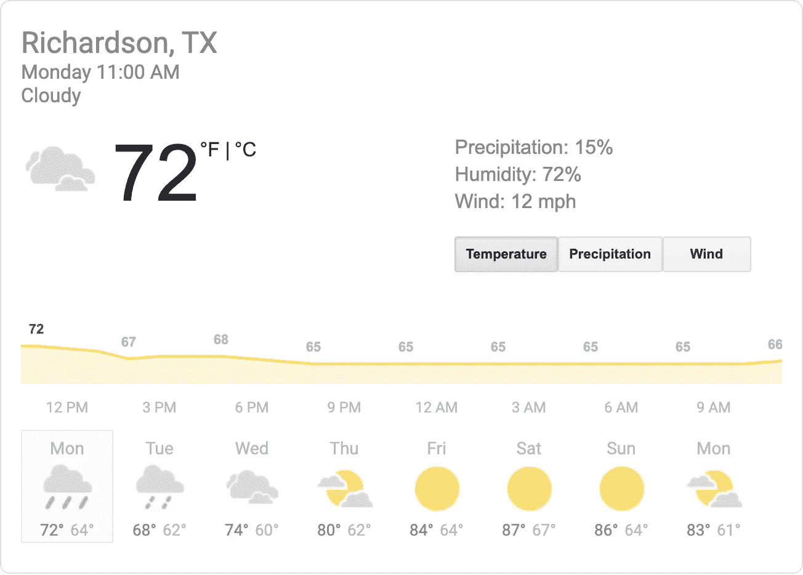
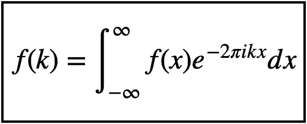
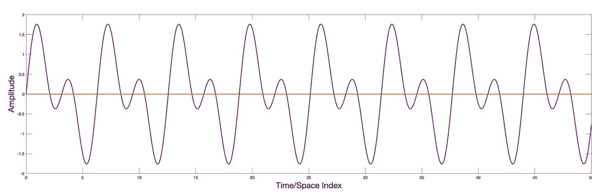
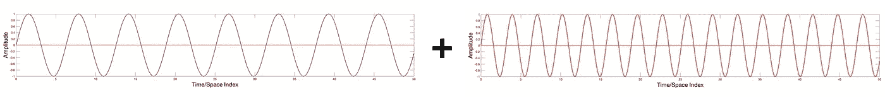
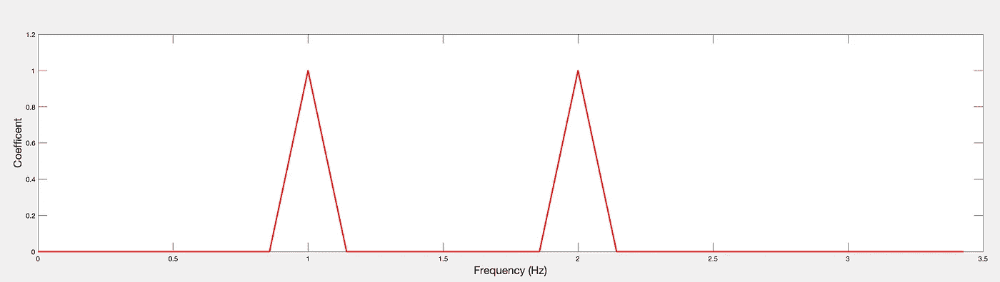
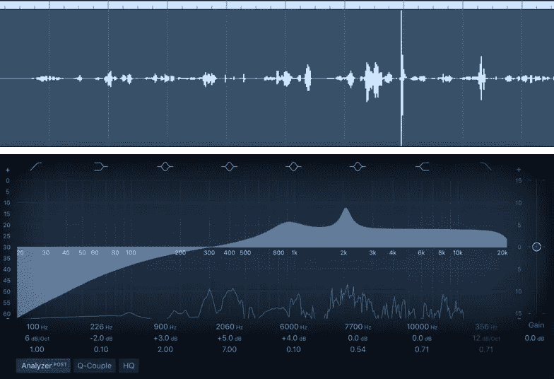
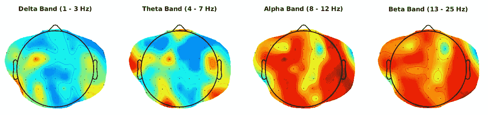

# 时间序列、信号和傅立叶变换

> 原文：<https://towardsdatascience.com/time-series-signals-the-fourier-transform-f68e8a97c1c2?source=collection_archive---------8----------------------->

## 未来文章的介绍和入门

在我接下来的三篇文章中，我将介绍和讨论傅立叶和小波变换，它们提取了一个量如何随时间振荡的信息。这些方法几乎有无数的应用，我在这里描述了其中的一些。

[**示例代码**](https://github.com/ShawhinT/YouTube/tree/main/fourierTransform) 链接可以在下面的“参考资料”部分找到。

# 时间序列

毫无疑问，每个人都熟悉时间序列，即使你没有听说过这个术语。一个**时间序列**仅仅是**一组按时间**排序的值。例如，股票指数价格，在你最喜欢的新闻网上通常被描绘成价格与时间的关系图。另一个例子是 7 天预报，显示几天内的高温。时间序列是表示数据的一种自然方式。

纳斯达克指数价格随时间变化是一个熟悉的时间序列。图片来自谷歌搜索“纳斯达克”。

7 天预报中的最高和最低温度形成一个时间序列。图片来自谷歌搜索“天气”。

# 信号

信号是一种时间序列。更具体地说，**信号**是代表物理事件的**时变量。信号的两个基本属性是:振幅和频率。信号的幅度是其大小，例如音频信号的响度。信号的频率表征了它在时间上的振荡，例如吉他发出的音调。**

音乐的音频信号波形。信号是立体声混音的左半部分。图片作者。

不言而喻，当从连续信号(数量的无限集合)到离散信号(数量的有限集合)时，信息会丢失。因此，离散信号通常是连续信号的近似。例如，考虑捕捉办公室中的温度波动来运行 HVAC 系统。在任何时候，办公室都会有一些平均环境温度。假设每小时用一套温度计测量这个温度。这种测量会产生一个离散的信号，近似于办公室中真实的温度波动。有理由怀疑这些每小时的温度记录会导致空调不良，因为温度可能会在比一小时小得多的时间尺度上变化。如果是，应该多久测量一次温度？使用奈奎斯特定理正式回答了这个问题。为了可靠地捕获连续信号，记录信息的速率(称为采样速率)必须是目标信号频率的两倍。这就是为什么音频通常以 44，100 Hz 采样，因为人类听觉的上限约为 20，000 Hz。

实际上，从环境中获取有意义的信息可能并不那么简单。真实世界的信号通常是非周期性的、有噪声的，并且受多种来源的影响。从这些信号中提取有用的信息是信号处理的基本目标。

# 傅立叶变换

傅立叶变换的定义。还存在其他一些因前置因子而不同的约定。图片作者。

信号处理的核心是**傅立叶变换**。FT **将函数分解成正弦和余弦**即波。理论上，任何函数都可以用这种方式表示，即表示为不同振幅和频率的(可能是无限的)正弦和余弦函数之和。下面给出一个玩具例子。代码可以在随附的 [GitHub repo](https://github.com/ShawhinT/YouTube/tree/main/fourierTransform) 找到。

**玩具示例信号。**图片作者。

**玩具的构成频率举例:**换句话说，玩具信号可以表示为频率为 1 和 2 Hz 的 2 个正弦函数之和。图片作者。

**玩具信号的单侧功率谱:**对应于信号分解成两个正弦函数，在 f=1 和 2 Hz 处出现两个幅值相等的显著峰值。图片作者。

## 应用程序

傅立叶变换在频谱分析、解微分方程和 A/V 制作中有无数的应用。

**音频制作**

均衡(EQ)是音频制作的重要组成部分。特定频率范围的音量可以调高或调低，从而改变音频的声音。EQ 的一个基本用途是从音频文件中去除背景噪音。

顶部面板显示音频信号。底部面板显示均衡器，它增加或减少频率范围的增益。图片作者。

**脑电图**

脑电图是一种记录大脑电活动的技术。EEG 的频谱分析被广泛使用，即通过成分频率能量检查信号。EEG 中广泛使用的频带约定如下。

脑电图中常用的频带。图片作者。

# 结论

时间序列和信号是组织数据的自然方式。傅立叶变换提取嵌入在数据中的频率信息。这种方法在音频工程、物理和数据科学等领域有无数的用例。对于实际应用，傅立叶变换通过**快速傅立叶变换(FFT)** 算法进行离散化并提高计算效率。FFT 将在我的下一篇文章中讨论。

## 资源

**更多系列** : [FFT](https://shawhin.medium.com/the-fast-fourier-transform-fft-5e96cf637c38) | [小波变换](https://shawhin.medium.com/the-wavelet-transform-e9cfa85d7b34)

**连接** : [我的网站](https://shawhint.github.io/) | [预定电话](https://calendly.com/shawhintalebi) | [消息我](https://shawhint.github.io/connect.html)

**社交**:[YouTube](https://www.youtube.com/channel/UCa9gErQ9AE5jT2DZLjXBIdA)|[LinkedIn](https://www.linkedin.com/in/shawhintalebi/)|[Twitter](https://twitter.com/ShawhinT)

**支持** : [给我买杯咖啡](https://www.buymeacoffee.com/shawhint?source=about_page-------------------------------------) ☕️ | [成为会员](/membership?source=about_page-------------------------------------) ⭐️

 [## 通过我的推荐链接加入媒体——肖文·塔莱比

### ⭐️成为会员使用我的推荐链接，并获得充分的媒体上的每一篇文章。您的会员费直接…

shawhin.medium.com](https://shawhin.medium.com/membership)