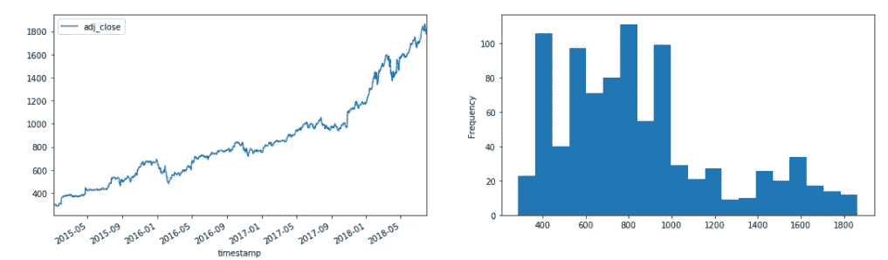
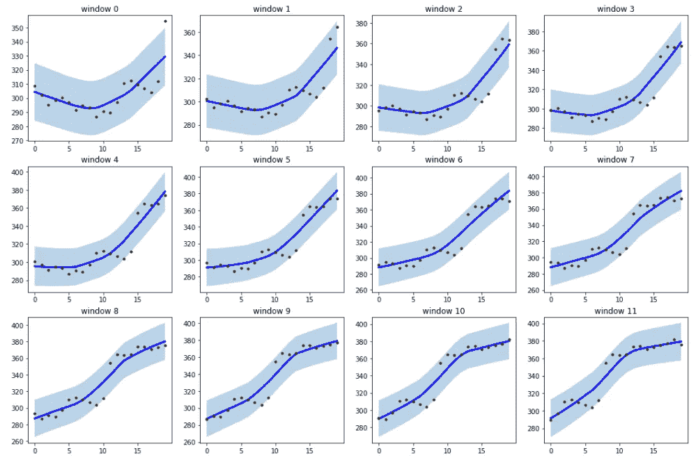
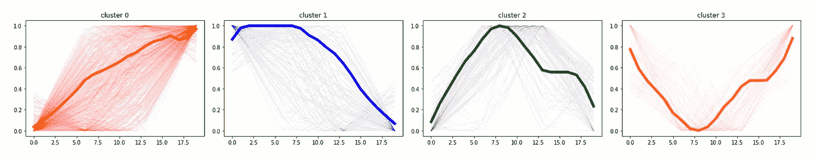
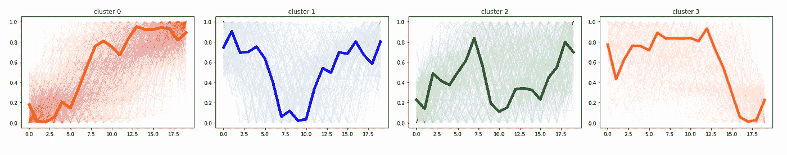
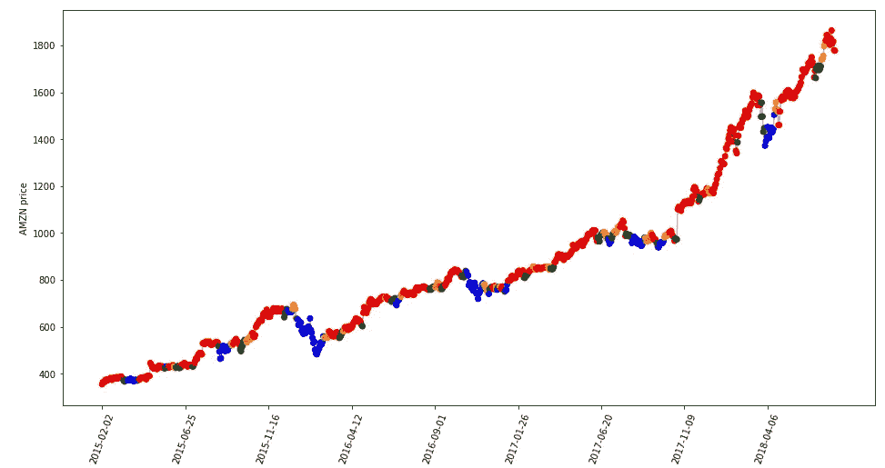

# 时间序列平滑以实现更好的聚类

> 原文：<https://towardsdatascience.com/time-series-smoothing-for-better-clustering-121b98f308e8?source=collection_archive---------24----------------------->

## 机器学习的金融序列处理

莱蒂·施密在 [Unsplash](https://unsplash.com?utm_source=medium&utm_medium=referral) 上拍摄的照片

在时间序列分析中，脏的和杂乱的数据会改变我们的推理和结论。这是真的，尤其是在这个领域，因为时间依赖在处理时间序列时起着至关重要的作用。

噪声或异常值必须按照特定的解决方案小心处理。在这种情况下， [**tsmoothie**](https://github.com/cerlymarco/tsmoothie) 软件包可以帮助我们在准备时间序列进行分析时节省大量时间。 [**Tsmoothie**](https://github.com/cerlymarco/tsmoothie) 是一个用于时间序列平滑和异常值检测的 python 库，可以以矢量化的方式处理多个序列。它很有用，因为它可以提供我们需要的预处理步骤，如去噪或剔除异常值，保留原始数据中的时间模式。

在本帖中，我们使用这些小玩意来改进聚类任务。更准确地说，我们试图通过一种无监督的方法来识别财务数据中的一些变化。最后，我们将期望指出收盘价中的清晰模式，这些模式可用于检查市场的隐藏行为。

# 数据

如前所述，我们操作金融时间序列。有许多工具或预制数据集可以提供和存储金融数据。对于我们的目标，我们使用从 Kaggle 收集的数据集。[2000–2018 年的股票数据](https://www.kaggle.com/danieljperez/financial-data-20002018)是从 2000 年到 2018 年大约 39 只不同股票的股票价格的清理集合。它每天报告成交量、开盘价、最高价、最低价和收盘价。我们关注接近的价格。

出于演示的目的，我们考虑亚马逊的股票价格，但同样的发现也出现在其他股票信号中。

亚马逊收盘价历史和分布

# 时间序列平滑

我们工作流程的第一步包括时间序列预处理。我们的策略非常直观有效。给定收盘价的时间序列，我们把它分成小的滑动块。然后对每个片段进行平滑处理，以去除异常值。平滑过程对于减少我们系列中出现的噪声和指出可能随时间推移出现的真实模式是必不可少的。

[**Tsmoothie**](https://github.com/cerlymarco/tsmoothie) 为我们的目的提供了不同的平滑技术。它还具有内置的实用程序来运行滑动平滑方法。原始时间序列被分割成相等的窗口片段，然后被独立地平滑。我们选择局部加权散点图平滑([洛斯](https://en.wikipedia.org/wiki/Local_regression))作为平滑过程。

LOWESS 是一种强大的非参数技术，通过单变量或多变量平滑来拟合给定数据的平滑线。它对移动范围内的点集合进行回归，并根据横坐标值周围的距离进行加权，以计算序数值。平滑参数(*α*)的选择通常完全基于“重复试验”的基础。没有特定的技术来选择它的精确值。特定值的选择可能导致“过平滑”或“欠平滑”。

下面是应用上述程序的结果，滑动窗口长度为 20 天，且*α*等于 0.6。换句话说，我们正在为每个生成的窗口计算一个 LOWESS。

AMZN 股票价格的第一个平滑窗口

# 时间序列聚类

第二步包括使用聚类算法来识别我们的时间序列中的行为。创建等长窗口旨在轻松解决这一任务。

一般来说，将不同的时间序列聚类到相似的组中是具有挑战性的，因为每个数据点都遵循一个时间结构，为了获得满意的结果，我们必须遵守这个时间结构。标准聚类算法中使用的距离度量，如欧几里德距离，通常不适用于时间序列。一个更强的方法是用比较时间序列的度量代替默认的距离度量，例如[动态时间扭曲](https://en.wikipedia.org/wiki/Dynamic_time_warping)。

使用 K-均值和动态时间弯曲度量搜索 4 个聚类产生以下结果:

带平滑的缩放聚类中心和相关样本

**正如我们所看到的，很明显产生了 4 个不同的集群，代表了 4 种不同的市场运动:上升趋势(*集群 0* )、下降趋势(*集群 1* )、下降转折点(*集群 2* )、上升转折点(*集群 3* )。我们可以在不计算平滑度的情况下对原始时间窗口做同样的事情，并进行比较。**

****

**缩放的聚类中心和相关样本**没有平滑****

**现在这四组之间的差异并不明显。对生成的集群进行解释更加困难。从聚类算法中生成有意义的组的能力是任何无监督方法的更重要的先决条件。如果我们不能做出解释，结果就不能用来做决定。在这个意义上，采用平滑预处理可以帮助分析。**

****

**AMZN 收盘价和相应的窗口簇。通过平滑获得聚类**

# ****摘要****

****在金融领域，波动性的概念是决策的基础。它衡量市场中存在的不确定性，即风险。在这里，我们更深入地扩展了短期市场机制的概念。我们确定了四个明确的市场条件，平滑我们的时间序列块，以更好地理解数据的真实动态。在本文中，我们利用了金融聚类应用程序中的时间序列平滑，但这种方法在其他一些涉及时间序列分析的竞赛中也是有效和有用的。****

****[查看我的 GITHUB 回购 ](https://github.com/cerlymarco/MEDIUM_NoteBook)****

****保持联系: [Linkedin](https://www.linkedin.com/in/marco-cerliani-b0bba714b/)****