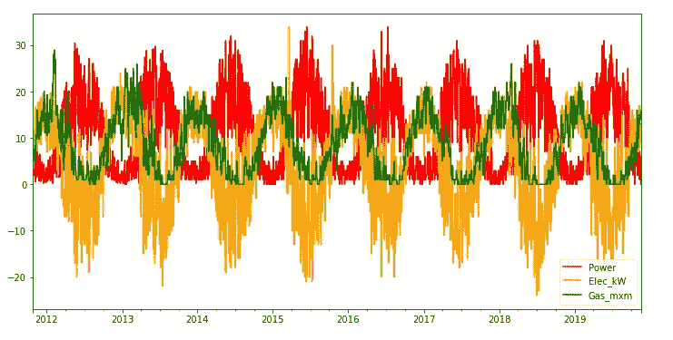
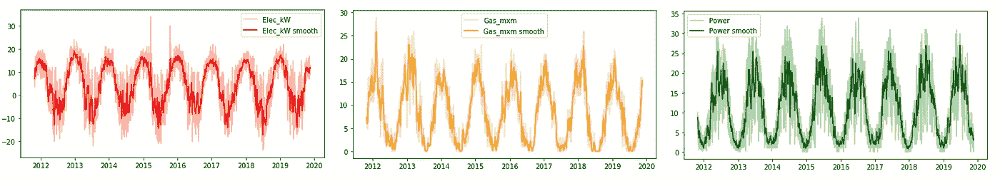
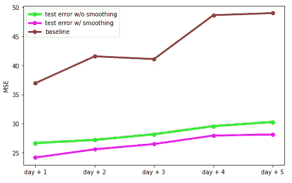
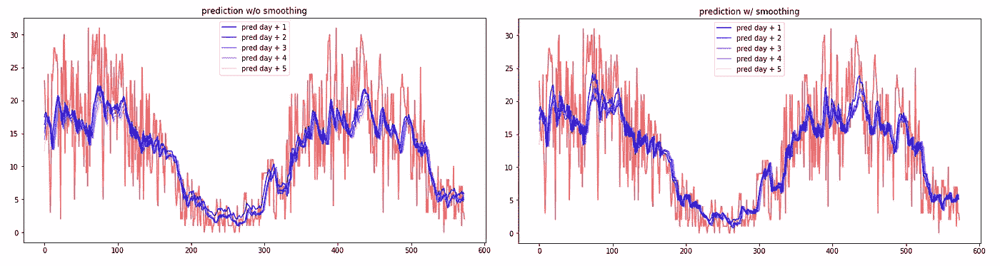

# 时间序列平滑用于更好的预测

> 原文：<https://towardsdatascience.com/time-series-smoothing-for-better-forecasting-7fbf10428b2?source=collection_archive---------13----------------------->

## 降低传感器中的噪声，以更好地预测太阳能电池板的发电量

亚历山大·埃里明在 [Unsplash](https://unsplash.com?utm_source=medium&utm_medium=referral) 上的照片

在时间序列预测中，脏的和杂乱的数据的存在会损害最终的预测。这是真的，尤其是在这个领域，因为时间依赖在处理时间序列时起着至关重要的作用。

噪声或异常值必须按照特定的解决方案小心处理。在这种情况下， [**tsmoothie**](https://github.com/cerlymarco/tsmoothie) 软件包可以帮助我们在准备时间序列进行分析时节省大量时间。 [**Tsmoothie**](https://github.com/cerlymarco/tsmoothie) 是一个用于时间序列平滑和异常值检测的 python 库，可以以矢量化的方式处理多个序列。它很有用，因为它可以提供我们需要的预处理步骤，如去噪或剔除异常值，保留原始数据中的时间模式。

在本帖中，我们用这些小玩意来改进预测任务。更准确地说，我们试图预测太阳能电池板的日发电量。最后，我们将期望从我们的去噪过程中受益，并产生比没有预处理的情况更好的预测。

# 数据

在 [Kaggle](https://www.kaggle.com/fvcoppen/solarpanelspower) 上有一个用于我们目的的真实数据集。该数据存储了安装在私人住宅屋顶上的太阳能电池板的日发电量。数据自 2011 年开始记录，以时间序列格式呈现 3 个不同的来源:

*   房子每天的煤气消耗量。
*   房子的日常用电量。其中负值表示太阳能超过了当地的电力消耗。
*   DC 到交流转换器上功率计的每日值。这是目前累积的太阳能电力。我们不需要累计值，而是需要每日的绝对值，因此，我们进行简单的微分运算。这是我们的预测目标。

正如我们从 raw 系列的图中可以注意到的，存在大量噪声。这对于传感器记录的数据来说是正常的。如果我们的数据源受到外部气象条件的影响，或者如果传感器质量不好，并且位于非最佳位置，情况会更糟。

幸运的是，我们有知识和工具来实现我们预测任务的良好结果。

# 时间序列平滑

我们工作流程的第一步包括时间序列预处理。我们的策略非常直观有效。我们获取目标时间序列(发电量)，并用一个神奇的工具对其进行平滑:每个数据科学家都必须知道的**卡尔曼滤波器**、**、**。

一般来说，在时间序列任务中使用卡尔曼滤波器的最大优点是可以使用状态空间形式来表示未观察到的组件模型。以状态空间形式表示时间序列模型的范围是一组通用算法(包括卡尔曼滤波器)的可用性，用于高斯似然的计算，其可以在数值上最大化以获得模型参数的最大似然估计。著名的软件使用这种表示来拟合像 ARIMA 这样的模型并不是偶然的。在我们的特殊情况下，我们使用卡尔曼滤波器和状态空间表示来建立一个未观察到的组件模型。

到目前为止，所有这些解释听起来都很棘手，但我想向您保证…[**Tsmoothie**](https://github.com/cerlymarco/tsmoothie)**可以轻松地构建未观察到的组件模型，以非常简单有效的方式操作自定义卡尔曼平滑。在这个阶段，我们可以释放我们的想象力，从*水平、趋势、季节性、长期季节性*中检测哪些成分有助于创建我们正在观察的时间序列。365 天的*水平*和*长季节性*对我们来说听起来不错。我们只需为每个组件假设添加一个“置信度”,就完成了。**

****

**对所有系列进行卡尔曼平滑(仅用于视觉目的)。我们只使用平滑的目标**

**得到的平滑时间序列保持原始数据中存在的相同时间模式，但是具有一致且合理的噪声降低。**

****专业提示:**如果我们的系列出现 NaNs，这不是问题，这个过程非常有效，它是一个非常强大的工具，可以填补我们数据中缺失的空白…这就是卡尔曼平滑的魅力。**

# **时间数列预测法**

**第二步是建立一个神经网络结构来预测未来几天的发电量。首先，我们在原始数据上拟合一个模型，其次，我们尝试在平滑的序列上拟合。平滑数据仅用作目标变量，所有输入序列保持原始格式。平滑标签的使用旨在帮助模型更好地捕捉真实模式并丢弃噪声。**

**我们选择 LSTM 自动编码器来预测未来 5 天的发电量。使用[**keras-hype tune**](https://github.com/cerlymarco/keras-hypetune)**执行训练程序。**该框架以非常直观的方式提供了神经网络结构的**超参数优化**。我们对一些参数组合进行网格搜索。所有涉及的两项培训都是如此。**

****

**基线只是现值的重复**

**我们可以想象，预测误差是时间范围的函数。第二天的预测比未来五天的预测更准确。重要的一点是，就所有时间预测范围的预测精度而言，平滑过程提供了很大的好处。**

****

**对未知测试数据的预测**

# **摘要**

**在这篇文章中，我们利用了预测场景中的时间序列平滑。我们应用卡尔曼滤波器来平滑我们的原始数据并减少噪音的存在。这一选择被证明在预测准确性方面是有利的。我还想指出卡尔曼滤波器在这一应用中的强大功能，以及它在构建未观察到的组件模型时成为一种良好工具的能力。**

**[**查看我的 GITHUB 回购**](https://github.com/cerlymarco/MEDIUM_NoteBook)**

**保持联系: [Linkedin](https://www.linkedin.com/in/marco-cerliani-b0bba714b/)**