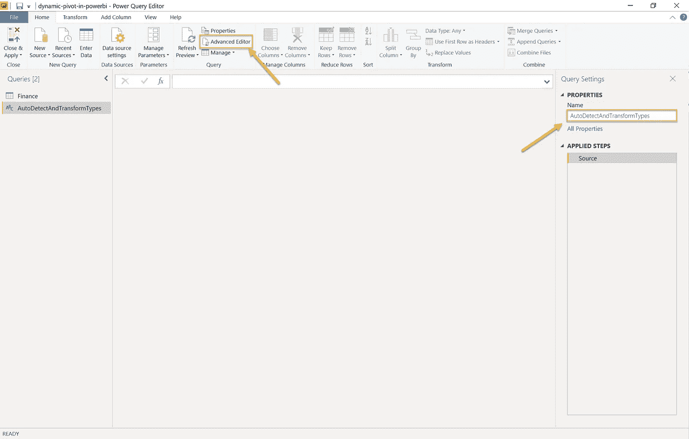

# 是时候改变了(数据)—使用 Pivot 和 Python，借助 Power BI 跟踪您的个人财务状况。

> 原文：<https://towardsdatascience.com/time-to-change-data-track-your-personal-finance-with-power-bi-using-pivot-and-python-5839a6f804e7?source=collection_archive---------5----------------------->

## 采用微软 POWER BI 的数据科学

## 一种使用 python 在 Power BI 中实现完全动态透视的方法，同时还可以享受跟踪个人财务的乐趣

在 Power BI 中学习一些关于 pivot 和 python 的新知识，同时构建一种更好的方法来跟踪您的个人财务状况，这不是很好吗？

如果你想要这个**仪表盘**👇那么这个故事是给你的！


个人财务仪表板

除了有趣的部分，我们还学到了以下内容:

*   如何在 Power BI 中进行透视，同时保持所有列完全动态，使添加新数据变得容易，而无需接触我们的模型。
*   动态检测 Power BI 中的数据类型，并使用自定义函数转换列。
*   在 Power BI 中使用 Python 清理和转换数据。

# 数据

从我的 [Github 库](https://github.com/sebastianzolg/dynamic-pivot-in-powerbi)下载样本数据。

[](https://github.com/sebastianzolg/dynamic-pivot-in-powerbi) [## sebastian zolg/动力枢轴 bi

github.com](https://github.com/sebastianzolg/dynamic-pivot-in-powerbi) 

让我们快速浏览一下我们的数据。

在 Excel 中打开 *personal-spendings.xlsx* 文件，注意它的简单结构。这样做的目的是让你从不同的地方添加数据变得容易，比如你的银行账户或者你正在做的任何项目。


您可以随意添加任意多的细节，但是输入数据要简单，这样跟踪数据就不会太难。我们让权力 BI 为我们做繁重的工作。

# 在枢轴上转动

Pivot 是将我们的数据维度转换为新形式的过程。在我们的例子中，我们希望初始的**类别**作为一个特征矩阵，以**数量**作为值。


将左侧数据集透视到右侧数据集

Power BI 中的 pivot 面临的挑战是在初始建模之后引入新标签(列)所需的工作。

这是因为 Power BI 通过名称静态引用列和其他元素*。这迫使我们每次推出新品类时都要接触我们的模型。我们需要一个解决方案！*

# 构建我们的模型

在 Power BI 中，点击**获取数据，**选择 **Excel** ，点击**连接。**从我的 Github 存储库中打开样本数据，或者选择您自己的数据集。


选择**财务**电子表格，查看数据并点击**转换**。


第一步，我们将列**月**和**年**转换成一个单独的**日期**列。

选择两列并点击**合并列**。


选择**自定义**作为分隔符类型，并使用斜线( **/** )作为分隔符。将列命名为**日期**并点击**确定**按钮。搞定了。


现在是时候将我们的数据转换到目标结构中，其中**类别**成为我们的列，**数量**成为我们的值。


确保您已经选择了**类别**列，然后单击**透视列**。


从数值下拉字段中选择**金额**。如果我们在同一个月有多个条目，我们希望 Power BI 使用 **Sum** 作为聚合函数。

点击**确定**。


结果应该如下面的屏幕所示。


请注意以下三点:

1.  我们有很多无效数据，因为不是每个**类别**都有收益*和*支出。
2.  我们对**支出**类型的值有负数，这可能很难想象。
3.  我们没有每个日期(月)的**总计**栏。

为了满足我们的需求，我们在 Power BI 中使用了一个 Python 脚本。

点击**运行 Python** **脚本**并插入下面的脚本。


让我们分解一下，看看这个 python 脚本为我们做了什么。

首先，我们动态选择数据类型为*编号为*的所有列。这样我们就不用硬引用任何列，并且可以很容易地添加新列。

```
numeric_cols = dataset.select_dtypes(include=np.number).columns
```

接下来，我们用数字 **0** 替换所有的*空值* 。

```
dataset.fillna(0, inplace=True)
```

现在我们已经选择了所有的数字列，我们只需在所有的行上调用`abs()`函数，将所有的负数转换成它的绝对等效值。

```
dataset[numeric_cols] = dataset[numeric_cols].abs()
```

最后，我们对所有行及其数字列进行求和。我们将结果存储在名为 **GrandTotal 的新列中。**

```
dataset['GrandTotal'] = dataset[numeric_cols].sum(axis=1)
```

为了使用结果，我们单击**表**来扩展数据集。


在运行 Python 片段后，Power BI 试图自动检测数据类型，但在这里没有做好。

此外，这一步添加了对命名列的硬引用。

因为我们希望它是完全动态的，我们通过点击 **X** 图标从**应用步骤**面板中移除了**变更类型**步骤。


**等一下！**当我们不能使用 Power BI 类型检测时，我们如何动态地输入数据？我们需要一个函数！

右键点击**查询**面板，选择**新建查询>空白查询**。


首先，我们给新的查询函数起一个好听的名字，比如`AutoDetectAndTransformTypes`。

接下来，我们通过点击**高级编辑器**图标**调出编辑器。**插入下面的脚本，点击**完成**。



***这是怎么回事？*** *这个剧本的灵感来源于* [*这里的*](https://datachant.com/2018/05/14/automatic-detection-of-column-types-in-powerquery/) *。向作者致敬。这篇文章很好地解释了脚本的作用。然而，我介绍了一些简化和另一种类型检测方法。*

*简而言之，脚本检查每一列，并通过检查每个值来推断正确的数据类型。然后，它构建列和数据类型的映射，并将其传递回 Power BI。*

现在我们通过点击公式栏中的 ***fx*** 图标来调用此功能。


***没看到公式栏？*** *转到* ***查看*** *并勾选* ***公式*** ***栏*** *旁边的方框。*

要调用数据集上的函数，请输入下面的公式并点击 enter。

```
= AutoDetectAndTransformTypes(dataset)
```


**搞定！**如您所见，我们的函数运行得非常好，将所有数值转换为类型*十进制数*并将日期字段转换为类型*日期。*

要开始可视化您的数据，点击**关闭&应用**。


# 构建仪表板

现在我们有了如此简单的数据，我们可以轻松地构建一个漂亮的报告。我让你自己去做。

如果您不想自己动手，我会将 Power BI 模板放在我的 Github 存储库中的数据文件旁边。只需克隆整个存储库并从同一个目录中打开*dynamic-pivot-in-power bi . pbit*文件。

由于我们的旋转模型，这都是视觉上的拖放。不需要代码或公式。


# 添加新类别

让我们来看看这一解决方案的强大功能。在 Excel 中打开原始数据，在列表底部引入任何*新的*类别**和**。别忘了**救**它。


回到 Power BI，您唯一需要做的就是刷新数据。

点击**刷新**，选择仪表板上的任何视觉效果，看到新添加的类别自动出现在**字段**列表中。勾选旁边的方框就大功告成了。

当然，这个字段也是**总计**计算的一部分。一切都充满活力。


**就是这样！**你做得很好。

就这样吧。

—塞巴斯蒂安