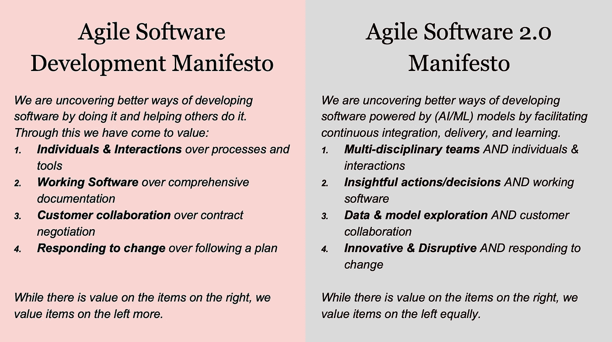
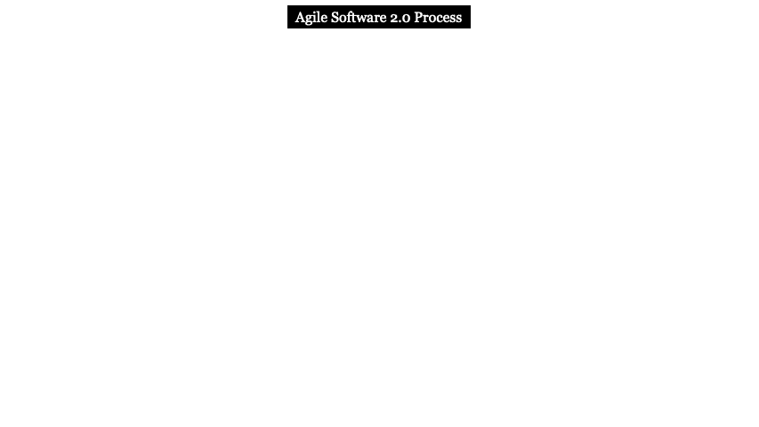

# 是时候将敏捷编程和敏捷数据科学结合起来了

> 原文：<https://towardsdatascience.com/time-to-combine-agile-programming-and-agile-data-science-26df7532b0e9?source=collection_archive---------34----------------------->

## [数据科学家来自火星，软件工程师来自金星(第五部分)](https://towardsdatascience.com/tagged/modeling)

## 敏捷软件 2.0 宣言和过程

来源:照片由[罗伯特·科林斯](https://unsplash.com/@robbie36?utm_source=unsplash&utm_medium=referral&utm_content=creditCopyText)在 [Unsplash](https://unsplash.com/s/photos/agile?utm_source=unsplash&utm_medium=referral&utm_content=creditCopyText) 上拍摄

在本系列的第 1 部分中，我们研究了软件和模型之间的主要区别；在 [Part 2](/consequences-of-mistaking-models-for-software-94d813f115f5) 中，我们探讨了将模型与软件混为一谈的十二个陷阱；在[第 3 部分](/model-evolution-from-standalone-models-to-model-factory-5a8e01fa03cb)中，我们看了模型的进化；在[第 4 部分](/model-lifecycle-from-ideas-to-value-14e654b7d4a4)中，我们经历了模型生命周期。现在，在本系列的最后一部分，我们将讨论模型生命周期和敏捷软件开发方法应该如何结合在一起。

基于我们之前的讨论，我们主要关心的是模型生命周期过程——及其迭代的价值发现、价值交付和价值管理——如何能够*与传统的敏捷软件开发方法相结合。本文的重点是这两种方法的结合；关于使数据科学或模型生命周期敏捷，这是 ***而不是*** 。模型生命周期过程本身是迭代的和敏捷的。*

# *敏捷的历史*

*敏捷的根源可以追溯到 20 世纪 30 年代的敏捷制造。在他们关于“[敏捷创新的秘史](https://hbr.org/2016/04/the-secret-history-of-agile-innovation)”的文章中，作者——[达雷尔·里格比](https://hbr.org/search?term=darrell%20k.%20rigby)、[杰夫·萨瑟兰](https://hbr.org/search?term=jeff%20sutherland)和[竹内广孝](https://hbr.org/search?term=hirotaka%20takeuchi)——注意到了这一历史背景。*

> *一些人将敏捷方法追溯到弗朗西斯·培根在 1620 年对科学方法的阐述。更合理的起点可能是 20 世纪 30 年代，当时贝尔实验室的物理学家和统计学家沃尔特·休哈特(Walter Shewhart)开始将计划-实践-研究-行动(PDSA)循环应用于产品和流程的改进。休哈特将这种迭代和增量开发方法教给了他的学生 W. Edwards Deming，后者在二战后的几年里在日本广泛使用了这种方法。*

*软件中敏捷性概念的早期应用之一(例如，它的持续和迭代性质)可以追溯到 20 世纪 50 年代。根据专家 Craig Larman 和 Victor Basili 的说法，早在 1957 年，IBM 服务局公司的 Gerald Weinberg 和 Bernie Dimsdale 就在洛杉矶进行增量软件开发。然而，敏捷的诞生通常归功于 2001 年犹他州雪鸟的一次会议。以下引自《大西洋月刊》的一篇文章抓住了这一诞生的精神:*

> *但正是在这里，一群软件反叛者聚集在一个滑雪胜地的白雪皑皑的群山中，于 2001 年起草并签署了该行业历史上最重要的文件之一，这是编码集的一种独立宣言。这个为期三天的小型务虚会将有助于塑造大部分软件的想象、创建和交付方式——或许还有世界的运行方式。*

*正是在这个地方，[敏捷宣言](https://www.agilealliance.org/agile101/the-agile-manifesto/)和[敏捷十二原则](https://www.agilealliance.org/agile101/12-principles-behind-the-agile-manifesto/)诞生了。详细研究敏捷宣言是值得的，这样我们就可以为敏捷数据科学开发另一个宣言。*

# *敏捷软件开发宣言*

*敏捷软件开发宣言由四个关键陈述组成:*

1.  *过程和工具之上的个人和交互*
2.  *综合文档之上的工作软件*
3.  *合同谈判中的客户协作*
4.  *响应变化而不是遵循计划*

*该文档继续指出*虽然右边的项目有价值，但我们更重视左边的项目*。因此，敏捷思维是对当时现有最佳实践的补充，而不是替代。有时候，敏捷被用作不提供全面的文档或没有架构设计或开发计划的借口。讽刺的是，敏捷本身已经变得更像一个过程和方法，而不是关注个人和他们的互动。*

# *敏捷数据科学宣言*

*在他 2013 年关于敏捷数据科学的第一本书和 2017 年名为[敏捷数据科学 2.0](https://medium.com/dataseries/book-summary-agile-data-science-2-0-f008c6bcfaa7) 的修订版中，Russell Jurney 展示了如何构建一个数据平台来构建、部署和完善分析应用。他将敏捷数据科学的目标定义如下:*

> *敏捷数据科学流程的目标是记录、促进和指导探索性数据分析，以发现并遵循*关键路径*获得引人注目的分析产品。*

*然后，他根据以下七条原则组织了他的*敏捷数据科学宣言*。*

> *1.迭代，迭代，迭代:表格，图表，报告，预测。*
> 
> *2.船舶中间输出。即使失败的实验也有产出。*
> 
> *3.执行任务的原型实验。*
> 
> *4.在产品管理中整合数据的专制观点。*
> 
> *5.当我们工作时，在数据价值金字塔上爬上爬下。*
> 
> *6.发现并追求通向杀手级产品的关键路径。*
> 
> *7.获取 meta。描述过程，而不仅仅是结束状态。*

*这些原则针对的是我们在之前的[文章](/data-scientists-are-from-mars-and-software-developers-are-from-venus-part-1-8dde19fb2eef)中概述的软件和模型之间的一些关键差异——主要是以实验为中心的开发过程和基于使用数据的归纳的推理机制。*

*在我们看来，这份敏捷数据科学宣言遗漏了一些关键发展:*

*   ***数据产品与模型:**重点是以敏捷的方式用 web 前端构建(大)数据产品。宣言中缺少持续和迭代的[价值发现、价值交付和价值管理](/model-lifecycle-from-ideas-to-value-14e654b7d4a4)的丰富内容。*
*   ***数据科学家 vs 跨学科团队:**正如我们之前讨论过的，模型生命周期管理正在从预测即服务转向模型工厂，这导致了新角色的出现，如 ML 工程师、模型操作和数据操作专家。这需要更多地关注跨学科团队。*
*   ***应对变化与颠覆:**敏捷数据科学宣言更关注应对变化，而不是用创新产品颠覆市场。*

*现在，我们来看看如何将敏捷软件开发和数据科学宣言结合到我们所谓的敏捷软件 2.0 宣言中。*

# *敏捷软件 2.0 宣言*

*特斯拉人工智能高级总监安德烈·卡帕西(Andrej Karpathy)介绍了术语[软件 2.0](https://medium.com/@karpathy/software-2-0-a64152b37c35) ，并将其与传统编程进行了对比，他称之为软件 1.0。具体来说，他说:*

> ***软件 1.0** 的“经典栈”是我们都很熟悉的——它是用 Python、C++等语言编写的。它由程序员写给计算机的明确指令组成。通过编写每一行代码，程序员用一些期望的行为来识别程序空间中的特定点。*
> 
> *相比之下，**软件 2.0** 可以用更抽象、对人类不友好的语言编写，比如神经网络的权重。没有人参与编写这段代码，因为有很多权重(典型的网络可能有几百万)，直接用权重编码有点困难(我试过)。*

*虽然 Karpathy 仅将软件 2.0 一词用于使用机器学习和深度学习开发的系统，但很明显，在可预见的未来，我们将需要软件开发的 1.0 和 2.0 版本共存。因此，我们应该将敏捷软件开发的关键价值与敏捷模型开发结合起来。我们认为这一联合宣言的目标如下:*

*通过促进(数据、软件和模型的)持续集成、交付和(机器)学习，我们正在发现开发由(AI/ML)模型驱动的软件的更好方法。*

*将敏捷软件开发宣言扩展为敏捷软件 2.0 宣言，我们有以下四个基本价值观:*

1.  ***多学科团队和个人&互动:**当我们将传统软件 1.0(例如，传统编程)与软件 2.0(例如，机器学习或更一般的模型构建)相结合时，我们正在将数据、软件和[模型生命周期](/model-lifecycle-from-ideas-to-value-14e654b7d4a4)相结合。这要求我们关注来自数据、软件和数据科学的多学科团队，包括业务分析师、数据分析师、架构师、软件开发人员、数据科学家、ML 工程师、DevSecOps、MLOps 或 ModelOps 以及 AI ethicists 没有一个人能够拥有所有这些能力，而且这些人也不仅仅来自一个学科；它们需要是由生命周期中的阶段决定的多学科。*
2.  ***有洞察力的行动和决策以及工作软件:**传统的敏捷软件开发加速了有用的工作软件的时间线，通常被称为最小可行产品(MVP)。然而，在这个敏捷软件周期中强制进行数据探索和模型构建通常会导致简单的描述性分析，而没有洞察力或预测性或规范性模型。模型构建或数据科学敏捷周期需要从软件敏捷周期中分离出来(如下所述),以便产生同样有洞察力的工作软件。*
3.  ***数据&模型探索和客户协作:**敏捷软件开发强调客户协作，因为传统的瀑布方法过度索引了从客户收集需求、设计软件、构建和测试。软件 2.0 带来了数据和模型，为这个等式增加了一个维度。客户可能无法总是清楚地表达他们的偏好或原因，或者他们为什么做出某些决定。拥有“数据讲述故事”和“模型展现数据本质”的能力对于软件 2.0 至关重要。*
4.  ***创新&颠覆性和响应变化:**敏捷软件开发非常善于响应变化——尤其是客户要求的变化。根据我们的经验，软件开发的短迭代周期(即 sprints)通常会导致功能的增量改进，但不会通过使用可用的数据和从模型中获得的洞察力来为创新和破坏提供足够的机会。*

**

*图 1:敏捷软件开发宣言(来源:[Agilemanifesto.org](https://www.agilealliance.org/agile101/the-agile-manifesto/))和敏捷软件 2.0 宣言*

*在讨论了敏捷软件 2.0 宣言之后，我将详细讨论如何将敏捷软件开发生命周期与模型开发生命周期结合起来，这在我之前的[文章](/model-lifecycle-from-ideas-to-value-14e654b7d4a4)中已经讨论过了。*

# *集成的敏捷软件 2.0 流程*

*考虑到软件和模型之间的根本差异——以及上面敏捷软件 2.0 宣言中提到的原因——我们需要在时间方面将传统的敏捷软件冲刺与模型生命周期分开。同时，我们不希望将它们作为两个独立且不同的敏捷周期来运行，因为这将阻止我们实现传统软件和模型的全部好处。那么，解决办法是什么呢？*

*一个解决方案包括交错 sprint 周期，并为软件 sprint 和模型 sprint 提供单独的时钟。在这个交错的过程中，有几个关键的交互点值得详细说明:*

1.  ***产品启动/积压:**在产品的启动阶段，尤其是结合了传统软件和模型的产品，软件、数据和建模团队需要一起决定客户想要的关键功能、可用的数据、需要产生的潜在见解或需要测试的假设，以及产品的关键差异化因素。一旦完成了这些，软件和建模团队就可以独立地执行他们的冲刺了。软件团队可以通过他们的标准 sprint 过程，而建模团队使用数据和模型进行探索和实验，正如我们在模型生命周期中的 ***价值交付循环*** 所描述的那样。*
2.  ***Sprint Backlog:** 当建模团队已经验证了假设并生成了洞察之后，被测试的模型和数据管道被放入 Sprint Backlog 中。当软件团队完成了它的标准冲刺后，它会将测试过的模型合并到软件的当前版本中。在这一步，软件开发人员、数据工程师、ML 工程师和数据科学家必须合作调整模型并大规模部署它们。*
3.  ***完成的工作和价值交付:**这个软件和模型集成 sprint 然后产生一个软件，它有一个准备好部署的嵌入式模型。在这个集成冲刺的最后，模型被部署到生产环境中，价值交付过程开始了。与传统软件不同，在传统软件中，软件可以进入操作阶段，对于具有嵌入式模型的软件，我们需要经历价值交付阶段，以确认模型仍然按照生产环境中的要求执行。一旦完成，集成模型就可以进入价值管理流程。*

**

*图 2:敏捷软件 2.0 过程*

*总之，敏捷软件 2.0 需要整合来自敏捷软件开发和敏捷数据科学的领先敏捷方法，以帮助希望部署嵌入 AI/ML 模型的软件的客户获得投资回报。*

*数据、软件和 AI/ML 模型的融合才刚刚开始。广泛的软件工程、软件开发和维护方法对于 AI/ML 模型来说是不存在的。最佳实践刚刚出现，未来十年将会看到该领域更多的学术和行业进步。我们以声称数据科学家来自火星，软件开发人员来自金星开始这个系列。在过去的几年里，这些学科逐渐融合在一起。这个由五部分组成的系列只是软件开发人员和 AI/ML 建模人员关注的主要领域的开始。*