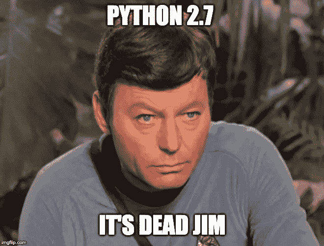

# 是时候做出改变了

> 原文：<https://towardsdatascience.com/time-to-make-the-switch-9eb719d434de?source=collection_archive---------3----------------------->

## 将 MacOS 默认值从 Python 2 升级到 Python 3



2020 年正在如火如荼地进行中，如果你还没有这样做的话，是时候更换你的默认 python 了。自 1 月 1 日起，Python 2.7 的维护已经停止。这意味着您当前版本的 python 现在是遗留代码！虽然在您的系统上保留一个版本的 Python 2 对于旧的脚本来说仍然很方便，但是现在是时候更新您的系统了。在本简报中，我们将下载 Python 3，将其设为默认，并将 Python 2 存储为别名。现在开始，让我们探索一下当前的 Python 环境。


来源 [XKCD](https://xkcd.com/1987/)

要找到我们的默认 Python 在系统中的位置，只需输入:

```
which python
```

这将向您显示默认 Python 的路径。如果您像我一样在/usr/local/bin 系统之外有一个默认的 Python，这可能会提供一些信息。我的默认 Python 是 Anaconda 发行版的一部分。要查看如何更改 Anaconda 发行版中的默认 Python，请向下滚动一点，越过默认方法。

## 默认 MacOS 系统

要查看 Python 的当前版本，只需输入:

```
python --version
```

我现在的版本是 2.7.15。要改变 MacOS 上的默认版本，我们可以从【https://www.python.org/downloads/mac-osx/】[Python 下载页面](https://www.python.org/downloads/mac-osx/)()下载最新的安装程序开始。下载安装程序会将新版本插入/usr/local/bin。在更改默认 Python 之前，让我们将旧的 python2 版本链接到 Python 2 命令。

```
echo "alias python2=/usr/local/bin/python2.7" >> ~/.bashrc
```

别名“python2”意味着当我们键入命令时，默认的 python 版本将是我们的 Python 2 发行版。现在让我们为新的 Python 3 创建一个别名。

```
echo "alias python=/usr/local/bin/python3.8" >> ~/.bashrc
```

应该可以了。这种方法的局限性在于，如果您想要更新 Python 版本，则必须手动重置别名。这意味着对于 Python 3.9，您必须重新执行之前的命令。

## 使用 Anaconda Base 升级

我的系统使用除 Anaconda 之外的默认 Python 发行版。要更改默认 Python 版本，只需输入:

```
conda install python=3.8.1
```

这将安装 Python 3.8.1。要在 Anaconda 上查看所有可用的 Python 版本，只需输入:

```
conda search python
```

安装较新版本的 Python 可能需要几分钟时间，并且额外的冲突解决方案是您之前下载的包可能与较新版本的 Python 不兼容。

你有它！一个简单的更新 Python 默认值的步骤，这样你就可以为这十年做好准备了！我叫科迪·格利克曼，你可以在 LinkedIn 上找到我。