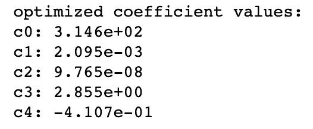
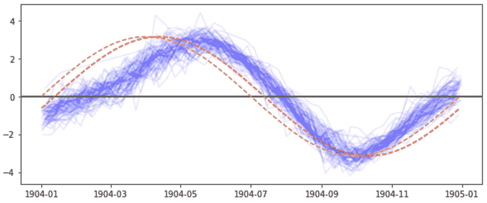

# 利用数据科学了解气候变化:大气 CO2 水平(基林曲线)——模型拟合和时间序列分析

> 原文：<https://towardsdatascience.com/timeseries-data-science-curve-fitting-pandas-numpy-scipy-b0cd938ecb59?source=collection_archive---------30----------------------->

# TL；博士:

## 也称为“执行摘要”

欢迎光临！本文是**数据科学的一个完整项目。**本文涵盖了 **1)数据准备 2)建模、**和 **3)模型评估**的领域。这个项目着眼于一个**时间驱动的季节性数据集**，我们将与**熊猫**库合作。对于建模和拟合，我们使用 **Numpy 的 polyfit** 和 **Scipy 的 optimize** 库。我将带你经历提出和构建模型的思维过程，以及如何验证它们。

对于更高级的读者，我将在另一篇文章中讨论如何通过 **PyStan** (斯坦的**Python 实现)使用**蒙特卡罗方法**对同一数据集执行**预测分析**。**

你可以在这里找到完整的代码。

# 背景

## 斯克里普斯二氧化碳项目

该项目基于自 1958 年以来在夏威夷莫纳罗亚天文台收集的二氧化碳浓度数据。该数据集由**斯克里普斯海洋研究所**编制，因此被称为 [**斯克里普斯二氧化碳数据集**](https://scrippsco2.ucsd.edu/) 。这是迄今为止最全面和最一致的科学测量之一，自 20 世纪 70 年代以来，美国国家海洋和大气管理局(NOAA)的 GMD 计划一直在努力扩大这一测量。


从 1980 年到 2010 年的月平均大气 CO2 浓度([来源](https://scrippsco2.ucsd.edu/research/atmospheric_co2.html))

## 龙骨曲线

数据集的结果曲线被命名为 [**基林曲线**](https://en.wikipedia.org/wiki/Keeling_Curve) ，以纪念启动监测程序的科学家**查理斯·大卫·基林**。基林曲线显示了二氧化碳浓度的平均增长(~ 2 ppmv/年)，并且是温室气体如何导致气候变化的最权威的证据之一。基林曲线有助于识别二氧化碳的季节变化、自然和人类活动之间的相互作用以及现代工业时代二氧化碳浓度的加速。

# 数据准备

## 数据下载

您可以直接从 Scripps 程序主页下载数据。csv 格式:[https://Scripps CO2 . ucsd . edu/data/atmospheric _ CO2/primary _ mlo _ CO2 _ record . html](https://scrippsco2.ucsd.edu/data/atmospheric_co2/primary_mlo_co2_record.html)。在我们的调查中，我们将使用文件名为“weekly _ in-situ _ co2 _ mlo . CSV”的**每周原位 CO2 数据集**。请注意，**默认的**原位 CO2 数据是**每月**——因此请确保您下载的是正确的文件。

**数据的前 44 行**是关于文件的**信息**，应该在导入 Python 之前丢弃。**第一列**表示记录的**日期**，格式为“yyyy/mm/dd”。**第二列**表示**大气 CO2 浓度**，单位为百万分率(ppm)。

## 数据导入

我们将使用熊猫图书馆来存放我们的数据。对于那些不熟悉熊猫的人来说，这是一个让你用一堆有用的特性创建数据框架的库。如果你正在进入**数据科学**领域，你会经常用到它！

```
df = pd.read_csv('weekly_in_situ_co2_mlo.csv',names=['date','CO2 ppm'])
print('Dataframe has **%d** data points of **%d** features'
      %(df.shape[0],df.shape[1]))df.head()
```


数据的输出(。csv 文件)导入。

## 将日期列转换为“日期时间”格式

当前日期采用**字符串**格式。我们将其更改为 **datetime** 对象，这样 Python 就可以识别出时间线上的数据点。熊猫对此有一个函数叫做“**到 _datetime** ”

```
df['date'] = pd.to_datetime(df['date'],format='%Y/%m/**%d**')
df.head()
```


将“日期”列更改为日期时间后的输出

## 创建“天”列

虽然 date 列用于将数据绘制成时间序列，但它对我们的建模步骤用处不大。为对应于第一天之后 N 天的**的数据创建一个新参数会提供更多信息。至少，它使我们的**模型参数易于解释**。**

```
*# take the first row as the start date* epoch = df['date'][0]*# take integer values of the days from epoch* df['days'] = (df['date']-epoch).dt.daysdf.head()
```


添加要在我们的模型中使用的“days”列的输出。请注意,“天数”列将用于查找模型的参数，而“日期”列将用于绘图。

## 数据观察

数据科学的第一步是调查数据的一般形式(如果可能的话)。这将使我们能够确定用于建模的宏观趋势。


未经编辑的原始数据

在宏观的一瞥之后，对数据进行一些细微的观察也是值得的。对于这个数据集，我将始终查看数据集的第一年、前三年、最后三年和最后一年。


数据集两侧的 1 年和 3 年数据图。

从这两个观察中，我们看到有一个**增加的基数趋势**和一个**波动的季节性趋势**。这两种趋势是您将在时间驱动的数据集中看到的典型趋势，尤其是关于**自然观测**的数据集。

# 建模和评估

## 建模

对数据建模是一种尝试，旨在识别生成数据的不同力量。建模可以通过科学调查或从数据中推断来完成。

如果你意识到一些创造数据的基本力量，通过科学调查建模是可能的。有限资源环境中的人口增长，例如病毒在有限人口中的传播，是一个已经在数学中广泛建模的问题。虽然这些数学模型无法解释数据中的所有变化，但它们可以提供塑造模型的关键方向，并且更适用于类似的场景(例如，具有不同初始点的类似环境)。

**推断建模**是针对数据中的变化进行的，当你不知道这些变化是如何产生的时候。推理建模仅限于指数或正弦曲线的基本集合，因为复杂的多项式函数往往会过度拟合数据，并且具有有限的可推广性。

## 估价

可以通过视觉和数字两种方式进行评估。**目视评估**可通过目视检查模型生成数据与实际数据来进行。当差异较大或数据中有**未说明的趋势**时，目视检查非常有用。重要的是从建模数据中创建**相关图表**，以查看**剩余数据**是否显示其他趋势。然后，可以通过添加额外的数学模型来解释这些数据。

**数值评估**通常采用 **R 平方值**的形式。r 平方值显示预测(或回归)解释的原始数据方差的百分比。接近 1.00 的 R 平方值更好(有可能过度拟合数据)，而接近 0 的值更差。(负的 R 平方值也是可能的，但是我们在这里不考虑这个概念。)R 平方值本身并不能揭示无法解释的方差在哪里。噪声引起的方差是不可分辨的，而缺少建模引起的方差是可以改善的。

# 模型# I——线性基本趋势

## 线性基本趋势建模

最明显的基本趋势是线性趋势。由于我们还没有考虑季节变化，所以整个模型是一个带有两个参数的**多项式**——零阶和一阶系数。

Numpy (np)的 Polyfit 库允许我们对数据进行多项式拟合。然后，我们可以使用输出系数值为我们拥有的每个数据点创建**合成数据**(即，为我们拥有的每个 x 点绘制相应的 y 点)。

```
coeffs = np.polyfit(df['days'],df['CO2 ppm'],deg=1)
print('Data has a linear trend**\n\**
1st deg coeff: **%.3e** (slope)**\n\**
0th deg coeff: **%.3e** (intercept)'
     %(coeffs[0],coeffs[1]))

df['linear trend'] = df['days']*coeffs[0]+coeffs[1]
df['relative ppm (lin)'] = df['CO2 ppm']-df['linear trend']
```


线性基本趋势的拟合参数值。

## 线性基本趋势评估

我们首先从模型的外观检查开始。**将建模数据叠加到原始数据上**显示，我们的线性模型确定了多年来的持续增长。


我们拟合的线性趋势叠加在原始数据之上

现在，我们观察在解释了线性趋势的变化后，数据看起来是什么样的。这是通过简单地从原始数据中减去模型数据来实现的。在代码中，这存储在一个名为**‘相对 ppm(Lin)’的新列中。**


线性趋势无法解释的其余变化。

从这个相对图中我们可以观察到两件事。**首先，在剩余的数据中有明显的减少和增加(月牙形)。**这表明数据的增长率平均先降低后升高，与线性趋势假设的恒定增长率相反。**其次，数据有明显的季节性**。这是显而易见的，因为我们还没有在我们的模型中实现季节性趋势，因此季节性仍然无法解释。请注意，当考虑到宏观水平的增长时，可以更好地观察到季节性趋势的**幅度**。

使用**数值分析**使用 **r 平方**，我们发现数据中 97.7%的变化可以用简单的线性趋势来解释。

# 模型#2 —二次基本趋势

## 二次基趋势建模

虽然使用高次多项式通常会因其过度拟合和缺乏可推广性而受到反对，但**二次多项式**，也称为二次函数，被广泛认为是合理的基本趋势。

像线性基本趋势一样，我们使用 Numpy 的 polyfit 库来拟合我们的数据的三个参数。

```
coeffs = np.polyfit(df['days'],df['CO2 ppm'],deg=2)
print('Data has a quadratic trend**\n\**
2nd deg coeff: **%.3e** (quad term)**\n\**
1st deg coeff: **%.3e** (slope)**\n\**
0th deg coeff: **%.3e** (intercept)'
     %(coeffs[0],coeffs[1],coeffs[2]))

df['quad trend'] = df['days']**2*coeffs[0]+df['days']*coeffs[1]+coeffs[2]
df['relative ppm (quad)'] = df['CO2 ppm']-df['quad trend']
```


二次基本趋势的拟合参数值。

## 二次基本趋势评估

同样，我们试图通过将趋势叠加到我们的数据上来进行**视觉评估**。


拟合的二次趋势叠加在原始数据之上。

我们立即看到，二次基趋势是一个比线性趋势好得多的宏观趋势。我们再次将**剩余变化**绘制到基本趋势上，以识别任何未解释的变化。


二次趋势无法解释的其余变化。

我们看到，以前的(线性)模型的新月形变化现在在新的(二次)模型下得到解释。似乎还有一些更高层次的变异，但现阶段很难直观观察到。

看一下**的 r 平方值**，我们现在看到 99.4%的变化现在被模型解释了——比以前的模型增加了 1.7 个百分点。

# 模型# 3——二次基数和正弦季节趋势

## 二次+正弦趋势建模

既然我们对**的基本趋势**有些满意，我们可以开始处理**的季节性趋势**。对于这个模型，我们实现了一个**正弦曲线**作为我们的季节因素。

基本趋势的参数仍然是二阶多项式函数的**三个系数。一条**一般正弦曲线**也有**三个系数** : **(1)振幅，(2)频率**，和 **(3)相位**。**

这就是我们可以利用我们的科学调查的地方。我们可以预测每年的季节性变化**。虽然这可能不准确，但我们仍然可以测试假设并观察性能。当我们能够**减少拟合参数**的数量时，它也为我们节省了大量的计算能力并增加了末端拟合的精度。因为我们的时间是以天为单位的，所以我们可以将频率参数取为 1/365.25，因为每年有 365.25 天。(如果你不知道. 25 的出处，查“闰年”)**

**由于我们的模型不再是一个**多项式**，我们不能使用 **Numpy 的 Polyfit** 库。相反，我们使用 **Scipy 的优化**模块来找到五个(之前是六个)参数的拟合值。**

```
**def** test_func(t,c0,c1,c2,c3,c4):
    **return** c0+c1*t+c2*t**2+c3*np.cos(2*math.pi*f_year*t+c4)
coeffs, coeffs_covariance = optimize.curve_fit(test_func,df['days'],df['CO2 ppm'])

print('optimized coefficient values:')
**for** i **in** range(5):
    print('c**%d**: **%.3e**'%(i,coeffs[i]))

df['quad+sin trend'] = coeffs[0] + coeffs[1]*df['days'] +\
                        coeffs[2]*df['days']**2 +\
                        coeffs[3]*np.cos(2*math.pi*f_year*df['days']+coeffs[4])
df['relative ppm (quad+sin)'] = df['CO2 ppm']-df['quad+sin trend']
```

****

**拟合的参数值。请注意，与 Numpy 的 polyfit 库不同，scipy.optimize 要求您显式声明一个函数来拟合数据。**

## **二次+正弦趋势评估**

****

**我们的模型在整个数据期间以及第一年和最后五年的原始数据集上的叠加。**

****目视检查**显示我们的组合模型与我们的数据非常吻合。 **r 平方值**告诉我们，我们现在已经解释了来自五个参数的数据变化的 **99.9%** (具体地说，99.8783%)。我们看到，正弦模型的增加使我们的模型的解释能力提高了 0.5 个百分点。**

**我们应该满足于这 99.9%的解释吗？这就是我们需要警惕过度拟合的地方。任何数据集，只要加入足够多的参数，都可以 100%“解释”。(从技术上来说，任何大小为 N 的数据集都可以通过使用具有 N 个参数的多项式进行 100%匹配)仅使用 **5 个参数**，现在就对一个**3000+数据点**数据集进行过度拟合还为时过早。决定归结为剩余的方差是来自**噪声**，我们不应该**过度拟合**，还是来自**模式**，我们希望将其合并到模型中。这就是为什么我们总是需要查看**剩余变化**并观察是否存在我们可以建模的模式。**

****

**二次+正弦模型预测后的剩余变化。**

**观察**整个时标**的剩余变化，我们首先看到变化的**幅度**已经显著降低。在线性基础模型中，**最大变化**(数据最高点和最低点之间的差异)约为 17 ppm，在二次基础模型中为 11 ppm。现在，考虑到正弦季节性，最大变化仅为 6 ppm。我们还看到两个 30 年长的新月形，但是它们的偏斜度很难识别。**

****

**第一年和最后一年绘制的剩余变化。**

**在**多年时间尺度**上，我们看到仍然有一些**周期变化**大约 **6 个月长度**。放大到**年尺度**，我们看到低谷出现在每年的 4 月和 10 月左右，高峰出现在 1 月和 7 月。这些**半年波动**的**振幅**约为 **2.5 ppm** ，其中心在宏观尺度上移动。**

# **奖金——研究正弦不对称**

**虽然我们的基本趋势是一年(365.25 天)，但我们无法解释的变化的周期是 6 个月，即我们正弦周期的一半。这似乎表明我们的**年度正弦季节性**周期性地抵消我们的数据。**

**我们可以调查**这种偏移是如何发生的，方法是将我们的所有数据**逐月叠加**，并查看它与我们模型中使用的正弦季节性相比如何。****

**为了实现这一点，我们首先**将年度差异**移至我们的“日期”栏。这确保了我们所有的**数据将绘制在 x 轴**的同一线段上。在我的代码中，我通过将年份部分重置为 1904 来实现这一点。这与完全删除年份部分略有不同，默认情况下，这将使用 1900 年的“datetime”类纪元年份。这不适用于我们的情况，因为我们的一个数据点有闰日(2 月 29 日)，1900 年不是闰年(1904 年是)。**

**其次，我们需要根据我们在线性和二次基本趋势中看到的每年的**平均值增长**进行调整。这确保了我们所有的**数据将被绘制在 y 轴**的同一范围内。在我的代码中，我通过从每年的数据值中减去每年的平均数据值来实现这一点。这意味着我的绘图将以 y=0 线为中心。**

```
*# the list of years represented in the dataset*
dfYears = range(df.iloc[0]['date'].year,df.iloc[-1]['date'].year+1)
**for** year **in** dfYears:
    dfYear = df[df['date'].dt.year == year]
    *## there's 1992-02-29 in the dataset*
    *## and the "epoch" year in the datetime module (1900)*
    *## is NOT a leap year*
    monthDays = [datetime.strptime('1904-'+str(date.month)+'-'+str(date.day), '%Y-%m-**%d**')
                 **for** date **in** dfYear['date']]
    plt.plot(monthDays,dfYear['CO2 ppm']-np.mean(dfYear['CO2 ppm']),
             color='b',alpha=0.1)
```

**最后，我们在聚合图上绘制正弦曲线，以验证我们的假设。为了比较，我在黄色虚线中加入了一个非相移正弦图(从 0 开始到结束)。我用眼睛标记了一个相移，它的图形用橙色虚线表示。**

****

**每年绘制的大气 CO2 汇总数据图，并以绝对高度归一化(蓝色，不透明度=0.1)**

**在此，我们确定**数据的季节性**实际上是**与**正弦曲线**略有出入**。数据值从谷到峰的**增加**是**非常缓慢的**——总计耗时 **8 个月**。另一方面，数据值的**下降**，只需要 **4 个月**。这解释了当数据**的增长速度比我们的模型**慢并且**的下降速度比我们的模型**快时 **6 个月**与模型的差异。**

**如果你真的去查阅斯克里普斯项目网站上的文件和出版物[，你会发现一个解释，解释了大气 CO2 的增减循环中的这种**不对称性。**](https://scrippsco2.ucsd.edu/publications/scientific_literature.html)**[简而言之](https://en.wikipedia.org/wiki/Keeling_Curve#Results_and_interpretation)，大气 CO2 的**减少**来自夏季**植被的生长**，因为植物消耗 CO2 并排出 O2。由于大部分地块集中在**北半球**，本次夏季从**5 月持续至**9 月，为期 4 个月。CO2 水平变化在大气中的反映延迟约 1 个月，实际下降周期为**6 月(高峰)至 10 月(低谷)**。****

# **下一步是什么？**

**首先，祝贺你走到这一步！现在，您已经了解了为**时间序列数据建立模型的基本思维过程。**在数据科学方面，你也使用了三个 Python 包——熊猫(数据结构)、Numpy 和 Scipy。Numpy 和 Scipy 都广泛用于**数学计算**，Scipy 为**线性代数**函数提供了更全面的能力。如果你是一个刚进入数据科学领域的学生，你会看到这些软件包更多！**

**具体来说，关于这个项目，你可以关闭这一章满意地解决了 99.9%的变化在一个数据集重要的人类；或者尝试对该变化进行甚至更大的定址(诸如微调该正弦曲线以更好地拟合该增大-减小不对称性)；或者尝试数据外测试(即投影)，以查看模型在数据集中的时间序列中的表现。关于最后一点，我写了一篇单独的文章，使用**蒙特卡罗方法**来确定模型的投影边界，并通过 **PyStan** 库实现。**