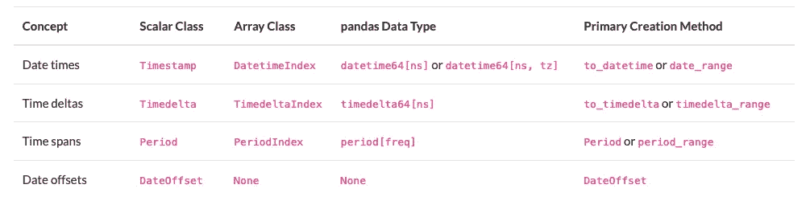
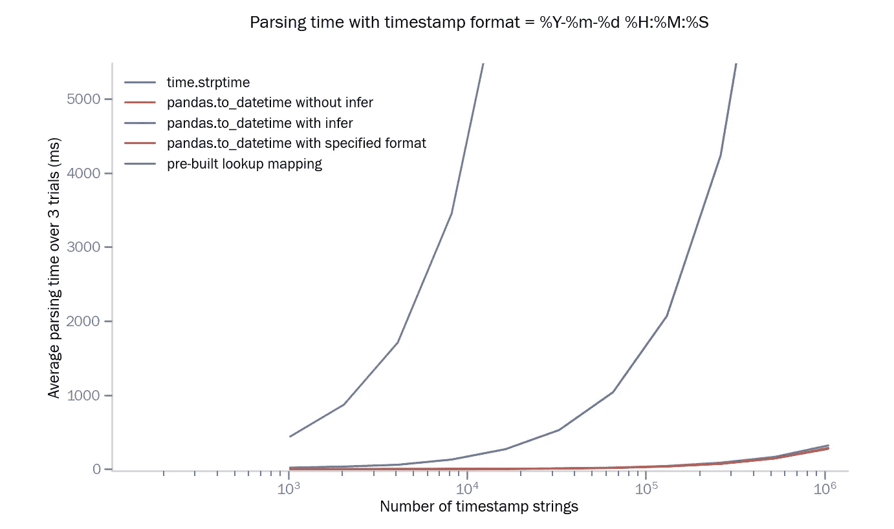
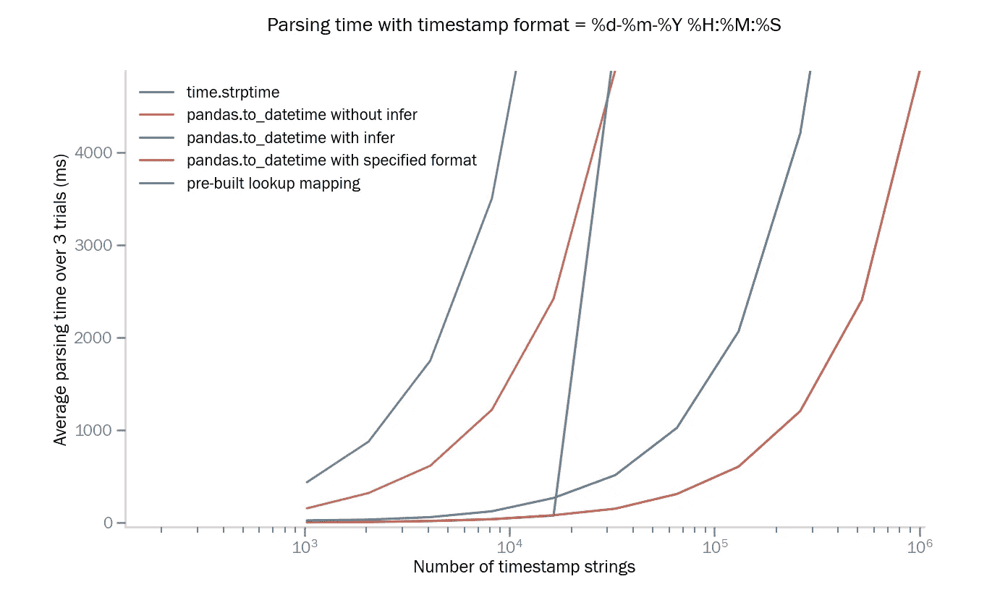
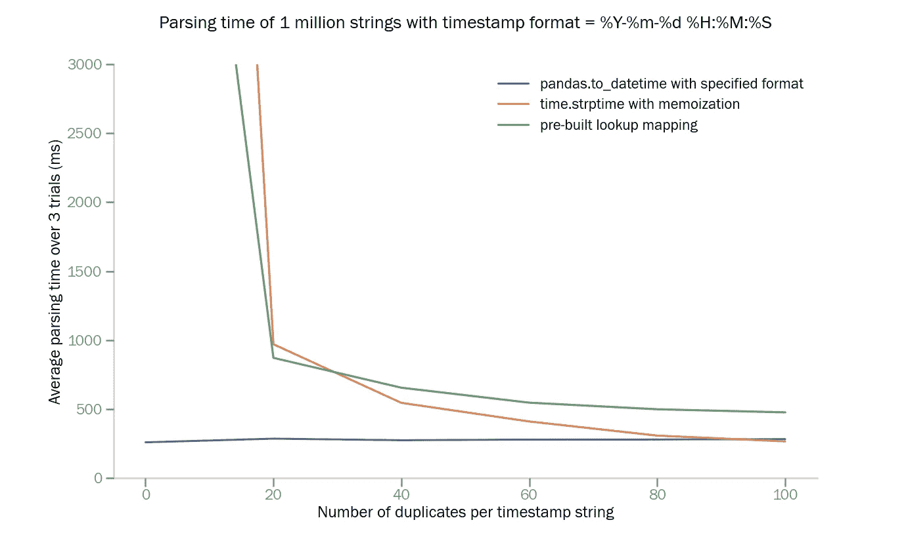
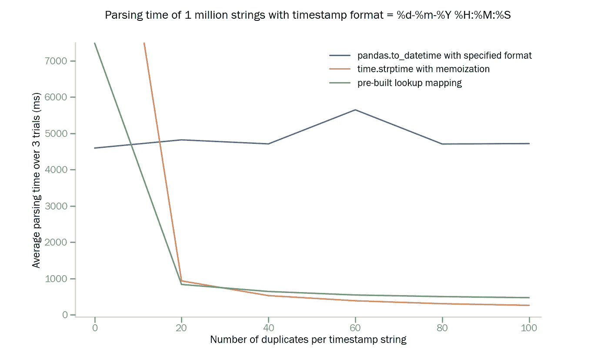
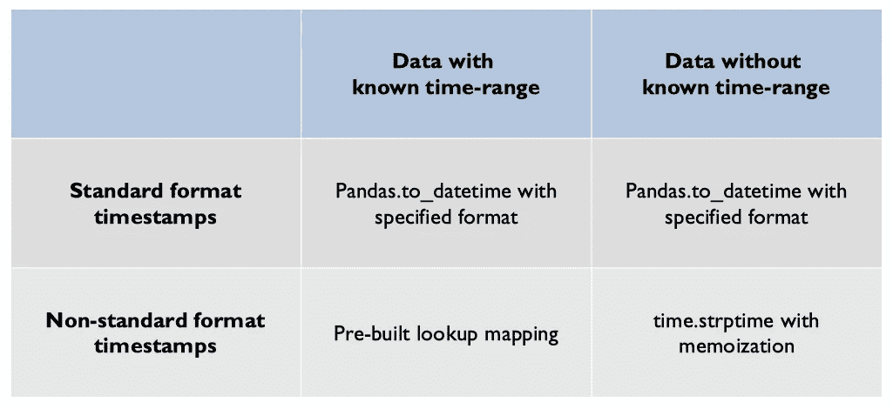

# 用 Pandas 和 Python 进行时间序列数据分析的时间戳解析

> 原文：<https://towardsdatascience.com/timestamp-parsing-with-python-ec185536bcfc?source=collection_archive---------11----------------------->

## [入门](https://towardsdatascience.com/tagged/getting-started)

由[卢克·切瑟](https://unsplash.com/@lukechesser?utm_source=medium&utm_medium=referral)在 [Unsplash](https://unsplash.com?utm_source=medium&utm_medium=referral) 上拍摄的照片

> **TL；Pandas 为解析时间戳格式提供了很大的灵活性。但是**灵活性是以性能为代价的**。在处理标准格式的时间戳时，这仍然是一个很好的解决方案。然而，当时间戳格式不标准时，像记忆和带有预建查找表的映射这样的技术可以比 Pandas 快**几个数量级。跳至[总结部分](#3f08)了解不同条件下使用方法的建议。****

我们今天生成的许多数据都是时间序列数据的形式。并且对该数据的分析通常依赖于在一种结构中表示数据的时间戳，该结构服从于基于时间的切片和切割。在标准 Python 和流行的数据分析库中，如 Numpy 和 Pandas，有专门的数据类型来存储基于时间的信息。但是，传入的时间戳通常是不同格式的字符串。并且将这些字符串解析成基于时间的数据类型是一个耗时且有时乏味的过程。

Pandas 中时间相关数据的数据类型。图片来自 pandas.pydata.org。

在标准 Python 中，解析具有已知格式的时间戳字符串的常见方式是 **time** 模块的 **strptime** 方法(类似于 C 的 *strptime* 的接口)。

然而，由于大多数数据科学家不得不在数据集上做比解析时间戳字符串更多的事情，像 Pandas 这样强大的库变得非常受欢迎。在 Pandas 中，解析时间戳字符串最常见的方式是 **to_datetime** 方法。这种方法提供了很大的灵活性，甚至可以自动推断格式。所以很多人几乎是盲目的使用。

在本文中，我们将研究不同时间戳解析方法在不同类型数据集上的性能和适用性。我们就看什么时候盲目用熊猫，什么时候用别的了。

# 常用方法

在这个分析中，我们将比较六种解析时间戳字符串集合的常用方法。

## 1.time.strptime

对于具有已知格式的时间戳字符串，Python 的时间模块提供了这个方法来将字符串转换为 Python Datetime 对象。

示例:

## 2.Pandas.to_datetime 无需推断

Pandas 库中的这个方法可以转换时间戳字符串的集合，即使没有预先知道的格式。

示例:

请注意时间戳字符串列表 **ts_str_list** 如何具有不同格式的时间戳。Pandas 自动推断出每个时间戳字符串的格式，然后进行转换。

## 3.带推断的 Pandas.to_datetime

同样的 to_datetime 方法在 Pandas 中有几个可选的参数。其中一个参数是**推断日期时间格式**。默认设置为**假**。然而，通过将其设置为 **True** ，该方法推断集合中第一个时间戳字符串的格式，然后尝试使用该格式解析其余的字符串。如果推断出的格式与集合中的任何后续字符串都不匹配，则该方法会采用 infer_datetime_format = False 的行为。

这种方法的优点是在解析具有一致格式的字符串集合时节省了大量时间。

示例:

## 4.具有指定格式参数的 Pandas.to_datetime

to_datetime 方法接受的另一个参数是**格式**。类似于 time.strptime，这让我们可以显式地定义一种格式来解析时间戳字符串的集合。正如我们将在后面看到的，这种方法的优点是它比让 Pandas 自己推断日期时间要快得多。然而，先决条件是时间戳字符串的集合具有一致且预先知道的格式。

示例:

## 5.time.strptime 带记忆

[记忆](https://www.interviewcake.com/concept/java/memoization)是一种存储操作结果的技术，这样就不需要重复操作。使用 memos for the time.strptime 方法可以确保在具有重复时间戳的数据集中，我们不会浪费时间多次解析同一个字符串。当然，在没有任何重复的数据集中，这种方法不会比 plain time.strptime 方法有优势。

示例:

## 6.预建的查找映射

另一种解析已知格式和已知时间范围的长时间戳列表的方法是创建字符串到日期时间对象的映射。然后，我们可以使用 Python 的 **map** 方法来获得对应于每个时间戳字符串的 Datetime 对象的列表。

示例:

# 具有唯一时间戳的实验

## 1.标准格式的时间戳列表

[ISO-8601](https://en.wikipedia.org/wiki/ISO_8601) 是一个被广泛接受的时间相关信息交换国际标准。除了遵循 ISO-8601 标准的时间戳之外，就 Pandas 而言，其他一些时间戳也是一种“标准”格式。这意味着熊猫可以非常有效地解析一些时间戳格式。没有一个详尽的列表(据我所知)，但是一般来说，包含日期所有部分的时间戳格式和以年份开始的格式似乎都属于这一类。

现在，让我们看看当给定已知标准格式的时间戳时，这些方法是如何执行的。时间戳的格式在每个数据集中是一致的。我们用不同大小的数据集测试了适用方法的性能。

时间戳为标准格式时比较不同的方法|作者图片

结果显示，在这种情况下， **Pandas.to_datetime** 明显优于 time.strptime。预构建的查找方法也略微优于 time.strptime 方法。然而，它仍然远远达不到熊猫提供的性能。

## 2.非标准格式的时间戳列表

现在，如果我们对具有非标准时间戳格式(例如 13–11–2000 04:50:32)的数据集运行相同的测试，我们会看到一些差异。

时间戳为非标准格式时比较不同的方法|作者图片

我们在这里注意到，具有指定格式的 Pandas.to_datetime 执行得最好，而普通的 time.strptime 循环排在第二位。预构建的查找方法花费太多时间来构建地图，因此其性能受到影响。没有 infer 选项的 Pandas.to_datetime 也需要很长时间，因为每个时间戳字符串都需要重复的格式推断。

在 Pandas.to_datetime with infer 的结果中，我们也看到了一些奇怪的行为。我们看到，在数据集规模接近 20000 之前，它的表现异常出色。然后它以与 Pandas.to_datetime 相同的方式执行，而不使用 infer。这是怎么回事？！

这种行为恰好是这些实验中使用的数据集的副作用，但它说明了一个重要的问题。这些实验中使用的数据集是一个时间戳列表，从 2000 年 1 月 1 日上午 12:00 开始，以 1 秒的间隔持续进行。使用的时间戳格式为 **dd-mm-yyyy hh:MM:ss** 。因此，当 Pandas 试图推断列表中的第一个时间戳时，格式存在模糊性。这是因为时间戳字符串 01–01–2000 00:01:00 的格式可以是 **dd-mm-yyyy hh:MM:ss** 或 **mm-dd-yyyy hh:MM:ss** ！

因此，当我们有一个以模糊时间戳开始但在列表末尾有明确时间戳的数据集时，Pandas 可能会在到达列表末尾时意识到其推断是不正确的。然后，它会退回到为每个时间戳字符串单独推断日期时间格式的行为。这将导致操作的性能类似于 infer_datetime_format = False 时的情况。

# 重复数据集上的实验

迄今为止使用的数据集没有重复的。然而，在现实世界中，我们经常处理具有重复时间戳的数据集或来自同一时间段的多个数据集。在工业智能领域(我目前在其中工作)，同时处理来自同一时间范围的大量数据集并不少见，因此，在所有这些数据集之间存在大量重复的时间戳字符串。

在下面的实验中，我们将看到我们对时间戳解析的选择会如何根据我们的数据集中有多少重复而改变。

在接下来的实验中，所有数据集都包含一百万个时间戳字符串。在测试过程中，不同数量的副本被注入每个数据集，同时保持数据集大小固定。注入的最低重复数是 0(都是唯一的)，最高重复数是 100(数据集中的每个时间戳有 99 个其他副本)。

## 尝试使用标准格式的时间戳字符串(并且在整个数据集中保持一致)

当时间戳格式为标准|图片由作者提供时，无论有无重复，熊猫都表现良好

我们在这里看到，在处理标准格式时，Pandas.to_datetime 是一个简单的选择。正如所料，随着数据集中重复项数量的增加，内存化和预构建的查找映射会得到改善。

## 尝试使用非标准格式的时间戳字符串(并且在整个数据集中保持一致)

当时间戳格式不标准时，记忆和预建查找的性能优于 Pandas 图片由作者提供

但是当时间戳的格式不标准并且数据集中有一些重复时，记忆和预建的查找映射都表现得更好。事实上，我最近使用了预先构建的查找映射方法来解析大量时间戳字符串，这为我节省了 8 个多小时！

# 摘要

## 对于没有太多重复的数据:

1.  **已知格式一致的时间戳** 使用熊猫并指定格式。
2.  **具有一致但未知格式的时间戳**
    使用熊猫 infer_datetime_format = True。
3.  **没有一致格式的时间戳** 使用 Pandas with infer _ datetime _ format = False。

## 对于有大量重复的数据:

对于有重复的数据，时间戳的格式很重要。因此，这里有一个方便的表格来帮助你选择。

在不同条件下解析时间戳字符串的推荐方法|作者图片