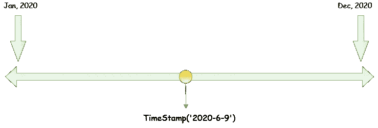
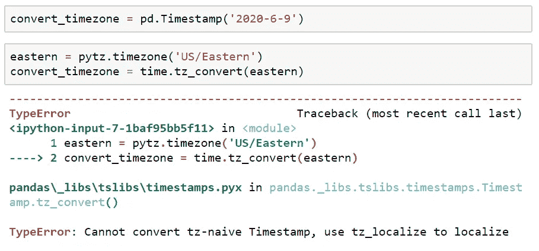
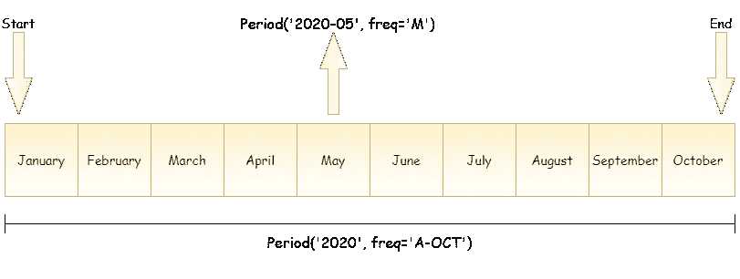

# 时间戳与时间增量与时间段

> 原文：<https://towardsdatascience.com/timestamp-vs-timedelta-vs-time-period-afad0a48a7d1?source=collection_archive---------32----------------------->

## 了解熊猫时间序列数据结构

照片由[内森·杜姆劳](https://unsplash.com/@nate_dumlao?utm_source=medium&utm_medium=referral)在 [Unsplash](https://unsplash.com?utm_source=medium&utm_medium=referral) 上拍摄

**数据！不仅仅是数据科学，软件行业的所有其他领域都在处理数据。从系统软件到应用软件，以高效的方式处理和存储数据始终是一项挑战。一种常见且最有效的战斗策略是利用 ***数据结构。*****

正如计算机科学家弗雷德·布鲁克斯所说，

> 在与缓慢的系统进行的永无止境的战斗中，程序员的主要武器是改变内部模块结构。我们的第一反应应该是重组模块的数据结构。

无论怎样强调数据结构都不为过——您可以拥有完美的代码、完美的逻辑、零错误，但是以笨拙的方式存储数据可能会导致应用程序的崩溃。

Pandas 本质上是为分析金融时间序列数据的[目的](https://en.wikipedia.org/wiki/Pandas_(software))而开发的。它包含了大量的工具来处理日期和时间相关的数据。在本文中，我将解释基本的 pandas 时间序列数据结构、它们可以接受的输入类型以及它们的功能。

处理时序数据的一些基本数据结构是:

*   工时戳记
*   时间差
*   时间段

## 1)时间戳:

Python 在包含三种不同类型的`[datetime](https://docs.python.org/3/library/datetime.html)`模块中提供了日期和时间功能，

*   日期—日、月、年
*   时间—小时、分钟、秒、微秒
*   日期时间—日期和时间的组成部分

python 中的`datetime`由日期和时间组成，pandas 的替代方案是将日期和时间封装在一起的`Timestamp`对象。它是 python 的`datetime`的对等物，但基于更有效的 numpy.datetime64 数据类型。

时间戳插图

*熊猫* [*时间戳*](https://pandas.pydata.org/pandas-docs/stable/reference/api/pandas.Timestamp.html) *引用具有纳秒精度(十亿分之一秒)的特定时刻。*

这是最基本的时间序列数据类型，它将值与特定时刻相关联。时间戳构造函数非常灵活，可以处理各种输入，比如字符串、浮点、整型。下面是它可以接受的不同类型的输入的例子。

用各种输入创建时间戳对象

在上面的示例中，[7]和[8]包含一个标量值。诸如整数或浮点数之类的单个值也可以传递给时间戳构造函数，它返回的日期和时间相当于 UNIX 纪元(1970 年 1 月 1 日)之后的秒数。此外，它允许人类可理解的日期对象与 UNIX 纪元相互转换，以便于计算。当一个 nan 值像[9]中那样被传递时，它返回一个 NaT(不是时间)值，这是 pandas 对于时间戳数据的 null 值。

时间戳构造函数理解时区转换。默认情况下，它不知道时区，但是可以通过在创建对象时将时区传递给参数`tz`来使*知道时区*。这个对象在内部存储了一个 [UTC](https://en.wikipedia.org/wiki/Coordinated_Universal_Time) 时间戳值，使得时区之间的转换变得简单。

***注意*** *:如果您的列/索引/对象不支持时区，您将会得到如下错误*

时区转换错误

*您可以通过本地化(使其具有时区意识)然后转换来克服这个问题。*

除此之外，时间戳可以存储频率信息，具有大量对数据操作有用的属性和方法。时间戳的索引结构是 [DatetimeIndex](https://pandas.pydata.org/pandas-docs/stable/reference/api/pandas.DatetimeIndex.html#pandas.DatetimeIndex) ，其类型为 datetime64，包含时间序列特定方法，便于处理。

## 2)时间差:

[delta](https://www.google.com/search?rlz=1C1CHZL_enIN707IN707&sxsrf=ALeKk038CgpGyIw-ZTMsIwEuF0GYDUq1-A%3A1591970785866&ei=4YvjXoHHNKOa4-EP1uKuqAQ&q=what+is+delta&oq=what+is+delta&gs_lcp=CgZwc3ktYWIQAzIKCAAQsQMQFBCHAjICCAAyBwgAEBQQhwIyAggAMgIIADICCAAyAggAMgIIADICCAAyAggAOgQIABBHOgQIIxAnOgcIABCxAxBDOgQIABBDOgUIABCxAzoFCAAQgwFQ4g1YxyVg2SloAHABeACAAd4CiAG_F5IBBzAuNS42LjKYAQCgAQGqAQdnd3Mtd2l6&sclient=psy-ab&ved=0ahUKEwjBu7ypufzpAhUjzTgGHVaxC0UQ4dUDCAw&uact=5) 的定义之一是它是两个事物或值之间的差异。`Timedelta`只不过是时间上的差异，可以指两个间隔之间的时间量或确切的时间长度，并且基于 numpy.timedelta64。

与时间戳构造函数类似，Timedelta 也倾向于接受可变数量的输入。有趣的是，它既可以取正值，也可以取负值。下面是一些例子，让你一窥究竟。

Timedeltas 是 python 和 pandas 的一部分。他们可以

*   彼此相加或相减

*   彼此相除以返回浮点值

*   添加到`timestamp`

*   添加到`datetime`

*   添加到`date`

*   无法添加到`time`

与`Timestamp`类似，`Timedelta`也有大量用于操作数据的属性和方法，相关的索引结构是类型为 int64 的 [TimedeltaIndex](https://pandas.pydata.org/pandas-docs/stable/reference/api/pandas.TimedeltaIndex.html) 。

## 3)时间段:

时间[周期](https://pandas.pydata.org/pandas-docs/stable/reference/api/pandas.Period.html)指开始和结束时间戳之间的特定时间长度，该时间长度不变且不重叠。`Period`类采用`Period`类型，该类型采用一个字符串或整数，并基于 numpy.datetime64 对固定频率进行编码。

通常，一个值和一个频率参数被传递给`Period()`构造函数，被指定为`freq`的频率参数接受一组预定义的字符串。考虑下面的例子，

时间段示例

在[1] `freq='A-OCT'`中，表示频率为每年一次，固定在十月底，而在[3] `freq='M'`中，表示频率为每月一次。您还可以指定每季度、每周的频率。要了解更多信息，请点击查看[。](https://pandas.pydata.org/pandas-docs/version/0.12/timeseries.html)

时间周期图示

可以使用带有`start`、`end`和频率参数的`period_range()`函数生成一系列`Period`对象。

生成一系列期间

频率之间的转换是一项经常需要处理的任务。这可以通过`[asfreq](https://pandas.pydata.org/pandas-docs/stable/reference/api/pandas.DataFrame.asfreq.html)`方法完成。让我们考虑一个将月频率转换为周频率的例子，

频率之间的转换

除此之外，`Periods`可以转换成`Timestamps`，反之亦然。与`Period`对象相关联的索引结构是`PeriodIndex`。

感谢你一路阅读到这里。如果你有任何问题、反馈或批评，请在评论区告诉我。祝你今天开心！玩的开心！