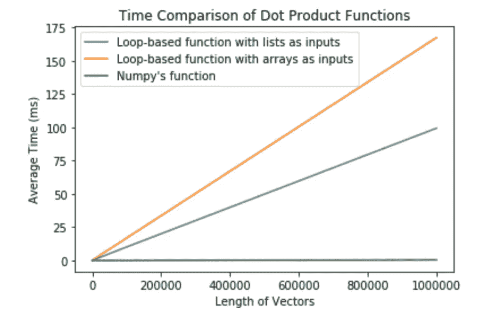
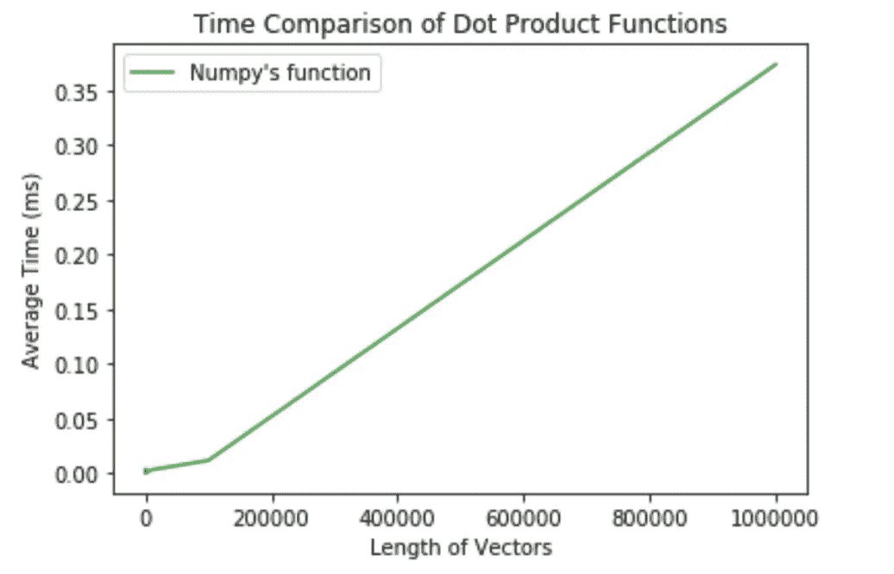

# 时间和数量

> 原文：<https://towardsdatascience.com/timing-and-numpy-611b93338cc3?source=collection_archive---------15----------------------->

## 一个用 Jupyter notebook 在 Python 中计时代码的例子。

作者: [Edward Krueger](https://www.linkedin.com/in/edkrueger/) 数据科学家兼讲师和 [Douglas Franklin](https://www.linkedin.com/in/douglas-franklin-1a3a2aa3/) 助教兼技术作家。



*在本文中，我们将点积计算作为基准测试运行时的模型，我们将可视化一些生成点积的方法，看看哪种方法最快。此外，我们还将介绍一些计时代码行和 ipython 单元的方法。*

链接到 GitHub 库:[https://github.com/edkrueger/dot-product-timing](https://github.com/edkrueger/dot-product-timing/blob/master/dot_product_timing.ipynb)

程序员通过可读性、模块化和运行时间来判断代码质量。本文主要关注 Python 和 Jupyter 中的运行时和计时方法。随着函数处理更多的数据，运行时间可能会急剧增加。在所有条件相同的情况下，越快的函数越好。在本文中，我们将点积计算作为基准测试运行时的模型，我们将可视化几种生成点积的方法，看看哪种方法最快。点积是两个或多个向量相乘的结果。向量是大多数科学算法的基础，也是机器学习和梯度下降的基础。因此，对于数据科学家、机器学习研究人员，甚至是寻找技巧的新程序员来说，这些方法可能会提供洞察力。

# Jupyter 方法

属国

```
# import packagesimport numpy as np
from timeit import timeit
import matplotlib.pyplot as plt
```

我们将在 Jupyter 笔记本中展示三种不同的时间编码方法。我们计时方法的输出有时被分成“墙时间”和“CPU 时间”两个子类别墙上时间是我们熟悉的时间概念，就像墙上的时钟或秒表的时间一样。墙壁时间记录从过程开始到结束的时间。CPU 时间是 CPU 专用于一个进程的总执行时间或运行时间。CPU 时间将是墙时间的一小部分。这是因为其他不直接涉及 CPU 的操作都包含在 wall time 中。我们将关注“墙时间”,因为它提供了直接和直观的时间。

在开始计时之前，我们需要计时的代码和作为参数传递的数组。为了创建函数计时的数组，我们使用 NumPy 生成两个大小为 1，000 的随机向量作为 NumPy 数组

```
# create the vectors# create the vectors as numpy arrays
A_arr = np.random.randn(10**3)
B_arr = np.random.randn(10**3)# copy the vectors as lists
A_list = list(A_arr)
B_list = list(B_arr)
```

现在我们将讨论 Jupyter 笔记本中的三种计时方法；Jupyter 内置的 time 'magic '和 timeit 'magic '方法以及一个名为 timeit 的外部包。

魔术是 Ipython(或 Jupyter)内核特有的，由 Ipython 内核提供。magics 的一个优点是你不必导入一个包。为了正常工作，Magics 使用了在底层语言中无效的语法元素。例如，Jupyter 内核对 Magics 使用“%”语法元素，因为“%”在 Python 中不是有效的一元运算符。然而,`% '在其他语言中可能有含义。

1) Jupyter 的内置魔术时间
Jupyter 的内置时间魔术返回单次执行一个单元格或一行的时间。通过在要计时的代码行上插入“%time ”,可以将时间魔法应用于一行代码。时间魔法也可以通过在单元格的开头放置%%time 来应用于单元格。这个“%%”告诉 Jupyter 使用魔法来计时整个细胞。

## 示例:时间线魔术

```
# time one execution of numpy’s function%time np.dot(A_arr, B_arr)[out] Wall time: 4.99 ms
```

## 例子:时间单元魔法

```
%%time# timing numpy’s built in functionnp.dot(A_arr, B_arr)[out] Wall time: 4.99 ms
```

2) Jupyter 的内置魔术 timeit
Jupyter 的内置魔术 timeit 会返回同一单元格或行的多次执行的平均值。当对每个单元格或行的单次执行进行计时时，结果可能会有所不同。这种差异可能是由后台运行的计算机进程造成的。因此，使用 timeit 将通过返回一组执行次数的平均值和标准偏差来产生更有价值的结果。这个方法也可以用作单元格或行魔术，但是为了比较，我们只把它实现为行魔术。

## 例如:朱庇特的时间

```
# find average of 10 runs of numpy’s dot product%timeit -n 10 np.dot(A_arr, B_arr)[out] 5.14 ± 2.93 µs per loop (mean ± std. dev. of 7 runs, 10 loops each)
```

3)time it 外部包

timeit 包还可以对一个函数的多次执行进行计时。这个包创建了一个函数计时的环境。默认情况下，这种环境关闭垃圾收集和缓存。垃圾收集是通过删除不再需要或不再使用的数据来释放计算机内存空间的自动过程。缓存是由用于在计算环境中临时存储数据的硬件或软件来完成的。这种方法的优点是它使独立的计时更具可比性。缺点是垃圾收集和/或缓存可能是被测函数性能的重要组成部分。

要使用 timeit，我们需要创建一个没有参数的函数。一个简单的方法是传递一个 lambda 函数，不带参数，作为计时的参数。

## 示例:Timeit 包

```
# find average of 10 runs of numpy’s functiontime = timeit(
 lambda: np.dot(A_arr, B_arr),
 number=10
)print(f”{time} ms”.format(time * 1000/ 10))[out] 0.0018839795529856929 ms
```

以上三种计时方法收敛到相同的结果。NumPy 数组上基于循环的函数最慢，列表上基于循环的函数次之，而 NumPy 的函数是目前最快的。

**使用 timeit 的更彻底的方法**
另一种方法是编写一个计时器函数，接受要计时的函数及其参数。然后它定义一个等价的(lambda)函数，没有参数，并计时。

```
def time_function(func, *args, reps=10):

“””
Passes *args into a function, func, and times it reps 
times, returns the average time in milliseconds (ms).
“””
 avg_time = timeit(lambda:func(*args),number=reps) / reps

 return avg_time * 1000
```

由此，我们得到了与直接使用 timeit 大致相同的结果。

现在，我们可能想看看随着向量长度的增长，时间是如何变化的。我建立了一个函数来计算不同长度的点积函数。使用同一个向量多次计时可能会产生不准确的结果，因为对于某些向量来说，计算点积可能会更快。我将重复不同的向量，以确保公平的测试。

```
def time_dot_product(func, 
 vector_length, 
 input_type = “array”, 
 data_reps = 10, 
 reps = 10
): 

“”” 
Takes func, a function that perfroms a calculation on 
two vectors (array-lines) and returns the times (in ms) 
the function takes to run on std. normal generated 
vectors.Arguments: 
 — — — — — 
 func (function): a function that performs a calculation 
 on two vectors (array-lines) 
 vector_length (int): the length that the random 
 vectors should be 
 input_type (str): Controls the data type of the random vector. 
 Takes values \”list\” or \”array\” 
 data_reps (int): the number of times to generate 
 the data 
 reps (int): the number of time to run the timer 
 for each data set 
“””total_time = 0 

 for i in range(0, data_reps): 

 A = np.random.standard_normal(vector_length) 
 B = np.random.standard_normal(vector_length) 

 if input_type == “list”: 
 A = list(A) 
 B = list(B) 

 inst_time = time_function(func, A, B, reps=reps)

 total_time += inst_time 

avg_time = total_time / data_repsreturn avg_time
```

为了可视化这些函数的行为，我们将使用 Matplotlib 绘制它们的图形。为此，我们对长度为 1 到 1，000，000 的向量的每个点积函数进行计时。对于较慢的计算机，应选择较低的数量级。如果有一台更快的计算机，看看这些函数在更长的向量上的表现可能会很有趣。

```
# create an array of increasing timesord_mag = 6
lengths = [10 ** n for n in range(0, ord_mag + 1)]
```


随着向量长度的增加，运行时间的增加几乎是完全线性的。这种线性符合理论:假设算术运算具有恒定的时间复杂度，点积运算具有线性时间复杂度，即 O(n)。基于循环的点积在 NumPy 数组上较慢，因为循环函数必须将 NumPy 数组转换为 python 列表数据类型。这种转换意味着遍历一个 NumPy 数组比遍历一个 list 需要更多的时间。NumPy 函数可能看起来不会增加执行时间。然而，如果我们放大，我们可以看到与其他时间复杂性相似的行为；O(n)。



总之，应该使用 NumPy 进行点积计算。对于其他向量运算也是如此。但是，如果必须编写循环，使用列表比 NumPy 数组作为输入更有效。我们所有的计时方法都返回了相似的结果，尽管格式不同。尽管根据我们的结果，NumPy 点积具有最短的运行时间，但是我们可以说所有的测试都具有相同的渐近复杂度或顺序；O(n)。在实际情况下，算法的运行时间取决于它必须完成的操作数量。记住，所有的事情都是一样的，更快的功能是更好的功能。当编写在大型数据集上运行的代码或编写模块化代码时，我们应该记住这一点。向量对于机器学习应用至关重要。因此，对于任何机器学习计算，NumPy 数组都是可行的。更快意味着更少的计算资源、时间和能量。在计算中，更快的解决方案是更好的解决方案！

我希望这是信息丰富和发人深省的！请随意浏览标题中链接的 Jupyter 笔记本，并亲自尝试一些计时。你的电脑比我的快吗？

**我的电脑**
|组件|规格|规格

|型号| iMac Retina 5k，27 英寸，2015 年末|
|CPU | 3.2 GHz 英特尔酷睿 i5 |
| RAM | 8GB 1867 MHz DDR 3 |
| GPU | AMD 镭龙 r9 m390 2gb |
| OS | Mojave v 10 . 14 . 5 |