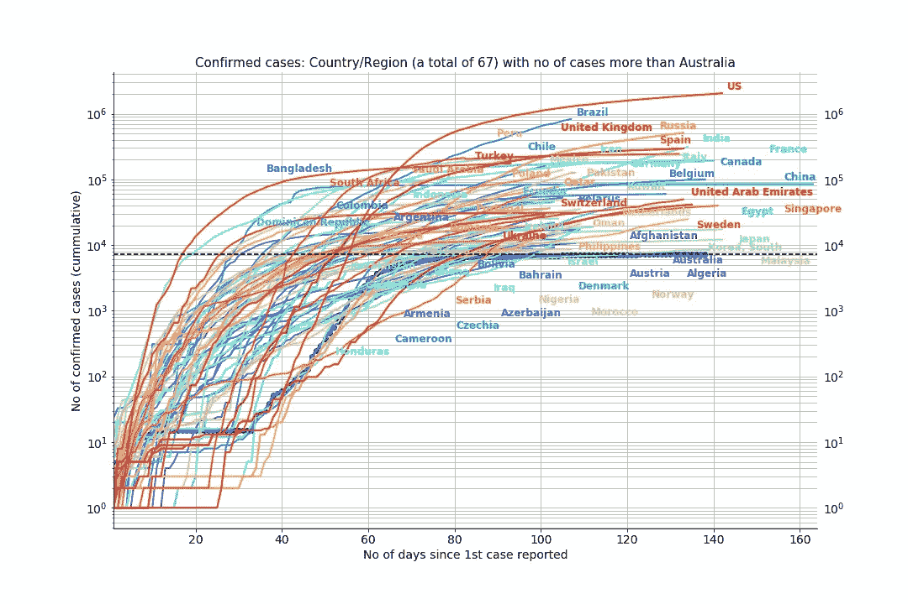
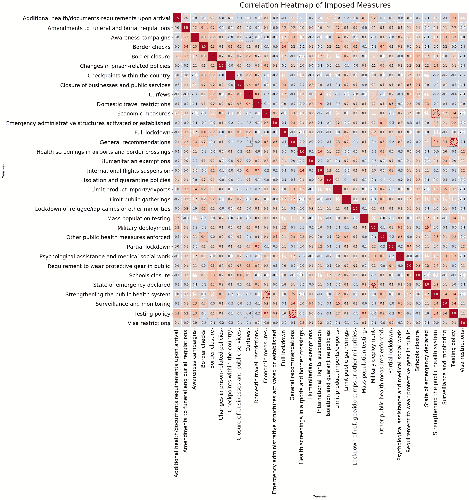
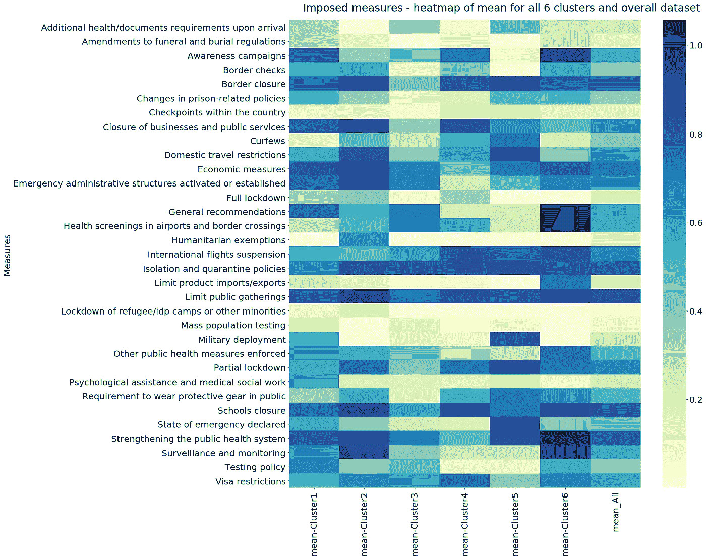
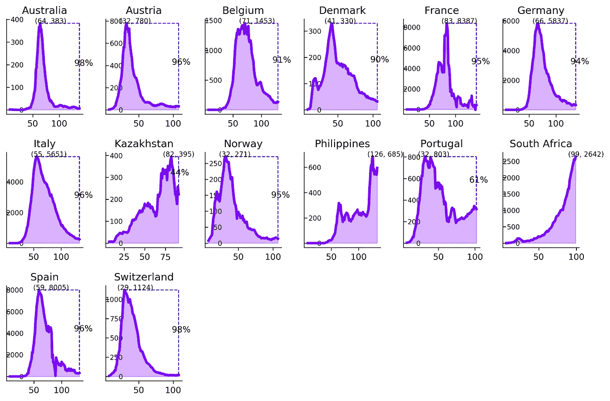
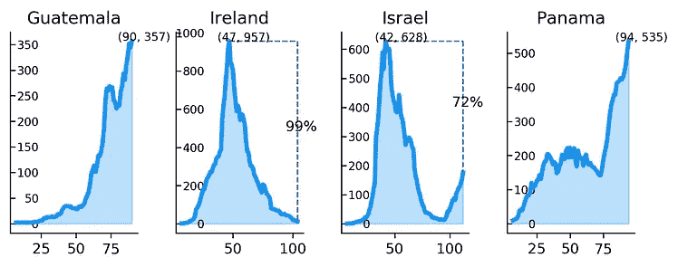
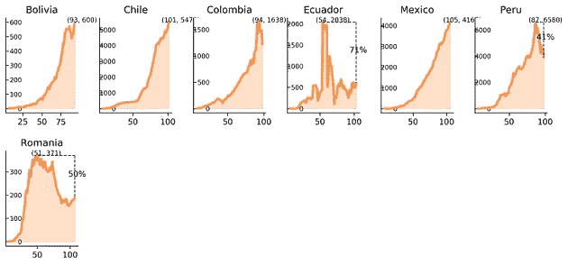
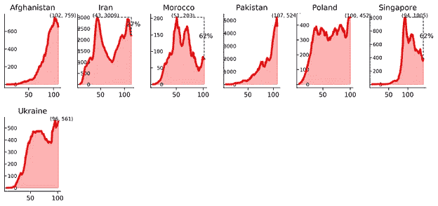
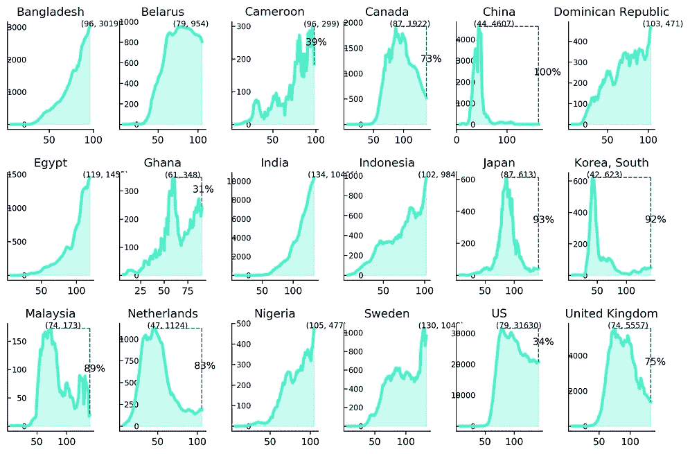
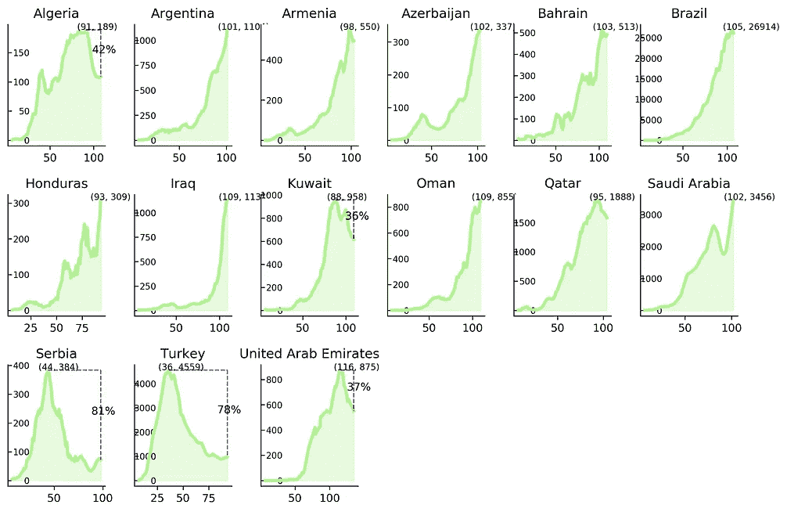

# 对新冠肺炎实施制裁的时机很重要

> 原文：<https://towardsdatascience.com/timing-matters-in-imposing-measures-for-covid-19-db53e2e5a987?source=collection_archive---------47----------------------->

## 越早采取的措施控制得越好

图片来源:freepik

**作者:吉塔达斯&凯瑟琳洛佩斯**

从第一个新冠肺炎病例出现在一个国家开始，这种病毒已经以不同的速度在不同的国家渗透到不同的社区。在某一时刻，政府通常会实施某种措施和政策，以拯救生命和生计。这些措施包括检测、追踪、增加卫生系统的容量、封锁和旅行限制等等。在这篇文章中，我们研究了一组国家，以了解他们在控制病毒传播方面的表现，以及他们使用的各种措施的时机。

# **本研究数据&国家**

从我们在[之前的工作](/a-quick-look-at-covid-19-in-australia-7b730694201e#e8c4-1258fdcb6932)继续，我们在这项研究中纳入了比澳大利亚确诊病例更多的国家。截至 2020 年 6 月 12 日，有 64 个国家出现了更多的确诊病例，并提供了它们的措施数据。因此，本研究将对这 64 个国家进行调查，其截至 6 月 12 日的确诊病例如下图 1 所示。

图一。截至 2020 年 6 月 12 日，世界各国的病例数超过澳大利亚

我们使用了来自人道主义数据交换(HDE)的 2 组数据。

1.  [数据集](https://data.humdata.org/dataset/novel-coronavirus-2019-ncov-cases)追踪全球受新冠肺炎影响的人数，包括确诊、康复和死亡病例。
2.  [获取强制措施“acaps _ covid 19 _ government _ measures _ Dataset . xlsx”的数据集](http://data.humdata.org)。

# 强制措施之间的相互关系

这项研究列出了 33 个国家的措施，从“加强公共卫生系统”到“部分封锁”等等。根据一个国家使用的每个具体措施的时间，每个措施都被缩放到[0，1]。从一个国家报告第一例病例的那一天起，如果没有使用某项措施，则该措施记录为 0。一个国家越早采取一项措施，该具体措施记录的数值就越高(越接近 1)。下图 2 显示了基于皮尔逊相关系数的热图。

图二。包含 33 个测量值的关联热图

上面的热图显示，“加强公共卫生系统”和“经济措施”之间有很强的相关性，“一般建议”和“测试政策”之间也有很强的相关性。它还表明了“部分封锁”和“国内旅行限制”之间的相关性。我们可以理解为这些措施经常一起使用。在所有这些被研究的国家中,“检测政策”是完全独立的，与“边境检查”无关。

# 实施措施和时机的聚类分析

在研究了 33 个测度之间的相关性后，通过降维得到了一组 28 个主成分。我们使用 K-means 聚类和剪影分数从 64 个国家的数据中得出一组 6 个聚类。

在每个国家出现第一例病例后，在不同的时间采取了不同的措施。所有这 64 个国家都根据其采取措施的时间特点被分配了一个类别号。如下面图 3 中的热图所示，如果度量值引入较早，则度量值更暗，在[0，1]的范围内更接近 1。一组国家使用的指标越晚，热图中显示的颜色越浅。

例如，“**有限聚集**是在新冠肺炎病例在这些国家开始后的早期阶段在所有国家使用的措施。相反，这项研究中包括的这些国家最近采取的措施是“**封锁难民**”和“**大规模人口测试**”。

图三。6 个集群中每个度量的时间平均值的热图

## 第 1 组(第 1 组)包括澳大利亚—“早起鸟”风格:

这 14 个国家包括澳大利亚、奥地利、比利时、丹麦、法国、德国、意大利、挪威、葡萄牙、西班牙、瑞士、哈萨克斯坦、菲律宾和南非。这些国家采用的措施的特点是:

*   ***过早或相当早地推出*** 政府可能推出的大量跨选项措施。这些措施包括“经济措施”、“关闭商业和公共服务”和“加强公共系统”。
*   ***杰出早期简介*****【心理援助与医务社会工作】和【测试政策】相比其他团体。**

**这组国家每日确诊病例的 7 天滚动平均值如图 4 所示。在这 14 个国家中，包括澳大利亚在内的 11 个国家已经(或几乎已经)使曲线变平。这些国家中的大多数也经历了病例从高峰到最新状态的大幅减少。澳大利亚政府在早期阶段采取了多项措施，成功地走上了这条曲线。**

****

**图 4。包括澳大利亚在内的第一组国家**

## **第 2 组(第 2 类、第 5 类和第 6 类)——“早或晚”风格:**

**在下图 5 中，这一组包括 18 个国家。参照图 3，这些国家在实施措施方面有两个共同点。**

*   *****很早*** 一些措施的介绍:与其他国家相比，第 2 组国家很早就采用了"监视和监测"、"关闭学校"和"关闭边境"，第 6 组国家很早就采用了"提高认识运动"、"加强公共卫生系统"和"机场健康检查"。**
*   ***很晚才出台“军事部署”和“乱人口测试”等措施，与其他团体的“测试政策”相比。***

***从下图 5 所示的案件数量的 7 天移动平均数来看，除了爱尔兰、以色列和厄瓜多尔这些奉承曲线的国家之外，大多数国家还没有用“或早或晚”模式实施的措施使曲线变平。***

******************

***图五。第 2 类、第 5 类和第 6 类国家***

## ***第 3 组(第 3 组和第 4 组)——“中晚期”风格***

***这一组包括 33 个国家。关于这些国家采用所有这 33 项措施的时间，我们可以看到，与其他国家相比，大多数措施是在相当晚或相当晚的阶段引入这些国家的，只有“学校关闭”是一个例外。从下图 6 所示病例数的 7 天移动平均数来看，大多数国家的阳性病例数仍在上升。然而，中国、韩国、加拿大、荷兰、英国都包括在成功控制第一波疫情的国家之内，这表明除了引入的时机之外，我们还需要考虑更多的因素。***

************

***图六。第 3 类和第 4 类国家***

# ***见解和开放式问题***

***不同的国家在不同的时间采取不同的措施来控制传染病的传播。根据采取这些措施的时间，我们对国家进行了分组，以确定这 64 个国家的具体模式。很明显，越早采取措施，对控制疾病传播的影响就越大:***

> ***“时机很重要！越早越好”***

***然而，这项研究也强调指出，产生足够影响的时机非常有限。我们需要研究每项措施在控制 COVID19 传播方面的有效性，以便各国能够通过了解更多信息来调整更有效的短期和长期管理策略:***

> ***"在减少传播方面，各种措施有不同的效果！"***

****欢迎随时访问 GitHub*[*repo*](https://github.com/gitadas/COVID19_ImposedMeasures)*，欢迎您的反馈和意见。****