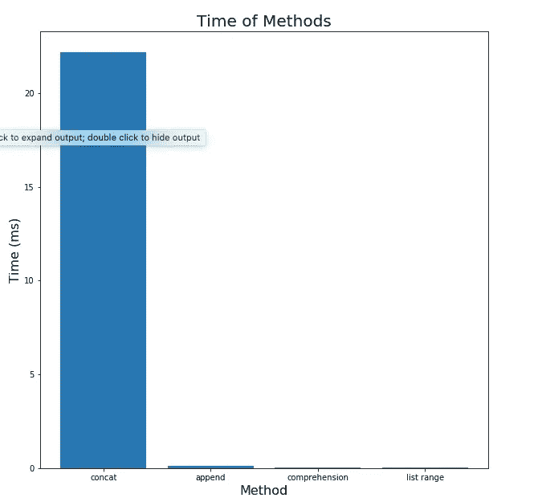
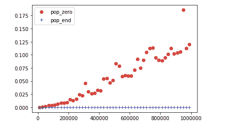
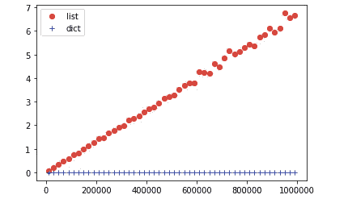

# 高效 Python 代码的计时

> 原文：<https://towardsdatascience.com/timing-the-performance-to-choose-the-right-python-object-for-your-data-science-project-670db6f11b8e?source=collection_archive---------11----------------------->

## 如何比较列表、集合和其他方法的性能


乔恩·泰森在 [Unsplash](https://unsplash.com?utm_source=medium&utm_medium=referral) 上的照片

# 动机

让我们看看这些常用的创建列表的方法:

串联:

```
l = []
   for i in range(10000):
      l = l + [i]
```

追加:

```
l = []
   for i in range(10000):
      l.append(i)
```

理解:

```
l = [i for i in range(10000)]
```

列表范围:

```
l = list(range(10000))
```

这些方法应该给你同样的数组。但是你有没有想过不同方法的效率？如果您正在处理一个小数据集，您可能不需要选择一种方法而不是另一种方法，但是当数据集变大时，选择一种有效的方法会对性能产生很大的影响。



惊讶于`concat`和其他方法在性能上的巨大差异？等到你看到比例:

1019.0323133454616!

您可能会意识到理解不同方法和 Python 对象之间的性能差异是多么重要。但是你能用什么方法来选择一个有效的方法呢？

# 计时来追踪它

你追踪的一个方法是用时间来追踪创建某个对象需要多长时间，比较时间差。`timeit`方法允许你这么做。

```
import timeitimport numpy as npfrom timeit import Timer
```

让我们看看如何跟踪方法的时间来创建我之前展示的列表。要使用`Timer`,我们需要:

*   将您想要计时的*函数*作为*字符串*和*位置*传递，以将该函数放入`Timer`
*   设置*实验次数*以找到该功能的平均时间

结果:

```
concat  25.208993583999998 milliseconds
append  0.13781585199999924 milliseconds
comprehension  0.08480268199999941 milliseconds
list range  0.024738168999999033 milliseconds

Worse vs. best ratio 1019.0323133454616
```

# 比较其他 Python 方法

酷！现在我们知道如何比较不同方法之间的时间。让我们用它来跟踪我们在 Python 中经常使用的其他方法

## Pop-front 与 Pop-end

您可能会猜测弹出数组前面的元素比弹出数组末尾的元素花费更多的时间(因为在弹出第一个元素后，您必须重新分配数组中其他元素的位置)。但是随着数组大小的增加，先弹出多长时间呢？

我们使用范围从 10000 到 1000000 的数组进行测试，步长为 20000。让我们一起来观察我们的结果

```
import numpy as npmatrixDat = np.array( result )import matplotlib.pyplot as pltplt.plot(matrixDat[:,0], matrixDat[:,1], 'o', color='red',label='pop_zero');
plt.plot(matrixDat[:,0], matrixDat[:,2], '+', color='blue',label='pop_end');leg = plt.legend(numpoints=1)
```



`.pop(0)`的持续时间随着阵列尺寸的增加而增加，而`.pop()`的持续时间几乎保持不变。如果不追踪时间，我们不会注意到差异。

## 列表与集合

在我们找到 list 和 set 在性能上的区别之前，你愿意猜猜哪个性能更好吗？保持你的猜测，向下滚动找到答案。

使用前面的代码行来绘制结果。女士们先生们，让我来宣布结果:



如果你最初的猜测成立，你是对的。随着大小的增加，创建列表的持续时间增加，而集合的持续时间保持不变。

# 结论

了解 Python 方法之间的性能差异有助于您为自己的目标选择最有效的方法或对象。由于您将在数据科学项目中使用大型数据集，因此关注不同方法的性能以节省时间至关重要。

在 [this Github repo](https://github.com/khuyentran1401/Data-science/blob/master/python/Time.ipynb) 中，您可以随意使用本文的代码。

我喜欢写一些基本的数据科学概念，并尝试不同的算法和数据科学工具。你可以通过 [LinkedIn](https://www.linkedin.com/in/khuyen-tran-1401/) 和 [Twitter](https://twitter.com/KhuyenTran16) 与我联系。

如果你想查看我写的所有文章的代码，请点击这里。在 Medium 上关注我，了解我的最新数据科学文章，例如:

[](/maximize-your-productivity-with-python-6110004b45f7) [## 使用 Python 最大化您的生产力

### 你创建了一个待办事项清单来提高效率，但最终却把时间浪费在了不重要的任务上。如果你能创造…

towardsdatascience.com](/maximize-your-productivity-with-python-6110004b45f7) [](/cython-a-speed-up-tool-for-your-python-function-9bab64364bfd) [## cy thon——Python 函数的加速工具

### 当调整你的算法得到小的改进时，你可能想用 Cython 获得额外的速度，一个…

towardsdatascience.com](/cython-a-speed-up-tool-for-your-python-function-9bab64364bfd) [](/choose-stocks-to-invest-with-python-584892e3ad22) [## 用 Python 选择要投资的股票

### 您计划在未来 3 年投资几只股票，每只股票的每一美元都有不同的预期回报…

towardsdatascience.com](/choose-stocks-to-invest-with-python-584892e3ad22) [](https://medium.com/@khuyentran1476/comprehensive-numpy-tutorials-for-beginners-8b88696bd3a2) [## 为您的数据科学项目提供 Numpy 技巧

### 创建数组、矩阵、执行矩阵运算、解决线性代数问题和常见数据科学的技巧…

medium.com](https://medium.com/@khuyentran1476/comprehensive-numpy-tutorials-for-beginners-8b88696bd3a2)