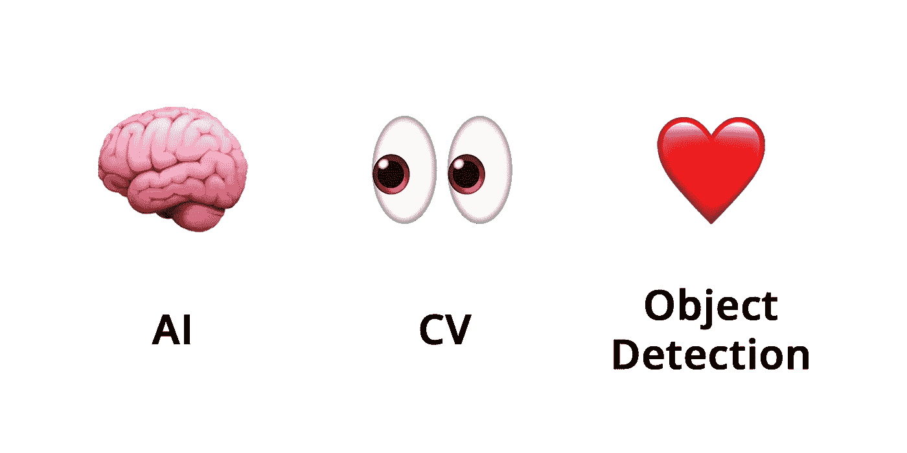

# 如果火绒可以直接刷到你身上会怎么样？

> 原文：<https://towardsdatascience.com/tinder-swipe-on-you-fd65b905791?source=collection_archive---------45----------------------->

## 字节/大小

## 随着视频聊天功能即将推出，这个约会平台可以使用人工智能来检测令人不快的图像


亚历山大·辛恩在 [Unsplash](https://unsplash.com?utm_source=medium&utm_medium=referral) 上的照片

18 岁是每个人生命中的一大步，一两个月前我迈出了这一步。它通常伴随着一系列的通过仪式:买你的第一张彩票，喝你的第一杯酒，签订令人心碎的债务协议。

另一个是加入 Tinder。我们可能相距遥远，但与他人联系的需求比以往任何时候都更强烈。我想，离别使心更亲？

那是谎言，你的高中恋情不会持续到大学两个星期，杰西卡。


Tinder 最近宣布计划为该平台引入视频聊天功能，他们已经明确表示，在我所谓的“性感垂直缩放会议”期间，将利用某种**人工智能** + **物体检测**来防止骚扰并确保安全。

# 什么是物体识别？

一些定义:

*   **AI(人工智能):**泛指机器(计算机)系统，执行人类可以完成的任务。
*   **CV(计算机视觉):**专门理解图像或视频内容的一类 AI。
*   **物体检测:**与 CV 相邻，它在寻找一个特定的物体。

在人类的术语中，‘**大脑**’有点像人工智能的整体概念，你的’**眼睛**执行计算机视觉，当你**寻找特定的东西**(你的钥匙、零食、真爱)时，你正在执行物体探测任务。



## 大多数 CV 程序使用**CNN**(卷积神经网络):

CNN 的每一个“层”都着眼于图像的某些特征(通过像素值)，从简单的边缘开始，逐渐变得更加复杂。

这些特征被**映射**以给出每个特征的概率位置。来自每个部分的最高概率被**汇集**到一个更小的图像中，其中负像素值被变成 0。

然后**过程重复**。最终，所有这些**连接的层**可以被编译，使得它们匹配某个标签/结果。基于这些结果的概率，CNN 给出了它对图像中内容的最佳猜测。


[来源](/a-comprehensive-guide-to-convolutional-neural-networks-the-eli5-way-3bd2b1164a53)

这很巧妙，但也很耗时。如果查丁顿·伍兹沃斯在 Tinder 视频聊天上开始变得太……*舒服*，20 秒的处理时间会感觉像过了一辈子。

幸运的是，一些 CNN 可以在**实时**运行。 *YOLO* 是一种物体检测算法，在自动驾驶汽车方面显示出了前景，在自动驾驶汽车中，实时检测是一个生死攸关的问题。

# 唯一一次说 YOLO 在 2020 年是可以接受的

YOLO 将图像分解成一个**网格**，每个网格方块负责预测其边界内物体的大小、类别和位置。

它还给出一个**置信度得分**——有多确定这是一个对象？然后，它试图找出对象的**类**(在它实际上*是*对象的情况下)。这返回一个**条件概率**:例如 P(Car | Object)。

这些置信度得分与正在讨论的对象周围的**边界框**相关联，最终产生许多不同权重的边界框。该算法然后寻找有许多 **重叠**的**盒子——这意味着那里很可能有一个物体。**


[来源](https://www.pyimagesearch.com/2018/11/12/yolo-object-detection-with-opencv/) |较重的边界框线对应较大的置信度得分。

那些高度重叠的预测被输出，如果它们满足某个**阈值概率分数**，它们将被保留。YOLO 可以在视频的每一帧/每一秒都这样做，如果 Tinder 想监控视频聊天的安全，这是一个完美的工具。

# 这对 Tinder 的发展意味着什么

Tinder 表示，当涉及到安全和隐私之间的平衡时，他们向安全学习。在他们即将推出的视频聊天功能中使用 YOLO 实时物体检测可以让许多人**感到更安全**使用它+阻止任何小动作。

Tinder 的下一波用户是 Z 世代——我们的整个生活都在互联网上，所以我想我们会对 Tinder 观看我们的视频聊天感到满意。

这项功能如何工作是一个不同的问题。如果 Tinder 看到一个不受欢迎/不合适的对象，他们会结束通话，举报用户，还是给你一个警告？

技术上来说，这完全是另一回事。在整个关系中，从用户到用户、*和*的不适当变化的分类。即使算法是为每个用户定制的，这也将是一个**计算上具有挑战性的**问题。

幸运的是，我 18 岁
在 3 英里外
，我喜欢解决问题和在沙滩上漫步。


```
A **byte-sized deep dive** into **tech** and **business**.
```

大家好，我是 Murto，是加拿大多伦多的一名 18 岁的企业家和学生。如果你想聊天，请在 LinkedIn 上联系我！