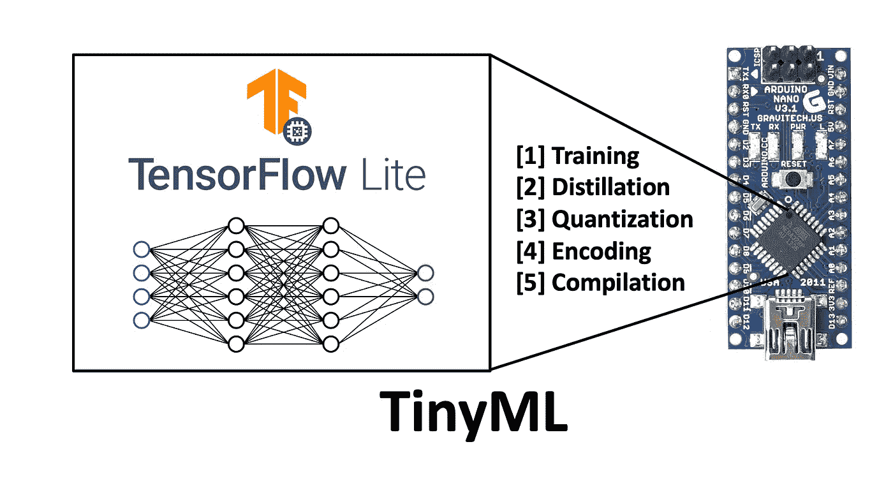
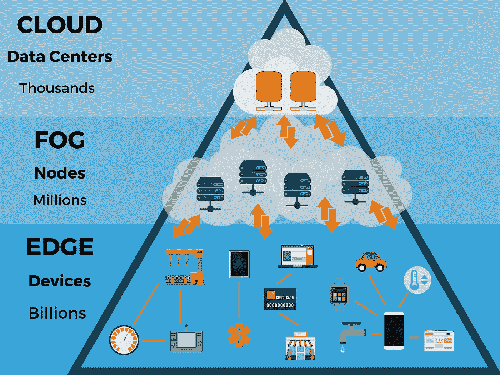
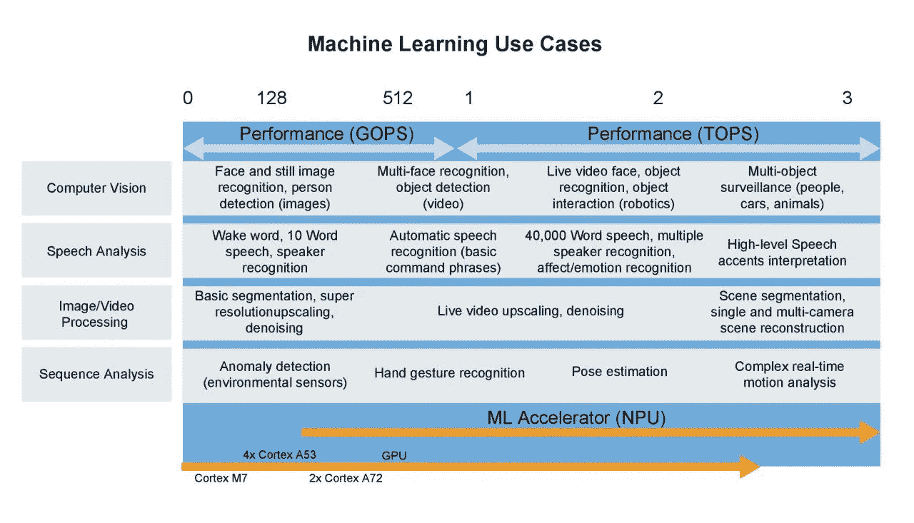
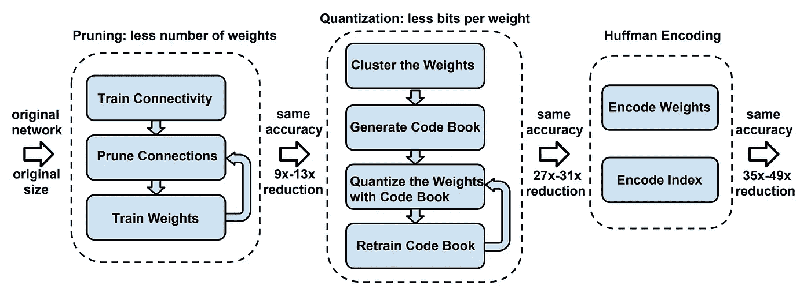
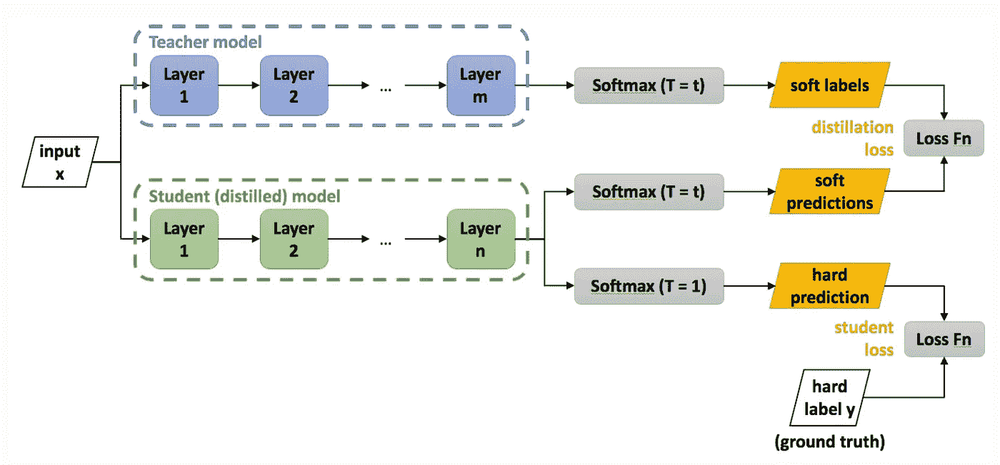
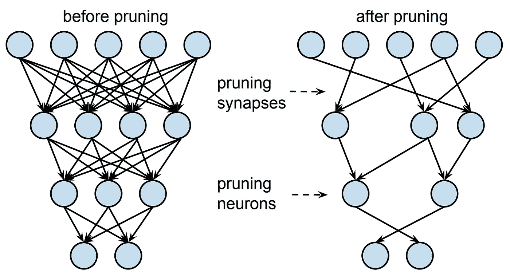
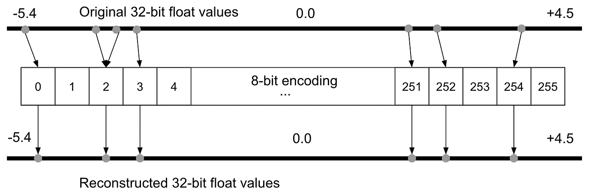
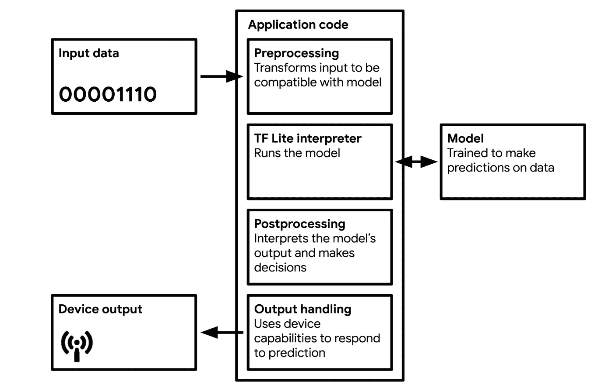

# 微型机器学习:下一次人工智能革命

> 原文：<https://towardsdatascience.com/tiny-machine-learning-the-next-ai-revolution-495c26463868?source=collection_archive---------1----------------------->

## 更大的模型并不总是更好的模型

> 由 NASA 推动开始的电子产品小型化成为了一个完整的消费产品产业。现在我们把贝多芬的全部作品别在翻领上，戴着耳机听。— ***尼尔·德格拉斯·泰森，天体物理学家兼科学评论员***
> 
> [……]超低功耗嵌入式设备的普及，加上面向微控制器的 TensorFlow Lite 等嵌入式机器学习框架的推出，将使人工智能支持的物联网设备大规模扩散。— ***哈佛大学副教授维杰·贾纳帕·雷迪***

嵌入式设备微型机器学习(TinyML)概述。

这是微型机器学习系列文章的第一篇。本文的目标是向读者介绍微型机器学习的概念及其未来的潜力。在本系列的后续文章中，将深入讨论具体的应用程序、实现和教程。

# **简介**

在过去的十年里，由于处理器速度的提高和大数据的出现，我们目睹了机器学习算法的规模呈指数级增长。最初，模型足够小，可以使用中央处理器(CPU)中的一个或多个内核在本地机器上运行。

不久之后，使用图形处理单元(GPU)的计算变得有必要处理更大的数据集，并且由于引入了基于云的服务，如 SaaS 平台(如谷歌联合实验室)和 IaaS(如亚马逊 EC2 实例)，变得更加容易获得。此时，算法仍然可以在单台机器上运行。

最近，我们已经看到了专用集成电路(ASICs)和张量处理单元(TPU)的发展，它们可以打包大约 8 个 GPU 的能力。这些设备已经增加了跨多个系统分布学习的能力，以试图发展越来越大的模型。

最近，随着 GPT-3 算法(2020 年 5 月发布)的发布，这一点达到了顶峰，该算法拥有包含惊人的 1750 亿神经元的网络架构，是人脑中现有数量的两倍多(约 850 亿)。这比有史以来第二大神经网络图灵-NLG(2020 年 2 月发布，包含约 175 亿个参数)的神经元数量多 10 倍。一些估计称，该模型的培训成本约为 1000 万美元，并使用约 3 GWh 的电力(约为三个核电厂一小时的发电量)。

虽然 GPT-3 和图灵-NLG 的成就值得称赞，但自然地，这导致了一些业内人士批评人工智能行业越来越大的碳足迹。然而，它也有助于激发人工智能社区对更节能计算的兴趣。这些想法，像更有效的算法、数据表示和计算，多年来一直是一个看似不相关的领域的焦点:**微型机器学习**。

微型机器学习(tinyML)是机器学习和嵌入式物联网(IoT)设备的交集。该领域是一个新兴的工程学科，有可能彻底改变许多行业。

tinyML 的主要行业受益者是边缘计算和节能计算。TinyML 源于物联网(IoT)的概念。物联网的传统理念是，数据将从本地设备发送到云端进行处理。一些人对这一概念提出了某些担忧:隐私、延迟、存储和能效等等。

**能源效率。**传输数据(通过有线或无线)非常耗能，大约比机载计算(具体来说，乘累加单元)耗能多一个数量级。开发能够自行执行数据处理的物联网系统是最节能的方法。人工智能的先驱们已经讨论了“以数据为中心”的计算(相对于云模型的“以计算为中心”)有一段时间了，我们现在开始看到它的表演。

**隐私。**传输数据可能会侵犯隐私。此类数据可能会被恶意行为者截获，并且当存储在单一位置(例如云)时，其安全性会变得更低。通过将数据主要保存在设备上并最大限度地减少通信，这提高了安全性和隐私性。

**储存。对于许多物联网设备来说，它们正在获取的数据毫无价值。想象一下，一个安全摄像头一天 24 小时记录着一栋大楼的入口。在一天的大部分时间里，摄像机镜头没有任何用处，因为什么都没发生。通过拥有一个仅在必要时激活的更智能的系统，需要更低的存储容量，并且传输到云的必要数据量也减少了。**

**潜伏期。**对于标准的物联网设备，如亚马逊 Alexa，这些设备将数据传输到云端进行处理，然后根据算法的输出返回响应。从这个意义上来说，这个设备只是一个通向云模型的便捷通道，就像你和亚马逊的服务器之间的信鸽。这个设备相当笨，完全依赖于互联网的速度来产生结果。如果你网速慢，亚马逊 Alexa 也会变慢。对于具有板载自动语音识别功能的智能物联网设备，延迟会减少，因为对外部通信的依赖会减少(如果不是没有的话)。

这些问题导致了边缘计算的发展，即在边缘设备(位于云“边缘”的设备)上执行处理活动的想法。这些设备在内存、计算和功率方面受到高度的资源限制，导致了更高效的算法、数据结构和计算方法的开发。

这种改进也适用于更大的模型，这可能导致机器学习模型的效率提高几个数量级，而不会影响模型的准确性。例如，由微软开发的 [Bonsai](https://microsoft.github.io/EdgeML/static/docs/publications/Bonsai.pdf) 算法可以小到 2 KB，但甚至可以比典型的 40 MB kNN 算法或 4 MB 神经网络有更好的**性能。这个结果听起来可能不重要，但在 1/10，000 大小的模型上同样的精度是非常令人印象深刻的。这么小的模型可以在 Arduino Uno 上运行，Arduino Uno 有 2 KB 的 RAM 可用——简而言之，你现在可以在 5 美元的微控制器上建立这样的机器学习模型。**

我们正处于一个有趣的十字路口，机器学习正在两种计算范式之间分叉:以计算为中心的计算和以数据为中心的计算。在以计算为中心的范式中，数据由数据中心中的实例存储和分析，而在以数据为中心的范式中，处理在数据的源位置本地完成。虽然我们似乎正在快速迈向以计算为中心的范式的天花板，但以数据为中心的范式的工作才刚刚开始。

物联网设备和嵌入式机器学习模型在现代世界中越来越普遍(预计到 2020 年底将有超过 200 亿台活跃设备)。其中很多你可能都没有注意到。智能门铃，智能恒温器，当你说两句话，或者甚至只是拿起电话，智能手机就会“醒来”。本文的剩余部分将更深入地关注 tinyML 是如何工作的，以及当前和未来的应用程序。

云的层次结构。(来源: [eBizSolutions](https://www.thinkebiz.net/what-edge-computing/) )

# TinyML 的示例

以前，设备需要复杂的电路来执行各种操作。现在，机器学习越来越有可能将这种硬件“智能”抽象为软件，使嵌入式设备变得越来越简单、轻便和灵活。

嵌入式设备的机器学习带来的挑战是相当大的，但在这一领域已经取得了很大的进展。在微控制器上部署神经网络的关键挑战是低内存占用、有限的功率和有限的计算。

也许 TinyML 最明显的例子是在智能手机中。这些设备会持续主动地监听唤醒词，比如安卓智能手机上的“嘿谷歌”，或者 iPhones 上的“嘿 Siri”。通过智能手机的主中央处理器(CPU)运行这些活动，现代 iPhone 的 CPU 为 1.85 GHz，仅在几个小时内就会耗尽电池。对于大多数人一天最多使用几次的东西来说，这种程度的退化是不可接受的。

为了解决这个问题，开发人员创造了专门的低功耗硬件，能够由小型电池供电(如圆形 CR2032“硬币”电池)。这使得电路即使在 CPU 不运行时也能保持活动，基本上是在屏幕不亮的时候。

**这些电路的功耗低至 1 mW，使用标准 CR2032 电池可供电长达一年。**

可能看起来不像，但这是一件大事。对于许多电子设备来说，能量是一个限制因素。任何需要市电的设备都被限制在有布线的位置，当十几个设备出现在同一个位置时，布线会很快变得难以承受。干线电力也是低效和昂贵的。将电源电压(在美国约为 120 V)转换为典型的电路电压范围(通常约为 5 V)会浪费大量能源。任何有笔记本充电器的人在拔掉充电器的时候可能都会知道这一点。充电器内变压器产生的热量是电压转换过程中浪费的能量。

即使是带电池的设备，电池寿命也有限，需要频繁对接。许多消费类设备的设计都是为了让电池能够持续工作一个工作日。依靠硬币大小的电池可以持续工作一年的 TinyML 设备意味着它们可以被放置在偏远的环境中，只在必要时进行通信以节省能源。

唤醒词并不是我们看到的唯一无缝嵌入智能手机的 TinyML。加速度计数据用于确定是否有人刚刚拿起手机，这将唤醒 CPU 并打开屏幕。

显然，这些不是 TinyML 唯一可能的应用。事实上，TinyML 为企业和爱好者提供了许多令人兴奋的机会，来生产更智能的物联网设备。在一个数据变得越来越重要的世界中，将机器学习资源分发到远程位置的内存受限设备的能力可能会对农业、天气预报或地震学等数据密集型行业产生巨大的好处。

毫无疑问，赋予边缘设备执行数据驱动处理的能力将为工业过程带来范式转变。例如，能够监测作物并在检测到土壤湿度、特定气体(例如，苹果成熟时会释放乙烷)或特定大气条件(例如，大风、低温或高湿度)等特征时发送“帮助”消息的设备将极大地促进作物生长，从而提高作物产量。

另一个例子是，智能门铃可能装有摄像头，可以使用面部识别来确定谁在场。这可以用于安全目的，或者甚至仅仅是当有人在场时，门铃的摄像机信号被传送到房子里的电视，以便居民知道谁在门口。

tinyML 目前的两个主要关注领域是:

[**关键词看点**](https://arxiv.org/abs/1804.03209) **。**大多数人已经熟悉了这个应用程序。“嘿 Siri”和“嘿 Google”是关键词的例子(通常与 hotword 或 wake word 同义)。这种设备持续收听来自麦克风的音频输入，并被训练成只对与所学习的关键词相对应的特定声音序列做出响应。这些设备比自动语音识别(ASR)应用程序简单，并且相应地使用较少的资源。一些设备，如谷歌智能手机，利用[级联架构](https://arxiv.org/pdf/1712.03603.pdf)来提供安全的说话人验证。

[**视觉唤醒词**](https://arxiv.org/abs/1906.05721) **。**有一种基于图像的模拟唤醒词，称为视觉唤醒词。把这些想象成一个图像的二进制分类，来表示某样东西是存在还是不存在。例如，智能照明系统可以被设计成当它检测到人的存在时激活，当他们离开时关闭。类似地，野生动物摄影师可以在特定动物出现时使用这个来拍照，或者在他们检测到有人出现时使用安全摄像头。

下面显示了 TinyML 的当前机器学习用例的更广泛的概述。

*tiny ml 的机器学习用例(来源图片:NXP)。*

# TinyML 如何工作

TinyML 算法的工作方式与传统的机器学习模型非常相似。通常，模型像往常一样在用户的计算机上或云中被训练。后期培训是 tinyML 真正工作的开始，这个过程通常被称为**深度压缩**。

*深度压缩过程示意图。来源:* [*ArXiv*](https://arxiv.org/pdf/1510.00149.pdf) *。*

## 模型蒸馏

在训练之后，模型然后以这样的方式被改变，以创建具有更紧凑表示的模型。**剪枝**和**知识** **提炼**就是这样两种技术。

知识提炼的基本思想是，较大的网络中有一些稀疏或冗余。虽然大型网络具有高的表示能力，但是如果网络能力不饱和，它可以在具有较低表示能力(即，较少神经元)的较小网络中表示。Hinton et al. (2015)将教师模型中的嵌入信息转移到学生模型中称为“**暗知识**”。

下图说明了知识提炼的过程。

*深度压缩过程图。*在这个图中，“老师”是一个经过训练的卷积神经网络模型。教师的任务是将其“知识”转移到一个参数更少的更小的卷积网络模型，即“学生”。这一过程被称为知识提炼，用于将相同的知识保存在一个较小的网络中，提供了一种压缩网络的方法，以便它们可以在更多内存受限的设备上使用。*来源:*[*ArXiv*](https://arxiv.org/pdf/1510.00149.pdf)*。*

在这个图中,“教师”是一个经过训练的神经网络模型。教师的任务是将其“知识”转移到一个参数更少的更小的网络模型“学生”中。该过程用于将相同的知识保存在较小的网络中，提供了一种压缩知识表示的方式，从而压缩神经网络的大小，使得它们可以用于更多内存受限的设备。

同样，修剪有助于使模型的表示更加紧凑。广义地说，修剪试图去除对输出预测几乎没有用处的神经元。这通常与较小的神经权重有关，而较大的权重由于在推理过程中更重要而被保留。然后，在修剪后的架构上重新训练网络，以微调输出。

提取模型知识表示的剪枝图解。

## 量化

在提炼之后，该模型在训练后被量化成与嵌入式设备的架构兼容的格式。

为什么量子化是必要的？想象一个使用 ATmega328P 微控制器的 Arduino Uno，该微控制器使用 8 位算法。要在 Uno 上运行一个模型，模型权重理想情况下必须存储为 8 位整数值(而许多台式计算机和笔记本电脑使用 32 位或 64 位浮点表示)。通过量化模型，权重的存储大小减少了四分之一(对于从 32 位到 8 位值的量化)，并且精度通常受到可忽略的影响(通常在 1–3%左右)。

8 位编码期间的量化误差图(然后用于重构 32 位浮点)。(来源: [TinyML](https://tinymlbook.com/) 书)

由于[量化误差](https://en.wikipedia.org/wiki/Quantization_(signal_processing))，一些信息可能在量化过程中丢失(例如，在基于浮点表示的 3.42 的值可能在基于整数的平台上被截断为 3)。为了解决这个问题，量化感知(QA)训练也被提出作为一种替代方案。QA 训练本质上在训练期间约束网络仅使用量化设备上可用的值(参见[张量流示例](https://www.tensorflow.org/model_optimization/guide/quantization/training))。

## 霍夫曼编码

编码是一个可选的步骤，有时通过以最有效的方式存储数据来进一步减少模型大小:通常通过著名的[霍夫曼编码](https://en.wikipedia.org/wiki/Huffman_coding)。

## 汇编

一旦模型被量化和编码，它就被转换成某种形式的光神经网络解释器可以解释的格式，其中最流行的可能是 [TF Lite](https://www.tensorflow.org/lite) (大小约 500 KB)和 [TF Lite Micro](https://www.tensorflow.org/lite/microcontrollers) (大小约 20 KB)。然后，该模型被编译成 C 或 C++代码(大多数微控制器为了有效利用内存而使用的语言)，并由设备上的解释器运行。

TInyML 应用的工作流程(来源:[Pete Warden 和 Daniel Situnayake 所著的 TinyML](https://tinymlbook.com/) 一书)

tinyML 的大部分技能来自于处理复杂的微控制器世界。TF Lite 和 TF Lite Micro 之所以这么小，是因为去掉了任何不必要的功能。不幸的是，这包括调试和可视化等有用的能力。这意味着，如果在部署过程中出现错误，很难辨别出发生了什么。

此外，虽然模型必须存储在设备上，但是模型还必须能够执行推理。这意味着微控制器必须具有足够大的存储器，以便能够运行(1)其操作系统和库，(2)神经网络解释器，如 TF Lite，(3)存储的神经权重和神经架构，以及(4)推理期间的中间结果。因此，tinyML 研究论文中经常引用量化算法的峰值内存使用量，以及内存使用量、乘累加单元(MAC)的数量、精度等。

## 为什么不在设备上训练？

设备上的训练带来了额外的复杂性。由于数值精度降低，保证足够训练网络所需的精度水平变得极其困难。标准台式计算机上的自动微分方法近似精确到机器精度。计算 10^-16 精度的导数是不可思议的，但是利用 8 位值的自动微分将导致糟糕的结果。在反向传播过程中，这些导数被合成并最终用于更新神经参数。在如此低的数值精度下，这种模型的精度可能很差。

也就是说，神经网络已经使用 16 位和 8 位浮点数进行了训练。

第一篇研究降低深度学习中数值精度的论文是 Suyog Gupta 和他的同事在 2015 年发表的论文*[*有限数值精度的深度学习*](https://arxiv.org/abs/1502.02551)*。这篇论文的结果很有趣，表明 32 位浮点表示可以简化为 16 位定点表示，而精度基本上没有下降。然而，这是使用 [**随机舍入**](https://en.wikipedia.org/wiki/Rounding#Stochastic_rounding) 的唯一情况，因为平均而言，它产生一个无偏的结果。**

**2018 年，王乃刚及其同事在他们的论文*[*用 8 位浮点数*](https://arxiv.org/abs/1812.08011) *训练深度神经网络中，训练了一个使用 8 位浮点数的神经网络。*使用 8 位数字而不是推理来训练神经网络，实现起来明显更具挑战性，因为需要在反向传播期间保持梯度计算的保真度(当使用自动微分时，它能够实现机器精度)。***

## **计算效率如何？**

**还可以定制模型，使其计算效率更高。广泛部署在移动设备上的模型架构，如 **MobileNetV1** 和 **MobileNetV2** 就是很好的例子。这些基本上是卷积神经网络，它们重新设计了卷积运算，使其计算效率更高。这种更有效的卷积形式被称为**深度方向可分离卷积**。还可以使用 [**基于硬件的评测**](https://arxiv.org/abs/1804.03230) 和 [**神经架构搜索**](https://en.wikipedia.org/wiki/Neural_architecture_search) 来优化架构的延迟，本文对此不做介绍。**

# **下一场人工智能革命**

**在资源受限的设备上运行机器学习模型的能力为许多新的可能性打开了大门。发展可能有助于使标准机器学习更加节能，这将有助于平息对数据科学对环境影响的担忧。此外，tinyML 允许嵌入式设备基于数据驱动的算法被赋予新的智能，这可以用于从[预防性维护](https://ieeexplore.ieee.org/abstract/document/8941000)到[探测森林中的鸟声](https://journals.plos.org/plosone/article?id=10.1371/journal.pone.0211970)的任何事情。**

**尽管一些机器学习从业者无疑将继续扩大模型的规模，但一个新的趋势正在朝着更具内存、计算和能源效率的机器学习算法发展。TinyML 仍处于萌芽阶段，这方面的专家很少。我推荐感兴趣的读者查看参考资料中的一些论文，它们是 tinyML 领域中的一些重要论文。这个领域正在快速发展，并将在未来几年内成为人工智能在工业中的一个新的重要应用。注意这个空间。**

# **参考**

**[1]辛顿，杰弗里&维尼亚尔斯，奥里奥尔&迪恩，杰夫。(2015).[在神经网络中提取知识](https://arxiv.org/pdf/1503.02531.pdf)。**

**[2] D. Bankman，L. Yang，B. Moons，M. Verhelst 和 B. Murmann，“[一款始终在线的 3.8μJ/86% CIFAR-10 混合信号二进制 CNN 处理器，所有片内存储器均采用 28nm CMOS](https://ieeexplore.ieee.org/document/8310264) ，” *2018 年 IEEE 国际固态电路会议——(ISSCC)*，加利福尼亚州三藩市，2018 年，第 222–224 页，doi: 10.1109**

**[3]沃登，P. (2018)。[机器学习的未来为何微小](https://www.google.com/url?q=https://petewarden.com/2018/06/11/why-the-future-of-machine-learning-is-tiny/&sa=D&ust=1598909818796000&usg=AFQjCNEuTSO5LXSHwfszrUh4PbRq58RDIA)。皮特·沃顿的博客。**

**[4]沃德-福克斯顿，S. (2020 年)。[皮层上的 AI 声音识别——M0:数据为王](https://www.eetimes.com/ai-sound-recognition-on-a-cortex-m0-data-is-king/)。EE 时代。**

**[5]利维，M. (2020)。[MCU 上的深度学习是边缘计算的未来](https://www.eetimes.com/deep-learning-on-mcus-is-the-future-of-edge-computing/)。EE 时代。**

**[6]格鲁恩斯坦、亚历山大&阿尔瓦雷斯、拉结尔&桑顿、克里斯&戈德拉特、穆罕默德阿里。(2017).[移动设备上关键字定位的级联架构](https://arxiv.org/abs/1712.03603)。**

**[7] Kumar，a .，Saurabh Goyal 和 M. Varma。(2017).[物联网用 2 KB RAM 的资源高效机器学习](https://microsoft.github.io/EdgeML/static/docs/publications/Bonsai.pdf)。**

**[8]张，运东&须田，纳文&赖，梁真&钱德拉，维卡斯。(2017). [Hello Edge:微控制器上的关键词识别](https://arxiv.org/abs/1711.07128)。**

**[9]费多罗夫、伊戈尔&斯塔梅诺维奇、马尔科&延森、卡尔&杨、李奇亚&曼德尔、阿里&甘、&马蒂娜、马修&沃特穆格、保罗。(2020). [TinyLSTMs:助听器的高效神经语音增强](https://arxiv.org/pdf/2005.11138.pdf)。**

**[10]林，季&陈，魏明&林，&科恩，约翰&甘，庄&韩，宋.(2020). [MCUNet:物联网设备上的微小深度学习](https://arxiv.org/pdf/2007.10319.pdf)。**

**[【](https://arxiv.org/pdf/2007.10319.pdf)11】陈、田琦&莫罗、蒂埃里。(2020). [TVM:面向深度学习的自动化端到端优化编译器](https://www.usenix.org/conference/osdi18/presentation/chen)。**

**[12]韦伯、洛根和安德鲁·雷乌施(2020)。[Tiny ml——TVM 如何驯服 Tiny](https://tvm.apache.org/2020/06/04/tinyml-how-tvm-is-taming-tiny) 。**

**[【](https://tvm.apache.org/2020/06/04/tinyml-how-tvm-is-taming-tiny)13】克利须那摩提，Raghuraman。(2018).[量化深度卷积网络实现高效推理:白皮书](https://arxiv.org/pdf/1806.08342.pdf)。**

**[14]约辛斯基，贾森&克伦尼，杰夫&本吉奥，Y. &利普森，霍德。(2014).[深度神经网络中的特征有多大的可转移性？](https://papers.nips.cc/paper/5347-how-transferable-are-features-in-deep-neural-networks.pdf)。**

**[15]赖，良真&须田，纳文&钱德拉，维卡斯。(2018).c[MSIS-神经网络:Arm Cortex-M CPU 的高效神经网络内核](https://arxiv.org/pdf/1801.06601.pdf)。**

**[16]乔德里，阿坎克沙&沃顿，皮特&施伦斯，黄邦贤&霍华德，安德鲁&罗德斯，洛奇。(2019).[视觉唤醒词数据集](https://arxiv.org/pdf/1906.05721.pdf)。**

**[17]监狱长，皮特。(2018).[语音命令:用于有限词汇语音识别的数据集](https://arxiv.org/abs/1804.03209)。**

**[18]泽姆利亚尼金，马克西姆&斯莫卡洛夫，亚历山大&哈诺瓦，塔蒂亚娜&彼得罗维奇娃，安娜&谢列布里雅科夫，格里戈里。(2019). [512KiB RAM 就够了！单片机上的现场摄像头人脸识别 DNN](https://openaccess.thecvf.com/content_ICCVW_2019/papers/LPCV/Zemlyanikin_512KiB_RAM_Is_Enough_Live_Camera_Face_Recognition_DNN_on_ICCVW_2019_paper.pdf)。2493–2500.10.1109/ICCVW.2019.00305**