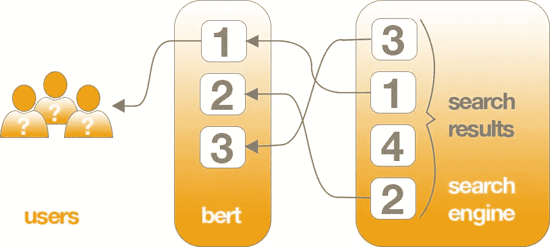
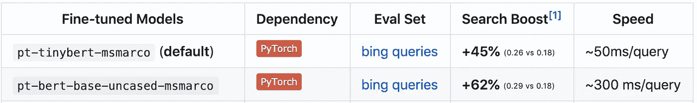

# 用于搜索的 TinyBERT:比 BERT 快 10 倍，小 20 倍

> 原文：<https://towardsdatascience.com/tinybert-for-search-10x-faster-and-20x-smaller-than-bert-74cd1b6b5aec?source=collection_archive---------19----------------------->

## 加速谷歌用来回答你的问题的算法，这样它就可以在标准的 CPU 上运行

*合著* [*科尔梯恩梯*](https://medium.com/@colethienes)



最近，[谷歌推出了一种理解搜索并决定你看到哪些结果的新方法。这种方法基于流行的开源转换器 BERT，使用语言理解来理解搜索背后的含义，这是传统的关键字方法无法做到的。](https://www.blog.google/products/search/search-language-understanding-bert/)

我们构建了 [NBoost](https://github.com/koursaros-ai/nboost) 来让非 Google 用户也能轻松使用高级搜索排名模型，并在此过程中开发了 TinyBERT for search，我将在本文中介绍它。

> 特别是对于更长、更具对话性的查询，或者像“for”和“to”这样的介词对意义非常重要的搜索， **Search 将能够理解您查询中单词的上下文。**你可以用自己觉得自然的方式搜索。
> - Pandu Nayak，谷歌搜索副总裁

# 让伯特变得更小更快

BERT 已经被证明可以改善搜索结果，但是有一个问题:运行这些查询理解模型需要大量的计算机。当速度很重要并且需要处理数百万次搜索时，这一点尤为重要。这一挑战如此艰巨，以至于谷歌甚至建立了自己的硬件来运行这些模型。而且他们用来在生产中运行这些 TPU 的代码是私有的，所以其他任何想运行它的人都要倒霉了。

为了在标准硬件上运行这些模型，我们使用 [**知识提炼**](https://nervanasystems.github.io/distiller/knowledge_distillation.html) ，一个更大的**教师**网络被用来训练一个更小的**学生**网络的过程，该网络保持了大部分的准确性，但使用了更少、通常更小的层，使其*更小*和*更快*。


[https://nerv anasystems . github . io/distiller/knowledge _ distillation . html](https://nervanasystems.github.io/distiller/knowledge_distillation.html)

# TinyBERT 建筑

我们使用来自[这个报告](https://github.com/huawei-noah/Pretrained-Language-Model/tree/master/TinyBERT)的代码进行知识提炼，并对其进行修改，用于在[女士马可](http://www.msmarco.org/)数据集上进行训练和评估。我们最初用 MS Marco 训练三元组在 PyTorch 中训练了一个教师 bert-base-uncased 网络。然后我们用它作为老师训练一个更小的学生 BERT 网络，只有 **4 个隐含层**而不是标准的 **12 个**。此外，这些层中的每一层都只有 **312** 的尺寸，而不是 **768** 的尺寸，使得模型更加轻便。我们在 BERT 的末尾使用前馈二进制分类层来产生搜索排名的分数。


BERT 用于对(问题、答案)或(搜索、搜索结果)对进行搜索评分，然后根据这些评分对结果进行排名

以下是我们使用的 tinyBERT 架构的示例 *bert_config.json* ，与标准 bert_config 的显著差异以粗体显示。

```
{
 “attention_probs_dropout_prob”: 0.1,
 “cell”: {},
 **“emb_size”: 312,**
 “hidden_act”: “gelu”,
 “hidden_dropout_prob”: 0.1,
 “hidden_size”: 312,
 “initializer_range”: 0.02,
 **“intermediate_size”: 1200,**
 “max_position_embeddings”: 512,
 “num_attention_heads”: 12,
 **“num_hidden_layers”: 4,**
 “pre_trained”: “”,
 “structure”: [],
 “type_vocab_size”: 2,
 “vocab_size”: 30522
}
```

# 评估模型



[1] MRR 对 BM25 排名前 50 的结果。宾查询指的是马尔科女士。K80 GPU 上的速度。

[Marco 女士](http://msmarco.org)是真实世界搜索引擎使用数据的最大公开来源，使其成为评估搜索和问答模型的理想选择。**它显示真实世界的必应搜索结果，以及用户最终点击了什么的信息**。当[伯特基地第一次在 MSMarco](https://arxiv.org/abs/1904.07531) 上使用的时候，它以 **0.05 MRR** 的成绩击败了最先进水平(很多)。基于 BERT 的解决方案仍然位居排行榜首位。我们的目标是找到一种方法，从一个在现实世界中使用足够快的模型中实现这种提升。

进来吧，TinyBERT。虽然在重新排名方面不如 BERT Base 有效，但我们的实验表明，它保留了 BERT Base 的 90%的 MRR 分数(0.26 比 0.29，从 BM25 重新排名前 50)，同时使模型 **~快 10 倍**， **~小 20 倍。然而，基于马尔科女士等学术基准的结果往往缺乏现实世界的普遍性，因此应该持保留态度。**