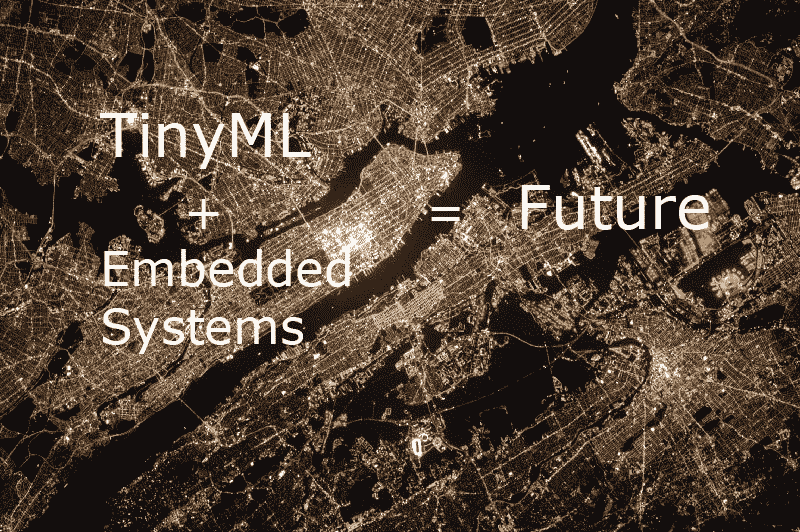
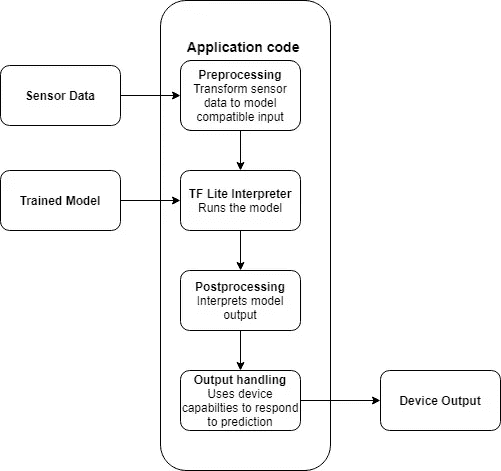

# 将机器学习添加到你的小应用程序中

> 原文：<https://towardsdatascience.com/tinyml-add-machine-learning-to-your-tiny-apps-b21c41ffb422?source=collection_archive---------40----------------------->

## 使用机器学习构建嵌入式系统项目指南

美国宇航局在 [Unsplash](https://unsplash.com/s/photos/city?utm_source=unsplash&utm_medium=referral&utm_content=creditCopyText) 拍摄的照片

您可能已经使用 NVIDIA 的 Jetson 板或 Raspberry Pi 设计了 ML 项目。对于构建汽车和机器人应用来说，这些都是非常强大的设备。例如，Jetson 使用强大的 GPU，满负荷运行时功率为几十瓦。

但你有没有想过在你的微型微控制器或 Arduino 项目中利用深度学习？嗯，你可能最终会想‘哦，这几乎不可能’。这些微型微控制器仅仅运行在几十或几百千字节的内存上。它们主要用于低功耗和低成本的应用程序，并且计算效率低下，无法运行深度学习功能。

你可能会惊讶地发现，你的 Android 手机使用什么机制来不断监听“Ok Google”呼叫词。我告诉你，它没有使用 Android 强大的处理器和千兆字节的 RAM 来运行强大的神经网络。相反，它只是使用运行在数字信号处理器(DSP)上的 14KB 神经网络来完成这项任务。这些 DSP 只有几十千字节的内存，功耗只有几毫瓦。

简而言之，为了将机器学习引入到运行在几千字节内存、低处理能力和寿命为几个月的硬币电池(能源成本低于 1 mW)上的设备中，TinyML 的这一想法被引入。结合深度学习和嵌入式系统，您现在可以通过集成简单的语音识别、通过运动传感器进行的手势检测以及通过摄像头传感器检测人员来构建令人惊叹的应用。

# 我需要什么硬件？

最初，从许多现成的板开始是一个好习惯。 [SparkFun 的 Edge](https://www.sparkfun.com/products/15170) 、 [Arduino Nano 33 BLE Sense](https://store.arduino.cc/usa/nano-33-ble-sense) 和 [Mbed STM32F746G 探索套件](https://os.mbed.com/platforms/ST-Discovery-F746NG/)是一些受欢迎的选项。如果你想建立一些现实的原型项目，你还需要一个麦克风，加速度计或摄像头。

# 我需要什么软件？

大多数开发者更喜欢 *TensorFlow* 和 *Keras* 来构建和训练深度学习网络。张量流模型基本上是一组指令，告诉解释器如何转换数据以产生输出。当我们想要使用这个训练好的模型时，我们将它加载到内存中，并使用解释器执行它。幸运的是，TensorFlow 提供了一个解释器来在这些微小的低功耗设备上运行模型。这套工具叫做 *TensorFlow Lite* 。 *TensorFlow Lite 转换器*用于将我们的模型转换为 TensorFlow Lite 格式。

TensorFlow Lite 有一个变种叫做*tensor flow Lite for micro controllers*，这是一个专门为运行在只有几十千字节可用内存的嵌入式设备上而设计的框架。

模型被转换后，就可以部署了。我们使用 tensor flow Lite for micro controller 的 C++库将模型加载到设备并进行预测。由于这是我们的模型满足我们的应用程序代码的一部分，我们需要编写一些代码，从传感器获取原始输入数据，并将其转换为与我们的模型被训练时相同的格式。然后，将转换后的数据传递到模型中，用于进行预测。

作者图片

# 包扎

TinyML 使我们能够将机器学习模型集成到 C++程序中，以创建用于在低内存和低功耗设备上部署的强大应用程序。微控制器无处不在，我们周围的不同设备中大约有 2500 亿个微控制器。想象一下，如果由这种微小的人类般的智能为它们提供动力，它们会给我们带来什么样的力量？