# Python 中快速数据分析的技巧和诀窍

> 原文：<https://towardsdatascience.com/tips-and-tricks-for-fast-data-analysis-in-python-f108ad32fa90?source=collection_archive---------13----------------------->


尼古拉斯·霍伊泽在 [Unsplash](https://unsplash.com/s/photos/quick?utm_source=unsplash&utm_medium=referral&utm_content=creditCopyText) 拍摄的照片

## 用 python 快速总结和描述数据集

python 编程语言有大量用于数据分析的内置函数和库。结合这些库可以产生非常强大的方法来总结、描述和过滤大量数据。

在本文中，我想分享一些关于如何结合 [pandas](https://pandas.pydata.org/) 、 [matplotlib](https://matplotlib.org/) 和一些内置 python 功能来快速分析数据集的技巧。

本文中的所有库都可以通过软件包管理器安装。

## 数据

在本文中，我将使用一个被称为成人收入数据集的数据集，它可以从 [UCI 机器学习库](https://archive.ics.uci.edu/ml/datasets/adult)下载。该数据集包含关于每个成年人的许多特征和一个目标变量，该变量告诉我们他们的收入是否超过 50，000 pa。

这里是我正在使用的库的所有导入。

```
import pandas as pd
import numpy as np
from sklearn import preprocessingimport matplotlib.pyplot as plt
%matplotlib inline
```

我使用 pandas 读取数据集并返回前几行。

```
data = pd.read_csv('adults_data.csv')
data.head()
```

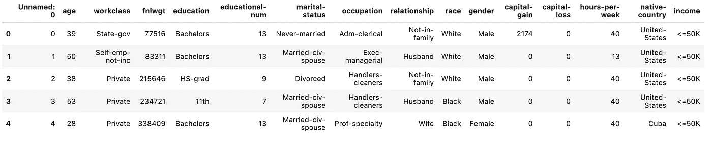

该数据集通常用于建立机器学习模型，该模型根据特征预测收入阶层。然而，在进入模型构建阶段之前，先进行一些数据分析是有用的。

## 形容

describe 函数允许我们快速查看数据集中数字要素的一些基本描述性统计数据。运行`data.describe()`我们可以看到我们的数据集有 32，561 行，我们可以看到每个数字特征的平均值，并了解每个特征的值分布情况。

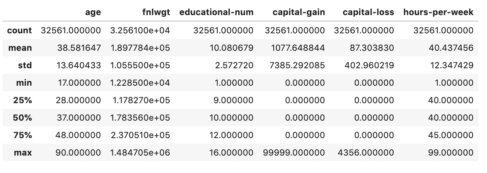

## 值计数

在这个数据集中，我们还有分类变量，对这些变量的分布有一个基本的了解也是很有用的。`value_counts()`函数提供了一种非常简单的方法来实现这一点。让我们用这个来检查一下`marital-status`的特性。

```
data['marital-status'].value_counts()
```

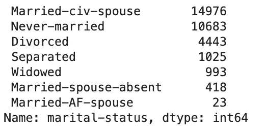

为了使其更容易可视化，我们可以通过添加少量额外代码来快速创建该值的条形图。标题是可选的，您可以使用通常的 matplotlib 功能自定义轴标签、颜色和图表的其他方面。

```
plt.title('Marital Status')
data['marital-status'].value_counts().plot.bar()
```

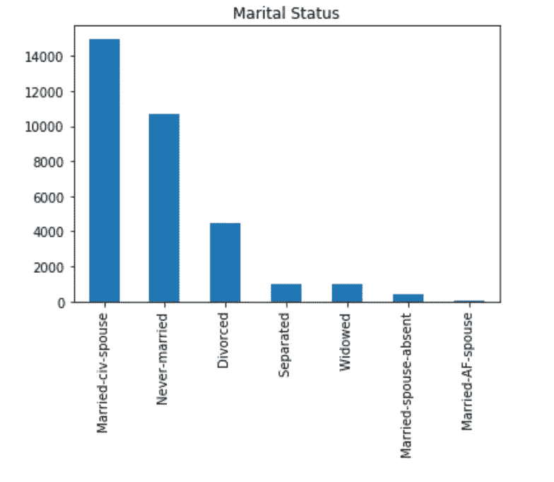

当我们有一个具有高基数(大量唯一值)的要素时，使用值计数绘图就不那么有效了。

```
plt.title('Native Country')
data['native-country'].value_counts().plot.bar()
```

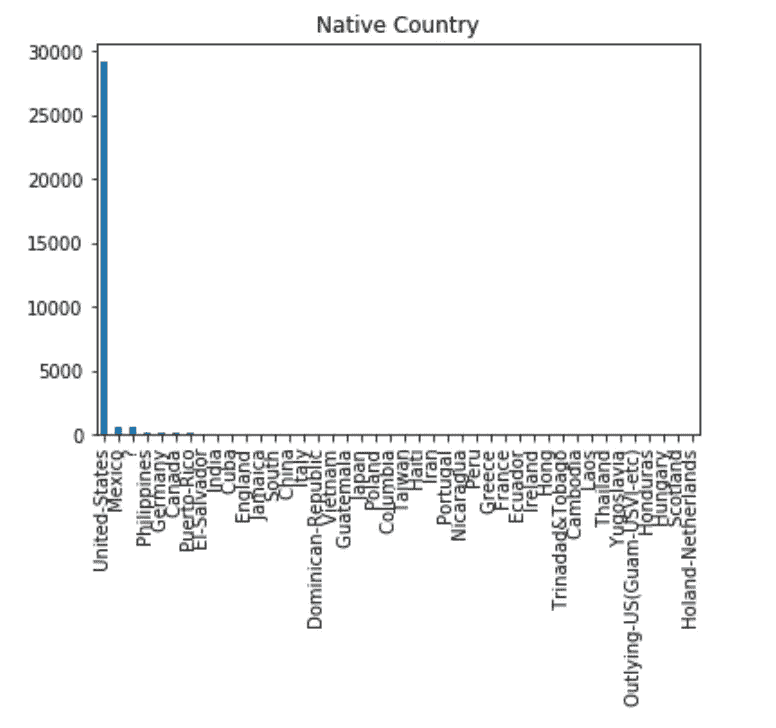

对于像 native-country 这样的要素，只绘制前 n 个值会更有用，因为这为我们提供了有用的洞察力。我们可以通过增加一点代码来实现。

```
plt.title('Native Country')
data['native-country'].value_counts().nlargest(10).plot.bar()
```

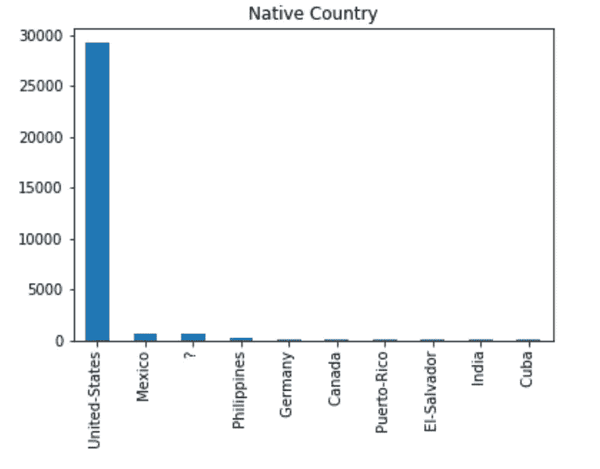

## 熊猫小组

当我们有数据要进行分段比较时，pandas groupby 函数非常有用。在该数据集中，我们希望执行分析以了解两个收入类别之间的差异以及要素差异的大小。pandas 的 groupby 函数提供了一种非常快速的方法来实现这一点。

如果我们运行下面的代码，我们可以分析两个收入组之间所有数值的均值差异。

```
round(data.groupby(['income']).mean(),2)
```

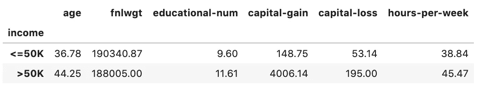

比较差异的更好方法是查看两组的分布差异。箱线图是一种很有用的方法。这可以通过与 groupby 一起使用绘图功能来实现。可视化如下所示。

```
data.groupby('income').boxplot(fontsize=20,rot=90,figsize=(20,10),patch_artist=True)
```

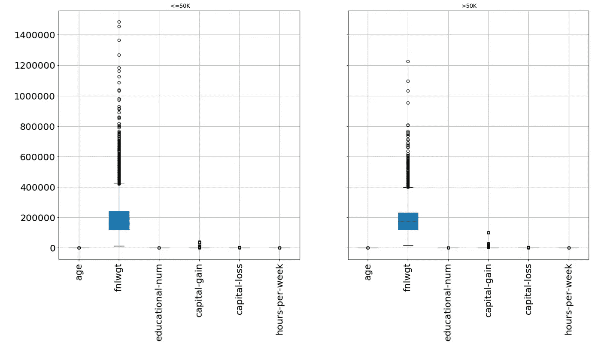

你会注意到，由于数值在不同的尺度上，很难比较这两种分布。为了克服这一点，我们可以[缩放](https://medium.com/greyatom/why-how-and-when-to-scale-your-features-4b30ab09db5e)这些值。为此，我使用了[scikit-learn](https://scikit-learn.org/)minmax scaler 函数。这会缩放这些值，使它们都位于 0 和 1 之间。我们现在可以清楚地看到一些特征之间的实质性差异，例如年龄和每周工作时间。

```
numeric_features = data.select_dtypes(include=['int64', 'float64']).columns
categorical_features = data.select_dtypes(include=['object']).columnsnumeric_data = data[numeric_features]
categorical_data = data[categorical_features]x = numeric_data.values 
min_max_scaler = preprocessing.MinMaxScaler()
x_scaled = min_max_scaler.fit_transform(x)
numeric_data = pd.DataFrame(x_scaled, columns=numeric_data.columns)
data_transformed = pd.concat([numeric_data, categorical_data], axis=1)
data_transformed.groupby('income').boxplot(fontsize=20,rot=90,figsize=(20,10),patch_artist=True)
```

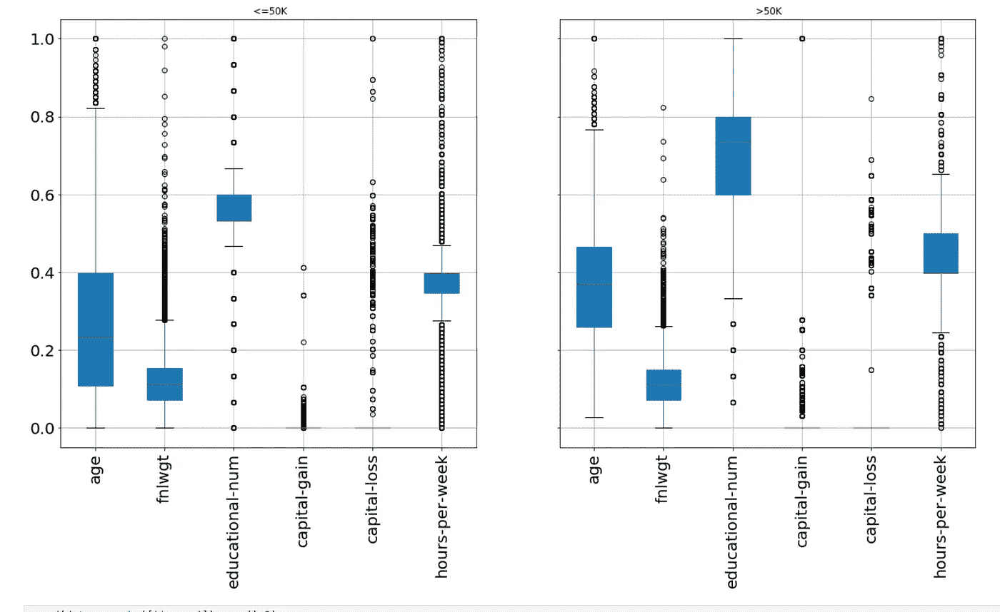

我们还可以使用 groupby 函数来比较分类特征。在下图中，我们可以很快发现，在高收入阶层中，男性人数多于女性。

```
data.groupby('income').gender.value_counts().unstack(0).plot.barh()
```

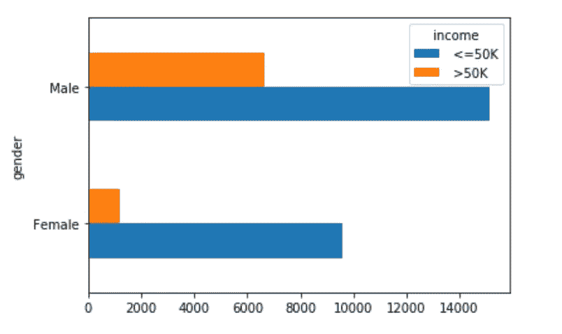

## 数据透视表

Pandas 的功能使您能够用 python 创建电子表格风格的数据透视表。数据透视表允许您快速汇总、分组和过滤数据，以执行更复杂的分析。

我们可以使用数据透视表来探索更复杂的关系。让我们更深入地研究一下性别和收入阶层之间的关系。女性挣得少是因为她们每周工作时间少吗？

```
pivot_workclass = pd.pivot_table(data, values=['hours-per-week'],
                                 index = 'gender',
                                 columns = 'income', aggfunc=np.mean, fill_value=0)
```

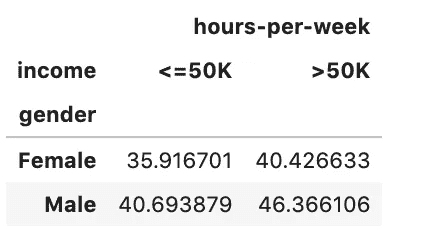

我们可以添加绘图功能，使这更容易可视化。

```
pivot_workclass = pd.pivot_table(data, values=['hours-per-week'],
                                 index = 'gender',
                                 columns = 'income', aggfunc=np.mean, fill_value=0).plot.bar()
```

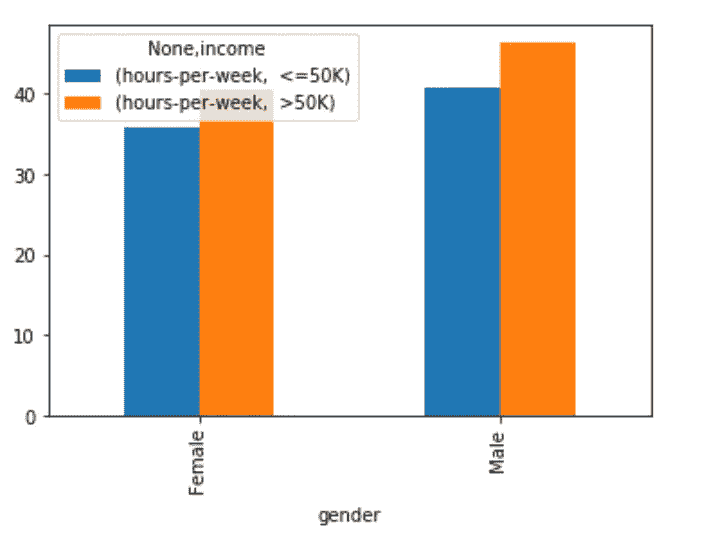

上面描述的所有方法都可以扩展，以创建更丰富、更复杂的分析。更多关于熊猫图书馆的信息，请看我之前的指南，可以在[这里](/5-minute-guide-to-plotting-with-pandas-e8c0f40a1df4)找到。

感谢阅读！