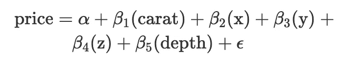

# RStudio 和 R Markdown 中的提示和技巧

> 原文：<https://towardsdatascience.com/tips-and-tricks-in-rstudio-and-r-markdown-7a464508b0c?source=collection_archive---------26----------------------->

## 或者如何更快更有效地写 R 代码


照片由[胡安·戈麦斯](https://unsplash.com/@nosoylasonia?utm_source=medium&utm_medium=referral)拍摄

如果你有机会和一位经验丰富的程序员一起工作，你可能会惊讶于她写代码的速度。在本文中，我分享了一些技巧和快捷方式，您可以在 RStudio 和 R Markdown 中使用它们来加速代码的编写。

# 运行代码

你很可能已经知道这个快捷方式，但是我仍然为新的 R 用户提到它。从您的脚本中，您可以运行一段代码:

```
command + Enter on Mac
Ctrl + Enter on Windows
```

# 在 R and R 减价中插入评论

要插入注释:

```
command + Shift + C on Mac
Ctrl + Shift + C on Windows
```

此快捷方式可用于:

*   当你想注释你的代码时。它会在行首添加一个`#`
*   对于 R Markdown 中的文本。它会在文本周围添加`<!--`和`-->`

请注意，如果您想要注释多行，请选择您想要注释的所有行，然后使用快捷键。如果您想要取消注释，请应用相同的快捷键。

# 编织一个 R 减价文件

您可以使用此快捷方式来编织 R Markdown 文档:

```
command + Shift + K on Mac
Ctrl + Shift + K on Windows
```

# 代码片段

代码段通常只有几个字符长，用作插入一段普通代码的快捷方式。你只需输入几个字符，然后按下`Tab`，它会用一个更大的代码来完成你的代码。然后再次使用`Tab`在需要定制的代码中导航。例如，如果您键入`fun`，然后按下`Tab`，它将自动使用所需代码完成代码，以创建一个函数:

```
name <- function(variables) {

}
```

再次按下`Tab`将在占位符间跳转，以便您进行编辑。所以你可以先编辑函数的名字，然后是变量，最后是函数内部的代码(自己试试！).

RStudio 中默认有很多代码片段。以下是我最常用的代码片段:

*   `lib`呼叫`library()`

```
library(package)
```

*   `mat`创建一个矩阵

```
matrix(data, nrow = rows, ncol = cols)
```

*   `if`、`el`、`ei`创建`if() {}`、`else {}`、`else if () {}`等条件表达式

```
if (condition) {

}else {

}else if (condition) {

}
```

*   `fun`创建一个函数

```
name <- function(variables) {

}
```

*   `for`创建 for 循环

```
for (variable in vector) {

}
```

*   `ts`插入带有当前日期和时间的注释(如果你有很长的代码并与他人分享，以便他们能看到它何时被编辑，这很有用)

```
# Tue Jan 21 20:20:14 2020 ------------------------------
```

*   `shinyapp`每次我创建一个新的[闪亮的应用](https://www.statsandr.com/tags/shiny/)

```
library(shiny)ui <- fluidPage(

)server <- function(input, output, session) {

}shinyApp(ui, server)
```

你可以看到所有默认的代码片段，并通过点击工具>全局选项…>代码(左侧栏) >编辑代码片段…

# R 降价中的有序列表

在 R Markdown 中，当创建这样的有序列表时:

1.  项目 1
2.  项目 2
3.  项目 3

而不是纠结于数字和打字

```
1\. Item 1
2\. Item 2
3\. Item 3
```

你可以简单地输入

```
1\. Item 1
1\. Item 2
1\. Item 3
```

获得完全相同的结果(自己尝试一下或者查看本文的代码！).这样，在创建新项目时，您就不必担心下一个号码是什么了。

更进一步，只要第一项是您想要开始的数字，任何数字实际上都将呈现相同的结果。例如，您可以键入:

```
1\. Item 1
7\. Item 2
3\. Item 3
```

这使得

1.  项目 1
2.  项目 2
3.  项目 3

然而，我建议总是使用你想要的数字来开始所有的条目，因为如果你移动了顶部的一个条目，列表将从这个新的数字开始。例如，如果我们将`7\. Item 2`从前面的列表中移到顶部，列表将变成:

```
7\. Item 2
1\. Item 1
3\. Item 3
```

这不正确地呈现了

1.  项目 2
2.  项目 1
3.  项目 3

# R Markdown 中的新代码块

当编辑 R Markdown 文档时，您将需要多次插入新的 R 代码块。以下快捷方式将使您的生活更轻松:

```
command + option + I on Mac (or command + alt + I depending on your keyboard)
Ctrl + ALT + I on Windows
```


R Markdown 中的新 R 代码块

# 重新格式化代码

一个清晰可读的代码总是更容易和更快地阅读(并且在分享给合作者时看起来更专业)。自动应用最常见的编码准则，如空白、缩进等。，使用:

```
cmd + Shift + A on Mac
Ctrl + Shift + A on Windows
```

例如，下面的代码不符合指导原则(并且不容易阅读):

```
1+1
  for(i in 1:10){if(!i%%2){next}
print(i)
 }
```

变得更加简洁易读:

```
1 + 1
for (i in 1:10) {
  if (!i %% 2) {
    next
  }
  print(i)
}
```

# RStudio addins

RStudio 插件是一些扩展，它们为从 RStudio 中执行高级 R 函数提供了一种简单的机制。更简单地说，当执行一个插件(通过单击插件菜单中的一个按钮)时，相应的代码被执行，而您不必编写代码。RStudio 插件的优势在于，与您自己编写代码相比，它们允许您更轻松地执行复杂和高级的代码。

我最常用的 addin 可能是`[{esquisse}](https://www.statsandr.com/blog/rstudio-addins-or-how-to-make-your-coding-life-easier/#esquisse)` [addin](https://www.statsandr.com/blog/rstudio-addins-or-how-to-make-your-coding-life-easier/#esquisse) ，它允许用`[{ggplot2}](https://www.statsandr.com/blog/graphics-in-r-with-ggplot2/)` [包](https://www.statsandr.com/blog/graphics-in-r-with-ggplot2/)以用户友好和交互的方式绘制图形，而不必自己编写代码。

RStudio 插件种类繁多，需要更详细的解释，所以我写了一篇文章专门讨论这些插件。见文章[此处](https://www.statsandr.com/blog/rstudio-addins-or-how-to-make-your-coding-life-easier/)。

# `{pander}`和`{report}`为美学

`{pander}`包中的`pander()`功能对于 [R Markdown](https://statsandr.com/blog/getting-started-in-r-markdown/) 文档和报告非常有用。这实际上不是一条捷径，但它极大地提高了 R 输出的美观性。

例如，参见下面独立性[卡方测试](https://statsandr.com/blog/chi-square-test-of-independence-in-r/)的默认输出与使用`pander()`函数(使用`[{ggplot2}](https://statsandr.com/blog/graphics-in-r-with-ggplot2/)` [包](https://statsandr.com/blog/graphics-in-r-with-ggplot2/)中的`diamonds`数据集)的相同测试的输出之间的差异:

```
library(ggplot2)
dat <- diamondstest <- chisq.test(table(dat$cut, dat$color))
test## 
##  Pearson's Chi-squared test
## 
## data:  table(dat$cut, dat$color)
## X-squared = 310.32, df = 24, p-value < 2.2e-16library(pander)
pander(test)
```


你需要的所有信息都显示在一个雅致的表格中。`pander()`函数适用于许多统计测试(不是所有测试，但我没有在 R 中的所有可用测试中尝试过)和回归模型:

```
# Linear model with lm()
model <- lm(price ~ carat + x + y + z,
            data = dat)
model## 
## Call:
## lm(formula = price ~ carat + x + y + z, data = dat)
## 
## Coefficients:
## (Intercept)        carat            x            y            z  
##      1921.2      10233.9       -884.2        166.0       -576.2pander(model)
```


pander 函数还制作数据集、表格、向量等。在 R Markdown 输出中可读性更好。例如，请参见下面的差异:

```
head(dat) # first 6 observations of a dataset## # A tibble: 6 x 10
##   carat cut       color clarity depth table price     x     y     z
##   <dbl> <ord>     <ord> <ord>   <dbl> <dbl> <int> <dbl> <dbl> <dbl>
## 1 0.23  Ideal     E     SI2      61.5    55   326  3.95  3.98  2.43
## 2 0.21  Premium   E     SI1      59.8    61   326  3.89  3.84  2.31
## 3 0.23  Good      E     VS1      56.9    65   327  4.05  4.07  2.31
## 4 0.290 Premium   I     VS2      62.4    58   334  4.2   4.23  2.63
## 5 0.31  Good      J     SI2      63.3    58   335  4.34  4.35  2.75
## 6 0.24  Very Good J     VVS2     62.8    57   336  3.94  3.96  2.48pander(head(dat))
```


```
summary(dat) # main descriptive statistics##      carat               cut        color        clarity          depth      
##  Min.   :0.2000   Fair     : 1610   D: 6775   SI1    :13065   Min.   :43.00  
##  1st Qu.:0.4000   Good     : 4906   E: 9797   VS2    :12258   1st Qu.:61.00  
##  Median :0.7000   Very Good:12082   F: 9542   SI2    : 9194   Median :61.80  
##  Mean   :0.7979   Premium  :13791   G:11292   VS1    : 8171   Mean   :61.75  
##  3rd Qu.:1.0400   Ideal    :21551   H: 8304   VVS2   : 5066   3rd Qu.:62.50  
##  Max.   :5.0100                     I: 5422   VVS1   : 3655   Max.   :79.00  
##                                     J: 2808   (Other): 2531                  
##      table           price             x                y         
##  Min.   :43.00   Min.   :  326   Min.   : 0.000   Min.   : 0.000  
##  1st Qu.:56.00   1st Qu.:  950   1st Qu.: 4.710   1st Qu.: 4.720  
##  Median :57.00   Median : 2401   Median : 5.700   Median : 5.710  
##  Mean   :57.46   Mean   : 3933   Mean   : 5.731   Mean   : 5.735  
##  3rd Qu.:59.00   3rd Qu.: 5324   3rd Qu.: 6.540   3rd Qu.: 6.540  
##  Max.   :95.00   Max.   :18823   Max.   :10.740   Max.   :58.900  
##                                                                   
##        z         
##  Min.   : 0.000  
##  1st Qu.: 2.910  
##  Median : 3.530  
##  Mean   : 3.539  
##  3rd Qu.: 4.040  
##  Max.   :31.800  
##pander(summary(dat))
```


```
table(dat$cut, dat$color) # contingency table##            
##                D    E    F    G    H    I    J
##   Fair       163  224  312  314  303  175  119
##   Good       662  933  909  871  702  522  307
##   Very Good 1513 2400 2164 2299 1824 1204  678
##   Premium   1603 2337 2331 2924 2360 1428  808
##   Ideal     2834 3903 3826 4884 3115 2093  896pander(table(dat$cut, dat$color))
```


```
names(dat) # variable names##  [1] "carat"   "cut"     "color"   "clarity" "depth"   "table"   "price"  
##  [8] "x"       "y"       "z"pander(names(dat))
```

*克拉*，*切工*，*颜色*，*净度*，*深度*，*表*，*价格*， *x* ， *y* 和 *z*

```
rnorm(4) # generates 4 observations from a standard normal distribution## [1] -1.8170575  0.2089859  1.0480589  0.1609936pander(rnorm(4))
```

*1.291* 、 *0.1842* 、 *-0.1146* 和 *-1.006*

这个技巧在编写 [R Markdown](https://statsandr.com/blog/getting-started-in-r-markdown/) 时特别有用，因为生成的文档看起来会更好。

另一个美观的技巧是`{report}`包中的`report()`函数。

与`pander()`类似，`report()`函数允许以更易读的方式报告测试结果——但它也为您解释结果。例如，参见[相关性测试](https://statsandr.com/blog/correlation-coefficient-and-correlation-test-in-r/):

```
# install.packages("remotes")
# remotes::install_github("easystats/report") # You only need to do that once
library("report") # Load the package every time you start Rreport(cor.test(dat$price, dat$carat))## Effect sizes were labelled following Funder's (2019) recommendations.
## 
## The Pearson's product-moment correlation between dat$price and dat$carat is positive, significant and very large (r = 0.92, 95% CI [0.92, 0.92], t(53938) = 551.41, p < .001)
```

测试结果与 *p* 值和相关系数一起显示并解释给您。

注意，`report()`功能可用于其他分析。在软件包的[文档](https://easystats.github.io/report/)中查看更多示例。

# 用`{equatiomatic}`提取方程模型

如果您经常需要在 R Markdown 报告中编写与统计模型相对应的方程，`[{equatiomatic}](https://cran.r-project.org/package=equatiomatic)`将帮助您节省时间。

下面是一个多元线性回归的基本示例，使用与上述相同的数据集(即`diamonds`来自`{ggplot2}`):

```
# install.packages("equatiomatic")
library(equatiomatic)# fit a basic multiple linear regression model
model <- lm(price ~ carat + depth,
            data = dat)extract_eq(model,
           use_coefs = TRUE)
```

价格= 4045.33 + 7765.14 克拉-102.17 克拉(深)+ ϵ

如果方程很长，您可以通过添加参数`wrap = TRUE`在多行中显示它:

```
model <- lm(price ~ carat + x + y + z + depth,
            data = dat)extract_eq(model,
           use_coefs = TRUE,
           wrap = TRUE)
```

价格= 12196.69 + 10615.5 克拉-1369.67 克拉+ 97.6 克拉+ 64.2 克拉-156.62 克拉(深)+ ϵ

请注意:

*   如果您在 R Markdown 中使用它，您需要为该特定代码块添加`results = 'asis'`,否则该方程将被呈现为 LaTeX 方程
*   在撰写本文时，它仅适用于 PDF 和 HTML 输出，不适用于 Word
*   每行的默认术语数是 4。您可以使用`terms_per_line`参数来更改它:

```
extract_eq(model,
           use_coefs = TRUE,
           wrap = TRUE,
           terms_per_line = 2)
```


*   `{equatiomatic}`也支持逻辑回归的输出。在[插图](https://cran.r-project.org/web/packages/equatiomatic/vignettes/intro-equatiomatic.html)中查看所有支持的型号
*   如果您需要没有实际参数估计的理论模型，请删除`use_coefs`参数:

```
extract_eq(model,
           wrap = TRUE)
```



在这种情况下，我更喜欢用β0 作为截距，而不是α。你可以用`intercept = "beta"`论点来改变这一点:

```
extract_eq(model,
           wrap = TRUE,
           intercept = "beta")
```


# 管道操作员`%>%`

如果您经常使用`{dplyr}`、`{tidyverse}`或`{magrittr}`软件包，以下是管道操作员`%>%`的快捷方式:

```
command + Shift + M on Mac
Ctrl + Shift + M on Windows
```

# 其他人

与许多其他程序类似，您也可以使用:

*   Mac 上的`command + Shift + N`和 Windows 上的`Ctrl + Shift + N`打开一个新的 R 脚本
*   Mac 上的`command + S`和 Windows 上的`Ctrl + S`保存您当前的脚本或 R Markdown 文档

感谢阅读。我希望这些提示和技巧对你有用。如果你正在使用其他的，请在评论区分享。

和往常一样，如果您有与本文主题相关的问题或建议，请将其添加为评论，以便其他读者可以从讨论中受益。

**相关文章:**

*   [安装和加载 R 包的有效方法](https://www.statsandr.com/blog/an-efficient-way-to-install-and-load-r-packages/)
*   我的数据符合正态分布吗？关于最广泛使用的分布以及如何检验 R 中的正态性的注释
*   [R 中的费雪精确检验:小样本的独立性检验](https://www.statsandr.com/blog/fisher-s-exact-test-in-r-independence-test-for-a-small-sample/)
*   [R 中独立性的卡方检验](https://www.statsandr.com/blog/chi-square-test-of-independence-in-r/)
*   [如何在简历中创建简历时间线](https://www.statsandr.com/blog/how-to-create-a-timeline-of-your-cv-in-r/)

*原载于 2020 年 1 月 21 日 https://statsandr.com*[](https://statsandr.com/blog/tips-and-tricks-in-rstudio-and-r-markdown/)**。**