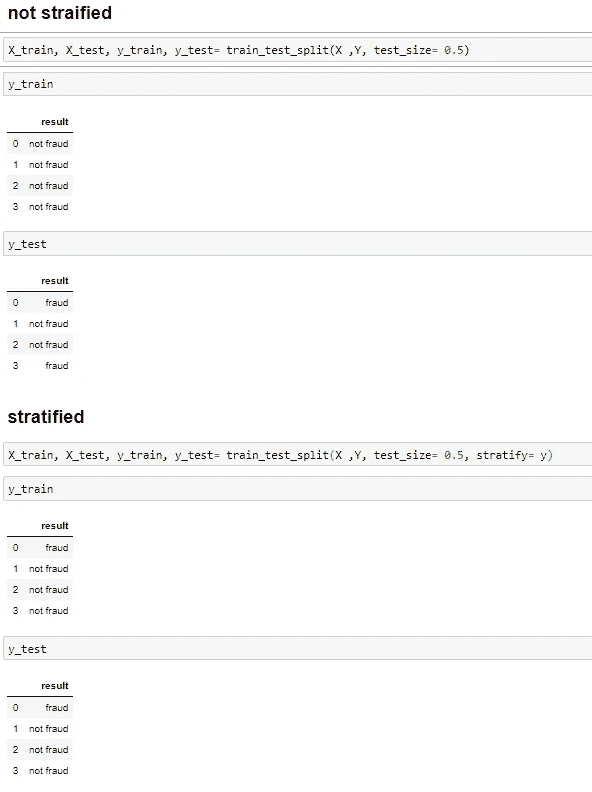
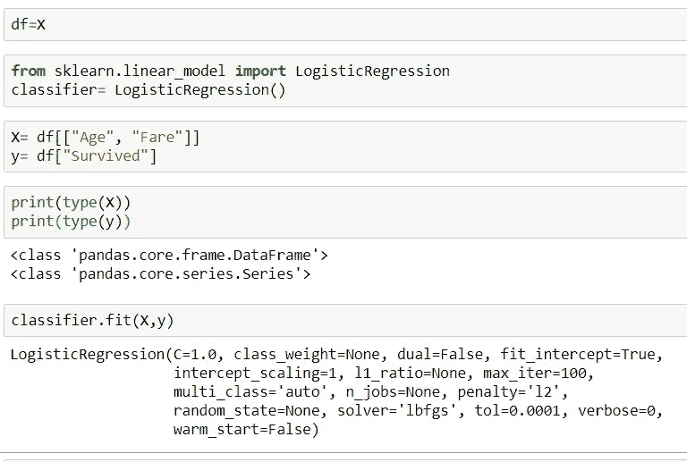
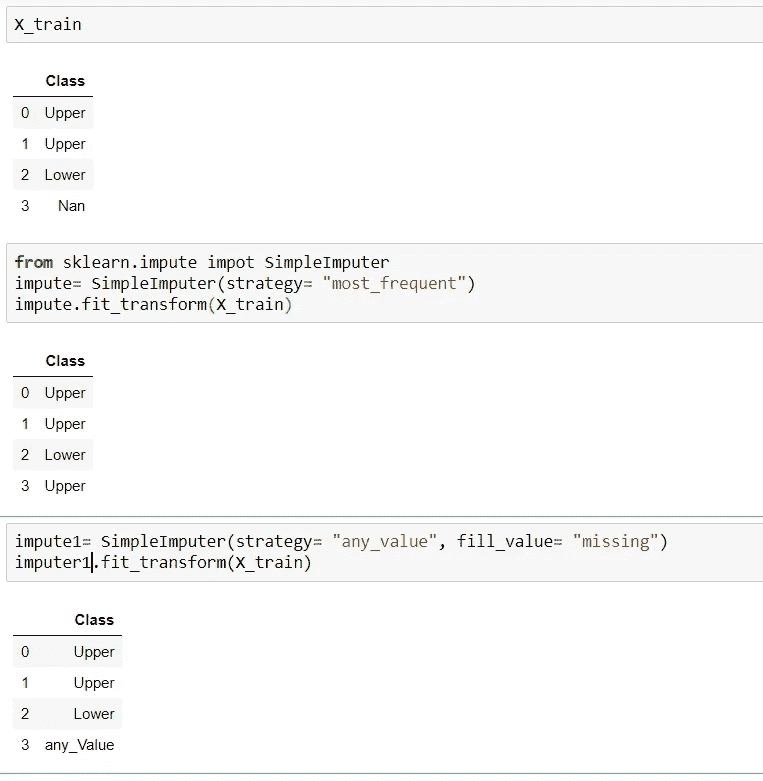
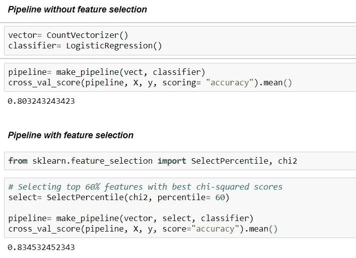
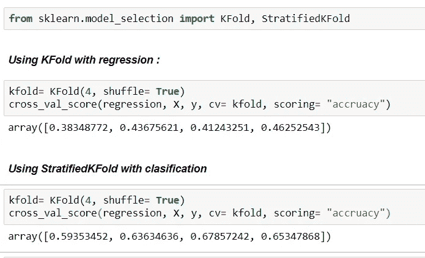
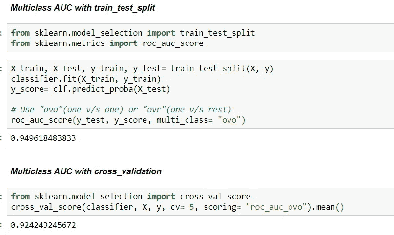
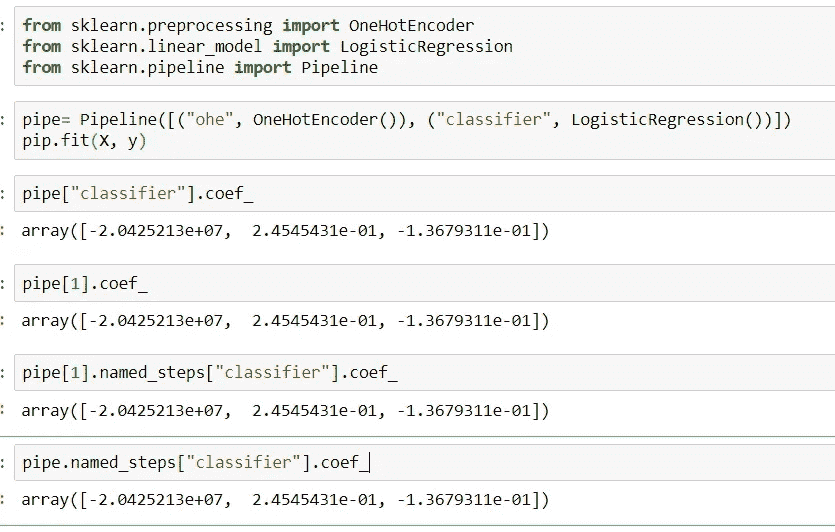
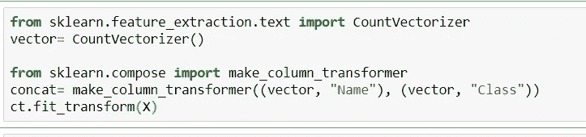
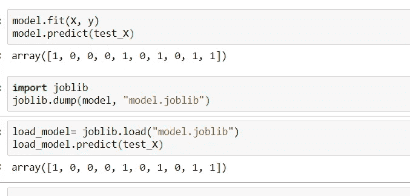

# Sci-kit 学习的技巧和诀窍会让你大吃一惊！

> 原文：<https://towardsdatascience.com/tips-and-tricks-of-sci-kit-learn-that-will-amaze-you-ce791431552e?source=collection_archive---------64----------------------->

## “学习不是偶然获得的，必须用热情去追求，用勤奋去对待。”——阿比盖尔·亚当斯

阿娜斯·阿尔尚蒂的 Unsplash

我从我的同事那里收到很多问题，比如“sci-kit learn 中最常用的函数是什么，我们可以学习这些函数来尽快开始构建数据科学项目”，这迫使我思考，“他们是在阅读了 [**帕累托原理**](https://en.wikipedia.org/wiki/Pareto_principle) 后接近我还是什么？**”。**

我不能告诉你在这样的库中学习一些特定的函数，因为每一个都有它们的使用案例和重要性。

在本文中，我将讨论 sci-kit learn library 的一些提示和技巧，它们在任何与数据相关的项目中都非常有用。

***这就是我们今天要讨论的:***

1.  **使用带有分层参数的 test_train_split()函数。**
2.  **何处不使用 values()函数。**
3.  **simple imputr()函数。**
4.  **管道中的特征选择。**
5.  **使用 K 折叠和带洗牌的分层折叠。**
6.  **使用 AUC 进行分类。**
7.  **四种方式监控流水线的步骤。**
8.  **CountVectorizer()和 make_column_transformer()。**
9.  **处理 Joblib 函数()。**

## 1.使用带有分层参数的 test_train_split()函数。

我们不能在回归和分类任务中使用具有相同参数的函数。

在分类问题中，我们寻找预测一些离散值，对吗？。我们也会意识到输出属性可能会有类不平衡。因此，在执行 train_test_split 操作时，分类比例不一定要保留在训练和测试数据中。

因此，为了解决这个问题，我们使用**分层参数**，如下图所示。

**例如:**

来源:我的图库

## **2。哪里不使用 values()函数？**

在将**系列或任何数据帧**传递给 sci-kit learn 时，不需要使用 **values** 函数，因为它知道如何访问底层的 **numpy 数组。**

**示例:**

来源:我的图库

## 3.**简单估算器()函数**

在进行数据分析时，我们经常会遇到一些列或行缺少标记为**“nan”的标签。**为了处理这种问题，我们用列的平均值代替 **nan** 值，有时用最频繁出现的词代替。

对于所有这些任务，我们在 sklearn 中有一个函数 **SimpleImput** 。

请参见下面的例子以获得更多的理解。

**举例:**

来源:我的图库

## 4.管线中的特征选择:

通过以下方式将**特征选择**添加到**管道**非常容易:

1.  通过使用 **SelectPercentile** 功能来保持最高得分特征。
2.  在预处理之后、模型构建之前添加特征选择。

**例如:**

来源:我的图库

## 5.使用 K 折叠和带洗牌的分层折叠。

如果我们正在考虑使用交叉验证，并且我们的数据集不是任意排序的，我们可以使用洗牌来获得更好的结果。这里有更多关于洗牌的信息。

**例子:**

来源:我的图库

## 6.使用 AUC 进行分类

如果我们执行具有类别不平衡的二元分类，AUC 可以是有效的评估度量。

**参见示例:**

来源:我的图库

## 6.监控流水线步骤的四种方法。

有四种方法来监控机器学习流水线的各个步骤。请参见下面的例子以获得更多的理解。

**例如:**

来源:我的图库

## 8.CountVectorizer()和[make _ column _ transformer()](https://scikit-learn.org/stable/modules/generated/sklearn.compose.ColumnTransformer.html)

如果我们想要[向量化](https://scikit-learn.org/stable/modules/generated/sklearn.feature_extraction.text.CountVectorizer.html)两个文本列并一次连接它们，请遵循以下步骤。

**例如:**

来源:我的图库

## 9.处理 Joblib 函数():

为了通过将我们的机器学习模型嵌入到任何实时 web 应用中来部署它，或者为了保存该模型以备后用，我们使用 sklearn 中可用的 **joblib 函数**。

参见下面的 E **示例**:

来源:我的图库

## 在我们走之前..

本文到此为止。我相信今天你们都已经了解了 sci-kit learn library 的一些新特性和功能。我没有包括第 10 个和更远的，因为我将在下一篇文章中描述它们。

在此之前，我需要知道你对这篇文章是否有用的回应。请在下面的评论区发表评论，让我知道我是否遗漏了什么，以便我可以在下一篇文章中纠正它。

请跟随凯文·马卡姆先生，因为他经常发布这样的提示和技巧。

**如果这篇文章对你有所帮助。请在这里支持我**【https://www.buymeacoffee.com/shobhitsri】

**谢谢你。**