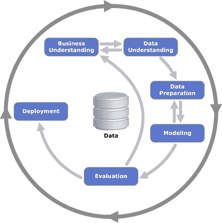

# 构建可信数据科学组合项目的技巧和资源

> 原文：<https://towardsdatascience.com/tips-resources-to-for-building-authentic-data-science-portfolio-projects-2068ce153ebb?source=collection_archive---------29----------------------->

## 了解不同的资源，让你的下一个作品集脱颖而出。

凯利·西克玛在 [Unsplash](https://unsplash.com/s/photos/pencil-drawing?utm_source=unsplash&utm_medium=referral&utm_content=creditCopyText) 上的照片

# 介绍

投资组合项目是任何数据科学的关键。他们不仅向招聘人员展示你的工作、能力和优势，也是应用你所学知识的好方法。

不幸的是，许多人并没有真正把他们的投资组合项目做到最好。相反，他们写一些代码，放在 Github 上，可能写一篇关于它的文章，或者，他们做一个 Kaggle 竞赛，把代码放在 Github 上。

不幸的是，这不是**创造投资组合项目的好方法。为什么？因为您创建的模型只是存在于笔记本中，因此您不了解模型部署。第二，大多数比赛都有干净的数据集供你使用，这与真实世界的数据形成了鲜明的对比，所以你并没有真正做获取数据的困难部分。**

我这篇文章，我将与你分享以下内容:

*   如何为投资组合想出好主意？
*   在那里你可以找到下一个作品集项目的免费开放数据集
*   如何着手投资组合项目
*   为了充分利用你的作品集项目，需要采取的两个基本步骤

> 所以，坐下来，放松，享受这篇文章吧！

# 第一步:为投资组合项目想出好主意

由 [Unsplash](https://unsplash.com/s/photos/ideas?utm_source=unsplash&utm_medium=referral&utm_content=creditCopyText) 上的[absolute vision](https://unsplash.com/@freegraphictoday?utm_source=unsplash&utm_medium=referral&utm_content=creditCopyText)拍摄的照片

这可以说是投资组合项目中最难的部分，因为有时你可能拥有做一个项目的所有技能，但你不知道在哪里以及如何应用它！

# 技巧 1:获得灵感

照片由[你好我是 Nik🎞](https://unsplash.com/@helloimnik?utm_source=unsplash&utm_medium=referral&utm_content=creditCopyText) on [Unsplash](https://unsplash.com/s/photos/inspirational?utm_source=unsplash&utm_medium=referral&utm_content=creditCopyText)

一种方法是从人们已经完成的其他项目中获取灵感。以下是一些很好的例子:

*   [斯坦福的 ML 类项目](http://cs229.stanford.edu/proj2018/):这其实是斯坦福的机器学习类的作品。由一个项目组成，报告和海报可以在网上看到。这是我最喜欢的项目之一，因为这里的一些项目令人惊叹，他们也友好地提供了 Github 代码。
*   [人工智能生成食谱](https://github.com/derekdjia/AI_Generated_Recipes):这个由[德里克·贾](https://github.com/derekdjia)制作的项目是一个很好的例子，展示了如何将你热爱的两件事结合成一个真正鼓舞人心的项目。
*   这个项目是一个很好的例子，并不是所有的投资组合项目都必须通过 Flask 部署或者制作成 Docker 映像。在这里，作者制作了一个 PyPi 包，帮助初学者选择项目的最佳模型。
*   [SnapStudy](https://github.com/abhattasali/SnapStudy) :不仅是一个很棒的想法，更是一个很棒的名字！这个项目允许用户拍下他/她的笔记，并自动生成抽认卡来帮助他们记忆！多酷啊！
*   [股票交易机器人](https://github.com/ilcardella/TradingBot):这也是一个真正的端到端强化学习项目的好例子。包含了非常清晰的项目说明和信息，这是一个很好的例子，说明如何将强化学习知识应用到现实世界中。

# 技巧 2:头脑风暴，解决生活中的问题

由 [Kelly Sikkema](https://unsplash.com/@kellysikkema?utm_source=unsplash&utm_medium=referral&utm_content=creditCopyText) 在 [Unsplash](https://unsplash.com/s/photos/brainstorm?utm_source=unsplash&utm_medium=referral&utm_content=creditCopyText) 上拍摄的照片

头脑风暴是为项目产生想法的一个非常强大的工具。科学证明，把事情写下来可以让你更有效率，我自己也经常对我在便利贴上写下的想法感到惊讶！。这篇教程是关于如何充分利用头脑风暴会议的完美指南。

另一种方法是找出你在日常生活中可能面临的问题，看看你能否利用数据科学解决这些问题。您可以提出以下问题:

1.  我可以利用 NLP 为自己写文章吗？
2.  我可以使用监督学习创建垃圾邮件分类器吗？
3.  我可以创建一个应用程序来推荐我应该看的网飞电影吗？或者我该听什么 Spotify？
4.  我可以创建一个应用程序，根据我喜欢的食物向我推荐食谱吗？
5.  我可以创建一个可以阅读我的笔迹的 NLP 应用程序吗？
6.  我能创造一个强化学习机器人来帮我交易股票吗？

诸如此类。重点是有很多事情可能会困扰你，但是不要抱怨它们，看看你是否可以利用 ML & Data 科学来提出创新的想法！

# 步骤 2:为你的作品集项目打开数据集

米卡·鲍梅斯特在 [Unsplash](https://unsplash.com/s/photos/data?utm_source=unsplash&utm_medium=referral&utm_content=creditCopyText) 上的照片

任何项目最重要的部分都是数据。没有数据，其他一切都没用。然而，为您的项目找到正确的数据可能是一项艰巨的任务。这就是为什么我编制了一份免费、开放和高质量数据集的清单，供你在下一个作品集项目中使用。

事不宜迟，这里是免费开放数据集的列表:

1.  [五三八](https://data.fivethirtyeight.com)
2.  [BuzzFeed 新闻](https://github.com/BuzzFeedNews/everything)
3.  [索克拉塔](https://dev.socrata.com/data/)
4.  [牛逼数据](https://github.com/awesomedata/awesome-public-datasets)
5.  [谷歌公共数据集](https://cloud.google.com/public-datasets)
6.  [Quandl](https://www.quandl.com)
7.  [Data.gov](https://www.data.gov)
8.  [学术洪流](https://academictorrents.com)
9.  [data.world](https://data.world)
10.  [AWS 公共数据集](https://registry.opendata.aws)
11.  [r/数据集](https://www.reddit.com/r/datasets/)
12.  [数据是复数](https://tinyletter.com/data-is-plural)
13.  [维基百科数据集](https://en.wikipedia.org/wiki/List_of_datasets_for_machine-learning_research)
14.  [IMF 数据](https://www.imf.org/en/Data)
15.  [世界银行数据](https://data.worldbank.org)
16.  [美国宇航局数据集](https://nasa.github.io/data-nasa-gov-frontpage/)
17.  [CERN 开放数据门户](http://opendata.cern.ch)
18.  [全球健康观察数据仓库](https://apps.who.int/gho/data/node.main)

这是我根据自己使用这些资源的亲身经历整理的清单。我鼓励你去看看，看看哪些是热门的，哪些不是。所以现在你肯定不能用“我找不到好的数据”这个借口了！

一旦您下载了数据集并准备好进行分析，请暂停片刻，并询问一些关键问题:

1.  这个数据集是如何创建的？
2.  数据从哪里来？
3.  数据中存在哪些数据类型？
4.  是否存在缺失值？如果是，他们是 MCAR、马尔还是马尔？
5.  数据有分类值吗？

# 步骤 3:如何着手一个投资组合项目

[Gary Bendig](https://unsplash.com/@kris_ricepees?utm_source=unsplash&utm_medium=referral&utm_content=creditCopyText) 在 [Unsplash](https://unsplash.com/s/photos/approach?utm_source=unsplash&utm_medium=referral&utm_content=creditCopyText) 上拍摄的照片

当我开始构建组合项目时，我通常会跳过所有的 EDA 和预处理，只运行一个 XGBoost 模型(是的，确实很愚蠢。)然而，我知道我需要遵循一个清晰的项目结构。然后就遇到了 *CRISPDM* 。

# 数据挖掘的跨行业标准流程

图片来自[维基百科](https://en.wikipedia.org/wiki/Cross-industry_standard_process_for_data_mining)

跨行业数据挖掘标准流程(CRISPDM)是一个流程模型，描述了描述数据科学生命周期的 6 个步骤。它本质上帮助你**计划**、**组织**、**构建**、**实施**你的项目。

太好了。但是这些步骤真正涉及到什么呢？好问题。所以，让我们具体讨论一下！

# CRISPDM 中涉及的步骤

在 [Unsplash](https://unsplash.com/s/photos/steps?utm_source=unsplash&utm_medium=referral&utm_content=creditCopyText) 上由 [Ambrose Chua](https://unsplash.com/@serverwentdown?utm_source=unsplash&utm_medium=referral&utm_content=creditCopyText) 拍摄的照片

# 1.业务理解/目标定义

在这里，您定义了项目的实际目标，以及您通过创建这个项目想要实现的目标。这可以分为 3 个阶段:

*   **目标:**在这里，你定义项目的目标和你试图完成的任务。您还需要调查数据是否可以用来解决这个问题
*   资源评估:在这里，你调查项目所需的资源，以及从哪里和如何获得这些资源。你会在本地工作，还是在云上工作？您的数据需要从多个位置汇集吗？
*   **工具评估:**在这里，您可以根据项目的目标，选择您认为最适合这个项目的最佳工具和技术

# 2.数据理解

好了，现在你已经理解了你想要达到的目标，你开始做你的分析。这些步骤可以分解为以下任务:

**数据收集:**从收集数据开始。您可以利用 REST API、数据仓库服务或其他方法来收集数据并将其整合到一个可用的数据集中

**数据描述:**从做一些 EDA 开始，查看数据的基本结构，对数据有一个感觉，并理解您正在处理的数据类型

**数据探索:**在这里，您可以更深入地研究您的数据。您开始执行更复杂的查询，在数据中寻找隐藏的模式，并试图找到数据中对当前问题有关键见解的方面

**数据评估:**你开始评估数据的质量。你会问这样的问题:

*   数据干净吗？
*   是否存在缺失值？
*   我需要删除一些功能吗？
*   我需要如何预处理我的数据？
*   是否需要功能缩放？

# 3.数据准备

这是您准备用于模型的最终数据的步骤。这里的阶段如下:

*   **数据选择:**选择您将需要的数据，并从您的数据中移除不需要的特征。
*   **数据清洗:**这个阶段通常是最长的。您可能需要估算、更正、删除和格式化值
*   **数据构建:**特征工程。在这种情况下，您可以使用从数据分析中获得的见解来了解如何智能地利用现有要素来构建有望使您的模型受益的新要素。您可能还需要使用不同的转换来转换某些值
*   **数据集成:**将不同的数据集组合在一起，形成一个完整的数据集
*   **数据格式化:**您可能需要格式化某些值，例如，您可能想要将字符串和分类值编码/调整为数值，以便从特征中获得有用的信息

# 4.建模

可能是项目中最令人愉快和期待的部分。这个阶段分为 4 个部分:

1.  **选择建模技术**:确定尝试哪些算法(如回归、神经网络)。这可以通过尝试几种基线方法并同时对它们进行评估来实现
2.  **生成测试设计**:根据您的建模方法，您可能需要将数据分成训练集、测试集和验证集。您可能会决定使用交叉验证来更好地了解您的模型将如何推广到新数据。确保**而不是**在测试集上评估您的数据！
3.  **构建模型**:听起来可能很迷人，但这可能只是执行几行代码，如“reg = LinearRegression()。fit(X，y)"。这也可以包括将一组模型组合在一起，称为*集合。*
4.  **评估模型**:通常，多个模型相互竞争，数据科学家需要根据领域知识、预定义的成功标准和测试设计来解释模型结果。
5.  **调整模型:**选择理想模型后，您可能希望调整模型的参数，以获得与数据的最佳拟合。

# 5.估价

周期的这一阶段关注的是哪个模型最适合目标和项目，并计划接下来的步骤。这个阶段可以分为以下几个部分:

*   **评估模型:**你可以根据你的领域问题使用不同的度量标准来调查，看看哪个模型表现最好。您必须选择最符合项目目标的模型。
*   **复习项目:**这是重要的一步。你回顾整个周期，看看你是否可以做得更好。你做了彻底的 EDA 吗？是否选择了最佳功能？总结你的发现，并根据需要调整你的项目
*   **确定后续步骤:**根据模型的性能以及它满足项目目标的程度，您可以决定继续进行部署，或者您可以回顾整个周期，看看您是否可以批准项目的某些方面。

# 部署

很抱歉打破你的幻想，但是一个模型对你笔记本里面的人来说不是很有用！您需要有一个部署模型的计划。其中涉及的步骤如下:

*   **计划开发:**为您将如何部署模型开发一个清晰而简明的计划

1.  **计划监控和维护:**制定一个全面的监控和维护计划，以避免在模型的操作阶段(或项目后阶段)出现问题。
2.  **生成最终报告:**项目团队记录项目摘要，其中可能包括数据挖掘结果的最终演示。
3.  **回顾项目:**进行项目回顾，了解哪些进展顺利，哪些可以做得更好，以及将来如何改进。

这些原则将极大地帮助你清晰地构建你的投资组合项目，这样你就不会从一个阶段跳到另一个阶段。如果在任何阶段你不确定某件事，总是穿越回这个周期，看看你是否能改进什么。

# 为了充分利用您的项目，需要使用的 2 项关键资产

Silas k hler 在 [Unsplash](https://unsplash.com/s/photos/key?utm_source=unsplash&utm_medium=referral&utm_content=creditCopyText) 上拍摄的照片

我把这两种方法作为它们自己的一部分的原因仅仅是因为我还没有看到足够的组合项目利用它们。这两种方法被低估了，但它们在以下方面有很大帮助:

1.  排除故障
2.  减少错误

# 关键资产 1:伐木

照片由[稍微有用的](https://unsplash.com/@usefulcollective?utm_source=unsplash&utm_medium=referral&utm_content=creditCopyText)在 [Unsplash](https://unsplash.com/s/photos/logging?utm_source=unsplash&utm_medium=referral&utm_content=creditCopyText) 上拍摄

毫无疑问，我从未见过使用最少的策略是日志记录。它如此简单，却很少被使用。本质上，日志记录*跟踪你的代码*并且*记录关键信息，如果你在项目中开始遇到问题，你可以通过*查看这些信息。

我一直都在使用这个工具，并且我已经捕获了许多讨厌的 bug，否则这些 bug 就会进入产品中，并且会迫使我花费无数的时间来修复它们。如果你想学习如何使用日志记录，这里有一篇由 [Real Python](https://realpython.com/python-logging/) 撰写的关于日志记录的文章，老实说，这是你唯一需要阅读的教程，因为它非常全面。

# 关键资产 2:建立 CI/CD 渠道

由[凯西·霍纳](https://unsplash.com/@mischievous_penguins?utm_source=unsplash&utm_medium=referral&utm_content=creditCopyText)在 [Unsplash](https://unsplash.com/s/photos/pipeline?utm_source=unsplash&utm_medium=referral&utm_content=creditCopyText) 上拍摄

这也是一个被严重低估和利用不足的策略。我怎么强调测试驱动开发的重要性和它所拥有的无数好处都不为过。建立稳固的 CI/CD 渠道有助于实现以下目标:

1.  在 bug 投入生产之前尽早捕捉它们
2.  如果有严重的错误，回滚到以前的代码
3.  在开发的所有阶段跟踪您的代码
4.  将项目的不同方面划分到不同的工作空间中，以便对过程的所有阶段进行单独的跟踪和评估。

就我个人而言，我喜欢在设置 CI/CD 管道时使用 Travis CI 和 Git。但是，您可以随意使用您想要的任何 CI 或 CD 工具。

# 结论

虽然没有人是完美的，但我相信一个人应该永远为之奋斗。在这里，我给出了让你的项目脱颖而出的技巧和资源，以及如何充分利用你的项目。我已经描述了应该执行的端到端循环，以及如何使用两种被低估的方法在下一个项目中真正达到最大效率。

我希望这篇文章以某种方式帮助了你，我希望你现在已经准备好构建有史以来最真实的投资组合项目了！确保不断更新更多内容，永远做最好的自己！

照片由[威廉·冈克尔](https://unsplash.com/@wilhelmgunkel?utm_source=unsplash&utm_medium=referral&utm_content=creditCopyText)在 [Unsplash](https://unsplash.com/s/photos/thank-you?utm_source=unsplash&utm_medium=referral&utm_content=creditCopyText) 上拍摄