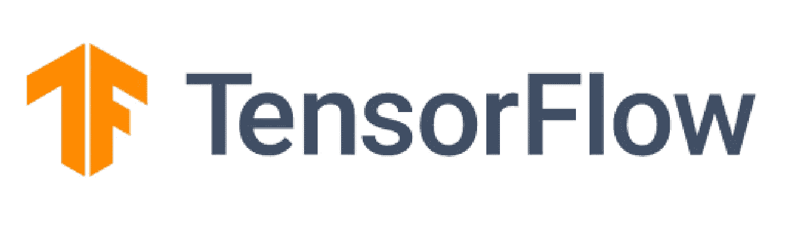
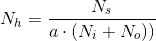

# 从 10 天的 ML 挑战看如何建立更好的深度学习模型

> 原文：<https://towardsdatascience.com/tips-to-building-better-deep-learning-models-from-10-days-of-ml-challenge-2cd84f12e0a4?source=collection_archive---------45----------------------->



资料来源:tensorflow.org

这些建议是我在参加 10 天 ML 挑战赛时制定的，这是孟买的 T [ensorFlow 用户组](https://twitter.com/tfugmumbai)的一项精彩倡议，旨在鼓励人们更多地学习或实践 ML，而不一定是 TensorFlow。流程是这样的，你会在一天开始时被分配一项任务，你被期望完成任务并在推特上发布你的结果。任务可以是从预处理数据到构建模型到部署模型的任何事情。我建议你仔细检查挑战的任务，并亲自尝试，不管你是初学者还是实践者。我将继续分享我从这些任务中获得的主要收获。我所有的解决方案和挑战问题的陈述都是开源的-

[](https://github.com/Rishit-dagli/10-Days-of-ML) [## Rishit-dagli/10 天 ML

### TFUG 孟买发起的 ML 10 天的存储库。所有的代码将在每天 7 点左右被推送到回购处…

github.com](https://github.com/Rishit-dagli/10-Days-of-ML) 

# 我的外卖

挑战最好的部分是，它不像一个核心竞争，而是一个促进学习的倡议，这意味着如果你不知道一个概念或有你无法修复的错误，你可以向这个精彩的社区提出并获得支持。这对初学者尤其起到了很大的作用。更好的一点是，你还会得到相关的链接来研究完成挑战所需的主题。

我所有相同的输出都可以在[这个线程](https://twitter.com/rishit_dagli/status/1242102029473873921?s=20)中得到

**第一天**

我们被要求为可用的新冠肺炎数据集制作一些交互式图表[这里](https://data.humdata.org/hxlproxy/api/data-preview.csv?url=https%3A%2F%2Fraw.githubusercontent.com%2FCSSEGISandData%2FCOVID-19%2Fmaster%2Fcsse_covid_19_data%2Fcsse_covid_19_time_series%2Ftime_series_19-covid-Confirmed.csv&filename=time_series_2019-ncov-Confirmed.csv)。首先你必须建立一个-

*   国家图表
*   日期图表
*   洲状图

这里的一个主要问题是数据集没有纬度或经度数据，您可以将这些数据传递到函数中来创建一个洲级图表。所以，我所做的是从 Kaggle 获得另一个国家和大陆数据集，并在我的原始数据集中添加一个名为“大陆”的列。这就解决了问题。有了这么多的数据，我看到一些人制作了巨大复杂的图表，由于这些图表的目的，简化事情和便于分析是一种挑战。你再也无法从中观察到任何模式。例如，一个简单的散点图向我展示了一些国家的增长率就像教科书上的指数图，所以我用`ln(x1)`代替了特征`x1`，它几乎是线性的！

> 制作更简单、更容易理解的图表，通过这些图表，你可以分析数据，发现一些事情或模式，而不是复杂的图表，这些图表没有太大意义，违背了原因。

**第二天**

第二天是关于特征工程和泰坦尼克号数据集的数据预处理，这里是。Titanic 是一个很好的候选对象，因为我们在 Titanic 数据集中看到了许多变化和低相关性特征，因此采用良好的特征工程和预处理策略非常重要。此外，你还可以做一些数据可视化。

> 特征工程是将原始数据转换为更好地代表预测模型潜在问题的特征的过程，从而提高对未知数据的模型准确性。

您可以在这个数据集本身中使用许多方法，如分类转换、分类列、热编码等等。自己尝试一下。

**第三天**

我们终于到了构建模型的部分，我们必须预测[贷款状态](http://iali.in/datasets/loan_status_train.csv)、[谷物评级](http://iali.in/datasets/cereal.csv)以及为高级用户分析[评论毒性](https://www.dropbox.com/s/ggl9krhh6dcwhhz/train.csv)的 NLP 任务。前两项任务非常简单，针对的是初学者，处理毒性数据非常棒。从 NLP 任务中得到的一个简单但有力的观察是，最好选择 RNN/ LSTM/ GRU 单位作为词汇量的倍数。

> 尝试选择你的递归层的单元数作为词汇大小的倍数，并尝试通过一个首选的相似性度量来选择你的嵌入维度。此外，不要简单地堆积你的循环层，而是尝试改进你的整体模型架构。选择嵌入维数为特征数的 4 次方根的倍数，模型做得很好。

**第四天**

我们最终在 Expedia 数据集上实现了无监督学习，这里是 T4。数据集非常大，有超过 2 GB 的数据，因此在受限环境下处理如此巨大的数据集时必须采取一些预防措施。你可以使用一些技巧来这样做，就像你应该清除你的中间张量和变量，你可以很容易地使用

```
del [variable_name]
```

您还应该尝试使用并行处理技术获取数据，同时使用预处理技术在 map 函数中运行它们，并充分利用您的 CPU 内核。在我的方法中，我已经使用云做了一些高成本的操作，比如 PCA 或 LDA，你也应该试着做同样的事情。你也不应该跳到像受限玻尔兹曼机器这样的算法上，在这种情况下，K-Means 和玻尔兹曼机器之间有大约 0.8%的精度差异，这里使用 K-Means 和简化你的算法比一点精度更有意义。

> 总是获取数据，并在一个`map`中并行地对其进行预处理。尽可能清除中间张量和变量，以释放内存，从而获得更好的性能。你应该总是喜欢简单而不是精确的小变化。

**第五天**

我们被要求为著名的狗和猫的数据集建立模型[这里](https://storage.googleapis.com/mledu-datasets/cats_and_dogs_filtered.zip)。这个想法是使用卷积神经网络或 CNN 来做同样的事情，并找出图像中的特征。我使用了两种方法来完成这项任务，一种是从初始数据集进行迁移学习，冻结一些层，并在此之下添加一些密集层。我重新训练了我在初始模型下面添加的层，并以良好的准确性结束。对于另一种从头开始构建网络的方法，我使用了几个卷积层和池层来完成这项工作。为了防止过度拟合，我还使用了正则化、去除图层和图像增强，这些都可以通过 tensor flow[轻松实现。两者都存在于回购中。](https://medium.com/u/b1d410cb9700?source=post_page-----2cd84f12e0a4--------------------------------)

> 你应该总是尝试使用正则化，放弃层和图像增强来克服过度拟合。也尝试使用奇数内核大小，如 3x3 或 5x5。不要只是不断增加你的通道数，你可能会得到更好的训练精度，但数据过拟合。总是从使用较小的滤波器开始是为了收集尽可能多的局部信息，然后逐渐增加滤波器宽度以减小生成的特征空间宽度来表示更多的全局、高级和代表性信息。

**第六天**

第六天我们有两项任务，为时尚 MNIST 制作模型，为预测肺炎制作 x 光图像。这又是一个图像问题，我们被期望使用 CNN。

> 如果数据集不像时尚 MNIST 那样复杂，就不要浪费时间制作一个 10 层左右的庞大模型架构。

X 射线肺炎问题有点棘手，我们还需要对数据进行一些特征工程。在研究这个问题时，我发现了一些非常有用的实验结果，我认为人们应该遵循这些结果。

> ****批量规格化*** *一般必须在通过包含激活功能的层之后，在脱落层(如果有的话)之前，放置在架构中。sigmoid 激活函数是一个例外，其中您需要在激活前放置批处理规范化图层，以确保在应用函数前值位于 sigmoid 的线性区域内。K* 在网络的初始阶段保持特征空间宽而浅，并在接近末端时使其变得更窄和更深。*
> 
> ***(非常重要)将辍学层放在最大池层之后**。如果放置在 Max-Pool 图层之前，则由 Dropout 移除的值可能不会影响 Max-Pool 图层的输出，因为它会从一组值中选取最大值，因此只有在移除最大值后，才能考虑移除要素依赖关系。*

***第七天***

*这都是关于 NLP 的，我们再次面临两个挑战，分析 [IMDB 评论](https://www.kaggle.com/lakshmi25npathi/sentiment-analysis-of-imdb-movie-reviews)，这也是一个非常著名的数据集，以及通过 [Twitter 数据集](https://www.kaggle.com/nitin194/twitter-sentiment-analysis)分析评论的情绪。*

> *每个 LSTM 层都应该有一个下降层。该层将通过在训练期间忽略随机选择的神经元来帮助防止过度拟合，并因此降低对单个神经元的特定权重的敏感性。20%通常用作保持模型准确性和防止过度拟合之间的良好折衷。*

*这里的主要挑战是选择 LSTM/ GRU 单位的数量。我用 K-Fold 交叉验证来做到这一点，如果你不想深入研究它的工作原理，你可以用这个简化的结果*

**

**Nᵢ* 是输入神经元的数量， *Nₒ* 是输出神经元的数量，ns 是训练数据中的样本数量，a 代表比例因子。*

> *这里的 a 或α代表比例因子，通常在 2 到 10 之间。您可以将α视为每个神经元的有效分支因子或非零权重的数量。我个人建议您将α设置在 5 到 10 之间，以获得更好的性能。*

*这是我用嵌入式投影仪制作的一个很棒的可视化图像*

*IMDB 数据可视化*

***第八天***

*对可用的消费者投诉数据的文档或文本进行聚类[这里](https://www.kaggle.com/dushyantv/consumer_complaints)是第 8 天的任务。任务是将投诉数据分成不同的类别。我尝试了许多不同的算法，如 K-Means、分层、模糊、密度聚类和受限机器，K-Means 再次给了我最好的结果。我使用肘方法和轮廓曲线，以了解相同的最佳集群数。我将再次举这个例子来说明人们应该选择简单而不是一点点性能。在这种情况下，亲和度级数给了我最好的 Fowlkeys-Mallows 分数，比 K-Means 分数稍高一点，所以我最终改用 K-Means。*

> *在模型可解释性和性能或准确性之间的权衡中，您应该更喜欢小差异情况下的可解释性。*

***第九天和第十天***

*这些天是关于 TensorFlow JS 的，我们必须部署运行在浏览器本身的模型。如果你对 TF.js 了解不多，你可以在这里阅读我的博客*

*[](https://medium.com/analytics-vidhya/getting-started-with-deep-learning-in-browser-with-tf-js-1e949b911e31) [## TF.js 浏览器深度学习入门

### 如果你是机器学习的初学者，并想开始在浏览器中开发模型，这是为…

medium.com](https://medium.com/analytics-vidhya/getting-started-with-deep-learning-in-browser-with-tf-js-1e949b911e31) 

我们必须用 TF.js 构建一个我们选择的项目。这些天我构建了两个项目，一个实时文本情感分析器和一个可以确定你的姿势的 web 应用程序。姿态检测建立在 Posenet 模型之上。基于浏览器的推理或训练要小心谨慎，你不希望你的进程阻塞你的计算机或用中间变量填充它。这里的一个好主意是使用类似 Firebase 的东西来托管一个经过训练的模型，并从您的 web 应用程序调用它。当进行实时推理时，确实有许多预处理要做。您也不应该阻塞任何线程并异步运行您的流程，以便在您的模型被加载并准备就绪时不阻塞您的 UI。

我见过很少有人把他们所有的 JS 代码写在 HTML 本身的两个`script`标签之间，或者把他们所有的代码放在一个单独的`index.js`文件中，现在你只有一个包含所有代码的文件。从开发人员的角度来看，这是一个非常糟糕的方法，您应该尝试将代码分成一个文件，一个用于获取数据，另一个用于加载模型，另一个用于预处理，等等。这使得其他人理解你的代码变得非常容易。

> 使用奇妙的`tf.tidy`几乎是强制性的，它让您的运行时不受中间张量和其他变量的影响，这些变量可能是您为了获得最佳内存利用率和防止内存泄漏而创建的。
> 
> 异步运行你的进程，你可以简单地在定义函数时使用关键字 a `async`，在调用函数时使用关键字`await`，这不会冻结你的 UI 线程，非常有用。
> 
> 我建议通过应用权重量化来缩小模型大小。通过量化模型权重，我们可以将模型的大小缩小到原始大小的四分之一。

# 结果

挑战赛的结果于 2020 年 4 月 9 日揭晓，我是获胜者之一😃。令我高兴的是，由于惊人的参与度，我还被提升为团队的导师。

感谢 [Sayak Paul](https://medium.com/u/c7edfd638e74?source=post_page-----2cd84f12e0a4--------------------------------) 、 [Ali Mustufa Shaikh](https://medium.com/u/f09a1a9d7d10?source=post_page-----2cd84f12e0a4--------------------------------) 、 [Shubham Sah](https://medium.com/u/8b51f0db34f2?source=post_page-----2cd84f12e0a4--------------------------------) 、 [Mitusha Arya](https://medium.com/u/8f6c4339ae29?source=post_page-----2cd84f12e0a4--------------------------------) 和 [Smit Jethwa](https://twitter.com/jethwa_smit) 在项目期间的指导。* 

# *关于我*

*大家好，我是里希特·达利*

*[推特](https://twitter.com/rishit_dagli)*

*[网站](https://rishit.tech/)*

*如果你想问我一些问题，报告任何错误，建议改进，给我反馈，你可以发邮件给我*

*   *【rishit.dagli@gmail.com】*
*   *[hello@rishit.tech](mailto:hello@rishit.tech)*