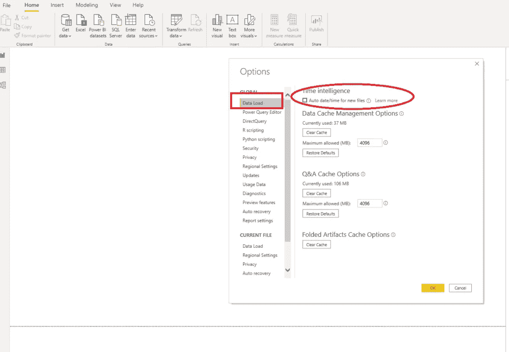
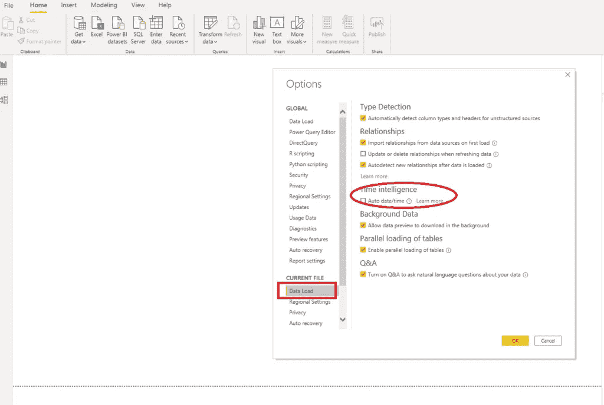
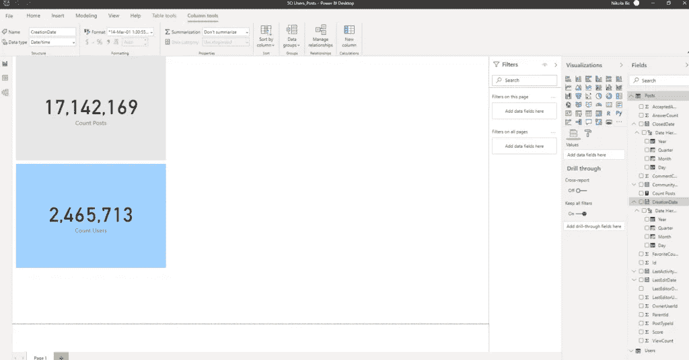
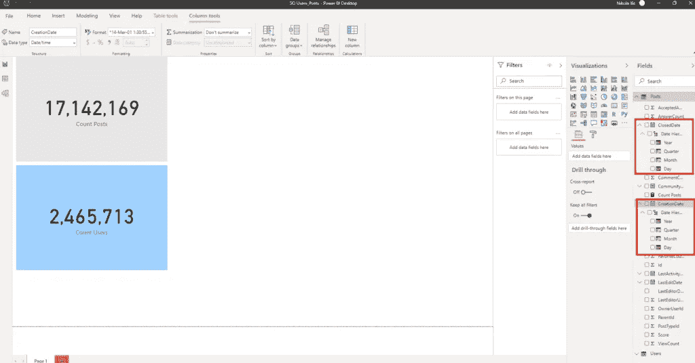
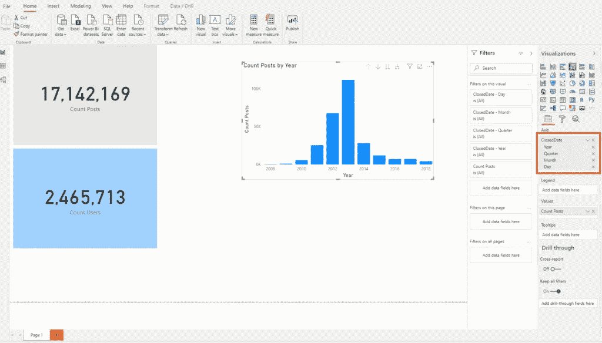
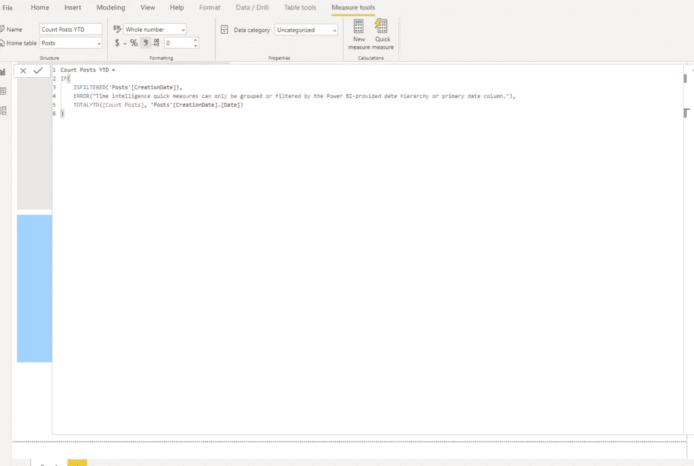
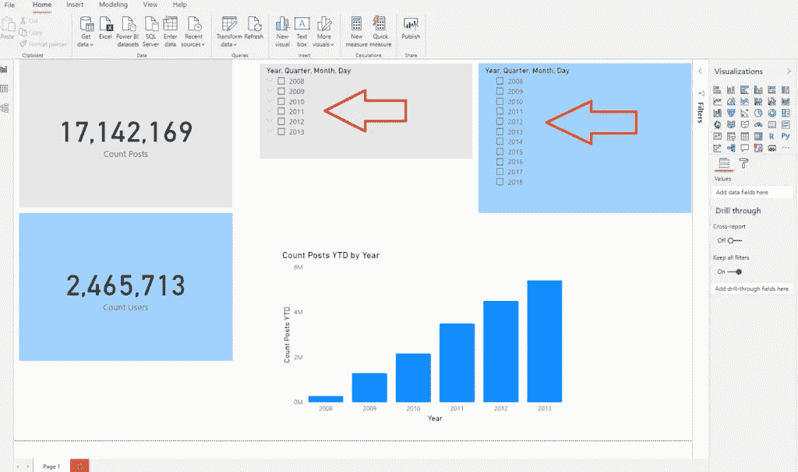
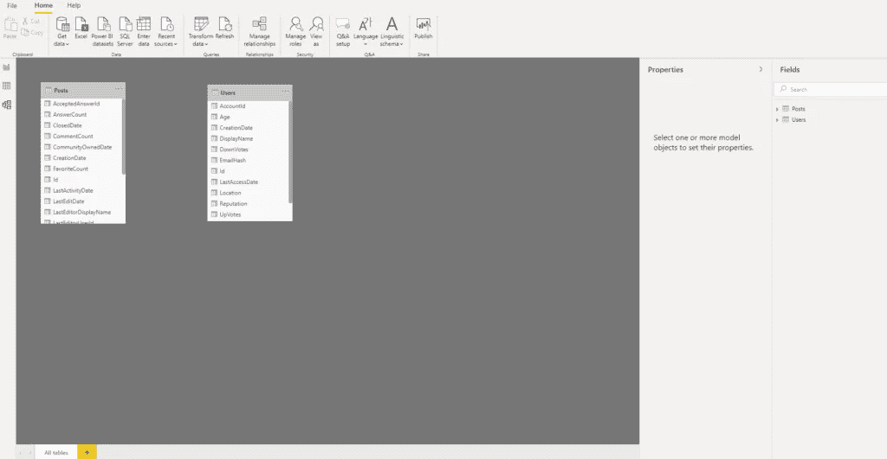
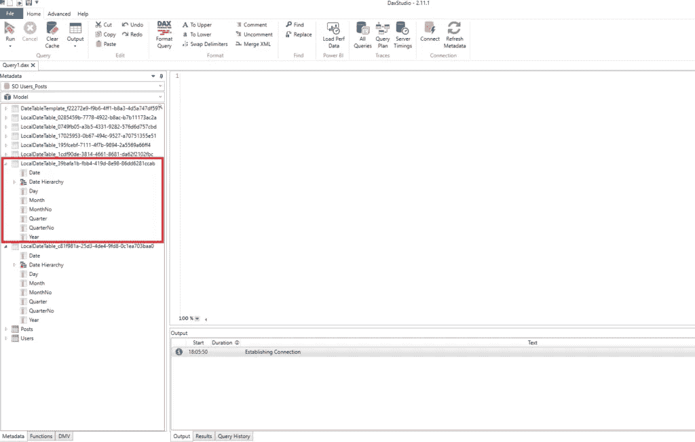

# TIQ 第 1 部分——如何用自动日期/时间摧毁您的 Power BI 模型

> 原文：<https://towardsdatascience.com/tiq-part-1-how-to-destroy-your-power-bi-model-with-auto-date-time-8fec32b22aff?source=collection_archive---------20----------------------->

## 在 TIQ 系列的第一部分，找出为什么使用自动日期/时间是一个坏主意

***TIQ 代表时间智商。由于“常规”智能通常被作为智商来衡量，而时间智能是数据建模中最重要的主题之一，我决定开始一个博客系列，将介绍一些基本概念、特定解决方案的利弊和要避免的潜在陷阱，一切都是为了增加你的整体 TIQ，并使你的模型在时间分析方面更加健壮、可伸缩和灵活***


马克·尼尔在 Pexels 上的照片

如果您曾经执行过任何类型的数据分析，您肯定应该知道，分析不同时间段内的数字、识别一段时间内的趋势，或者根据特定事件发生的时间点评估各种 KPI，是每个 BI 项目的“面包和面包屑”。

你可以在不了解客户、地理位置、产品等细节的情况下偷偷摸摸(当然也强烈建议使用这些维度)，但是不知道随着时间的推移会发生什么，你的整体分析就会受到影响。

因此，我真诚地将日期维度视为“威严”——在我看来，这是整个数据模型中最重要的维度！

当我最近写了关于[创建一个自定义日期维度](https://data-mozart.com/powerbi/power-query-tips-for-every-power-bi-developer/)的文章时，我承诺我会专门写一篇文章来更深入地解释时间智能。

所以，这是时间智能主题系列的第一篇文章。

由于它的重要性，我将尝试提供一个日期维度的全面概述，它提供的明显好处，以及在 Power BI 中正确使用(不正确)时的潜在陷阱。

## power BI——没有日期维度，我能偷偷通过吗？

答案很简单——当然，你可以！但是，你不应该。如果您的数据模型中没有使用日期维度，Power BI 不会让您失望。相反，它会“帮助”您，通过在模型中的每个日期列上自动创建日期层次结构！

哇，一开始听起来棒极了！既然 Power BI 可以为我构建一个单独的日期维度，我为什么还要浪费时间呢？保持关注，你很快就会发现为什么这不是你想要的结果。

打开新的 Power BI 文件时，在“文件”选项卡下，选择选项和设置，然后选择选项。在左侧的“全局”下，您会看到“时间智能”选项。



如果您选中新文件的自动日期/时间选项，则每次打开新的 Power BI 文件时，Power BI 都会自行处理日期。

另一个可以设置的地方是在左边的当前文件下，然后是数据加载。



让我简单解释一下当您选中此选项时，后台发生了什么:Power BI 将创建一个由年、季度、月和日期组成的日期层次结构，以便您可以在这四个粒度级别上分割数据。

我使用堆栈溢出数据库进行演示，因为它足够大，可以在启用自动日期时间时注意到我们的数据模型的行为。报告本身非常简单，包含两个卡片，显示我们模型的两个表中的许多行:



现在，当您在字段窗格中查看时，您会注意到日期类型的每一列都显示为一个层次结构。因此，我可以使用这些层次结构之一来分割数据:



每个关闭日期的帖子数量

“那有什么不对吗？”，你会问一个合理的问题。我得到了现成的解决方案，不需要编码、导入、扩展数据模型等。

## Power BI 幕后

在我继续之前，让我们先来看看当我尝试使用我们的“Date”维度来计算堆栈溢出数据库中年初至今的帖子总数时，后台发生了什么:



如果您看一下自动创建的 DAX 代码，您会注意到我们的 CreationDate 列的不寻常的列引用:

```
Count Posts YTD = 
IF(
    ISFILTERED('Posts'[CreationDate]),
    ERROR("Time intelligence quick measures can only be grouped or filtered by the Power BI-provided date hierarchy or primary date column."),
    TOTALYTD([Count Posts], 'Posts'[CreationDate].[Date])
)
```

这意味着 Power BI 指向自动创建的层次结构的特定成员(在我们的例子中。[日期]，但也可能是。[年份]，。[季度]或。[月])。

尽管如此，计算在这里，一切看起来很好。但是，如果我想让我的用户能够在不同的日期对数据进行切片，该怎么办呢？或者，如果用户要求每周分析数据？财政年度？星期几？

## 弹性等于零！

使用我们的自动日期维度，这些都是不可能的！所以，忘掉灵活性吧，你得到的是年、季度、月和日期，仅此而已。不要误解我的意思，这对于我们说的 80%的分析来说是很好的，但是我们应该如何处理剩下的呢？

例如，如果我想比较一段时间内基于 CreationDate 和 LastActivityDate 的数据，并且希望有一个切片器来更方便地执行我的分析，该怎么办？



正如您所注意到的，只用一个切片器是不可能满足这个要求的。我们需要两个切片器，分别用于每个日期层次结构。现在，假设我们想要基于四五个不同的日期对数据进行切片。更不用说，如果你采用这种策略，你的报告会变得多么丑陋、反直觉和复杂。

我们不能用新的属性扩展日期维度，这是这种方法的最大限制。

## 用自动日期表格隐藏和寻找

为了对幕后发生的事情有一个大致的了解，我将展示 BI 需要什么样的能力来处理这个问题。对于每个日期列(在我们的 Posts 表中，我们有 5 列:ClosedDate、CommunityOwnedDate、CreationDate、LastActivityDate 和 LastEditDate)，Power BI 创建了一个单独的日期表！

你不相信？请跟我来…



当您转到模型视图时，那里没有表。那么他们在哪里(如果他们真的存在的话)？

诀窍在于，这些表在默认情况下是隐藏的，在 Power BI 模型中是看不到的，正如这篇微软文章中的[所描述的。](https://docs.microsoft.com/en-us/power-bi/transform-model/desktop-auto-date-time)

因此，让我们启动 DAX Studio 来支持我们搜索这些本地日期表。对于那些还不熟悉 [DAX Studio](https://daxstudio.org/) 的人，我强烈推荐尝试一下——它有一大堆方便的功能，最重要的是，它是免费的！

我已经连接到我的 PBIX 文件，看:



在左边的“模型”下，你会看到一大堆日期表！！！谁创造了他们？我没有，正如你之前看到的。这些都是自动创建的数据表，BI 在后台创建这些数据表来实现时间智能计算。

## 数据模型的规模在增长…

不必说这些表是您的数据模型的一部分，即使您不是有意创建它们的。包含日期列的表越大，整个模型就越大。

我看到过许多例子，数据模型因为许多自动数据表而变得臃肿。

因此，在阅读了所有这些关于自动日期/时间功能的负面内容后，人们可以理解地问一个问题:

## 为什么这个自动日期/时间甚至存在于 Power BI 中，更不用说它是默认启用的了？！


照片由内森·考利拍摄

微软没有给出官方解释，但我认为这一决定背后的基本原理是 Power BI 作为一种自助式 BI 工具被推广。

我们不要忘记，有很多人根本不熟悉维度建模概念，更不用说通过编写 DAX 或 M 代码或使用数据仓库中现有的 SQL 日期维度来创建适当的日期维度了。他们需要 Power BI，他们使用 Power BI。

无论出于什么原因，自动日期/时间是 BI， ***的一部分，只是不要使用它。***

在 TIQ 系列的下一部分，我将讲述如何以适当的方式处理日期维度的可能解决方案。所以，敬请期待！