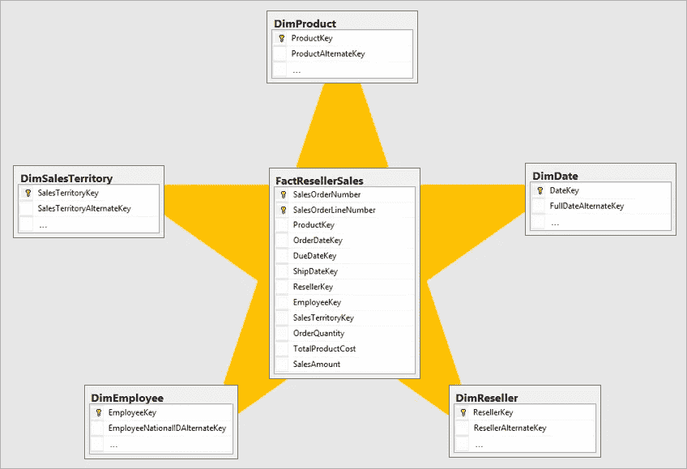

# TIQ 第二部分—陛下:日期维度

> 原文：<https://towardsdatascience.com/tiq-part-2-your-majesty-date-dimension-b4d54db84be9?source=collection_archive---------46----------------------->

## Power BI 数据模型中的日期维度有什么特别之处？在 TIQ 系列的第二部分中找到答案

Pixabay 在 Pexels 拍摄的照片

***TIQ 代表时间智商。由于“常规”智能通常被作为智商来衡量，而时间智能是数据建模中最重要的主题之一，我决定开始一个博客系列，将介绍一些基本概念、特定解决方案的利弊和要避免的潜在陷阱，一切都是为了增加你的整体 TIQ，并使你的模型在时间分析方面更加健壮、可伸缩和灵活***

您可能还记得，在本系列的第一部分中，我强调了日期维度是数据模型中所有维度中最重要的。让我简单解释一下我对此的看法:你可以在不知道某个特定客户群是否购买你的产品的情况下做你的生意；你会莫名其妙地偷偷摸摸，不知道你卖了 100 单位的产品 X 还是 200 单位的产品 Y；但是，如果不知道一段时间内的总体趋势，你肯定会迷失在数据分析中。

我并不是想贬低所有维度的重要性。我会称日期维度为*【第一对】*，或者“第一对”。在这个意义上，我经常称日期维度为“威严”…

Giga-01 在 fotocommunity.de 拍摄的照片

## 回归基础——让您的模型像明星一样闪耀！

在对日期维度给予应有的关注之前，我们需要澄清为什么它被称为维度，以及从更广泛的角度来看这意味着什么。

说到数据建模，很少有被普遍接受的概念。其中之一就是维度建模，对于各种报表系统(如 Power BI)的数据建模尤为重要。简单地说，这个概念假设你有一个或多个*事实表*和至少一个，但通常是多个*维度*。

事实表存储有关已发生事件的数据—无论是销售交易、汇率、温度值…在大多数情况下，事实是可以以某种方式聚合的数值(总和、平均值、数量等)。)

然而，这些数字没有价值，除非我们把它们放到特定的环境中。比如说，我们想知道黑色产品的销售额。或者，我们希望看到每个月的毛利润。或者，我们希望分析与欧洲相比，我们在美国销售了多少台设备。

这里，维度开始发挥作用。最简单地说，维度是业务实体的描述性表示。听起来势不可挡？很少有基本的例子能在一分钟内理清头绪。

假设您有一个名为 Customer 的业务实体。你会用什么样的特征来描述客户？名，姓，她/他住的地方？性别，学历？你说得对，所有这些都可以用来描述一个客户。产品呢？类别、类型、颜色…只是你可以使用的一些属性。

***日期维度是数据模型*** 中最一致的维度——虽然其他维度可以根据特定的报告需求进行不同的设置，或者可以在稍后阶段通过添加/删除属性来扩展/缩减，但是日期维度在每个数据模型中都或多或少是一致的！

理论上，你可以给一个产品添加无限数量的属性，而对于日期，你只能有一定数量的属性(即使你包括一些特定的东西，如工作日、公共假日等)。).这些属性有着完美的层次顺序:日期 2020 年 6 月 27 日将始终属于 2020 年、第二季度和六月，并且它将始终是星期六。您可以将产品 X 更改为属于奢侈品类别，而不是普通产品，但是对于日期，您不能应用相同的逻辑。

经过对维度的详细描述，我们的模型最终应该是这样的:

当您看一看这个图时，它为什么被称为星型模式就很明显了。我们在模型中间有一个事实表，不同的维度围绕着它，所以它让人想起一颗星星。每个维度和一个事实表之间只有一个关系。

不深入讨论其他数据建模技术的细节，例如*雪花*或*平面*(非规范化)表，因为这需要单独的系列文章，我只说在 Power BI 中创建数据模型时，推荐使用星型模式。

## 是什么让日期维度如此独特？

为了充分利用 Power BI 中强大的时间智能 DAX 函数，您的数据模型必须满足一些条件。主要的一条是: ***你的模型中至少需要有一个日期表！***

此外，表需要满足以下条件才能被视为日期表:

*   该表必须包含数据类型为日期或日期/时间的列(我们将该列称为日期列)
*   日期列必须有唯一的值
*   日期栏必须是连续的(不允许有遗漏的日期)
*   日期列中不允许有空值
*   最后，日期表必须标记为日期表

乍一看，在准备单独的日期表时，这看起来开销太大，特别是如果您还记得 Power BI 可以自动为您创建日期表，而无需您做出任何努力。

然而，就像在任何其他发展领域一样，在开始的时候，稍微多付出一点努力，就会让你在以后结出果实。从一开始就以正确的方式做事才是正道。创建一个单独的日期维度，并将该表标记为一个日期表，这将使您能够充分利用 Power BI，并在使用强大的 [DAX 时间智能函数](https://docs.microsoft.com/en-us/dax/time-intelligence-functions-dax)时为您提供最大的灵活性(在本系列的下一篇文章中会详细介绍)。

在 TIQ 系列的下一部分中，我将介绍在 Power BI 模型中创建全功能日期维度的所有现有技术，敬请关注！

如果你正在准备 DA-100 用 Power BI 分析数据考试，一定要查看我的成功经验的详细概述[这里](/passing-da-100-microsoft-exam-my-experience-6a911b41ec79)。