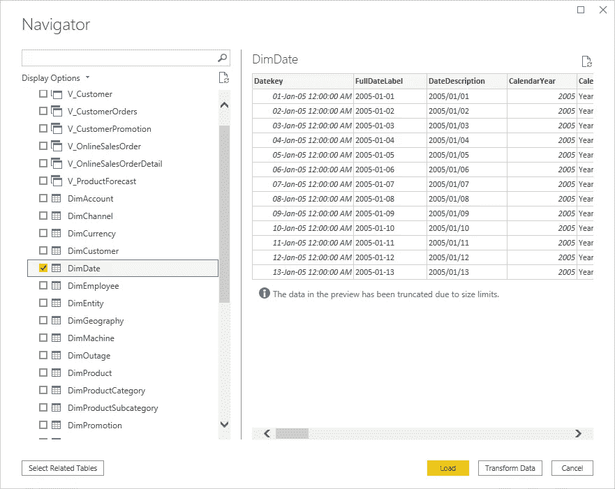
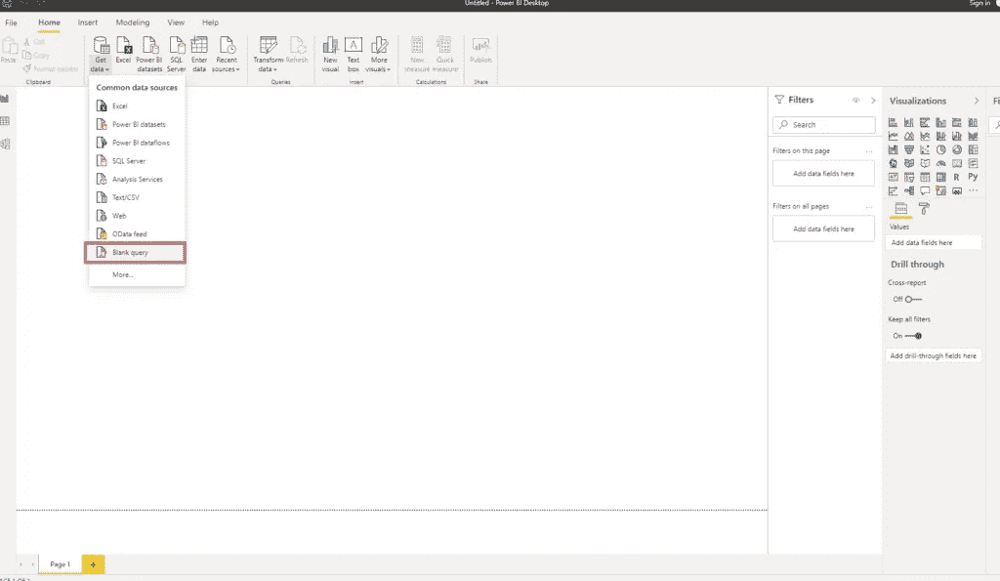
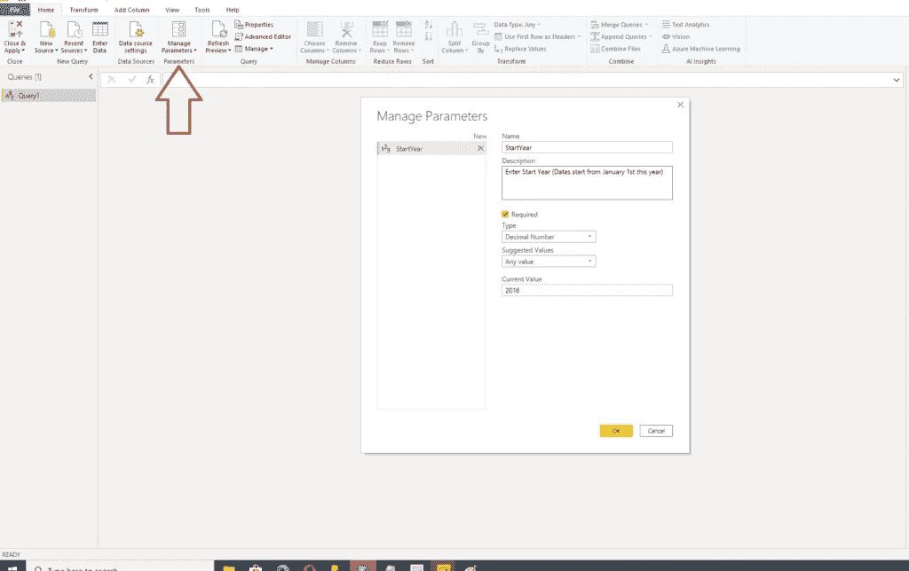
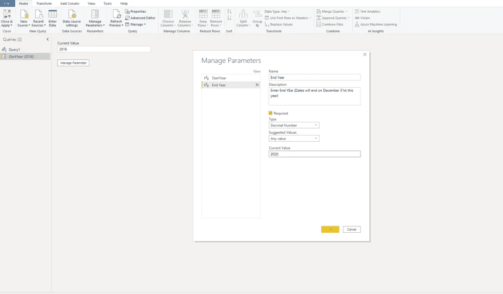
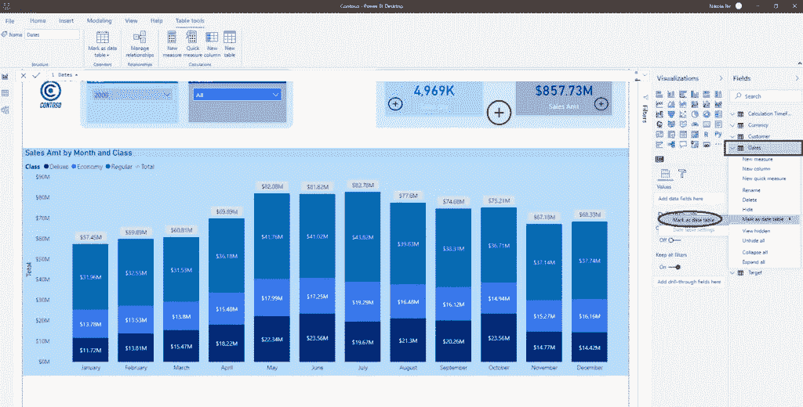
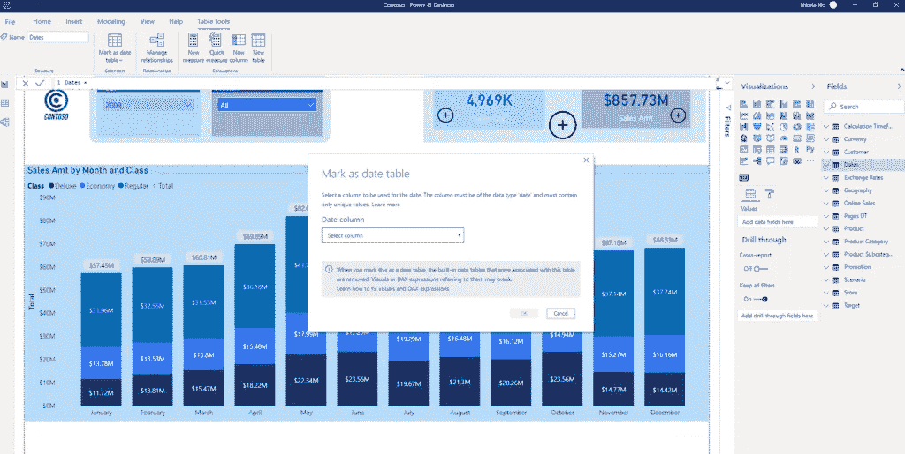
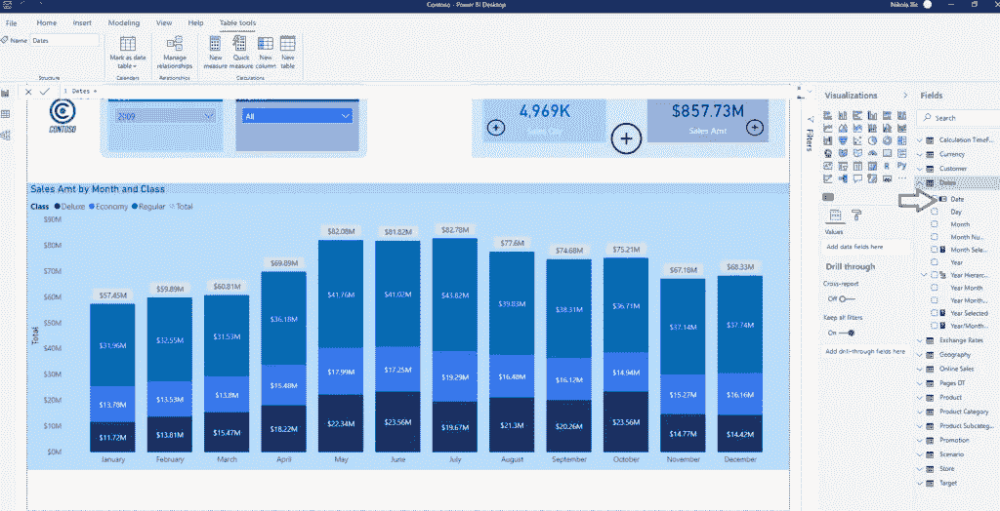

# TIQ 第 3 部分—日期维度创建的最终指南

> 原文：<https://towardsdatascience.com/tiq-part-3-ultimate-guide-to-date-dimension-creation-98b951ffa68c?source=collection_archive---------30----------------------->

## 在 TIQ 系列的第三部分中，学习在 Power BI 中创建适当的日期维度的所有可用方法


Pixabay 在 Pexels 上拍摄的照片

***TIQ 代表时间智商。由于“常规”智能通常被作为智商来衡量，而时间智能是数据建模中最重要的主题之一，我决定开始一个博客系列，将介绍一些基本概念、特定解决方案的利弊和要避免的潜在陷阱，一切都是为了增加你的整体 TIQ，并使你的模型在时间分析方面更加健壮、可伸缩和灵活***

在本系列的第一部分解释了为什么在 Power BI 中使用[自动日期/时间特性是合法的，但不是处理数据模型中日期的理想解决方案，并在第二部分强调了](/tiq-part-1-how-to-destroy-your-power-bi-model-with-auto-date-time-8fec32b22aff)[星型模式中日期维度](/tiq-part-2-your-majesty-date-dimension-b4d54db84be9)的重要性之后，在本部分中，您将找到在数据模型中创建适当日期维度的各种解决方案。

## 解决方案 1: SQL

在大多数情况下，如果您连接到关系数据源，如 SQL Server、Oracle 或 MySQL，那么驻留在数据仓库中的数据模型很可能已经包含了日期维度。

在这个场景中，您只需将现有的日期维度导入到 Power BI 数据模型中，就万事俱备了。这种方法带来的好处是，在组织级别上确保关于时间处理的单一真实来源。

假设我正在连接到一个 Contoso SQL Server 数据库，该数据库保存着一家名为 Contoso 的虚构公司的销售数据。一旦我选择了在 Power BI 中获取数据并连接到 Contoso 数据库，我唯一需要做的事情就是选择 DimDate 表(以及我需要的其他表),并且我在 Power BI 数据模型中有了一个适当的日期维度！



这是 Power BI 数据模型中处理时间最简单、最常用的方式。

如果出于任何原因，您的数据仓库没有日期维度(老实说，您被卡车撞上的机会比找到没有日期维度的数据仓库的机会更多)，您可以自己创建一个。网络上有多种现成的解决方案，例如 Aaron Bertrand 的[这个](https://www.mssqltips.com/sqlservertip/4054/creating-a-date-dimension-or-calendar-table-in-sql-server/)，因此，如果您出于任何原因需要它，使用 SQL 的日历表可以在几分钟内创建。

## 解决方案#2: M(超级查询)

如果您没有现有的日期维度可以导入到您的数据模型中，您可以使用 Power Query 及其 M 语言快速轻松地创建一个全新的日期维度。

正如我在之前的一篇文章中已经提到的，关于[各种权力查询技巧](https://data-mozart.com/powerbi/power-query-tips-for-every-power-bi-developer/)，网上有许多现成的解决方案。我从礼萨·拉德那里选了[这个](https://radacad.com/create-a-date-dimension-in-power-bi-in-4-steps-step-1-calendar-columns)。

以下是如何使用 M 语言创建日期维度的分步说明。打开新的 Power BI 文件，并在获取数据下选择空白查询:



如果要创建高度灵活和自定义的日期维度，应该利用参数。因此，在“管理参数”下，选择“新参数”并将其设置如下:



定义日期维的开始年份后，对结束年份应用相同的步骤:



完成后，打开高级编辑器并粘贴以下脚本:

```
let
    StartDate = #date(StartYear,1,1),
    EndDate = #date(EndYear,12,31),
    NumberOfDays = Duration.Days( EndDate - StartDate ),
    Dates = List.Dates(StartDate, NumberOfDays+1, #duration(1,0,0,0)),
    #"Converted to Table" = Table.FromList(Dates, Splitter.SplitByNothing(), null, null, ExtraValues.Error),
    #"Renamed Columns" = Table.RenameColumns(#"Converted to Table",{{"Column1", "FullDateAlternateKey"}}),
    #"Changed Type" = Table.TransformColumnTypes(#"Renamed Columns",{{"FullDateAlternateKey", type date}}),
    #"Inserted Year" = Table.AddColumn(#"Changed Type", "Year", each Date.Year([FullDateAlternateKey]), type number),
    #"Inserted Month" = Table.AddColumn(#"Inserted Year", "Month", each Date.Month([FullDateAlternateKey]), type number),
    #"Inserted Month Name" = Table.AddColumn(#"Inserted Month", "Month Name", each Date.MonthName([FullDateAlternateKey]), type text),
    #"Inserted Quarter" = Table.AddColumn(#"Inserted Month Name", "Quarter", each Date.QuarterOfYear([FullDateAlternateKey]), type number),
    #"Inserted Week of Year" = Table.AddColumn(#"Inserted Quarter", "Week of Year", each Date.WeekOfYear([FullDateAlternateKey]), type number),
    #"Inserted Week of Month" = Table.AddColumn(#"Inserted Week of Year", "Week of Month", each Date.WeekOfMonth([FullDateAlternateKey]), type number),
    #"Inserted Day" = Table.AddColumn(#"Inserted Week of Month", "Day", each Date.Day([FullDateAlternateKey]), type number),
    #"Inserted Day of Week" = Table.AddColumn(#"Inserted Day", "Day of Week", each Date.DayOfWeek([FullDateAlternateKey]), type number),
    #"Inserted Day of Year" = Table.AddColumn(#"Inserted Day of Week", "Day of Year", each Date.DayOfYear([FullDateAlternateKey]), type number),
    #"Inserted Day Name" = Table.AddColumn(#"Inserted Day of Year", "Day Name", each Date.DayOfWeekName([FullDateAlternateKey]), type text)
in
    #"Inserted Day Name"
```

完成后，点击 Close&Apply，您的数据模型中就有了功能齐全的日期维度！此外，如果您将文件另存为。pbit (Power BI 模板文件)，您可以轻松地更改要生成日期的时间段。

正如您可能已经注意到的，您只是定义了您想要的日期维度的开始和结束年份，而 M 负责处理所有其他事情——这多酷啊！

## 解决方案 3: DAX

最后，如果您喜欢使用 DAX 进行 Power BI 计算，也可以使用它来创建适当的日期维度。DAX 内置了函数 *CALENDAR()* 和 *CALENDARAUTO()* ，这些函数会为其他必要的属性做铺垫，比如周、工作日等。


在我指导您在哪里找到创建日期维度的最佳 DAX 脚本之前，我只想建议在大多数情况下避免使用 *CALENDARAUTO()* 函数，因为它从整个数据模型中获取最早的日期值，并扩展到整个数据模型中的最新日期！

这在某些有限的情况下可以很好地工作，但是在许多现实生活的场景中，比如当您导入关于客户的数据时，有些记录我们不知道客户的正确出生日期。然后，有人插入默认值 1900 年 1 月 1 日，如果您选择使用 *CALENDARAUTO()* 函数，Power BI 模型中的日期维度会突然从 1900 开始！

这里的关键是——您需要利用特定场景的处理，不要让 Power BI 搞乱您的数据模型。请记住，你是你的数据模型的老板！

正如我在上面承诺的，如果你决定使用 DAX 创建日期维度，不要再犹豫，使用 DAX 大师 Marco Russo 和 Alberto Ferrari 的解决方案。

## 关键要素—将日期维度标记为日期表

无论您选择哪种创建日期维度的解决方案(SQL、M 或 DAX ),都不要忘记最重要的一点——将这个表标记为一个日期表！这将使您能够充分利用日期维度，执行所有强大的 DAX 时间智能功能，而不必担心结果和性能。

为了被标记为日期表，一个表，或者更好地说，一个将被标记的列，必须满足几个条件:

*   每一行都包含唯一的值
*   不允许空值
*   包含连续的日期(不允许有间隔)
*   必须是日期数据类型

让我们看看如何通过几次点击将该表标记为日期表。右键单击日期维，将鼠标悬停在标记为日期表选项上，然后单击标记为日期表:



应会打开一个对话框，Power BI 将让您选择要在哪个列上应用标记:



Power BI 将自动识别正确数据类型的列，一旦您选择了该列，Power BI 将执行验证并通知您所选列是否验证成功。

如果一切正常，您应该会在日期列名称旁边看到一个小图标:



恭喜你！您已经完成了在数据模型中创建正确的、功能齐全的日期维度的所有必要步骤。

现在，我们已经为使用不同时间段操作数据奠定了基础，在本系列的下一部分中，我将介绍 DAX 中最重要的时间智能函数，以及如何使用它们来利用不同的现实场景。