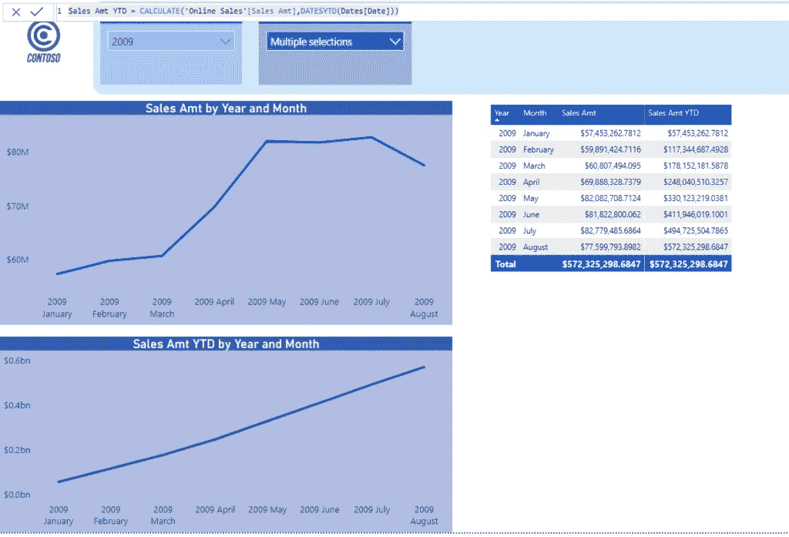
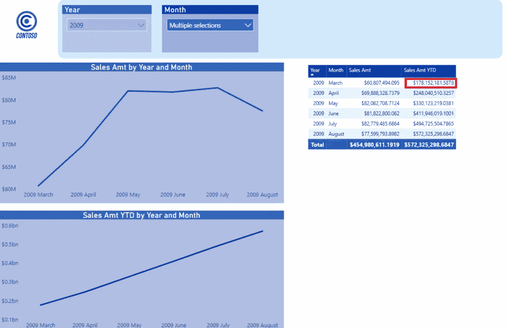
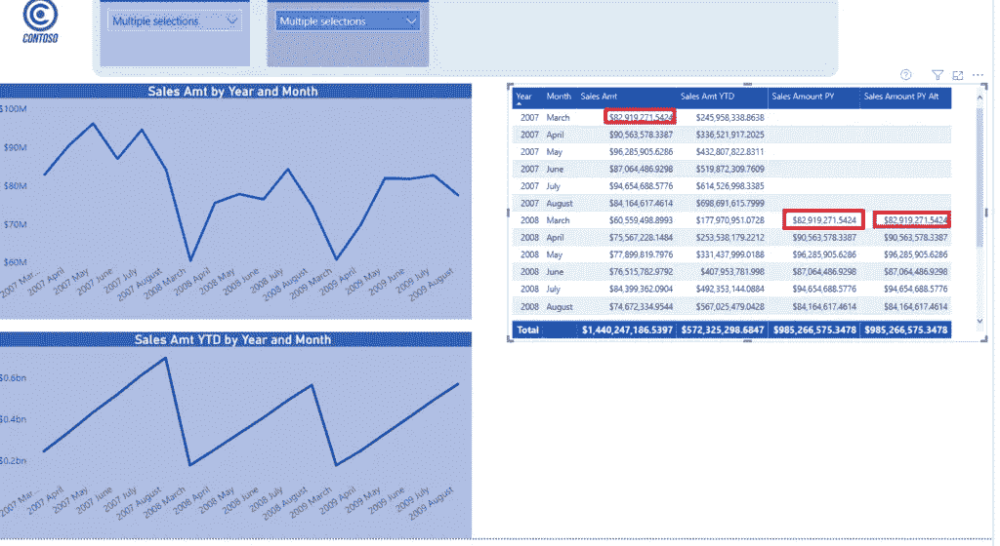
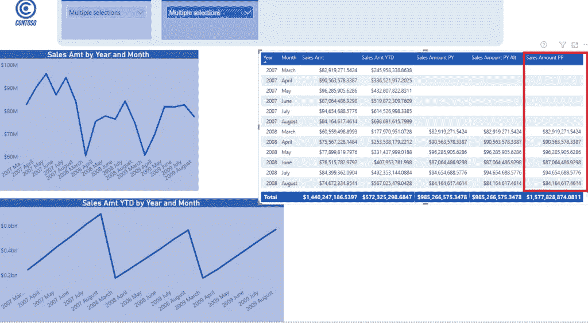
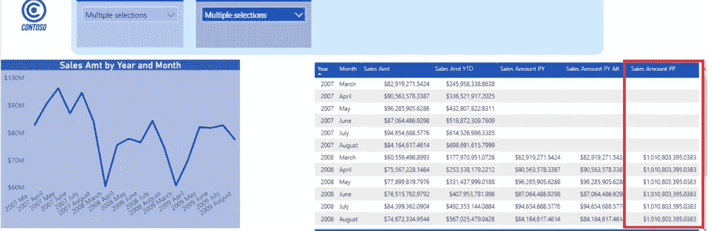
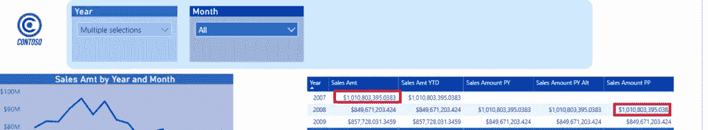

# TIQ 第四部分——在电力商业智能中保持时间智能

> 原文：<https://towardsdatascience.com/tiq-part-4-being-time-intelligent-in-power-bi-88171980b141?source=collection_archive---------49----------------------->

## 在 TIQ 系列的最后一部分，学习什么是时间智能，以及各种 DAX 时间智能函数之间的明显区别

***TIQ 代表时间智商。由于“常规”智能通常被作为智商来衡量，而时间智能是数据建模中最重要的主题之一，我决定开始一个博客系列，将介绍一些基本概念、特定解决方案的利弊和要避免的潜在陷阱，一切都是为了增加你的整体 TIQ，并使你的模型在时间分析方面更加健壮、可伸缩和灵活***


乔恩·泰森在 Unsplash 上拍摄的照片

亲爱的读者，我们即将结束这个系列。在详细解释了为什么可以、但不应该使用 Power BI 中的[自动日期/时间特性之后，接着强调了数据模型中日期维度](/tiq-part-1-how-to-destroy-your-power-bi-model-with-auto-date-time-8fec32b22aff)的[重要性，在上一篇文章中，我已经为](/tiq-part-2-your-majesty-date-dimension-b4d54db84be9)[创建适当的日期维度](/tiq-part-3-ultimate-guide-to-date-dimension-creation-98b951ffa68c)提供了各种解决方案。

因此，现在是时候总结一些最常用的时间相关计算的例子以及它们之间的一些明显差异了。

## 什么是时间智能？

用最简单的方式，时间智能表示某种与日期相关的计算。不要把它和“时间”这个词混为一谈，当有人谈论“时间智能”的时候，不要期望把小时/分钟/秒/毫秒看作是最底层的粒度。

更合适的术语应该是“日期智能”，但是由于“时间智能”已经被普遍接受，所以让我们坚持这个命名约定。


安德里克·朗菲尔德在 Unsplash 上拍摄的照片

DAX 中所有[时间智能函数](https://docs.microsoft.com/en-us/dax/time-intelligence-functions-dax)的主要特征是，无论如何，它们都需要对日期或日期/时间数据类型的列进行操作。*这意味着这些函数的输入参数之一需要是日期或日期/时间列*。

此外，所有这些都会将您选择的日期转换为一些新的日期(无论是过去还是未来)。

最后但同样重要的是，时间智能函数支持将一天作为最低级别的粒度，这意味着您不能在小时/分钟/秒等计算中使用它们。

## 正确使用时间智能功能的检查表

*   正如在本系列的前几篇文章中所强调的，您应该创建一个单独的日期维度，遵循所有必要的规则(连续日期、唯一值、非空值等)。)
*   在数据类型为日期或日期/时间的列上创建日期维度和事实表之间的关系，而不是在代理键整数列上创建关系，除非您将日期维度标记为日期表(在这种情况下，在整数代理键上创建关系也是可以的)*感谢 Derek van Leeuwen，MSc 发现了之前不精确的解释*
*   不要在时间智能函数中使用事实数据表中的日期或日期/时间列(例如，不要使用示例 Contoso 数据库中事实在线销售表中的订单日期列)
*   始终在日期维度中创建全年值。这意味着，即使事实表中的最后一个订单是在 2013 年 9 月，日期维度也应该包括整个 2013 年，最后一个值是 12 月 31 日
*   如前一章所述，坚持将一天作为最低级别的粒度

## 最常见的时间智能功能

有几十种时间智能功能，但其中一些比另一些使用得更频繁。例如，几乎所有使用数字的 Power BI 报告都需要进行某种比较，以确定趋势。或者，显示累积值也是最重要的业务需求之一。

这些功能乍看起来很简单，但同时也相当强大。让我们来看看这个简单的例子，计算所选年份的运行总数。

在 Contoso 数据库中，我创建了一个计算销售额的度量值:

```
Sales Amt = SUM('Online Sales'[SalesAmount])
```

现在，让我们创建用于计算运行总数的度量:

```
Sales Amt YTD = CALCULATE('Online Sales'[Sales Amt],
DATESYTD(Dates[Date])
)
```

当我将这些度量值拖到报表中并选择 2009 年 1 月到 8 月的月份时，您可以立即注意到月份级别上的数字差异:



这很简单，但让我解释一下在*销售金额本年迄今*衡量计算的背景下发生了什么，因为这对于理解这里的整个逻辑非常重要。

## 超越基础

回想一下我上面提到的*时移概念*——这里，我们选择了 2009 年 1 月 1 日到 2009 年 8 月 31 日的日期。YTD 计算发生的情况是，过滤器上下文被更改为包括从 2009 年**1 月 1 日**到所选月份最后一天之间的日期，不管我们选择的是哪个月份！

看下面的例子会更清楚，我选择了 2009 年 3 月到 2009 年 8 月的几个月:



仔细看看标有红色的数值。无论我们选择三月来显示我们的数字， *DATESYTD()* 函数都会重置我们的过滤器，并包含年初的值。我们在表格中看不到它们，但它们包含在三月份的总数中，因为您可以很容易地与第一个截图进行比较。无论我们如何更改切片器中的选择，YTD 的总数保持不变。

我最喜欢 DAX 的一点是，你可以用多种不同的方式实现相同的目标。这也代表运行总计计算，因为除了 *DATESYTD()* ，您还可以使用 *TOTALYTD()* 函数。 *TOTALQTD()* 和 *TOTALMTD()* 的工作方式与相同，但粒度不同(分别为季度和月份)。

## 细节决定成败…

您还应该注意特定函数之间的细微差别，因为在一种情况下，它们可以给你完全相同的结果，但在其他一些情况下，它们的表现完全不同。

因此，如果您想要执行年度间的比较，您可以同时使用*sameperiodlastyre()*和 *DATEADD()* 函数，以及以下度量…

```
Sales Amount PY = CALCULATE(SUM('Online Sales'[SalesAmount]),
DATEADD(Dates[Date],-1,YEAR)
)Sales Amount PY Alt = CALCULATE('Online Sales'[Sales Amt], 
SAMEPERIODLASTYEAR(Dates[Date])
)
```

…将返回相同的结果:



唯一的区别是 *DATEADD()* 为您提供了更大的灵活性，因为您可以根据自己的需要以及日期层次结构的不同级别(季度、月、日)来改变时间间隔，而 *SAMEPERIODLASTYEAR()* 仅绑定到上一年。 *PARALLELPERIOD()* 也非常相似，但仍然有很大的不同，就像我们为日期移动设置静态间隔一样:

```
Sales Amount PP = CALCULATE('Online Sales'[Sales Amt],
PARALLELPERIOD(Dates[Date],-12,MONTH)
)
```



但是，当我们将上次创建的度量值更改为…

```
Sales Amount PP = CALCULATE('Online Sales'[Sales Amt],
PARALLELPERIOD(Dates[Date],-1,YEAR)
)
```

…您可能认为-1 年相当于-12 个月…



然而，事实并非如此，因为 PARALLELPERIOD 将返回上一年的总销售额(切片器选择已被忽略):



我不想说:用 *DATEADD()* 不要用 *PARALLELPERIOD()* 。或者，避免使用 *SAMEPERIODLASTYEAR()* ，而是使用 *DATEADD()* 。所有这些函数在您的计算中都有它们的位置— **这里的关键接管是:当您选择时间智能函数来执行特定的时间计算时要小心！正如你已经看到的，在某些情况下，它们会返回相同的结果，但实际上，它们的行为完全不同。**

## 结论

时间智能是 Power BI(以及一般的商业智能)中最重要的概念之一。因此，正如我大胆尝试的那样，在几篇博文中涵盖所有内容几乎是不可能的。但是，我真心希望现在一些基本的概念和思路更加清晰。

最后，我打赌你的 TIQ(时间智商)比你开始这个有趣的 TIQ 之旅时要高。

感谢阅读！