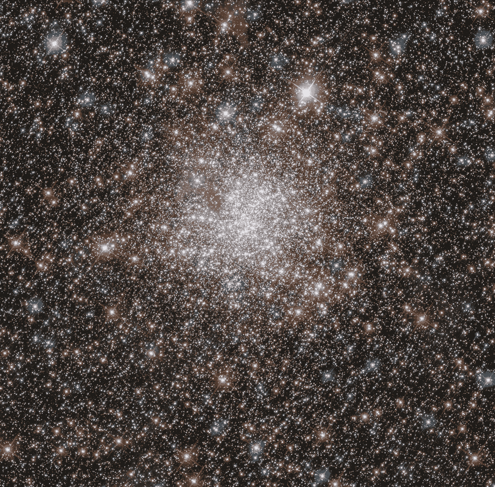
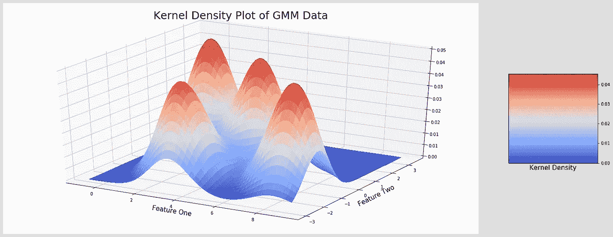
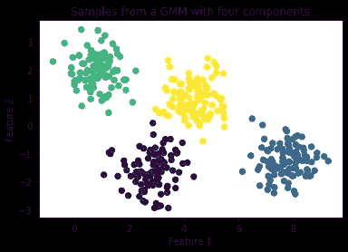
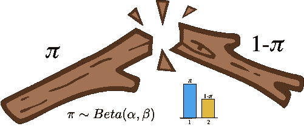
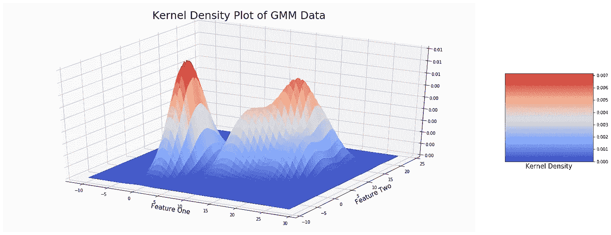
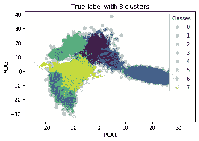
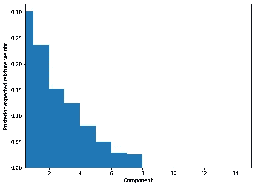
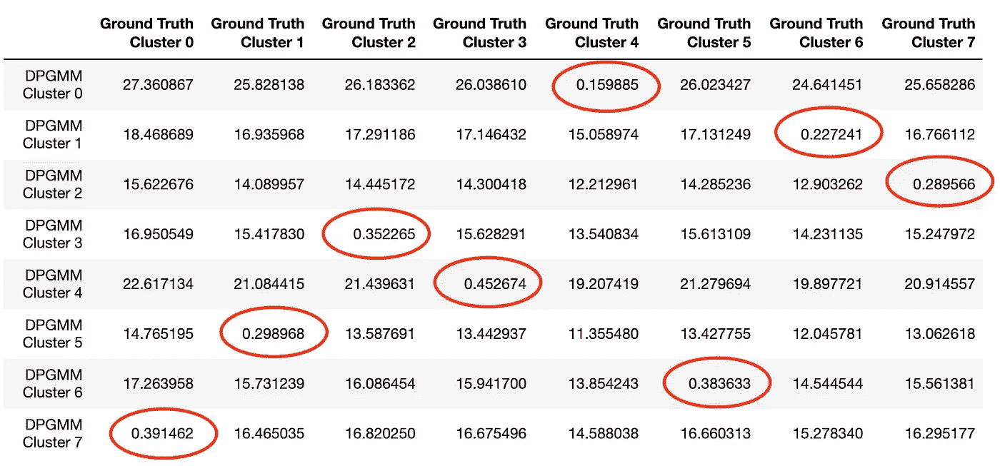
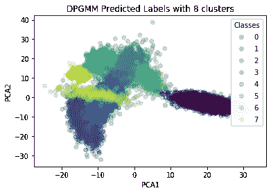
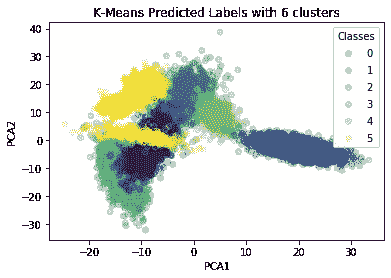

# TL；博士:狄利克雷过程高斯混合模型变得容易。

> 原文：<https://towardsdatascience.com/tl-dr-dirichlet-process-gaussian-mixture-models-made-easy-12b4d492e5f9?source=collection_archive---------7----------------------->

## 聚类是数据科学家生活中的祸根。我们中有多少人花了很多个周日晚上，带着越来越多的担忧看着一个新的数据集，在 scikit-learn 中翻找算法，摸索距离度量和集群数等超参数，同时向偏见之神祈祷宽恕。解决办法？贝叶斯非参数，英雄，我们都值得，但我们都非常需要。

***图片鸣谢:欧空局/哈勃& NASA***

首先也是最重要的:*聚类*是*生成的逆。*

生成模型是给我们*观察*的模型。我们可以使用伯努利分布模型来生成硬币翻转观察。我们可以用泊松分布模型来模拟放射性衰变。我们可以用一个训练好的神经网络来生成[古典音乐](https://medium.com/@alexissa122/generating-original-classical-music-with-an-lstm-neural-network-and-attention-abf03f9ddcb4)。模型越真实，这些观察结果就越接近现实。

**高斯混合模型**

下面是从四个独立的双变量正态分布中产生的 400 个样本的混合物，它们具有不同的平均值和相等的标准偏差。令人惊讶的是，这种混合高斯分布模型的名字叫做*高斯混合模型*。

**K 均值聚类**

使用 [K-Means](https://en.wikipedia.org/wiki/K-means_clustering) 算法和难以置信的 Sherlockesque 聚类数推理(核密度图字面上告诉你有 4 个聚类)，我能够恢复生成模型并对下面的每个聚类进行颜色编码。恢复/群集是干净的，因为数据非常干净。每个高斯贡献了 100 个样本，所以我们不必担心混合概率。我选择了四个截然不同的高斯均值和一个小的标准差进行采样，这样我就不用担心分布重叠了。

在现实中，大自然永远不会对你这样,**永远不会对你这样,**永远不会对你这样，我们不能忽视我们对聚类数、混合概率和混合中每个高斯矩的估计的不确定性。那么，我们如何根据数据复杂性来扩展我们的聚类方法呢？

**非参数模型**

让我们区分一下*参数化*和*非参数化*模型。参数模型是我们可以用固定数量的参数写在一张纸上的模型。 *y=mx + c* 有两个固定参数( *m* 、 *c* )，因此是参数化的。

当适合数据集时，随机森林分类器可以采用 *M* 个参数( **y** ， **X** ={x_{1}，x_{2}，…，x_{n}})，但是如果我们引入另一个特征 x_{n+1}，则需要更多的*K*；随着数据复杂性的增加，模型也是如此。参数的数量没有上限，*意味着对于足够复杂的数据，世界上没有足够的纸来写下完整的模型。这是一个*非参数*模型的例子。*

谁在乎呢？事实证明，当我们对聚类数或混合概率的先验信念有限时，我们可以转向非参数化，并无限地考虑*其中的许多。自然地，这些聚类中的许多是多余的，并且混合概率*非常接近于 0* ，以至于我们可以忽略它们。令人难以置信的是，这个框架让*数据决定最可能的集群数量*。*

太酷了，我们怎么开始？首先，我们需要一种描述无限多个分布的混合的方法，这就是**狄利克雷过程**的用武之地。

**狄利克雷过程**

狄利克雷过程先验可以用足够多的数学术语来描述，使人退回到 K-Means，所以我将偏头痛，给一个直观的概述。

我们希望将混合概率**𝜋=**{𝜋_{*1 }*,𝜋_{*2 }*,…𝜋_{*n }…}*分配给无限个聚类。我们知道， **𝜋** 之和必须为 1，并且每个𝜋_{ *i* }都大于或等于 0。如果我们把 0 和 1 之间的概率想象成一根棍子，我们就在寻找打破这根棍子的方法，以便它准确地反映 GMM 中每个高斯的混合贡献。这种定义狄利克雷过程先验的方法被称为**断棒**过程，它本身具有贝塔分布先验。我强烈推荐在这里阅读统计细节。

断棒过程的图示。感谢[http://blog . sha kirm . com/2015/12/machine-learning-the-trick-of-day-6-tricks-with-sticks/](http://blog.shakirm.com/2015/12/machine-learning-trick-of-the-day-6-tricks-with-sticks/)

在我们之前的例子中，我们有来自四个高斯人的相等贡献，所以 **𝜋 = {** 𝜋 *_{1} = 0.25，* 𝜋 *_{2} = 0.25，* 𝜋 *_{3} = 0.25，* 𝜋 *_{4} = 0.25，* 𝜋 *_{5} = 0，* 𝜋 *_{6} = 0，…，*我们打破了我们的棍子无数次，但概率密度只集中在前四个组成部分，允许我们截断无限分布。那么现在我们有了一个混合概率分配的非参数框架，我们如何将它拟合到数据中呢？

**狄利克雷过程高斯混合模型**

现在大揭秘:因为 **𝜋** 告诉我们每个高斯在我们的 GMM 中的相对贡献，它实际上是一个*分布。*每个𝜋 *_{i}* 对应一个唯一的高斯*n*(**μ**_*{ I }*，**σ**_*{ I }*)由均值 **μ** _ *{i}* 和协方差矩阵**σ**_*{ I }参数化。*如果我们让**θ***_ { I } =*(**μ**_*{ I }*，**σ**_*{ I }*)，我们的问题简化为给每个**θ**【t58 _ { I }分配一个概率𝜋 *_{i}* ，反映其对数据混合的贡献程度

给定一些 k 维多元高斯数据 **X，**我们从一个先验信念开始，即所有的 *p(* 𝜋) 都是同等可能的。然后，我们想使用我们的数据 **X** 来计算这个新的一切皆有可能的结构的可能性 p( **X** |𝜋)。最后，我们使用贝叶斯定理为模型后验 p(𝜋|**x**)∝p(**x |**𝜋)p(𝜋).更新我们的模型通常情况下，p(𝜋| **X** 涉及一些非常棘手的积分，所以我们依靠类似[马尔可夫链蒙特卡罗采样](/mcmc-intuition-for-everyone-5ae79fff22b1)或[变分推断](/bayesian-inference-problem-mcmc-and-variational-inference-25a8aa9bce29)来近似 p(𝜋| **X** 。幸运的是，给定正确的先验选择，我们可以使用[期望最大化](https://machinelearningmastery.com/expectation-maximization-em-algorithm/) (EM)算法进行推理！让我们在 scikit-learn 中看看它的实际应用。

**实施**

首先，我们生成一些非常混乱的玩具 GMM 数据集，富含随机的潜在相关结构。使用 20 维、8 个分量的 GMM，根据从具有均匀先验的狄利克雷分布初始化的权重方案抽取 10，000 个样本(链接到代码[这里](https://github.com/lchlon/medium/blob/master/DPGMM.ipynb))。

对前两个特征进行核密度估计，并不能告诉我们数据中潜在的聚类数，但确实揭示了惊人的异质性。

跨数据的前两个 PCA 分量的聚类散点图向我们显示了恢复一般模型可能有多困难:

使用 EM 算法拟合截断为 15 个分量的 DPGMM，我们看到大部分概率集中在前 8 个分量周围:

事实上，如果我们使用像[kull back–lei bler 散度](https://en.wikipedia.org/wiki/Kullback%E2%80%93Leibler_divergence)这样的度量，我们可以计算我们的估计参数和我们的数据集中的地面真实参数之间的距离的不对称度量:

每个估计的 DPGMM 聚类映射其自己唯一的基本事实聚类，相对于与其比较的其余基本事实聚类，具有非常小的 KL 散度。对于这种匹配，毫不奇怪，DPGMM 几乎完美地恢复了聚类，而 K-Means 分类器根据最大平均轮廓分数选择聚类数，努力恢复实际的聚类数。

请查看上面链接的代码，尝试用自己的数据实现它。祝好运，集群快乐！