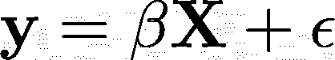
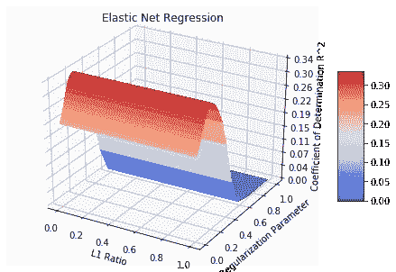
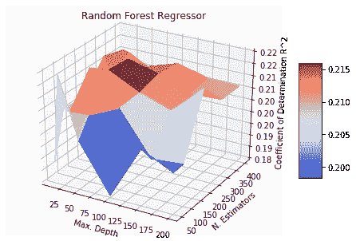
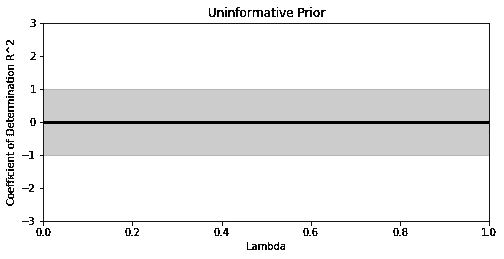
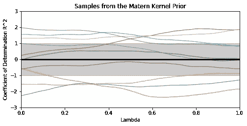
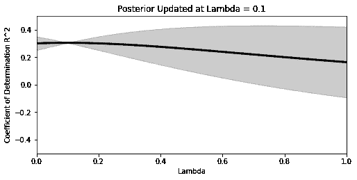
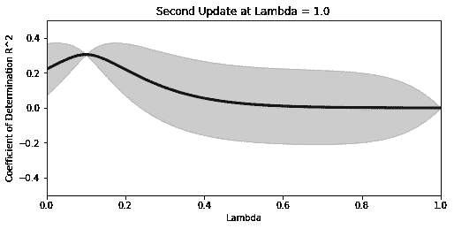
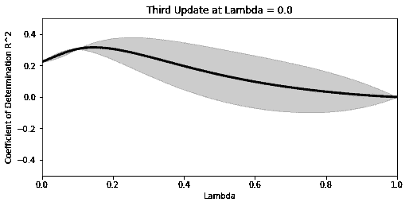
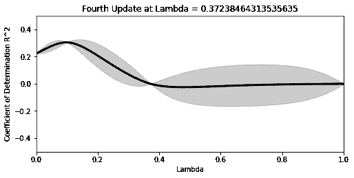
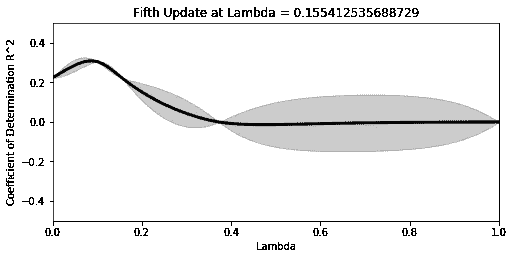

# TL；博士:高斯过程贝叶斯优化

> 原文：<https://towardsdatascience.com/tl-dr-gaussian-process-bayesian-optimization-5e66a014b693?source=collection_archive---------20----------------------->

## 数据科学家的难题:我们已经清理了数据，做出了建模假设，并急切地启动了 sklearn 所有阻挡在我们和 Kaggle 竞赛荣耀之间的都是这些讨厌的超参数。我们如何选择他们？

模型性能通常归结为三个关键因素:数据、模型的适当性和超参数的选择。我们可以将数据和模型类视为最棒的蓝莓松饼食谱中的配料，但即使是这些也无法挽救一个面包师在 300 摄氏度的烤箱中放置三个小时的产品。我们如何帮助他找到这些最佳设置？

**超参数优化**

优化模型超参数的艺术被称为*超参数优化*，你猜对了。在建模的这个阶段，我们提出了这样一个问题:选择什么样的模型设置可以在我的验证数据集上获得最佳性能？

**注意:**模型*超参数*应与模型*参数相区别。*模型参数是从数据中*学习的*，而超参数是由我们这些数据科学家*选择的*。例如，当拟合以下形式的线性模型时:

我们正在从我们的数据 **y** 和 **X** 中学习 *β* 。如果 **X** 包含许多具有潜在相关结构的特征，我们可能想要使用类似 L1、L2 或 elasticNet 正则化来减少[过度拟合](https://medium.com/fintechexplained/the-problem-of-overfitting-and-how-to-resolve-it-1eb9456b1dfd)。

超参数优化帮助我们回答这样的问题:“我应该选择什么正则化方法？”以及“我应该为正则化参数设置什么值？”。我们可以通过询问“我需要多少棵树”来调整其他模型，如随机森林回归器以及“最大树深度应该是多少？”。

**网格搜索**

最简单的方法是使用**每一个超参数组合**来拟合我们的模型，并确定在拒绝验证集上提供最佳性能。这种方法被称为网格搜索优化，因为我们可以将每个组合想象为每个超参数值所跨越的网格上的一个点。

图一。两个回归模型类适合玩具数据。左图:使用 L1 比率和正则化参数调整的弹性网络回归。右图:使用最大树深度和树总数调整的随机森林回归。

上面是在一个玩具数据集上调整的两个模型类，该数据集有 100 个特征和 1000 个样本。在这种网格搜索中，每对超参数用于训练一个新模型，该模型具有在保留数据集上评估的验证性能。虽然这在弹性网模型中是相对可行的(图 1。左)，在像随机森林回归(图 1)这样的非参数模型类的情况下，它的计算量非常大。对)。

网格搜索是一种**确定性**超参数调整方法:我们独立考虑每个超参数配置。对图 1 中表面的关键观察。他们是*连续的*和*行为良好的*(如果我们确定地知道曲面上的任何一点，我们就可以对它旁边的值进行合理的猜测)。因此，如果我们采用**概率**方法，我们可以近似图 1 中的表面。使用数量少得多的训练模型。这就是贝叶斯优化非常有用的地方。

**贝叶斯优化**

**Bayes 规则**让我们提出以下问题:我有一些关于我的误差表面看起来如何的*先验信念*，我有一个模型类和数据可以用来收集更多的*证据*，我如何使用新收集的证据更新我的误差表面以给我一个最优超参数的*后验估计*？

首先，我们需要一个灵活、可扩展且性能良好的模型来逼近我的回归模型相对于超参数的误差曲面。在贝叶斯优化中，这被称为*代理模型*。假设我们正在调优岭回归模型的 Lambda 超参数，它在 python 的 sklearn 实现中接受[0，1]中的值。

我们假设我们的验证误差是这个超参数的函数，但是不确定这个函数采取什么形式。由于我们还没有任何证据，我们可以从假设一个无信息结构开始，其中每个误差值都是从均值为 0、标准差为 1 的标准正态分布中独立提取的。这在图 2 中绘制在λ域上。下面。

您可以想象沿着 x 轴集合了无限数量的单个正态分布，阴影区域表示偏离以 0 为中心的平均值+/-1 个标准偏差。我们前面说过，当邻近的点已知时，我们对建议点的值的信心应该增加；我们需要将这种依赖性编码到协方差结构中。

这就是**核函数**特别有用的地方，它们测量任意两个给定点之间的相似性，并可用于在所有可能的协方差矩阵上建立先验分布。相似的 L1 比值比遥远值更可能具有相似的模型误差分布，并且这被编码在我们选择的核函数中。最棒的是，我们可以用它来建立函数的先验*分布。这种结构有一个特殊的名字:高斯过程**(GP)先验。关于 GPs 的深入概述，包括不同类型的核函数及其在贝叶斯优化中的应用，可以在[这里](https://arxiv.org/pdf/1807.02811.pdf)找到。***

**我们将使用 [Matern 内核](http://gpss.cc/gpuqss16/slides/durrande_school.pdf)作为代理函数协方差矩阵的先验。从我们的先验中采样值给出了线的分布:**

****

**为了更新我们的先验，我们可以从 Lambda 的随机样本开始，并用它来更新代理函数。在与之前相同的玩具数据集上拟合岭回归模型，我们可以计算λ= 0.1 时的决定系数；我们看到，与它相邻的点周围的不确定性大大降低:**

****

**理想情况下，我们希望下一个λ样本的决定系数期望值高于当前样本。这可以通过使用*采集功能*来实现，如[预期改善](https://www.cse.wustl.edu/~garnett/cse515t/spring_2015/files/lecture_notes/12.pdf) (EI)。我们可以从代理模型中直接计算出这个值，并使用它来提出下一个要评估的点。**

**我们可以在评估、取样、评估、取样之间反复，只要我们愿意。建模者决定准确性和计算量之间的权衡。以下是进一步四轮更新的图表:**

****************

**仅经过五轮贝叶斯更新，我们看到我们的代理函数正在采取一个独特的形状。采集函数引导我们的优化远离过度正则化模型的较高λ值。**

**总结:使用高斯过程先验的贝叶斯优化是一个非常有用的工具，用于调整模型超参数，同时最小化整体计算开销。对于那些有兴趣阅读更多内容的人，我肯定会推荐彼得·弗雷泽关于这个领域的评论。 [Thomas Huijskens](https://github.com/thuijskens/bayesian-optimization) 开发了一个优秀的 python 资源，用于使用预期改进的贝叶斯优化。**

**愿贝叶斯力量与你和你所有的努力同在。**