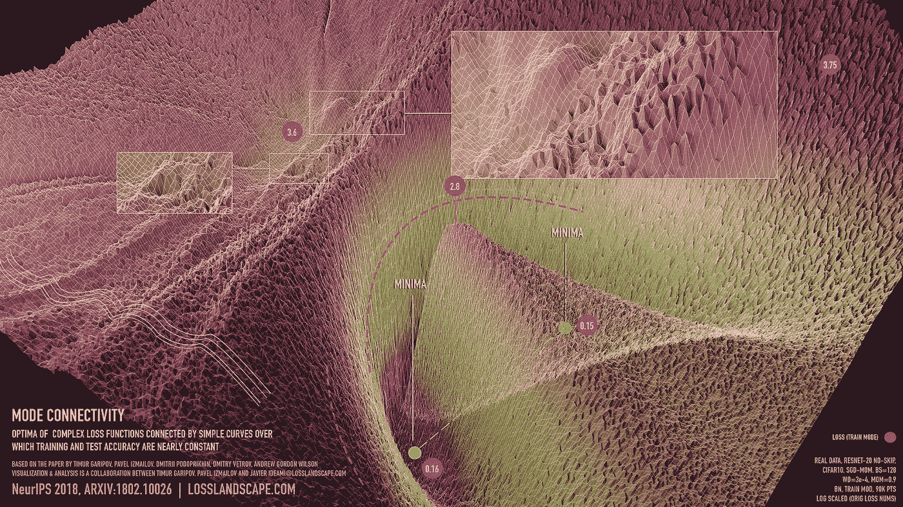
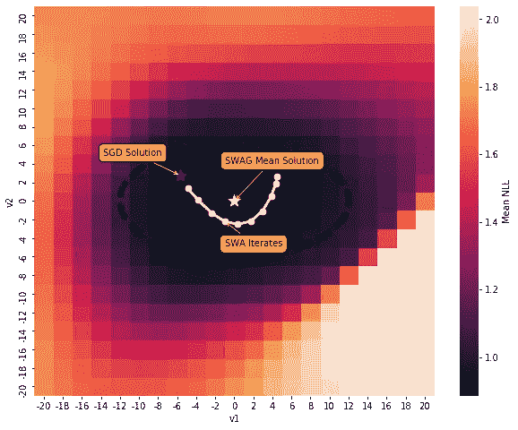

# TL；博士:拥有更多的赃物如何能让人工智能司机更安全

> 原文：<https://towardsdatascience.com/tl-dr-how-having-more-swag-can-make-for-safer-ai-drivers-d23457ecdb93?source=collection_archive---------37----------------------->

## 贝叶斯深度学习可以帮助捕捉传统方法通常忽略的不确定性属性。通过使用 SWAG 进行学习，我们表明可以训练自动驾驶员以更高的准确性做出更可靠的决策。

KITT OG 自动驾驶汽车

自动驾驶汽车曾经只是《霹雳游侠》等 20 世纪娱乐经典的主题。如今，谷歌有了 [Waymo](https://waymo.com/) ，优步有了 [XC90 SUV](https://www.theverge.com/2019/6/12/18662626/uber-volvo-self-driving-car-safety-autonomous-factory-level) ，每辆现代特斯拉都配备了自己的、不那么啰嗦的 KITT 版本，名为 [autopilot](https://www.tesla.com/en_GB/autopilot) 。和普通司机一样，AI 司机的大脑也要有经验，反应快，最重要的是，*自信*。虽然我们可以通过更多的数据来改善体验，通过更强大的机器或更快的算法来提高速度，但我们如何衡量和调节我们的信心呢？

注意我说的*调节*并不一定是*提高*。这是因为自动驾驶司机的决定通常由某种深度学习模型驱动，而这种模型已经*过于自信*。驾驶并不是一项让过度自信有回报的活动；罕见的错误会带来毁灭性的后果。没有人说深度学习模型自大，它们只是大多数确定性函数，不能代表不确定性。这就是贝叶斯方法胜出的地方。

**随机梯度下降**

DNNs 非常强大的模型，在从语言翻译到图像分类的一系列预测任务中表现出卓越的性能。它们通常包含成千上万的参数，可以调整这些参数以从数据中学习复杂的模式。在监督学习中，目标是学习 *p* ( **y** | **θ，X**)；我们搜索模型参数 **θ** ，连同我们的特征数据 **X，**可用于区分或预测我们的目标变量 **y** 中的观察值。对于任何 **θ** ，我们可以通过使用适当的损失度量**来计算我们的模型代表数据的程度，例如在分类任务的负对数似然回归模型的情况下的均方误差(MSE)。**

**如果我们绘制***【L】***对 **θ** 的曲线，我们可以看到损耗幅度如何在参数空间内变化:**

****

**CIFAR10 数据集的 RESNET-20 损失面的可视化。鸣谢:铁木尔·加里波夫和同事们。**

**这张漂亮的插图放大了在 CIFAR10 数据集上训练的 RESNET-20 DNN 的高度非凸损失表面。(x，y)轴上的每个 **θ** 实质上代表一个新的模型，其误差由 z 轴上的 ***L*** 的高度跟踪；理想情况下，我们希望挑选 ***L*** 值最小的 **θ** 。随机梯度下降(SGD)就像一种全球定位系统，引导我们从最初的起始位置沿着最大下降的路径前进，直到我们到达许多局部最小值中的一个。对于那些不熟悉 SGD 的人，我强烈推荐从 Andrew NG 的精彩概述[开始。](https://www.coursera.org/lecture/machine-learning/stochastic-gradient-descent-DoRHJ)**

**这种方法并非没有缺点:**

*   **[有人认为](https://arxiv.org/abs/1803.05407)传统的 SGD 只收敛到一组高性能网络的边界。小样本变化会导致训练和测试数据集之间的*损失表面移动*，从而将 **θ** 推离该边界，导致泛化能力差。**
*   **SGD 通常与一个*衰减学习率*一起使用，以便收敛到一个最优 **θ** 。虽然这加快了推理的速度，但它并没有覆盖所有可能的解决方案。**
*   **当我们做出导致过度自信估计的预测时，我们忽略了与 **θ** 相关的不确定性。**

**我们怎样才能在不增加额外计算开销的情况下解决这些问题呢？**

****贝叶斯网络的 SWAG****

**SWAG 中的 SWA 代表 [**随机加权平均**](https://arxiv.org/abs/1803.05407) **g** ，这是一种专门解决前两个缺点的方法。其思路是从一个预先训练好的解**θ_ {***pre***}**开始，然后把学习率推上去，利用 SGD 探索局部几何。在每一步 *i* 中，我们以恒定或循环的学习速率移动到权重空间 **θ** *_{i}* 中的新位置。恒定的学习速率产生一个新的解，我们连续地将它与我们的预训练解进行平均，以给出 SWA 解**θ_ {***SWA***}**。对于循环学习率，求解器“跳出”一个局部极小值，收敛到附近的另一个解；学习周期结束时的收敛解与训练解进行平均。作者表明，这种新的解决方案更有可能集中在一组广泛的高性能网络中，并强调了跨许多残差和图像分类网络的预测准确性的提高。**

**[Maddox 等人](https://arxiv.org/pdf/1902.02476.pdf)将该方法包装在贝叶斯魔术中，通过使用形式为*N*(**θ_ {***SWA*}，**σ**)的多元高斯模型来近似局部误差表面，将 SWA 扩展到 SWA( **G** )。**

****σ**是一个协方差矩阵，它跟踪沿局部几何形状的变化，并使用沿 SWA 算法路径移动的每个新点 **θ** *_{i}* 进行更新。不幸的是，如果我们包含每个迭代 *i，那么计算**σ**是很昂贵的；*dnn 包含数百万个参数。作为速度黑客，作者使用全套迭代来仅更新**σ**中的对角线元素，使用 SGD 迭代中的最后 **T** 项来计算非对角线。**

**现在来看最精彩的部分:我们不再只有对 **θ、**的*一个*选择，我们有了由*N*(**θ_ {***swa***}**、**σ**)给出的整个*分布*，它描述了围绕**θ_ {***swa***}**的几何特征。这让我们可以使用 [**贝叶斯模型平均**](https://www.jstor.org/stable/2676803?seq=1) 将不确定性直接建模到任何给定的预测中。原则上，这包括将 *p* ( **y** | **θ，X** )中的 **θ** 积分，得到*p*(**y**|**X**)。在实践中，这在计算上是难以处理的，所以我们通过[蒙特卡罗采样](https://machinelearningmastery.com/monte-carlo-sampling-for-probability/)来解决近似:采样**θ_ {*K*} ~***N*(**θ_ { swa }**，**σ**)**K**次，并平均 1/**K(**σ*p*(**y****

****SWAG 在图像分类、分割和回归任务上表现出了令人印象深刻的性能，但它在自动驾驶上又会如何呢？****

******带 SWAG 的自动驾驶******

********

****Udemy 早在 2016 年就推出了一款很棒的[驾驶模拟器](https://github.com/udacity/self-driving-car-sim)，可以用来手动收集训练数据和处理来自 python API 的 I/O。本实验中使用的网络架构和数据预处理步骤来自于 [Manajit Pal](/deep-learning-for-self-driving-cars-7f198ef4cfa2) 的一个很棒的教程，其中还包括一个链接，指向用于两个轨道之一的[数据集](https://d17h27t6h515a5.cloudfront.net/topher/2016/December/584f6edd_data/data.zip)。****

****本质上，该网络是一种改进的卷积神经网络，具有预测单一转向角的线性层。该网络将汽车驾驶员视角的右视图、中视图和左视图作为输入。因为这是一项回归任务，所以使用均方误差作为损失标准。所有代码都是用 python 编写的，使用 pytorch 和 Maddox 等人发布的 [SWAG 训练报告](https://github.com/wjmaddox/swa_gaussian/)进行推理。****

****使用 80:20 的种子随机分配将数据分成训练集和验证集。首先，使用传统的 SGD 在 60 个时期内训练初始网络，线性衰减的学习速率最初被设置为 0.1，持续 30 个时期，线性衰减至 0.00001，并在最后 6 个时期保持固定。在整个训练过程中，动量被设置为常数 0.9，其中 L2 正则化使用 0.0001 重量衰减来实现。通常在 40 个时期后观察到收敛。****

****然后 SWAG 再运行 60 个时期，更新每个时期 I 的循环学习率，如[伊兹迈洛夫等人](https://arxiv.org/abs/1803.05407)所述:****

1.  ****t(I)=(mod(i1，c) + 1)/c，****
2.  ****α(I)=(1t(I))α1+t(I)α2****

****使用基本学习率参数(α1，α2)= {(101，103)，c 是设置为 5 个历元的周期长度。我记录了训练/验证 MSE，并将其转换为负对数可能性，以便于解释。我们可以对获得的协方差矩阵执行奇异值分解(SVD ),以将我们的验证集损失表面投影到由特征向量定义的二维平面上:****

********

****这里，v1、v2 表示在由前两个 SVD 特征向量跨越的低维平面中距 SWA 解的距离。这是一个非常低维的表示，但是非常好地捕捉了损失表面的几何形状！！我们看到，尽管我们的 SGD 解在 SWAG 3σ区域内(绿色虚线)，但它与恰好位于宽损失边界正中心的 SWAG 平均解相差甚远。****

****最终的结论是，我们的 SGD 模型实现了 0.91±0.0115 的验证集 NLL，而 SWAG 构造具有更低的损失和更紧密的围绕 0.88±0.0094 的解决方案的置信界限。****

****由于该框架非常灵活，因此可以扩展到更复杂的自动驾驶网络，这些网络具有类似记忆的组件，如 LSTMs。但是现在，我希望我已经让你相信贝叶斯网络真的很神奇，并且对未来有很大的希望。****

****谷歌的协作环境为这个项目提供了动力，他们免费提供 GPU 时间，因此任何人都可以训练他们的模型！也感谢[Marco Antonio Awada](https://www.linkedin.com/in/marcantoniomawada/)博士对信息几何及其在深度学习中的应用的大力指导。****