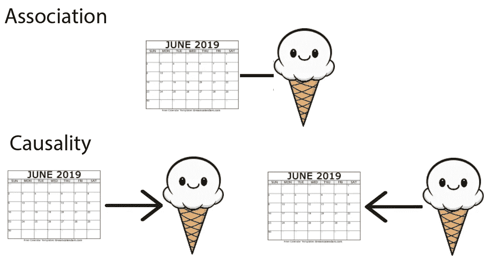
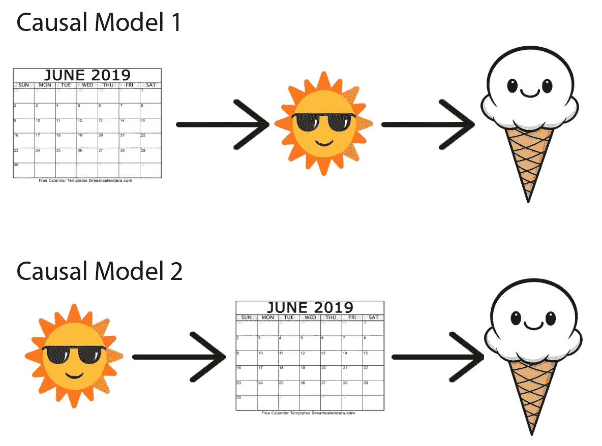
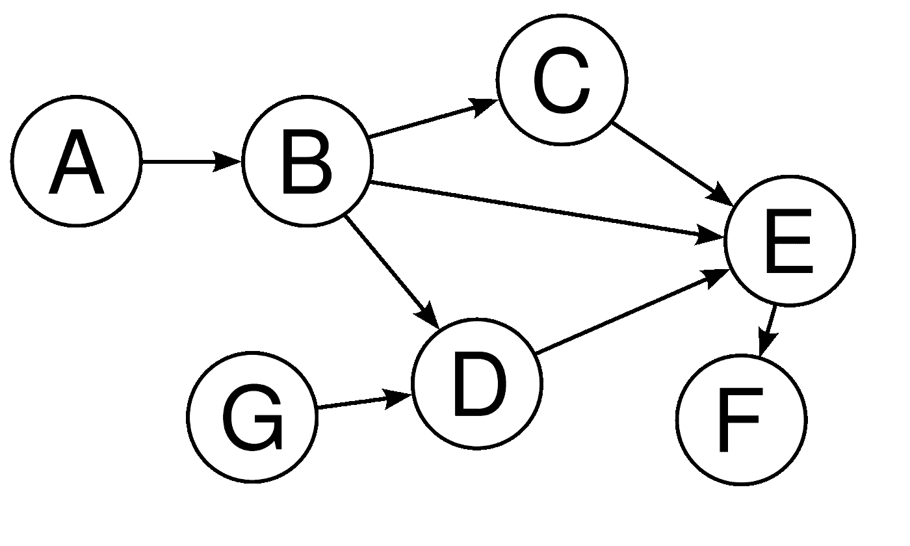
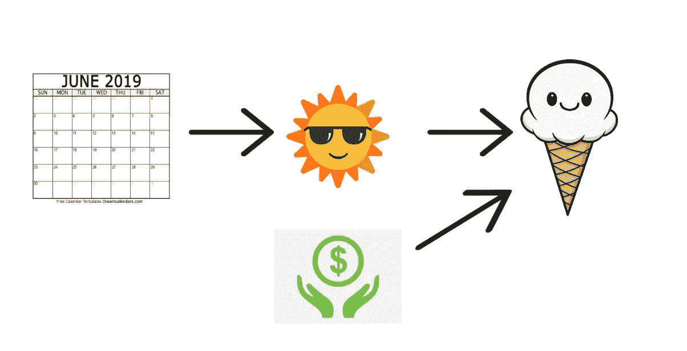
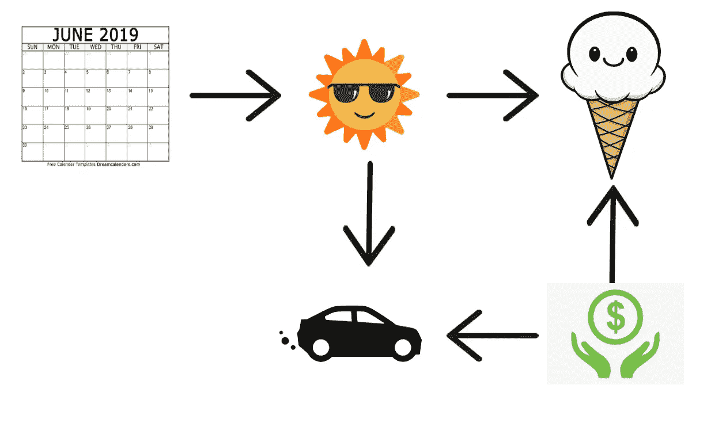

# TL；灾难恢复结构因果模型(Dag)变得简单

> 原文：<https://towardsdatascience.com/tl-dr-structural-causal-models-dags-made-easy-part-1-25526374cfd5?source=collection_archive---------48----------------------->

“吸烟与癌症有关”vs“吸烟致癌”，哪个更容易摇摆公众情绪？后者肯定；因果结论强于关联。我们拥有比以往更多的数据，但开发因果人工智能引擎仍然是一个重大挑战，我们在哪里？

先有鸡还是先有蛋？资料来源:publicdomainpictures.net

**联想 vs 因果关系**

简而言之:因果关系是那些在外部条件变化时保持不变的关系，无论如何关联都保持不变。

假设我们想了解一年中的哪一个月是冰淇淋需求增加的原因。相关性是一个简单的模型，其中观察到的冰淇淋需求被建模为一年中月份的线性函数**。**我们可以通过测量边际概率 *P* (冰淇淋 **|** 月)来表示这种关系。然而，一台机器如何仅凭联想就能确定是冰淇淋需求导致了一年中的哪一个月，还是相反？

它不能！这是因为我们无法在*变化条件*下验证 *P* (冰淇淋 **|** 月)。这就是所谓的关联模型的**静态属性** ，包括但不限于关联和回归。

批判地说，朱迪亚·珀尔(现代因果理论之父)将我们温顺的“*相关性并不意味着因果关系”*重新表述为更严格的 [*“一个人不能仅仅从关联中证实因果关系的主张，即使是在群体水平上——在每一个因果结论的背后，必定存在一些在观察研究中不可检验的因果假设”*](https://ftp.cs.ucla.edu/pub/stat_ser/r350.pdf) *。这与我们将因果假设直接编码到数据收集过程中的实验形成对比。那么，我们如何验证“六月会导致更多的冰淇淋需求”这句话呢？*

一些人通过简单地控制与治疗变量 **x** 和结果变量 **y** 相关的变量 **Z** 来宣称因果关系。例如，当检查六月( **x** )是否会导致冰淇淋需求激增( **y** )时，分析师可能会针对天气调整他们的模型。如果 **(Z** 和 **x** ) 和( **Z** 和 **y** )不是独立的， **Z** 就说是一个 [**混杂变量**](https://www.statisticshowto.com/experimental-design/confounding-variable/) 。因此，如果我们考虑天气因素，我们的计算机可以使用更新的关联模型*P’*(**y**|**x**)来识别下面这些家伙之间的正确因果关系吗？

差得远，“控制**Z”**只是我们已经验证的因果假设的一个子集，仍然有太多的依赖和事情在发生！为了了解为什么会出现这种情况，我们可以用一种叫做[****有向无环图****](https://en.wikipedia.org/wiki/Directed_acyclic_graph) **的**结构因果图**来说明因果关系。**

****因果有向无环图****

**通俗地说，DAG 是一个没有圈的有向图:**

****

**这意味着从图中的任何节点开始，比如 **D、**D，没有任何路径可以将你带回到 **D** 。重要的是，它们可以用于编码因果模型的所有假设，这被称为因果 DAG。节点表示事件，有向边表示因果关系:**E**->-F 隐含 **E** 是因果 **F** 。因为图是无环的，**没有事件能引起自身**。事件由**路径**连接，有三种路径需要考虑。让我们从字母转移到我们的冰淇淋示例，以获得一些实际的上下文:**

****

**DAG 1:开放路径**

****(1)开放路径:**六月是气温升高的原因，而气温升高又是冰淇淋需求增加的原因。天气在六月和冰淇淋需求之间扮演着 T2 的中介角色。健康的经济也会导致冰淇淋需求的增加，但是由于没有箭头指向它，这一事件与月份或天气无关。**

****

**DAG 2:后门路径**

****(2)后门路径**:这里两个变量共享同一个因果路径。在一个以农业为主的经济体中，气温升高可能会增加作物产量，从而提高经济健康水平，进而增加冰淇淋需求。更高的温度也让人们想吃更多的冰淇淋。因此，我们可以看到天气或一年中的月份如何成为农业和冰淇淋需求之间关系的混淆变量，因为两者之间存在关联。在因果 Dag 中，通过追踪后门路径总能找到混淆变量。**

****

**DAG 3:封闭路径**

****(3)封闭路径:**这里，一个变量有两个效应导入其中。更高的温度可能会使人们想开着空调汽车到处跑。此外，更健康的经济让汽车更实惠。后果如何？天气和通过更多驾驶传递的冰淇淋需求之间没有联系。驱动事件变量被称为*碰撞器。***

**现在我们明白了为什么简单地“控制混杂变量”会产生误导。在模型(1)中，对天气的调节对应于对*中介的调节，*这关闭了路径，并且这歪曲了事件之间的关系。在模型(3)中，错误地控制一个碰撞器作为混杂因素，打开了一条从六月到通过驾驶的冰淇淋需求的路径，扭曲了整体关系。在实验设计中，这也是一个同样重要的考虑因素，研究天气对倾向于驾驶的人群中冰淇淋销售的影响**选择偏差**。**

**最重要的是，检查因果 Dag 可以指导我们选择混杂变量:为了在模型(2)中收集经济健康对冰淇淋销售的影响的无偏估计，控制天气似乎是一个不错的选择。**