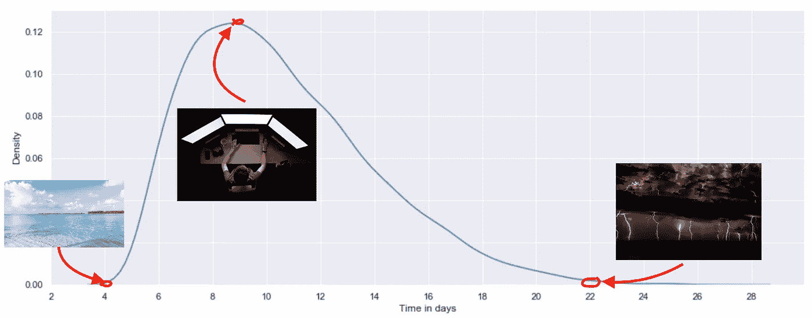
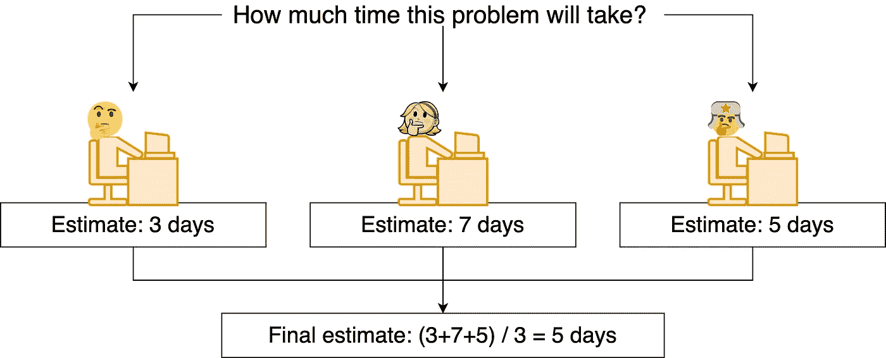
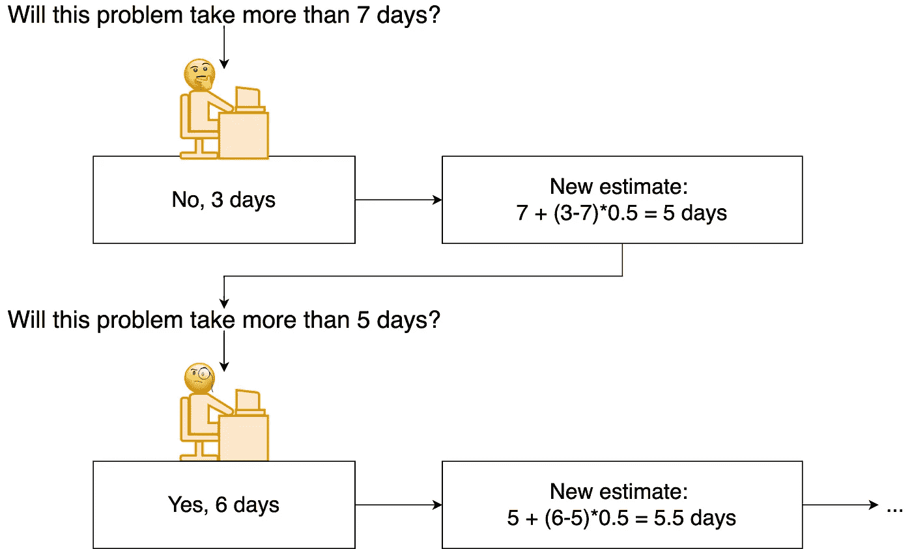
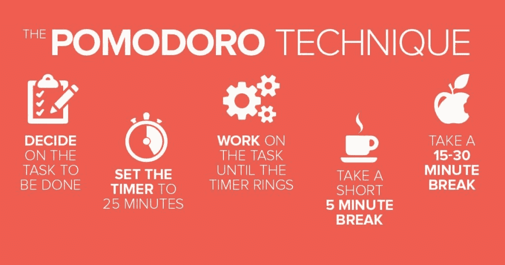

# TL；博士:罗伯特·马丁的《干净的编码者》

> 原文：<https://towardsdatascience.com/tl-dr-the-clean-coder-by-robert-martin-d53a77dd228b?source=collection_archive---------33----------------------->

布莱恩·戈夫在 [Unsplash](https://unsplash.com?utm_source=medium&utm_medium=referral) 上的照片

我刚刚读完罗伯特·c·马丁的《干净的程序员:职业程序员行为准则》。不可思议的书，全新的程序员，十分之十。我推荐给每一个日常写代码的人。

我决定做一些笔记，将书中的建议与我自己在数据科学和机器学习方面的一些经验结合起来。我试着把这些笔记写成可操作的形式，这样就很容易从中养成习惯。

1.  负责
2.  对自己的职业负责
3.  当你打算重用代码时，使用 TDD
4.  不要害怕说“不”
5.  定义“完成”
6.  通过给出时间估计来显示承诺
7.  提供时间估计，而不是猜测
8.  将大任务分解成几个小任务
9.  使用 PERT 方法
10.  请你的队友估计所需的时间
11.  不要参加所有邀请你参加的会议
12.  提供一个清晰的议程和一系列要实现的目标
13.  会议期间做笔记
14.  进行结对编程会话
15.  开始使用番茄红素

让我们详细看看每一个。

# 职业化

这本书的细红线是在回答这个问题，“成为一名软件开发专业人员意味着什么？”。你自己也想一想。你能称自己为专业人士吗？为什么？如果不是，你和专业人士的区别是什么？

## 负责

我父亲总是告诉我，“工作吧，就像你拥有它一样。”如果公司是你自己的，你会写蹩脚的代码，做最少的工作来满足需求，或者做肤浅的分析吗？大概不会。在道德上有义务为自己的行为负责。

> 非专业人士要容易得多。非专业人士不必对他们所做的工作负责。

我们如何承担责任？罗伯特·马丁提出了几点:

1.  不要损害功能。确保你的代码做了你想让它做的事情。
2.  设计易于测试的解决方案。问问你自己，“如果我在一年内重构这段代码，会有多容易？”如果你有可靠的测试，你就不会害怕改变代码。
3.  设计易于维护的解决方案。代码会随着时间而退化；维护它是你的责任。童子军规则:总是签入一个比你签出时更干净的模块。

## 对自己的职业负责

确保你有销路不是你雇主的责任。为你的事业努力。

1.  每周花 *n* 个小时学习新东西。阅读博客帖子，细读 [arxiv](https://www.arxiv-sanity.com/) 论文，在 YouTube 上观看会议笔记，在 Twitter 或 LinkedIn 上关注顶级人工智能影响者——有无数种方法可以了解数据科学和机器学习领域正在发生的事情。但是尽量不要被噪音淹没。把学习时间当作对你的职业和未来的巨大投资。让你的生活成为一个不断学习的过程。
2.  练习你的技能。贡献开放软件，做自己的宠物项目，参加机器学习比赛或者黑客马拉松。让练习技能成为每天的例行公事。
3.  成为某人的导师。即使你确实知道这个话题，向别人解释也会使你的知识结构化。与某人合作或成为导师。为社区做贡献。

# 测试驱动开发

[来源](https://www.monkeyuser.com/)

测试驱动开发(TDD)是一个软件开发过程，在这个过程中，程序员重复小周期的工作:为一个功能编写测试，编写这个功能，让这个功能通过测试。这种方法有多种好处；以下是几个例子:

1.  通过编写更多的测试，您可以确保您的程序如您所愿。TDD 允许您捕捉 bug，并对您的代码更有信心。
2.  久而久之，你的代码开始“发臭”，也就是说，代码质量下降。一个好的做法是不时地进行代码重构。但是你怎么能确定你的重构没有破坏代码呢？没有测试，就不可能确切知道。缺乏测试会阻止开发人员执行必要的重构(“如果我破坏了它，我需要修复它”)。
3.  TDD 迫使你正确地编写代码*。考虑一下为一个同时做多件事的函数编写测试(例如，拆分数据、归一化数据、训练模型以及计算分数)。那会很难。因此，您开始考虑是否可以将函数分解成几个更小的独立函数，这样测试会更容易。*
4.  *后来写的测试不如先写的测试深刻。*

## *当你打算重用代码时，使用 TDD*

*数据科学家是否应该使用 TDD 并不是那么明显。有多种理由反对将 TDD 用于数据科学和机器学习任务:*

1.  *TDD 需要更多的时间。在某些情况下，数据科学团队需要快速迭代，而 TDD 会减慢这个过程。*反驳论点一*:你如何确定你迭代的结果是可靠的？一个管道可能会被拒绝，因为一个隐藏的错误使分数很低。当你发现这个 bug 的时候，你必须再次迭代，以确定结果。*反驳论点二*:现在写脏代码，将来会需要更多时间。在许多情况下，技术债务是可以避免的。*
2.  *一些数据科学任务无法测试。*反方*:不能做所有的事情并不意味着我们不应该做任何事情。即使 10%的测试覆盖率也比 0%要好。*
3.  *并不是每一段 DS 代码都投入生产，因此很多工作*可能*是无用的。*反驳*:如果它没有投入生产，并不意味着代码不会被重用。*
4.  *数据科学家通常不是软件工程师，所以很少有人能写出合适的测试。*反驳*:开始做，熟能生巧。*

*自己决定用不用 TDD。*

*我为自己制定了一个简单的规则:如果我打算多次使用这段代码，我将首先编写测试。对于需要快速迭代的任务，使用眼球测试(例如，通过打印输出或绘图自己检查输出的完整性)。如果我们谈论生产，所有代码**必须**被测试。*

# *说不和说是*

## *不要害怕说“不”*

> *-我们真的很喜欢你为我们设计的标志！但是我们的管理层有一些很棒的想法…*
> 
> *-没有。*

*管理层并不像你那样对你的领域有深刻的理解(这就是他们雇佣你的原因)。他们通常不明白一项任务要花多少时间，或者在一些任务上投入资源是否有意义。你的管理层指望你捍卫你的目标，而不只是同意他们所说的一切。要有主见。你和你的经理都需要通过谈判获得尽可能好的结果。我并不是说你应该总是说“不”，但是请记住，专业人士是不会同意的。*

## *定义“完成”*

**

*了解你被期望做什么是至关重要的，尤其是在数据科学领域，分数的提高可能需要额外几周的工作。管理层的期望可能与你的计划不同，所以为了避免沮丧，讨论并定义什么是“完成”。如果你不确定什么时候可以说“完成了”，把任务分解成几个你确定的小任务。*

## *通过给出一个时间估计来显示承诺*

*“我会尽力在下周末之前完成”——你觉得怎么样？这句话的意思可能会有所不同，从“如果有就好了；如果我有时间的话，我会做的，这取决于说这话的人。在某些情况下，这样的短语可能会被视为对完成任务的承诺，这可能会导致错误的承诺。对你的承诺要非常清楚，给予并且不要害怕询问估计的时间。*

> *当你说你会做的时候*
> 
> *你是认真的*
> 
> *你真的做到了*

*你时不时会受到其他人的阻碍，或者因为意想不到的原因而无法完成任务。那很好。能做多少就做多少，专业一点。如果你不能及时完成项目，尽快通知利益相关者。*

# *时间**估计值***

*“完成这项任务需要五个工作日”——你这么说是什么意思？你的意思是:*

> *我认为它可能需要五天。也许四个，也许六个。甚至可能是 10 年。但我最后的猜测是五天。*

*或者你实际上的意思更接近于:*

> *不管要花多少钱，我都承诺在五天或更短的时间内完成它。我会加班；没有家人，没有朋友。五天，不能再多了。*

## *提供时间估计，而不是猜测*

*企业将时间估计视为承诺，而开发人员倾向于将估计视为猜测。真正的软件开发人员会做出承诺，并努力实现它们。问题是，在现实中，我们不知道这项任务需要多少时间，因此我们需要估计。人们往往是糟糕的评估者。然而，有几种方法可以帮助我们提高估计值。*

## *将大任务分解成几个小任务*

*假设你正在计划去巴哈马度假的预算。你需要多少？1k，3k，10k？你能确定吗？*

*你可能不能完全确定，但你仍然可以给出一个合理的估计。你所要做的就是得到一个往返的票价；你打算在食物、娱乐和礼物上花多少钱；等等等等，然后总结一下。这些估计也没那么难吧？时间规划也是如此。*

*把大任务分解成几个小任务，你是一举两得。首先，这种分解有助于理解任务所需的组件和整个架构。其次，它提高了估算的准确性:估算小任务所需的时间比大任务要容易得多。*

## *使用 [PERT](https://en.wikipedia.org/wiki/Program_evaluation_and_review_technique) 方法*

*为了提高估计的准确性，开始考虑时间估计不是一个单一的数字，而是几种情况:*

*● **O** :乐观——如果一切顺利，任务会很快完成。*

*● **N** :正常——这个估计有最大的成功机会(最可能的时间)。不是所有的事情都是完美的；将会出现一些错误和阻塞。*

*● **P** :悲观——事事不顺。最坏的可能，但也是可能的。*

**

*从左到右:乐观，正常和悲观的时间估计。使用过的照片，从左到右:在 [Unsplash](https://unsplash.com?utm_source=medium&utm_medium=referral) 上 [Ishan @seefromthesky](https://unsplash.com/@seefromthesky?utm_source=medium&utm_medium=referral) 的照片，在 [Unsplash](https://unsplash.com?utm_source=medium&utm_medium=referral) 上 [Max Duzij](https://unsplash.com/@max_duz?utm_source=medium&utm_medium=referral) 的照片，在 [Unsplash](https://unsplash.com?utm_source=medium&utm_medium=referral) 上 [Josep Castells](https://unsplash.com/@paniscusbcn?utm_source=medium&utm_medium=referral) 的照片*

*给定这些估计值，并假设任务所需的时间可以用 beta 分布来描述，您可以计算:*

*   *任务的预期持续时间: *m = (O + 4N + P) / 6* (天)*
*   *任务的标准差:*σ=(P—O)/6*(天)*

*一系列具有预期持续时间 *m_i* 和标准偏差 *sigma_i* 的任务所需的时间计算如下:*

*   *一系列任务的预期持续时间: *M = m_1 + m_2 + … + m_n**
*   *一个任务序列的标准差:*西格玛* = ( *西格玛 _1 ^ 2* + *西格玛 _2 ^ 2* + … + *西格玛 _n ^ 2* ) ^ 0.5*

## *请你的队友估计所需的时间*

*1906 年，英国统计学家弗朗西斯·高尔顿参加了在普利茅斯的一个郡会，普利茅斯是德文郡南海岸的一个港口城市。他偶然发现了一个猜重量的彩票，参与者被要求猜屠夫斧头的重量。猜得最接近的人将会获奖。高尔顿要求彩票组织者写下参与者的猜测。*

*根据这些笔记，高尔顿发现 800 次猜测的平均值与斧头实际重量相差不到 500 克，这比获胜者的猜测要近得多。这有助于认知科学中的洞察力，即群体的个人判断可以建模为响应的概率分布，中间值集中在待估计量的真实值附近(参见[群体智慧](https://en.wikipedia.org/wiki/The_Wisdom_of_Crowds)中的更多群体智慧示例)。*

*获得一项任务所需时间的更准确估计的最简单和最快的方法是**独立地**问你的队友，然后平均他们的答案。你不需要像在 ax 重量彩票中那样问 800 个人来得到一个可靠的预测。即使在几个同事的帮助下，最终的估计也会有更低的方差，因此估计会更准确(估计的误差包括[偏差、方差和噪声](https://en.wikipedia.org/wiki/Bias%E2%80%93variance_tradeoff)；减少其中一个，你会得到更好的预测)。*

**

*混合估计似乎很熟悉？没错，这是人类版的[随机森林](https://en.wikipedia.org/wiki/Random_forest)*

*要进一步改进预测，您可以执行以下操作:*

1.  *猜测完成任务所需的时间。假设你的估计是 7 天。*
2.  *询问同事这项任务需要的时间是多还是少。找出他们的估计和你的估计之间的差异。将差值乘以一个小数字(如果你有一个庞大的部门，则为 0.01；0.5，如果你有一个小团队)并将这个结果添加到你的估计中。*
3.  *重复直到收敛。*

*这种方法类似于梯度增强。理论上，它减少了估计的偏差。关于偏差-方差权衡、混合和增强的更多信息可以在[统计学习介绍](http://faculty.marshall.usc.edu/gareth-james/ISL/getbook.html)(第 2 章和第 8 章)中找到。*

**

*没错，这是人类的[梯度推进](https://en.wikipedia.org/wiki/Gradient_boosting)*

# *会议*

*工作日太短，你能投入编码的深度工作甚至更短。*

## *不要参加所有邀请你参加的会议*

*管理你的时间是你的工作，而不是邀请你的人。有时候，最好进行一次简短的面对面的讨论，不要开太长的会议。*

## *提供一个清晰的议程和一系列要实现的目标*

*这是一个简单而高效的提高会议效率的策略。你是要在会议中解决什么问题还是只是随意讨论？写下需要讨论的要点和应该做出的决定。让它变得可行。*

## *会议期间做笔记*

*你还记得两个月前会议上的内容吗？我也没有。我不知道是否有人可以。也许有人可以，但他们最有可能是在拉斯维加斯算牌。*

*自己做笔记或者请别人在会议期间做笔记。写下最重要的陈述、共识和任务。在 Confluence 或 Google Docs 中公开共享您的笔记，这样那些没有参加会议的人仍然可以得到更新。*

# *团队合作*

## *进行结对编程会话*

*结对编程是指两个或两个以上(最好是两个)的人一起完成一项任务。通常，一个人编写代码，另一个人讨论问题并观察问题，如语法、逻辑或代码风格。结对编程有多种好处:*

1.  *这可能是审查代码的最佳方式。*
2.  *结对编程是在公司内部传递知识的最快方式。*
3.  *结对编程有助于团队建设。*

## *开始使用番茄红素*

*大约六个月前，我开始使用番茄工作法，我注意到专注于问题和跟踪每天的结果变得更容易了(每天站立也有帮助)。此外，将你的工作时间分成几个间隔更健康，这样你就可以从电脑前起来热身。*

**

*[来源](https://www.attendancebot.com/blog/productivity-tips/)*