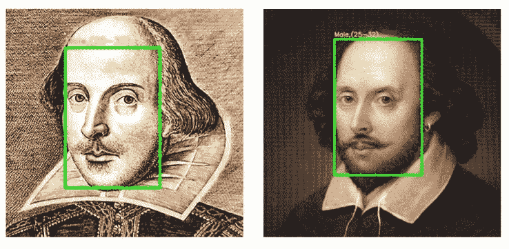
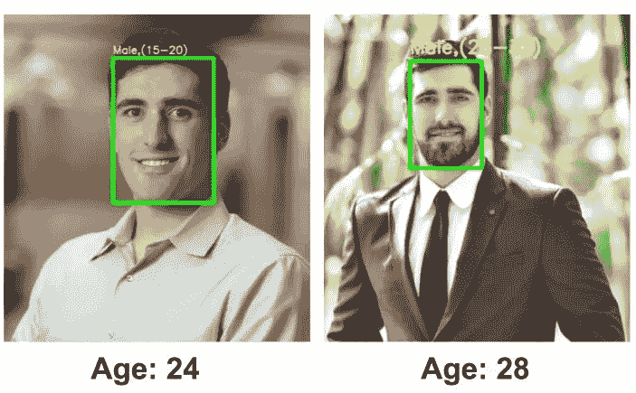

# 刮胡子，还是不刮胡子，这是个问题

> 原文：<https://towardsdatascience.com/to-beard-or-not-to-beard-that-is-the-question-b46864d7e003?source=collection_archive---------62----------------------->

## 使用深度学习对有胡须和无胡须的照片进行年龄分类



威廉.莎士比亚两幅画作的年代预测。在这种情况下，胡子不会改变年龄范围，尽管这幅画的平滑特征可能会妨碍模特的表现。原创图片分别来源于 [Flickr](https://www.flickr.com/photos/lincolnian/304477845) 和[pen light](https://penlighten.com/understanding-literary-term-peripeteia-with-examples)。

机器学习在计算机视觉中的应用是数据科学中一个不断发展的领域，一些有趣的问题已经用这些方法解决了。计算机视觉是[识别偷猎者](https://phys.org/news/2018-02-ai-vision-breakthrough-ids-poachers.html)并将他们绳之以法，以及推动无人驾驶汽车的浪潮。在这篇文章中，我使用计算机视觉是出于一个更不相关的原因，即识别我有胡子和没有胡子的年龄。如果你对使用机器学习进行年龄预测感兴趣，我在之前的文章中加入了很多我的代码和推理。如果你对计算机视觉感兴趣，OpenCV 是必不可少的，有许多教程可以帮助你入门。本文的代码改编自 Adrian Rosebrock 的 pyimagesearch 教程。我还通过使用 Prerak Agarwal 的 TDS 帖子来训练我自己的模型。我改编的代码可以在 GitHub 上找到，尽管我建议从 Adrian 和 Prerak 上查看代码。由于 Tensorflow 的训练时间较长，我的脚本使用了预先构建的 CAFFE 模型。

为了训练用于分类任务(例如年龄预测)的任何模型，我们需要具有真实年龄的标记人脸数据。要使用 Tensorflow 训练自己的深度学习模型， [Prerak 的 CoLab](https://drive.google.com/drive/folders/1gN7GoxYRAfE_wuiQaaR6dJ7qWD1kZ0Dz) 笔记本是一个很好的起点。他首先创建均匀分布的标记的训练数据的年龄范围或**箱**。在我自己的模型训练中，我改变了箱子以更准确地表示发展阶段。例如，我将 10-20 岁这一大类分为 8-12 岁、13-16 岁和 17-25 岁。然而，在[面部年龄数据集](https://www.kaggle.com/frabbisw/facial-age)和 [UTKFace 数据集](https://susanqq.github.io/UTKFace/)的组合中，出现了 17-25 岁和 25-30 岁人群的富集。训练后，我在遗漏的测试数据集上测试了我的新深度学习模型，发现我的模型预测所有测试案例为 25–30。这可能是不平衡的训练数据的结果。我需要对我的训练数据进行降采样，以平衡我的类来处理这个问题。我没有继续摆弄自己的模型，而是求助于 Adrian 教程中预先训练好的模型。

为了实现年龄分类模型，必须首先找到图片中的所有人脸。OpenCV 有使用[级联分类器](https://docs.opencv.org/3.4/db/d28/tutorial_cascade_classifier.html)的面部分类器演示。谢天谢地，面部检测模型已经创建好了。我们可以找到人脸，然后创建一个矩形框来突出显示我们的模型识别的“斑点”，以预测年龄和性别。斑点是图像的子部分的术语。我们的脚本通过网络向前运行新的 blob 预测，并获取最大预测分数。最大预测得分是分配给预测人脸的项。

**运行年龄/性别预测脚本**

要运行该脚本，只需从项目 [Github](https://github.com/Datadolittle/2BeardorNot2Beard) 下载源代码和模型。需要安装 Opencv 来运行模型和脚本

```
pip install opencv-python
```

然后进入文件夹，摆弄一些照片。** **要分类的照片必须与 AgeGender.py 在同一个目录下才能打印输出文件。****

```
./AgeGender.py --input bearded_willy.jpg
```

这将输出文件 age-gender-out-beadled _ willy . jpg。打开该文件以查看分类性能。

## 忍受令人发指的毛发生长带来的瘙痒和斑斑驳驳，还是把刀片拿到脸上，以相反的方式终结它们，哪个更高尚？去理发，去刮胡子。

这个年龄分类系统是如何对我自己有胡子/没有胡子的图片起作用的。



我长着一张娃娃脸，没有胡子，模特预测我的年龄在 15-20 岁之间，然而，有胡子的我属于 25-32 岁之间。

这个年龄分类系统把我没有胡子的脸定为 15-20 岁。鉴于我现在已经快 30 岁了，我认为留胡子可以让未来的面部识别技术准确识别我的年龄范围。我的名字是科迪·格利克曼，可以在 T2 的 LinkedIn 上找到我。请务必查看下面的一些其他文章。

[](/creating-photo-mosaics-using-python-49100e87efc) [## 使用 Python 创建照片镶嵌

### 一步一步的教程，让你自己的美丽的图像

towardsdatascience.com](/creating-photo-mosaics-using-python-49100e87efc) [](/dashing-through-christmas-songs-using-dash-and-sql-34ef2eb4d0cb) [## 使用 Dash 和 SQL 快速浏览圣诞歌曲

### 使用 SQL 数据库创建 Dash 仪表板的简单项目

towardsdatascience.com](/dashing-through-christmas-songs-using-dash-and-sql-34ef2eb4d0cb) [](/building-a-beautiful-static-webpage-using-github-f0f92c6e1f02) [## 使用 GitHub 创建漂亮的静态网页

### 查找模板和为静态网页创建表单的位置

towardsdatascience.com](/building-a-beautiful-static-webpage-using-github-f0f92c6e1f02)