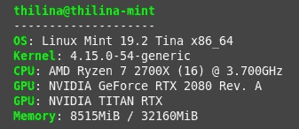
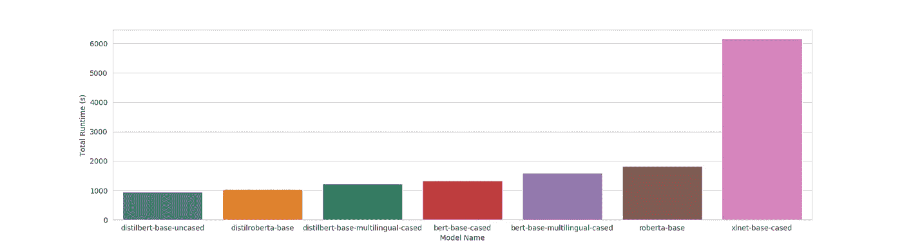
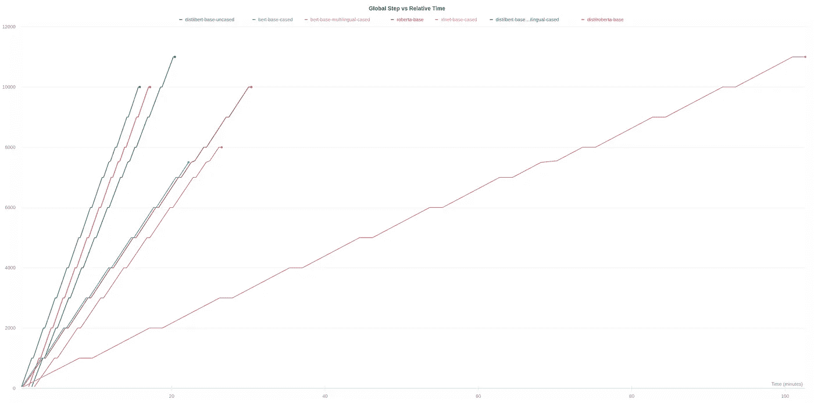
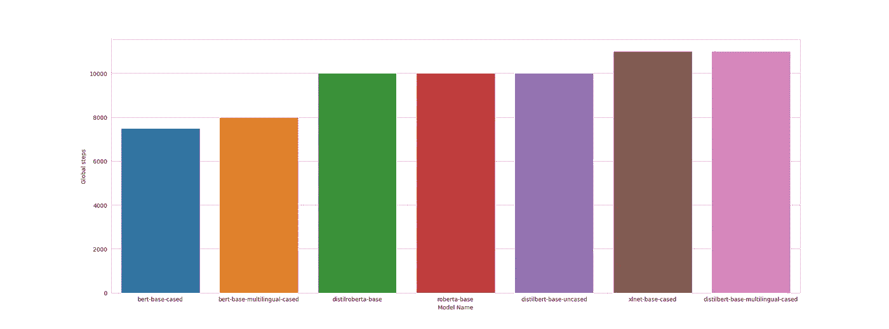
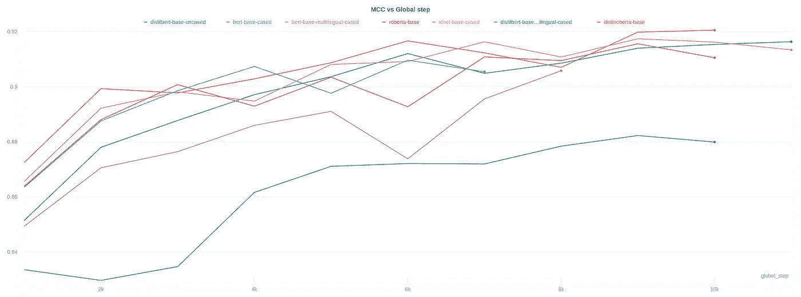
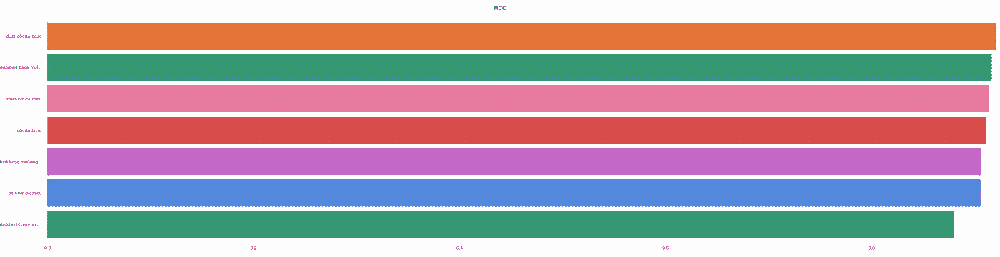

# 蒸馏还是不蒸馏:伯特、罗伯塔和 XLNet

> 原文：<https://towardsdatascience.com/to-distil-or-not-to-distil-bert-roberta-and-xlnet-c777ad92f8?source=collection_archive---------11----------------------->

## 变形金刚是自然语言处理中无可争议的王者。但是周围有这么多不同的模型，很难只选择一个。希望这能有所帮助！

照片由[维多利亚诺·伊斯基耶多](https://unsplash.com/@victoriano?utm_source=medium&utm_medium=referral)在 [Unsplash](https://unsplash.com?utm_source=medium&utm_medium=referral) 拍摄

这已经有点老生常谈了，但是 Transformer 模型已经改变了自然语言处理。BERT(和他的朋友们)在几乎所有常见的 NLP 任务中都扫除了之前设定的基准。这种成功，以及随之而来的流行，已经见证了基于 BERT 架构和训练技术的一系列新模型(前面提到的朋友)的开发。事实上，我们有幸拥有如此多的新模型，以至于对于哪个模型应该用于哪个任务有些困惑。这个问题我已经被问过很多次了，但在大多数情况下，答案是明确的“视情况而定”。

考虑到这一点，我不会尝试选择最佳模型，而是将几种最常见的模型进行比较，特别是在最终精度和训练时间方面。因此，我将使用相同的超参数来训练所有模型，这意味着这不一定是每个(或任何)模型的最佳情况。然而，我希望这个比较能让你对每个型号在相同情况下的表现有一个*的感受*。

# 设置

## 环境

这个实验是使用简单的变形金刚库进行的，这个库的目的是使变形金刚模型简单易用。这个库建立在流行的[拥抱脸变形金刚](https://github.com/huggingface/transformers)库之上。

如果你希望跟随实验，你可以在几个简单的步骤中准备好环境；

1.  从[这里](https://www.anaconda.com/distribution/)安装 Anaconda 或 Miniconda 包管理器
2.  创建新的虚拟环境并安装软件包。
    `conda create -n transformers python`
    `conda activate transformers`
    如果使用 Cuda:
    `conda install pytorch cudatoolkit=10.1 -c pytorch`
    其他:
    `conda install pytorch cpuonly -c pytorch`
3.  如果您使用 fp16 培训，请安装 Apex。请按照这里[的指示](https://github.com/NVIDIA/apex)。(从 pip 安装 Apex 给一些人带来了问题。)
4.  安装简单变压器。
    `pip install simpletransformers`

*请注意，我将同时使用 CUDA 和 FP16 培训(使用 Apex)。*

## 数据

AG News 数据集用于训练和评估模型。准备好数据集；

1.  [从 Fast.ai 下载](https://s3.amazonaws.com/fast-ai-nlp/ag_news_csv.tgz)数据集。
2.  提取`train.csv`和`test.csv`并将它们放在目录`data/`中。

## 使用的硬件

任何机器学习模型的训练时间将在很大程度上取决于所使用的硬件，因此您的里程数可能会有所不同！我附上了我用来对比的硬件。

在上面列出的两个 GPU 中，所有实验都只在 NVIDIA Titan RTX GPU 上运行。此外，这个 GPU 在实验期间执行的唯一任务是实验本身(包括操作系统 GUI 在内的一切都由 RTX 2080 处理)，以确保所有模型在任何时候都可以访问相同的硬件资源。

# 模特们

我们将试用下面给出的模型。

*   **Bert-base-cased**
    *12 层，768 隐，12 头，110M 参数。
    接受过小写英文文本的训练。*
*   **RoBERTa-base**
    *12 层，768-隐藏，12 头，125M 参数
    RoBERTa 使用 BERT-base 架构*
*   **distil bert-base-uncased**
    *6 层，768-隐藏，12 头，66M 参数
    从 BERT 模型中提取的 distilbert 模型 bert-base-uncased 检查点*
*   **xlnet-base-cased** *12 层，768 隐，12 头，110M 参数。
    XLNet 英文型号*
*   **distilloberta-base** *6 层，768 隐藏，12 头，82M 参数
    distilloberta 模型是从 roberta 模型中提炼出来的 roberta-base 检查点。*
*   **Bert-base-multilingual-cased** *12 层，768-hidden，12 头，110M 参数。
    使用最大的维基百科对前 104 种语言的大小写文本进行培训*
*   **distilbert-base-Multilingual-cased** *6 层，768 隐藏，12 头，134M 参数
    多语言 distil bert 模型是从多语言 BERT 模型 BERT-base-Multilingual-cased check point 中提炼出来的。*

# 超参数

成功训练一个好模型的一个重要部分是获得正确的超参数。根据我的经验，只要超参数值合理，大多数预训练的变压器模型都会收敛并给出良好的结果。因此，以下给出的值可被视为所有型号的合理默认值，而非针对任何特定型号的优化值。

对所选值的快速解释；

## 最大序列长度

变压器模型被限制为每个输入示例最多有*个标记*。令牌是模型词汇表中的一个“单词”(不一定是正确的英语单词)。任何输入文本都会被拆分，直到整个输入都由模型词汇表中的标记表示。如果结果表示包含的令牌数超过了允许的最大数量，它将被截断到最大长度。如果更短，它将被填充到最大长度。

由于 AG News 数据集中除了少数例子之外，其他例子的长度都小于 256 个标记，所以我决定使用这个值。请注意，增加最大长度会增加资源消耗。

## 训练时期的最大数量

很明显，每个模型将被训练最多 5 个时期，其中一个时期是所有训练数据的一次通过。

## 训练批量

培训期间将并行处理的示例数量。较大的批处理大小往往会减少训练时间(直到某个特定点，直到 GPU 的计算核心被完全利用)，但会消耗更多的 GPU 内存。一般来说，使用 GPU 能够处理的最大批量是安全的。

## 学习率

控制在训练期间更新模型权重时的步长。

## 早期停止耐心

早期停止是一种用于防止机器学习模型过度适应训练数据的技术。一般的想法是，一旦模型停止提高其在验证/测试数据上的性能，就终止训练。*耐心*是在终止之前等待多少步。耐心为 3，如果连续 3 次评估损失没有改善，我们将终止培训。

## 人工种子

我们正在设置手动种子值`4`，以确保结果可以重现。

# 代码

该脚本可用于在农业新闻数据集上训练每个模型。这还会将训练进度发送到 Weights & Biases 以便于可视化。您可以通过移除`train_args`中的线路`wandb_project`和`wandb_kwargs`来禁用此功能。然后可以从文件`x-y-training_progress_scores.csv`中获得训练进度，其中 x 和 y 分别是`model_type`和`model_name`。Tensorboard 也支持可视化(运行保存到`runs/`)。

该脚本需要两个参数，`model_type`和`model_name`。这里，`model_type`是 Transformer 架构，`model_name`是该架构的特定预训练模型。下面的 bash 脚本将为这个实验中使用的每个模型运行训练。

# 方法

我们将在 AG News 数据集上训练每个模型，并比较它们的性能。

之前指定的超参数将用于每个模型。重要的是，我们将使用早期停止来确保模型不会过度适应训练数据，这使我们能够进一步了解每个模型收敛的速度。

用于评估的指标是[马修斯相关系数](https://scikit-learn.org/stable/modules/generated/sklearn.metrics.matthews_corrcoef.html) (MCC)。将每隔 1000 个训练步骤并在每个训练时期结束时计算评估数据集上的模型的 MCC 分数。

# 结果

给聪明人一个忠告:结果可能因所用的数据集和所选的超参数而异。这不是也不打算作为模型的决定性基准。

现在，我已经(希望)给出了足够的警告来保护自己免受热心学者的亵渎指控，让我们开始吧！

## 完成时间

首先，看一下每个模型的运行时间。请注意，这同时考虑了培训时间和培训期间执行评估所花费的时间。

此外，由于提前停止，更快达到峰值性能的模型将具有更短的运行时间。

绘制上述值:

运行时与模型

为了看到整个画面，重要的是要考虑到提前停止的影响。

关键要点:

*   对于给定的模型类型(提取模型、基本 BERT/RoBERTa 模型和 XLNet ),执行给定数量的训练步骤所花费的时间是相同的。这一点从每条线的梯度就可以看出来。
*   推理时间(在这种情况下为评估)遵循类似的模式，对于给定的模型类型，时间是相等的。从线的平坦(水平)部分可以观察到单次通过评估数据集所花费的时间。平坦部分越长，评估时间越长。

收敛步骤的数量也呈现出同样的趋势。

*   基本模型(bert-base-cased、bert-base-multilingual-cased、roberta-base)收敛最快(平均 8 500 步)。
*   接下来是经过提炼的模型，平均 10 333 步。
*   XLNet 收敛于 11 000 步，与蒸馏模型相当。

绘制总步骤数:

## 最终性能

所有这些模型在 AG News 数据集上都表现得非常好。

差一点就打电话了。

如前所述，所有模型在测试数据上都表现出良好的性能，这证明了 Transformer 模型在 NLP 任务中的能力。

这些可视化(以及更多)可以在[这里](https://app.wandb.ai/thilina/ag-news-transformers-comparison?workspace=user-thilina)找到。

# 结论

虽然不同的 Transformer 模型在性能和训练时间方面存在明显的差异，但是最佳的选择通常取决于特定的数据集、任务和需求。

也就是说，我们可以得出一些通用的经验法则(拇指？).

*   与 BERT 和其他类似 BERT 的体系结构相比，XLNet 通常需要更多的资源，并且需要更长的时间来正确训练。
*   XLNet 在推理方面也比较慢。
*   然而，当数据与预训练数据明显不同时，XLNet 表现得更好。
*   经过预先训练的变形金刚的精华版本通常非常接近原始模型的性能。在这种情况下，它们超过了原始模型，但这很可能是因为所选择的超参数值。
*   经过提炼的模型训练速度更快，推理速度也更快。
*   然而，提取的模型可能难以收敛于某些数据集，尤其是在任务复杂的情况下。

基于这些观察(以及我的个人经验)，我通常会建议从精选模型开始，如果性能不令人满意，就转到基本模型和/或 XLNet。

这些模型的“大”版本是另一种选择，但我发现它们通常更难正确训练，而且由于它们的尺寸，肯定需要更长的时间来训练。

*思想？经历？见解？如果你有，请分享！*