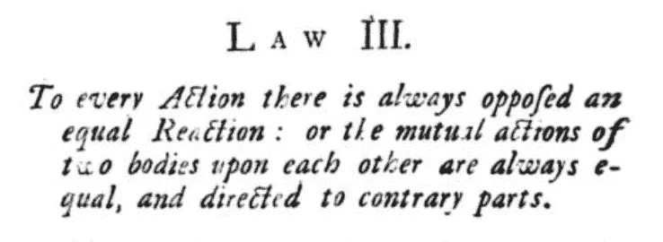
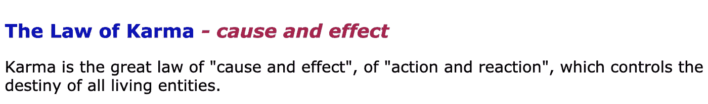
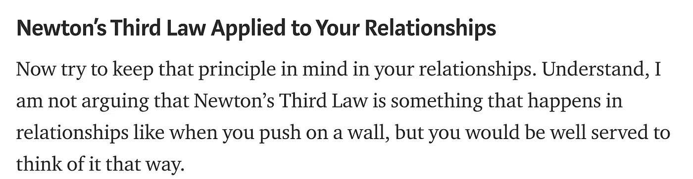
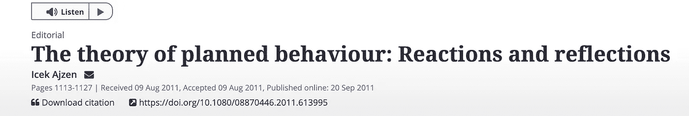
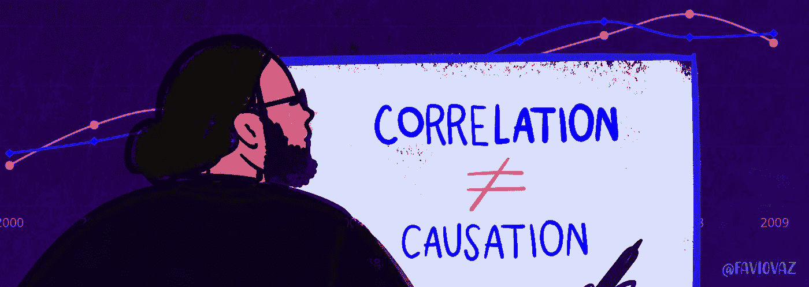

# 对于每一个动作，并不总是有相反的相等的反应

> 原文：<https://towardsdatascience.com/to-every-action-theres-not-always-an-opposed-equal-reaction-9d2553f71f3c?source=collection_archive---------4----------------------->

## 让我们停止编造，成为更好的科学家。

Héizel Vázquez 插图

如果你在生活中接触过任何基础或初级物理学，你会听到这样的话:

> 每一个作用力总会有一个相等的反作用力。

这是牛顿第三定律的摘录，它说:

> 每一个作用力总有一个相等的反作用力:或者说两个物体之间的相互作用力总是相等的，并且指向相反的方向。

这里有一幅来自 1729 年翻译的《自然哲学的数学原理》的图片:

https://archive.org/details/bub_gb_Tm0FAAAAQAAJ/page/n63

你们中的大多数人可能都知道这一点，而且，我很肯定你已经听说过人们把这一点应用到生活中的每一件事情上。我是说一切。

让我给你看一些例子:

瑜伽:

【https://www.yoga-philosophy.com/eng/karmalaw.htm 

这太尴尬了。

[https://medium . com/@ patrickbshirley/how-newtons-third-law-can-help-you-have-better-relationships-and-a-happy-life-2c 4 e 0 ff 2b 83](https://medium.com/@patrickbshirley/how-newtons-third-law-can-help-you-have-better-relationships-and-a-happier-life-2c4e0ff2b83)

哦，我的:

[https://www . jackcanfield . com/blog/using-the-law-of-attraction/](https://www.jackcanfield.com/blog/using-the-law-of-attraction/)

在心理学中(有很多这样的例子):

[https://www . tandfonline . com/doi/full/10.1080/08870446 . 2011 . 613995](https://www.tandfonline.com/doi/full/10.1080/08870446.2011.613995)

我可以继续，但我想你明白我的意思了。我们人类是将事物外推到新领域的专家。有许多科学论证被人们日复一日地使用，却不知道它们的含义和范围。

让我说清楚一点。牛顿说的是物体的运动，物理物体，而不是生命或感觉。我劝你读一下牛顿的原理，这样你就知道我的意思了。这是非常重要的，你应该知道一个科学论证意味着什么，以及它在哪里适用。它不能在任何地方使用。在牛顿写下他定义了物质、动量、力等等之前，他陈述了公理并解释了整个物理学理论。这个论点只适用于粒子，运动和力。

但更重要的是，我们调查了第三定律可以被打破的地方，这让它变得有点模糊。看一看:

 [## 牛顿第三定律被打破的统计力学

### 牛顿第三定律被违反的情况有很多种。通常，动作-反应…

journals.aps.org](https://journals.aps.org/prx/abstract/10.1103/PhysRevX.5.011035)  [## 物理学家展示了打破局部因果关系的新方法

### 2017 年 4 月 21 日，Phys.org，Lisa Zyga(phys . org)-物理学家首次通过实验证明了…

phys.org](https://phys.org/news/2017-04-physicists-violate-local-causality.html)  [## 通过作用-反作用对称破缺的光学径向驱动加速

### 一个动作产生一个大小相等方向相反的反作用。然而，如果有可能两个身体中的一个拥有…

www.nature.com](https://www.nature.com/articles/nphys2777) 

所以请不要再把第三定律的陈述当作“谋生的法则”

# 与数据科学的联系

Héizel Vázquez 插图

如果你在这里，你可能对数据科学感兴趣。链接是这样的:

> 不要用简单的论点在任何事情上寻找因果关系。

我们必须停止制造“简单”的模型，用“年龄”或“性别”这样的变量来解释复杂的事情。没那么容易。不要误解我，这只是一个开始，但如果我们想解决问题，我们需要深入挖掘。我们需要收集尽可能多的数据，并尽可能多地转换我们的数据，以找到尽可能有用的信息。

永远记住**相关性并不意味着因果关系**，对行动并不总是有简单的反应，并不是所有事情都是这样。

我们是科学家，如果你仍然不相信，请阅读这个:

 [## 关于数据和科学

### 第一部分:将科学引入讨论的重要性。

towardsdatascience.com](/https-towardsdatascience-com-on-data-and-science-e96849b5f363) 

每一个问题都不能用一个线性或逻辑回归或有 20 个特征的神经网络来解决。如果你采用这种方法，你就是“数据技术员”，而不是数据科学家。如果我们想改变世界，我们必须超越直觉和常识，这也适用于数据科学。

等待更多关于这个主题的信息，并请写下你的想法。