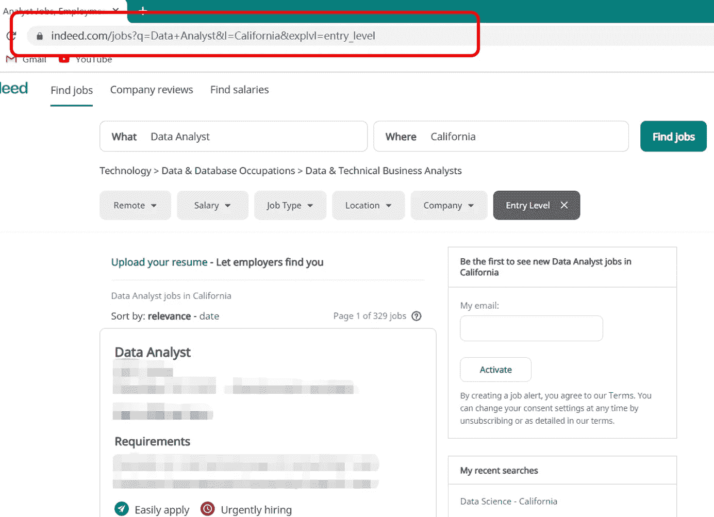
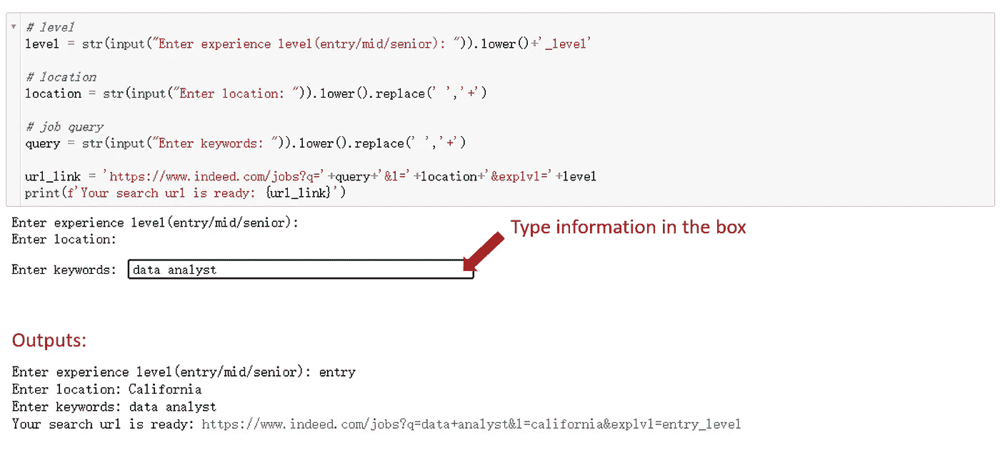
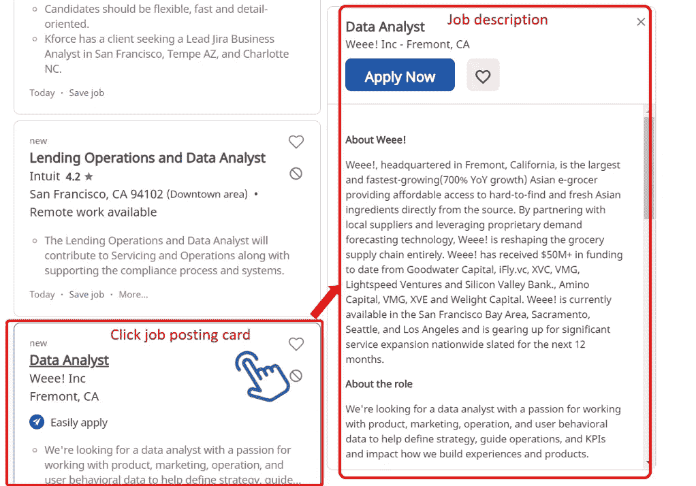
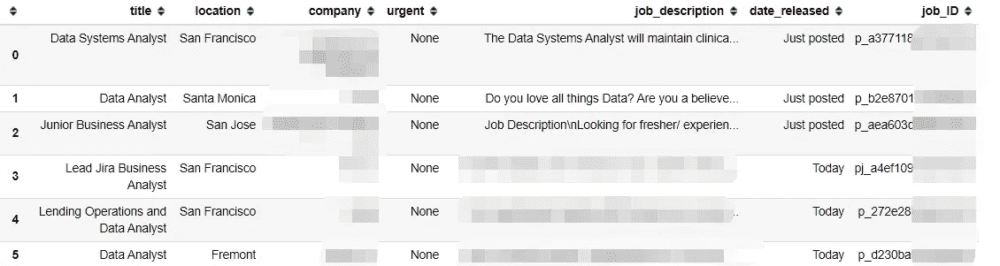
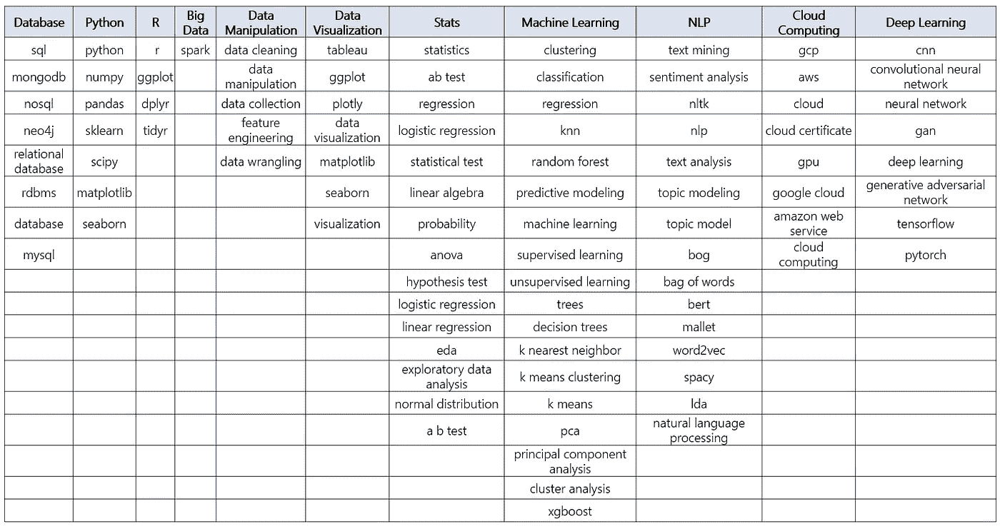
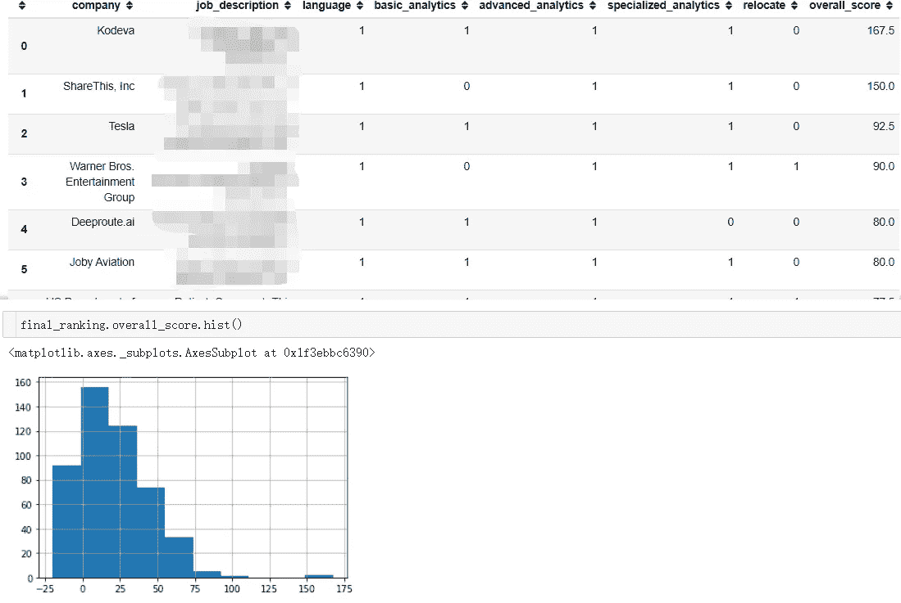

# 为了得到一份数据科学方面的工作，我用 Python 构建了一个自定义的职位发布过滤器

> 原文：<https://towardsdatascience.com/to-get-a-job-in-data-science-i-built-a-self-customized-job-posting-filter-with-python-15406ea428e7?source=collection_archive---------70----------------------->

## 找工作从来都不是一件小事。从来没有。

即使有像 Indeed 和 LinkedIn 这样的在线招聘平台的帮助，搜索的过程仍然需要大量的人工努力。不匹配的赞助帖子不断出现让你烦恼，当你尝试不同的搜索词时，同样的工作重复出现，只是进一步增加工作量。

此外，数据科学的范围如此之广，以至于它给搜索的难度增加了另一个乘数。用一个头衔“数据科学家”，你可以得到实际上截然不同的描述。

在 [Unsplash](https://unsplash.com?utm_source=medium&utm_medium=referral) 上由 [Hitesh Choudhary](https://unsplash.com/@hiteshchoudhary?utm_source=medium&utm_medium=referral) 拍摄的照片

但是你想过让梦想的工作找到你吗？在经历了没完没了的搜索之后，我决定用 **Python** 开发一个工具来帮助有效地管理招聘信息，并优先考虑那些最匹配我的。

我们开始吧！

# 数据收集

第一件事是收集足够的与数据相关的招聘信息。在这里，我选择了 indeed.com，并使用了从“数据科学家”、“机器学习”到“数据分析师”和“数据可视化”的关键词。

为了指定我的偏好，我使用过滤器来限制工作地点和经验水平。下面是一个结果页面的 URL 的截图。

有了它，我们就可以构建代码来收集职位发布。要继续，请确保您已经下载了 [Selenium](https://github.com/SeleniumHQ/selenium) 、 [BeautifulSoup](https://en.wikipedia.org/wiki/Beautiful_Soup_(HTML_parser)) 和 [ChromeDriver](https://chromedriver.chromium.org/downloads) 并在您的机器中进行了配置。(请将文件“ *chromedriver* ”放在放 Jupyter 笔记本的同一个文件夹下。)

首先，我创建了一个工具来生成 URL 链接，这样当我想改变搜索设置时，就不需要打开一个新的标签页来访问了。

输入你的偏好和搜索词，你会得到用于网络搜索的链接:

我使用 Selenium 来处理 web 抓取任务，因为它执行得很好，尤其是当您必须与网页交互来获取信息时。

例如，每页上有 10 多张招聘信息卡，您需要单击每张卡片来导航到相应的职位描述。这种情况下，*。点击()*可以为我们调出内容。另外，在第二个结果页面上会出现一个弹出窗口，所以我添加了一行按 Esc(escape)键来关闭窗口。

我写了以下代码来检索利益信息:**职位名称**、**地点**、**公司**、**职位描述**、**发布日期**，如果是**急招**。我还在网上搜索工作 id，生成新的网址，引导我回到某些发布信息的网页。

# 数据处理

我针对不同的搜索词运行了上述代码，以收集一个职位发布池。然后我合并数据集并删除重复的。我从最初的 900 多条帖子中得到了总共 650 多条独特的评论。(无法想象我是怎么翻遍这么多职位描述的！)

数据集一览:

之后，我对日期和工作描述做了一些文字处理:

# 定制作业选择器

主菜来了:构建一个定制的工作选择器。我的方法如下:

1.  根据我的技能组合创建有意义的指标。
2.  通过给每个指标一个权重来量化，并计算总分。

我做的第一件事是制作一个包含我所有技能的表格。我想出了几个类别，并给它们添加了一些关键词(当然，根据你想找什么样的工作，你也可以有自己的版本)。该表将用于从工作描述中提取短语。

关键词表的外观:

我使用下面的代码创建单词列表进行匹配。

对于每个类别，我计算了我的列表中有多少关键词在每个职位描述中被提及。例如，在“机器学习”类别中，我列出了 8 个关键词。如果其中 3 个出现在某个工作描述中，那么标签“*机器学习*”的值将是 3。

在用技能组合标注了所有的招聘信息后，我创建了一些新的指标来做进一步的比较。这些指标是根据我的个人资料和工作偏好设置的。

## 位置

我住在旧金山，我更喜欢在湾区工作，以避免搬迁。所以我创建了一个名为 relocate 的标签，如果它的位置在湾区之外，就加上“1”。

## 发布日期

如果一份工作是新发布的(在过去 5 天内)，它绝对值得申请，因为这意味着我的简历会有更高的曝光率。

## 程序设计语言

我还关心所需的编程语言。如果一个帖子没有指定 R、Python 或任何 DBMS 语言(如 SQL)中的任何语言，它可能不适合我，因为这份工作可能在数据科学领域太“商业”或太“核心”。

# 总发布分数

我构建了一个名为“ *basic_analytics* 的指标来标记最基本的技能，比如数据操作和数据可视化。

然后使用类似的方法，我为高级分析技能和专业技能创建了指标。

## 权衡不同的分析技能

量化一份工作与你匹配程度的一种方法是建立一个**总体发布分数**。一篇文章的总得分被定义为上述指标的加权和。同样，这是非常灵活的，重量可以根据您的需要进行调整。

我给予高级分析技能相对较高的权重，因为我更喜欢在机器学习算法和建模方面需要更多知识和实践的工作。

最后，我把帖子按总分排序。最终表格和显示分数分布的直方图:

# 下一步是什么？

有了这个方便的工具，我可以优先考虑得分较高的工作，并相应地准备我的简历。它更方便、省时，也让我的求职过程更容易管理。

您还可以利用这个脚本来定制您自己的作业选择器，并通过添加更多的特性使它达到更高的水平。([全码](https://github.com/luonan54/Job-Posting-Selector))

**求职愉快！**

查看我过去的博客:

 [## 新冠肺炎期间基于新闻话题的推特情感分析

### —网络公众如何回应疫情

towardsdatascience.com](/twitter-sentiment-analysis-based-on-news-topics-during-covid-19-c3d738005b55)