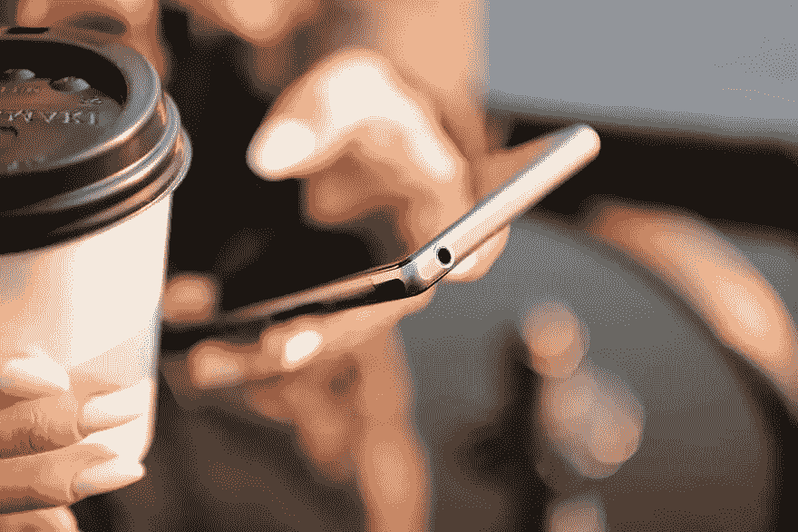
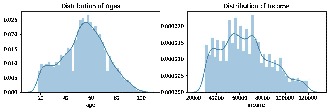
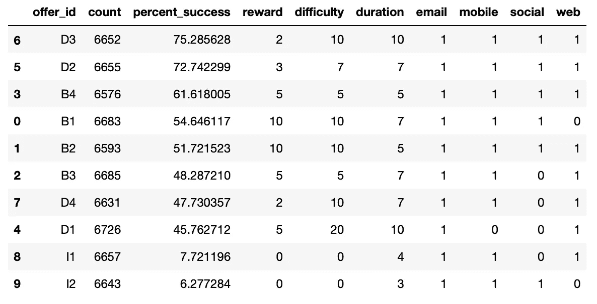
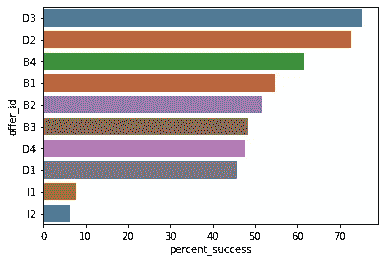
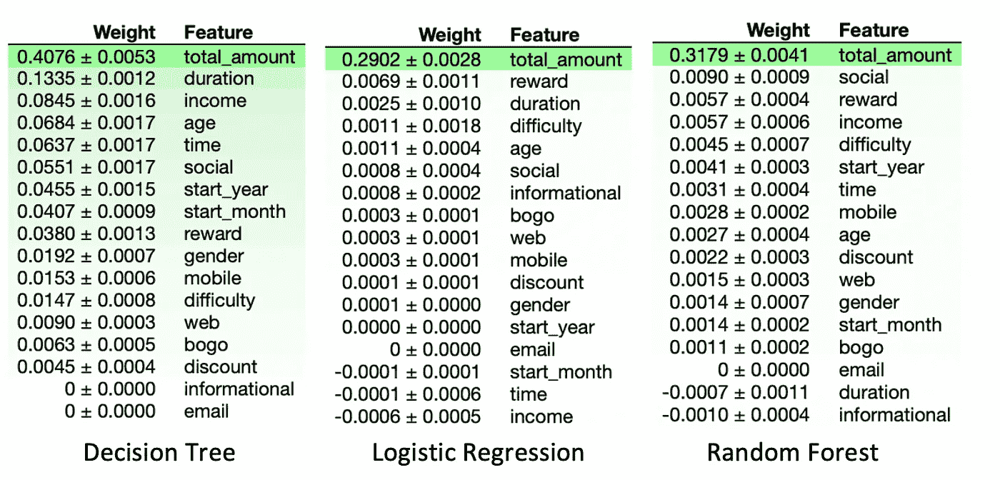

# 提供还是不提供？星巴克的机器学习项目

> 原文：<https://towardsdatascience.com/to-offer-or-not-to-offer-a-starbucks-machine-learning-project-c21bf9c398bc?source=collection_archive---------39----------------------->

寻找那些免费的咖啡奖励。 [*来源 Pikist*](https://www.pikist.com/free-photo-slxvu) *。*

我将第一个承认，我是一个狂热的咖啡爱好者。但是，我并不局限于某一家连锁店。在我的手机上，我下载了咖啡豆、星巴克和 Dunkin 的应用程序。大多数时候，距离会决定我去哪家店。然而，随着我在每个连锁店获得越来越多的忠诚度积分，我会因为收到特别优惠通知而去某个特定的商店。

星巴克怎么知道什么时候给我发那些奖励？他们如何在买一送一、下一次订单减 2 美元或简单的奖励星级之间做出选择？

这是我在我的 [Udacity 数据科学纳米学位](https://www.udacity.com/course/data-scientist-nanodegree--nd025)的顶点项目中试图回答的问题。

*如果你有兴趣跟随代码，* [*查看 Github*](https://github.com/Deveorac/Starbucks_offers) *上的项目。*

# TL，DR:

*   在星巴克，女性平均比男性花更多的钱。
*   没有完全填写会员资料的用户通常花费较少，这表明他们也不会从“精酿饮料”相关优惠中受益(例如，尝试我们的新 venti magic unicorn frappuccino，添加额外的糖屑和仙粉，并获得额外的 20 颗星！).
*   提供折扣的优惠比买一送一的优惠更有可能成交。
*   为了获得最大的完成度，在你的分销计划中加入社交媒体。最成功和第二次最不成功的报价几乎在所有方面都是一样的，除了最成功的报价是通过社交媒体传播的，而另一个不是。
*   通过机器学习，我验证了社交媒体是一个影响要约是否会被完成的因素。
*   其他重要因素包括优惠持续时间、用户年龄和奖励金额。不重要的因素包括电子邮件、用户成为会员的时间以及他们的性别。

# 数据

为了完成该项目，星巴克向 Udacity 提供了 3 个关键数据集:

*   portfolio:关于样本数据中提供的所有 10 个报价的数据
*   profile:关于所有进行交易或提供通知的用户的数据
*   文字记录:关于所有已发生交易的数据，无论是购买还是与报价的交互

深入到这里的细微差别，关于每个数据集还有一些事情需要注意。投资组合指定了特定报价的发布渠道，包括电子邮件、手机、社交网络或网络。还有一个难度分数，完成报价必须花费的金额。还指定了奖励金额、到期前的持续时间和优惠类型。

个人资料包括用户的性别、收入、年龄和成为会员的日期。然而，一些人口统计数据丢失了。

抄本包括记录的事件和交易金额，或者要约是否被接收、查看或完成。

# 问题陈述

使用这些数据的目的是识别购买趋势和报价完成情况。理想情况下，通过这个项目，我将能够预测用户是否会因为收到报价而进入商店购买。

因此，需要记住一些注意事项。如果有人要进来买 10 美元的咖啡，不管有没有报价，我们都不一定要在 10 美元的购买报价上降低 2 美元。

此外，用户可能会在没有阅读甚至不知道要约存在的情况下完成要约。同样，在这些案例中，该提议没有达到其改变行为的目标。

因此，在解析数据时，我确保只有当用户查看了要约并在要约到期前完成了要约，才认为要约已完成。

# 数据清理

幸运的是，这些数据集没有太多清理工作要做。但是，为了便于分析，做了一些更改。

首先，offer id 是一个看似随机的长字符串。这些被简单的两个字符的代码所取代。第一个字母表示报价是信息性的、折扣的还是买一送一的(I、D 和 B)以及一个序列号。

接下来，使用虚拟变量重新映射了性别和 offer 分布方法等列。

还检查了数据的完整性和正确性。人们发现大量的年龄被输入为 118，这是一个明显的错误。这些值被替换为 NaN。

# 数据探索

在我们进入机器学习之前(我知道这是你们所有人在这里的目的)，我从初步的数据探索开始。这有助于识别机器学习问题，验证从机器学习中得出的结论，并找到仅通过机器学习无法识别的数据集的基本统计描述符。

首先，我研究了每笔交易花费的金额。

正如经常光顾咖啡店的人所料，绝大多数交易都低于 8 美元。有趣的是，在 1-2 美元附近有一个大的峰值，也许这些人只是进去并得到一杯派克酒，还有房间。

接下来，我对用户人口统计数据感兴趣。我只考虑年龄和收入。

这看起来像是一个非常标准的用户群，尽管我原本预计年龄分布会有一个较低的峰值。

还有，对星巴克的 100 岁格莱美大声喊出来。

现在，任何去过星巴克的人都知道拿着星冰乐的少女的迷因。所以，我还想看看按性别划分的平均支出。有一些关于性别的“其他”数据，要么表示没有为该用户收集性别数据，要么表示用户识别为二进制之外的性别。区分这两者是很好的，但是，唉。

有意思。女性通常比男性多花 5 美元左右。由于每杯精酿饮料大约 5 美元，这表明女性比男性更经常购买多种饮料(可能是为家人或朋友购买)。

此图也让我们对“其他”类别有了一些了解。可能这些用户并没有完全注册成为会员，他们只是来买一杯黑咖啡，而不是对特别优惠的手工饮品特别感兴趣。

当然，这种独特的见解需要更多的数据来验证。

接下来，我对哪些报价最有可能完成感兴趣。提醒一下，这里的代码指的是优惠是直接折扣(即 10 美元订单减 2 美元)还是买一送一。也有信息提供，但这些只是通知用户新产品，例如，并没有行动。每份报价也以 4 种方式中的任何一种发布:电子邮件、手机、社交媒体或网络。

首先，重要的是要注意到每个提议被分发的次数大致相同，所以不存在偏见。最后两行在很大程度上也可以忽略，因为它们是信息提供，而不是折扣或 BOGOs。

从这一分析中得出的一些关键结论是，完成折扣的可能性比 BOGO 提供的更大。此外，所有表现最佳的产品都以各种可能的方式发布，尤其是社交媒体。当只有社交媒体被删除时，这些优惠就排在了最后，尽管它们也是折扣。

事实上，让我们比较一下 D3 和 D4。D3 是表现最好的，但除了一个关键因素:社交媒体，它几乎与 D4 相同。D3 也持续了几天时间，但考虑到表现最差的报价都不是在社交媒体上，这就很能说明问题。

# 机器学习

现在有趣的是，建立一个机器学习模型来预测哪些因素会增加要约完成率。

响应变量是报价是否成功，编码为 0 表示不成功，1 表示成功。如果要约在到期前被用户阅读并履行，则该要约被定义为成功。

这些是包含在机器学习算法中的因素，以及考虑的前 4 个交易的值。请注意，start_year 和 start_month 是指用户成为会员的时间。

完成了 25%的训练分割以建立机器学习管道。

有了这个，我就可以实现三种不同的方法了:

*   决策树分类器
*   逻辑回归
*   随机森林分类器

以下是每个型号的相关分数:

随机森林分类器

使用每个模型，我还能够确定哪些解释性因素对要约是否会被完成影响最大:

每个模型给出的结果略有不同，但总体来看，重要的因素包括报价持续时间、用户年龄和奖励金额。不重要的因素包括电子邮件、用户成为会员的时间以及他们的性别。随机森林模型还将社交媒体分布确定为一个重要因素，这一点我之前已经能够直观地识别出来。

# 结论

通过这个项目，我能够建立一个机器学习模型，并探索数据，以找到一些使要约更有可能成功的关键特征。

对数据集的一些改进将有助于完善我能够做出的预测。例如，如果有位置数据或更长的用户历史数据就好了。具体来说，看看总是点同样几样东西的用户是否会因为优惠而购买新的菜单项目会很有趣。这是该数据集的一个显著缺点，因为它没有具体说明具体购买了什么。

很有兴趣听听大家的想法！你有没有在你的星巴克应用程序(或其他商店的类似程序)上看到过似乎是为你量身定制的优惠？随着越来越多的数据可供用户使用，个性化服务似乎只会越来越频繁。