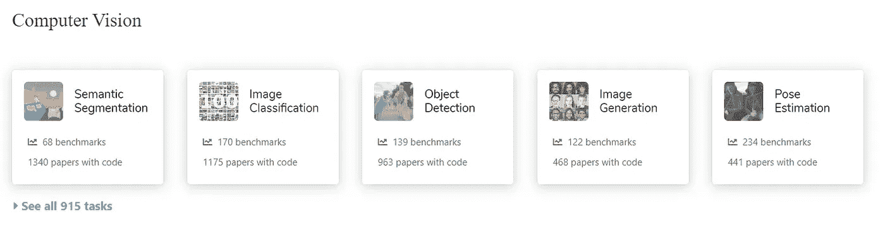

# 如何像数据科学家一样思考？

> 原文：<https://towardsdatascience.com/to-pose-a-learning-problem-6e069d6c17d?source=collection_archive---------47----------------------->

## 你被困在一个问题上了吗？

来自 [Pexels](https://www.pexels.com/photo/man-showing-distress-3777572/?utm_content=attributionCopyText&utm_medium=referral&utm_source=pexels) 的 Andrea Piacquadio 的照片

我们都是问题解决者。我们开始减少做任何事情的努力。我们厌倦了一次又一次地做同样的重复性工作。所以，我们想为什么不让机器来做呢。你瞧，今天你有聊天机器人，自动驾驶汽车，还有很多。

但是，所有这些努力都始于一件事。问题。

> 你想解决什么？

这是起点。就像在*的真实对话*中，第一印象为整个对话的成功开创了先例，当提出一个机器学习问题时，人们必须让*对问题产生良好的印象*。

# 问题的要素

任何深度学习问题都有三件事需要明确定义，才能在其中取得成功。

## 工作

简单吧？没有。

假设，我们从一个计算机视觉问题开始。我想创建一个解决计算机视觉问题的 DL 算法。但是，如果你只是打开那扇门，就会有近千个子问题。想要证据，这就是:

来源:www.paperswithcode.com·SOTA(作者截图)

所有这些子问题今天都存在，因为人们选择解决一个特定的问题，而不是一次做所有的事情(psst，这是一个坏主意)。

为此，使用**自上而下的方法**。

我们再次重复这个任务发现。假设您必须创建一个系统来自动将图书放在图书馆的书架上。

> **问题 1** :任务是什么？
> 
> **答**:在图书馆自动上架图书。
> 
> **问题 2** :这个任务包括什么？
> 
> **回答**:先看书名然后，归类到一个主题。
> 
> **问题 3** :我如何利用深度学习解决这个问题？
> 
> **回答**:我会用文字识别(计算机视觉)和主题分类(自然语言处理)。

Tada！你终于完成了你的任务。

## 经验

> “有些东西是教不来的；他们必须有经验。只有经历过自己的旅程，你才能学到人生中最有价值的课程。”
> ― **罗伊·t·贝内特**

对于机器来说，这并没有什么不同。为了解决问题，他们需要经历问题。

这里的问题是:

> 我的 DL 系统需要什么样的体验才能实现最佳性能？

继续上面的例子，我们现在有两个任务:文本识别和主题分类。

> **问题**:我的系统需要什么样的经验才能轻松识别书本上的文本？
> 
> **答**:从很多书的封面上看。

通常，对于 DL 系统，我们并不总是得到我们想要的。所以，我们问另一个问题。

> **问题:**如果我无法获得上述数据，什么样的体验可以帮助我的系统获得最佳性能？
> 
> **回答**:如果我找不到这个特定的数据，那么我应该找到包含不同背景颜色、角度和光线条件下的文本的数据。

关键是要找到一些涵盖你的具体问题的一般数据。在这里，你采取的是**通才方法**。

然后，到了你继续搜索数据的时候了。如果你幸运的话，你会找到它。如果不是，那么，你需要问自己这个问题:

> **问题**:在找不到任何数据的情况下，什么样的体验可以帮助我的系统？
> 
> **回答**:如果我得不到，那我就得自己做。我需要从各种角度生成印有文字的图像，背景必须从简单单调的颜色到生动的背景。

这是你去没人去过的地方时最常求助的方法。旅程还没有结束。

最后一个问题:

> **问题**:我可以使用任何现有数据为自己的系统创造体验吗？
> 
> 答案:答案基本上是肯定的，这将使你的生活变得更容易。获得一些真实的数据，并在此基础上构建你的数据，这是你能为自己做的最大的一件好事。

你必须为你的系统设计最佳的工作体验。

> 为你的系统选择合适的体验将决定它的成败。

## 工作指标

> 每个人都是天才。但是如果你根据一条鱼爬树的能力来判断它，它会一辈子相信自己是愚蠢的。
> ——阿尔伯特·爱因斯坦

如果您最终错误地度量了系统的性能，您最终会认为这是一个失败而不是成功。

继续上面的例子，我们如何衡量我们的系统是否在最佳状态下运行。

你问自己的问题是:

> 什么指标可以帮助我正确判断系统的性能？

在我们的例子中，答案是正确上架的书的数量。

但是，这能让我们全面了解系统的性能吗？

由于你有两个任务，它们的性能决定了整个系统的性能。所以，你也要为他们决定绩效指标。

> 所有现实生活中的任务都是多方面的。

对于文本识别，您可以选择字符级的识别精度。

对于主题分类，您可以选择主题被正确分配的次数。

所有现实生活中的任务都是多方面的，因此，需要在多个维度上进行评估。在我们的例子中，有子系统的性能和系统的整体性能。

# 摘要

在这篇文章中，我们了解了如何深入研究机器学习问题以及如何思考它。我们知道将深度学习问题分解成这些准系统(任务、经验和绩效衡量)是多么重要。然后，我们明白了如何探索这些准系统，以获得可能令我们惊讶的解决方案。正确的思考导致正确的解决方案。