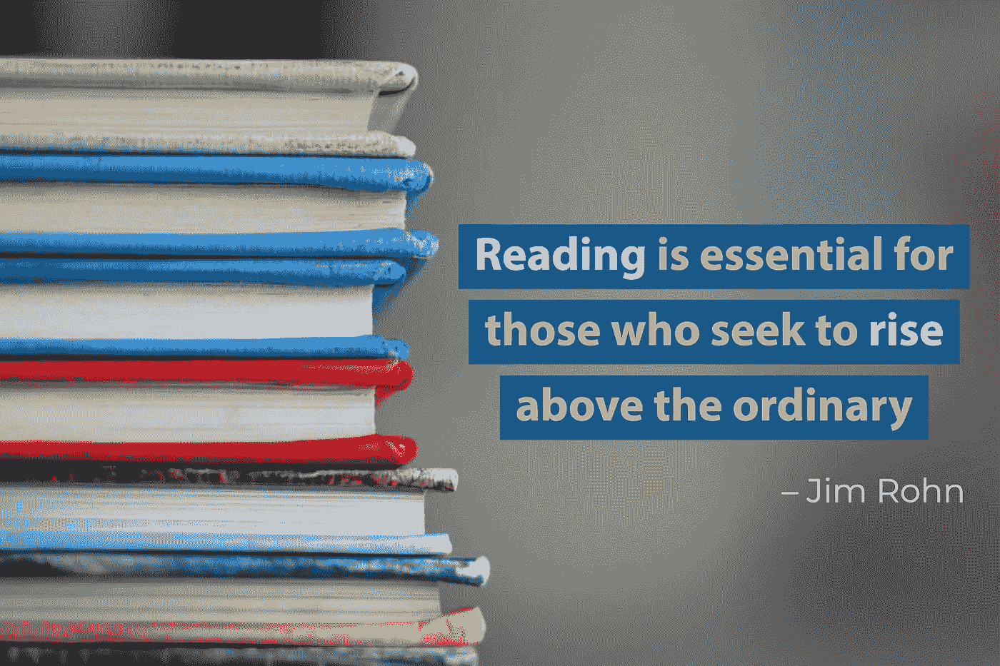

# 超越平凡——数据科学阅读清单

> 原文：<https://towardsdatascience.com/to-rising-above-the-ordinary-a-data-science-reading-list-4548c363fb9?source=collection_archive---------22----------------------->

## 每天一小时的阅读冲刺，以保持你的知识面广泛和最新

作为发展最快的行业之一，作为一名没有研究团队的数据科学家可能会令人无能为力。去年年底，我意识到我经常错过行业的新发展，不知不觉地重新发明轮子，在与专家的对话中失败。作为一名数据科学顾问，我的压力水平爆炸了，因为我总是觉得自己没有准备好去见客户。

金伯利农民在 [Unsplash](https://unsplash.com/photos/lUaaKCUANVI) 上拍摄的照片。作者通过 AdobeSpark 添加的引文。

因此，作为我 2020 年的目标，我决定让自己摆脱这种压力。

> “T o 知道你不知道是最好的。当你不知道的时候，认为你知道是一种疾病。把这个病认作是病，就是解脱。”——老子

从这句话中，我得出了一个相当简单的策略:通过阅读更多的书籍，我应该更了解与人工智能相关的新闻。这反过来又增加了我参与不同的人工智能相关讨论的信心。

从一月份开始，我开始定期使用博客和播客来保持自己的相关性。每个工作日，在瑜伽和冥想之后，在我上午 10 点站立之前，我会花一个小时阅读，同时喝第一杯咖啡。

我的收件箱里没有强迫症，所以我减少了订阅量，以确保我能得到我需要的信息，而不会淹没在信息中。作为一家专注于 ML 部署的公司的首席数据科学顾问，我确保我的阅读列表可以在三个方面提升我:

*   **人工智能领导者(我的客户)会关心的事情**:人工智能行业的状态，客户端行业的状态，Gartner 和麦肯锡发布的这类东西。
*   让我工作更有效率的事情:新的图书馆，新的建筑，温习一些数学/编程技能。
*   **成为良好话题引子的东西**:有趣的人工智能故事、初创企业新闻、客户的竞争对手在做什么。

我做的大部分阅读来自我订阅的邮件列表和播客。让别人获得你的阅读清单的权衡是花在寻找阅读内容上的时间和 100%符合你兴趣的高质量阅读材料。

这是我想出来的订阅，但它们会根据我的需求不断变化。随着世界的关闭和在家工作成为一种规范，我希望这个列表可以帮助你开始你的阅读计划。在没有经理不断潜伏在你身后盯着你屏幕的时候，抓住机会。

# 📩邮件列表:

我正在根据目标受众、阅读时间和我喜欢它的地方来组织列表。当然，目标读者仅仅是一个推荐，阅读时间很大程度上取决于你点击了多少链接，以及你进入兔子洞有多远。我可以用我整个阅读时间来研究一篇文章。

总之。(宣称即将开始令人兴奋或危险的活动)看我的👇

## 1.deeplearning.ai 的批处理

 [## The Batch:来自 deeplearning.ai 的新每周简讯！

### 欢迎来到 The Batch，这是 deeplearning.ai 的一份新的每周简讯！这一批提出了最重要的人工智能事件和…

www.deeplearning.ai](https://www.deeplearning.ai/thebatch/) 

这是吴恩达的另一个创意，它让我想起有一个随时可用的研究小组。该小组每周提交 6 篇关于深度学习最新发展的精彩文章。

**👥目标受众:**学者、研究人员、深度学习爱好者。

⏱**阅读时间:** ~30 分钟(每周)

⭐我喜欢它的地方:它组织得非常好。这些文章来自各种来源，对它是什么、它如何工作、它为什么重要、新闻背后有什么以及编辑们对它的看法进行了很好的总结。

## 2.哈佛数据科学评论

 [## 哈佛数据科学评论

### 作为哈佛数据科学倡议的开放访问平台，哈佛数据科学评论(HDSR)的特点是…

hdsr.mitpress.mit.edu](https://hdsr.mitpress.mit.edu/) 

我无法比网站上的开篇段落解释得更好，上面写着:

> 作为[哈佛数据科学倡议](https://datascience.harvard.edu/)的开放访问平台，*哈佛数据科学评论* (HDSR)以**基础思维、研究里程碑、教育创新和主要应用为特色。**它旨在发布内容，帮助将数据科学定义和塑造为一个基于有原则和有目的的数据生产、处理、解析和分析的科学严谨且具有全球影响力的多学科领域。

**👥目标受众:**每个人都有一个专栏

**⏱阅读时间:** 60+分钟(每月)

**⭐我喜欢它的地方:**有一个不错的网站，里面的信息是按照它吸引的观众类型排序的。有一个愿景和辩论的全景视图，一个致力于数据科学教育的支柱和关于历史、行业领导者、理论等的各种专栏。

## 3.中型每日文摘

 [## 中等——更明智地对待对你重要的事情。

### Medium 不同于互联网上的任何其他平台。我们的唯一目的是帮助您找到令人信服的想法…

medium.com](https://medium.com/) 

**👥目标受众:**有抱负的高级数据科学家和工程师

**⏱阅读时间:** ~20 分钟(每日)

⭐我喜欢它的地方:你可以很容易地定制你所阅读的内容，而且它的内容种类繁多。此外，许多流行的库和工具在 Medium 上也有自己的配置文件。我通过 [Jupyter 博客](https://blog.jupyter.org/)获得关于 Jupyter 项目的更新，并且我第一次在 Medium 上发现了 [Streamlit](https://github.com/streamlit/streamlit) 。我也很喜欢阅读文章的评论，Medium 是我发现评论最多的一个，这个社区总体来说也不错。

因为我还订阅了与数据科学无关的出版物，所以通过阅读一些其他材料，它帮助我让我的大脑休息一下。不过，我确实发现推荐倾向于付费墙后面的文章。

## 4.奥莱利数据和人工智能简讯

 [## 获取奥赖利数据简讯——奥赖利媒体

### 在 1，969 个评级中，平均每五颗星中有四颗保持消息灵通。从业内人士那里获得每周见解，此外…

www.oreilly.com](https://www.oreilly.com/data/newsletter.html) 

O'Reilly newsletter 是一份很好的行业见解每周综述。从纯技术到如何领导数据科学团队和其他商业信息，主题范围广泛。

👥**目标受众:**技术领导者&行业专业人士

**⏱阅读时间:** ~20 分钟(每周)

**⭐我喜欢它的什么:**与我关注的其他邮件列表相比，奥赖利的时事通讯有更多的“x 状态”文章。这些文章都是经过精心研究的，有很酷的图表和有趣的统计数据可供引用。我还发现这份时事通讯包含了更多的数据工程和 ML 部署类型的文章。对了，Data 和 AI 是两个独立的时事通讯。

## 5.KDNuggets 新闻

 [## 订阅 KDnuggets 新闻— KDnuggets

### 订阅 kdnugges 新闻邮件:Email: Name:(可选)kdnugges 是机器学习、数据…

www.kdnuggets.com](https://www.kdnuggets.com/news/subscribe.html) 

该时事通讯分为特色文章、活动/网络研讨会、新闻、教程和观点文章。我发现对于刚刚开始职业生涯的数据科学家或希望进入数据科学的人来说，KDNuggets 是一个很好的起点。

**👥目标受众:**更多初级/中级数据科学家

**⏱阅读时间:** < 10 分钟(每日)

**⭐我喜欢它的什么:**偶尔，我不明白它是如何关联的，但我通过 KDNuggets 在我的收件箱中收到了 DataRobot、Gartner 和 Figure8 之类的报告。我喜欢这些类型的报告，因为它们的分析相当全面，并有良好的统计数据和可视化来支持他们的主张。

# 🎧播客:

我早上准备的时候或者晚上做晚饭的时候会听播客。我不擅长同时处理多项任务，所以我选择了那些有挑战性内容但又容易理解的播客。

## 1.线性离题

 [## 线性离题

### 搜索我

lineardigressions.com](http://lineardigressions.com/) 

凯蒂和本是线性题外话的主持人。该节目涵盖了一切:数据科学、机器学习、模型可解释性、职业轨迹等。Katie 是一名数据科学顾问，所以我发现她的例子和思维框架对我与客户沟通很有帮助。

**👥目标受众:**有抱负的高级数据科学家和工程师。对这里的工程师来说，这是一个很大的呼喊，因为 Ben 帮助在数据科学和软件工程世界之间画出了很好的相似之处。

**⏱听力时间:**20-30 分钟(每周)

**⭐我喜欢它的地方:**主持人之间的对话风格使它成为一次轻松有趣的聆听。举个例子，听你的朋友谈论伯特比听你的教授谈论伯特有趣得多。本问了一些很有见地的问题，凯蒂用我能理解的简单易懂的语言解释了这些问题——通常是在切胡萝卜和煎牛排之间周旋的时候。

## 2.数据怀疑论者

 [## 数据怀疑论者

### 您值得信赖的播客，以数据科学、机器学习和人工智能为中心。请每周收听…

dataskeptic.com](https://dataskeptic.com/) 

数据怀疑论播客有一系列与数据科学、统计学、机器学习等相关的主题。这个节目选择了一个主题，并对其进行了几个月的深入报道——我广泛关注的一个主题是假新闻和 NLP。主持人凯尔特别热衷于科学方法和运用批判性思维解决问题。

**👥目标受众:**有抱负的高级数据科学家和工程师

**⏱听力时间:**20-50 分钟(每周)

**⭐我喜欢它的地方:**通常会有一个贯穿多集的主题，主题涉及面很广。开头几集适合入门者和初学者，随着主题的进展，内容变得有挑战性但有趣。

## 3.奥赖利数据显示

 [## 奥赖利数据秀播客——奥赖利

### O'Reilly 数据秀播客:Evan Chan 谈 Spark+Cassandra、FiloDB 和云计算的早期。的…

www.oreilly.com](https://www.oreilly.com/radar/topics/oreilly-data-show-podcast/) 

该节目探讨了推动大数据、数据科学和人工智能的机会和技术。每一集，主持人本·洛里卡采访领先的行业专业人士，谈论他们在现实世界中的经历。

**我也刚刚意识到这个节目似乎要停播了，但主持人有一个新的播客，叫做[数据交换](https://thedataexchange.media/)。我仍然认为奥赖利数据秀的插曲值得一听！

**👥目标受众:**行业专业人士，更倾向于机器学习工程师，因为很多剧集都与模型部署有关。

**⏱听力时间:**20-50 分钟(每周)

⭐:我喜欢它的地方:这个节目的嘉宾在他们各自的领域都非常精通并且受人尊敬。听到公司面临的各种问题非常有趣，从他们的经历中学习更有见地。

# 这就是我的数据科学阅读清单

希望这篇文章能给你的邮箱增加一些内容，或者启发你自己建立一个阅读清单。

我总是在寻找好的时事通讯和播客，请给我留下好材料的评论。

**感谢阅读** ⭐在[媒体](https://medium.com/@mereldawu)、 [LinkedIn](https://www.linkedin.com/in/mereldawu/) 上关注我，或者访问我的[网站](https://merelda.com)。此外，如果您想要对您的机器学习部署框架进行评估，[请在 Melio Consulting 发送电子邮件给我们](http://info@melio.co.za)。